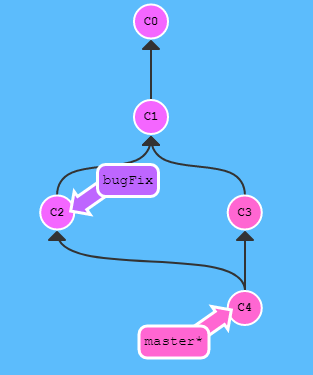
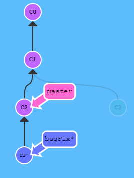
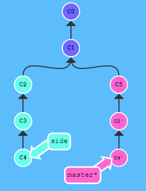
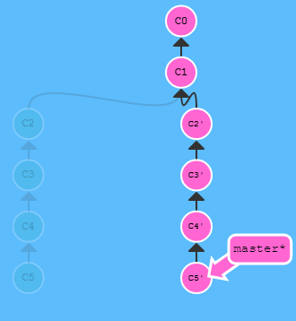

## 什么是Git

Git是目前世界上最先进的分布式版本控制系统


## Git与SVN的区别

* **SVN是集中式版本控制系统，版本库是集中放在中央服务器的**，而干活的时候首先要从中央服务器哪里得到最新的版本，然后干活，干完后，需要把自己做完的活推送到中央服务器。集中式版本控制系统是**必须联网**才能工作

* **Git是分布式版本控制系统，没有中央服务器，每个人的电脑就是一个完整的版本库**，这样，工作的时候就不需要联网了，因为版本都是在自己的电脑上。既然每个人的电脑都有一个完整的版本库，那多个人如何协作呢？比如说自己在电脑上改了文件A，其他人也在电脑上改了文件A，这时，你们两之间只需把各自的修改推送给对方，就可以互相看到对方的修改了

* **Git 只关心文件数据的整体是否发生变化，而SVN这类版本控制系统则只关心文件内容的具体差异**。这类系统每次记录有哪些文件作了更新，以及都更新了哪些行的什么内容，然而Git并不保存这些前后变化的差异数据。实际上，Git更像是把变化的文件作快照后，记录在一个微型的文件系统中。每次提交更新时，它会纵览一遍所有文件的指纹信息并对文件作一快照，然后保存一个指向这次快照的索引。为提高性能，若文件没有变化，Git 不会再次保存，而只对上次保存的快照作一链接
* **在Git 中的绝大多数操作都只需要访问本地文件和资源，不必联网就可以看到所有的历史版本记录，而SVN 却需要联网**。因为 Git 在本地磁盘上就保存着所有当前项目的历史更新，所以处理起来速度飞快，但我们需要浏览项目的历史更新摘要，Git 不用跑到外面的服务器上去取数据回来，而直接从本地数据库读取后展示给你看。如果想要看当前版本的文件和一个月前的版本之间有何差异，**Git 会取出一个月前的快照和当前文件作一次差异运算**
* **SVN 断开网络就无法commit代码，但是Git 可以先commit到本地仓库**。用SVN的话，没有网络时，无法commit代码，因为SVN 每次commit都必须联网，而且有网络的情况下每一次commit都会花上数秒甚至更长时间。但用 Git 的话，因为是在本地仓库commit所以几乎不需要时间，而且commit一定要频繁，不然无法记录你的改动，如果你一天commit一次，中间的修改你就找不回来，然后等到了有网络的时候再将版本纪录和代码一起上传到远程仓库
* **Git 的内容完整性要优于SVN**。因为Git 在 commit 或者 push 之前，通过对文件的内容或目录的结构计算出一个 SHA-1哈希值，作为指纹字符串进行内容的校验，并将此结果作为数据的唯一标识和索引，在远处仓库接受到commit的文件之后，会再计算一遍哈希值然后跟传递过来的哈希值做比较，如果不一致，说明文件在传输时变得不完整，或者磁盘损坏导致文件数据损坏。**另外在 Git 数据库中的东西都是用此哈希值来作索引，而不是靠文件名**
* **Git 克隆一个完整项目的速度非常快，SVN 非常慢**
* **其中最重要的区别是在于Git 上的分支远比SVN上的强大**
  * 分支是什么
    * 在 SVN 这类的版本控制系统上，**分支是一个完整的目录，且这个目录拥有完整的实际文件**。如果工作成员想要开启新的分支，那将会影响“全世界”！每个人都会拥有和你一样的分支。如果你的分支是用来对系统模块进行安全检查测试的，那将会像传染病一样，你改一个分支，还得让其他人重新切分支重新下载，而且这些代码很可能对稳定版本还是具有破坏性的
    * 在 Git上，每个工作成员可以任意在自己的本地版本库开启无限个分支。完全不需担心妨碍其他工作成员。只要我不合并及提交到主要版本库，没有一个工作成员会被影响。等到我不需要这个分支时， 我只要把它从我的本地版本库删除即可
  * 什么时候需要创建一个分支
    * 我们在开发新的功能模块时，可能会遇到各种bug或者冲突，如果我们还在主分支上开发，万一冲突很严重，造成当前稳定版本的分支出问题，就会很麻烦。如果主分支始终保留着最新的稳定版本，在新的分支上开发，冲突严重时，最多也就是把当前分支删掉，从那个稳定分支重新分一支出来，这样处理起来就方便了，而且分支还可以保留开发中可能出现的各种bug方便修复但不影响主分支多的使用
    * 当我们需要切换分支，如切换到主分支时候，会保存当前分支的状态，以便日后继续开发，防止丢失开发进度


## Git的优点和缺点

### 优点

* Git 中每个克隆的版本库都是平等的。可以从任何一个版本库的克隆来创建属于自己的版本库，同时你的版本库也可以作为源提供给他人
* Git 的每一次提取操作，实际上都是一次对代码仓库的完整备份
* 提交完全在本地完成，无须别人给你授权，并且提交总是会成功
* Git 的提交不会被打断，直到你的工作完全满意了，PUSH给他人或者他人PULL你的版本库，合并会发生在PULL和PUSH过程中，不能自动解决的冲突会提示你手工完成

### 缺点

- Git 没有严格的权限管理控制，一般通过系统设置文件读写权限的方式来做权限控制。
- 工作目录只能是整个项目。比如 checkout，建分支，都是基于整个项目的。而 svn 可以基于项目中的某一个目录


## 安装Git

步骤很简单，不赘述了，安装完成后还需要最后一步设置，在 Git Bash 中输入

```
$ git config --global user.name "Your Name"
$ git config --global user.email "email@example.com"
```

因为Git是分布式版本控制系统，所以，每个机器都必须自报家门：你的名字和Email地址。如果有人故意冒充别人怎么办？这个不必担心，首先我们相信大家都是善良无知的群众，其次，真的有冒充的也是有办法可查的。注意git config 命令的 **--global** 参数，用了这个参数，表示你这台机器上所有的Git仓库都会使用这个配置，当然也可以对某个仓库指定不同的用户名和Email地址


## 版本库

### 什么是版本库

版本库又名仓库，英文名repository，可以简单理解成一个目录，这个目录里面的所有文件都可以被 Git 管理起来，每个文件的修改、删除，Git都能跟踪，以便任何时刻都可以追踪历史，或者在将来某个时刻可以还原


### 初始化版本库

```
$ git init
```


### 将文件添加到版本库

**1. 用命令把文件添加到仓库**

```
$ git add <file>
```

**2. 用命令把文件提交到仓库**

```
$ git commit -m "message"
```

**-m** 后面输入的是本次提交的说明，可以输入任意内容，当然最好是有意义的，这样你就能从历史记录里方便地找到改动记录


## 版本控制

### 版本库状态

* **`git status`**： 查看版本库当前状态
* **`git diff <file>`**： 查看文件修改的内容
* **`git log`**： 显示从最近到最远的提交日志
  * 可以加上**`--pretty=oneline`**参数，简洁显示


### 版本号

下面一大串类似乱码的就是**版本号（commit id）**，和SVN不一样，Git的commit id不是1，2，3递增的数字，而是**一个SHA-1计算出来的一个非常大的数字，用十六进制表示。**为什么commit id需要用这么一大串数字表示呢？因为Git是分布式的版本控制系统，多人在同一个版本库里工作，如果大家都用1，2，3……作为版本号，那肯定就冲突了

```
$ git log --pretty=oneline
1094adb7b9b3807259d8cb349e7df1d4d6477073 (HEAD -> master) append GPL
e475afc93c209a690c39c13a46716e8fa000c366 add distributed
eaadf4e385e865d25c48e7ca9c8395c3f7dfaef0 wrote a readme file
```


### 版本回退

#### reset

把当前版本回退到上一个版本，可以使用 **git reset** 命令。首先，Git必须知道当前版本是哪个版本，在Git中，**用HEAD表示当前版本**，上一个版本就是**HEAD^**，上上一个版本就是**HEAD^^**，当然往上100个版本写100个^比较容易数不过来，所以写成**HEAD~100**

```
$ git reset --hard HEAD^
```


#### reset的三种模式

| 模式          | HEAD的位置 | 索引   | 工作树 |
| ------------- | ---------- | ------ | ------ |
| soft          | 修改       | 不修改 | 不修改 |
| mixed（默认） | 修改       | 修改   | 不修改 |
| hard          | 修改       | 修改   | 修改   |

* 使用场合
  - mixed：复原修改过的索引的状态
  - hard：彻底取消最近的提交
  - soft：只取消提交


#### reset 与 revert 的区别

* reset 是回到某次提交，提交及之前的 commit 都会被保留，但是此次之后的修改都会被退回到暂存区

* revert 用法与 reset 类似，是生成一个新的提交来撤销某次提交，此次提交之前的 commit 都会被保留


#### 回到未来的版本

Git 提供了一个命令 **git reflog** 用来记录每一次命令。**版本号没必要写全，前几位就可以了，Git会自动去找**

```
$ git reflog
$ git reset --hard <commit id>
```


### 工作区和暂存区

**工作区（Working Directory）**：就是在电脑里能看到的目录

**暂存区（stage）**：工作区有一个**隐藏目录 .git**，这个不算工作区，而是Git的版本库。Git的版本库里存了很多东西，其中最重要的就是**暂存区（stage 或 index）**，还有Git为我们**自动创建的第一个分支master**，以及**指向master的一个指针叫HEAD**


把文件往Git版本库里添加的时候，是分两步执行的

* 第一步是用 git add 把文件添加进去，实际上就是把文件修改添加到暂存区

* 第二步是用 git commit 提交更改，实际上就是把暂存区的所有内容提交到当前分支

因为在创建Git版本库时，Git自动为我们创建了唯一的 master 分支，所以现在 git commit 就是往master分支上提交更改。可以简单理解为，**需要提交的文件修改通通放到暂存区，然后，一次性提交暂存区的所有修改**


### 管理修改

为什么Git比其他版本控制系统设计得优秀，因为Git**跟踪并管理的是修改，而非文件**。

两次修改，第一次add，第二次没有add

> 第一次修改 -> git add -> 第二次修改 -> git commit

当用 git add 命令后，在工作区的第一次修改被放入暂存区，准备提交，但是，在工作区的第二次修改并没有放入暂存区，所以，git commit 只负责把暂存区的修改提交了，也就是第一次的修改被提交了，第二次的修改不会被提交。提交后，用以下命令可以查看工作区和版本库里面最新版本的区别

```
$ git diff HEAD -- <file>
```


### 撤销修改

* 把文件在工作区的修改全部撤销，这里有两种情况
  * 文件自修改后还没有被放到暂存区，**撤销修改就回到和版本库一模一样的状态**
  * 文件已经添加到暂存区后，又作了修改，**撤销修改就回到添加到暂存区后的状态**

总之，就是让这个文件回到最近一次 git commit 或 git add 时的状态

```
$ git checkout -- <file>
```

* 如果修改后已经使用 git add 到暂存区，用以下命令可以把暂存区的修改撤销掉，重新放回工作区，之后再用上面的命令撤销修改

```
$ git reset HEAD <file>
```


### 删除文件

* 确定要从版本库中删除该文件，用以下命令删掉，之后 commit

```
$ git rm <file>
$ git commit -m "message"
```

* 如果删错了，因为版本库里还保存着，所以可以很轻松地把误删的文件恢复到最新版本。git checkout 其实是用版本库里的版本替换工作区的版本，无论工作区是修改还是删除，都可以还原

```
$ git checkout -- <file>
```


### 忽略文件

在Git工作区的根目录下创建一个特殊的**`.gitignore`**文件，然后把要忽略的文件名填进去，Git就会自动忽略这些文件，也可自己定义需要忽略的文件

忽略文件的原则是

* 忽略操作系统自动生成的文件，如缩略图等
* 忽略编译生成的中间文件、可执行文件等，也就是如果一个文件是通过另一个文件自动生成的，那自动生成的文件就没必要放进版本库，比如Java编译产生的 .class 文件
* 忽略带有敏感信息的配置文件，如存放口令的配置文件

如果某个文件被**`.gitignore`**忽略了，可以使用**`git add -f <file>`**强制添加到 Git

可以使用**`git check-ignore`**检查**`.gitignore`**的忽略规则

**`.gitignore`**文件本身要放到版本库里，并且可以对其做版本管理


## 远程仓库

### SSH Key

由于本地Git仓库和GitHub仓库之间的传输是通过 SSH 加密的，所以需要进行设置

**第1步：创建SSH Key**

在用户主目录下，看看有没有 .ssh 目录，如果有，再看看这个目录下有没有id_rsa和id_rsa.pub这两个文件，如果已经有了，可直接跳到下一步。如果没有，打开 Shell 或 Git Bash，创建 SSH Key

```
$ ssh-keygen -t rsa -C "email@example.com"
```

如果一切顺利的话，可以在用户主目录里找到 .ssh 目录，里面有 **id_rsa** 和 **id_rsa.pub** 两个文件，这两个就是SSH Key 的秘钥对，id_rsa 是私钥，不能泄露出去，id_rsa.pub是公钥，可以放心地告诉任何人

**第2步：登录GitHUB**

打开 SSH Keys 页面，然后点 Add SSH Key ，填上任意 Title，在 Key 文本框里粘贴 id_rsa.pub 文件的内容


**为什么GitHub需要SSH Key**

因为GitHub需要识别出你推送的提交确实是你推送的，而不是别人冒充的，而Git支持 SSH 协议，所以，GitHub只要知道了你的公钥，就可以确认只有你自己才能推送。**GitHub允许添加多个Key**。在GitHub上免费托管的Git仓库，任何人都可以看到，但只有你自己才能改。如果不想让别人看到Git库，有两个办法，一个是交点保护费，让GitHub把公开的仓库变成私有的。另一个办法是自己动手，搭一个Git服务器，因为是你自己的Git服务器，所以别人也是看不见的，相当简单，公司内部开发必备


### 添加远程仓库

在本地仓库下运行命令。添加后，远程库的名字就是origin，这是Git默认的叫法，也可以改成别的，但是origin这个名字一看就知道是远程库

```
$ git remote add origin <adress>
```

Git 支持多种协议，默认的 git@ 使用 ssh，但也可以使用 https 等其他协议。使用https除了速度慢以外，还有个最大的麻烦是每次推送都必须输入口令，但是在某些只开放 http 端口的公司内部就无法使用 ssh 协议而只能用 https


### 将本地仓库的所有内容推送到远程仓库

由于远程库是空的，我们第一次推送master分支时，加上了**`-u`**参数，Git 不但会把本地的 master 分支内容推送的远程新的master分支，还会把本地的master分支和远程的master分支关联起来，在以后的推送或者拉取时就可以简化命令，直接使用**`git push origin master`**

```
$ git push -u origin master
```


### 从远程仓库克隆

假设从零开发，那么最好的方式是先创建远程库，然后，从远程库用命令 git clone 克隆一个本地库

```
$ git clone <address>
```


## 分支管理

### 创建分支

因为创建、合并和删除分支非常快，所以 Git 鼓励使用分支完成某个任务，合并后再删掉分支，这和直接在 master 分支上工作效果是一样的，但过程更安全

**创建并切换到分支**

```
$ git checkout -b <branch>
---相当于
$ git branch <branch>		---创建分支
$ git checkout <branch>		---切换分支
```


### 查看分支

使用以下命令查看当前分支，命令会列出所有分支，**当前分支前面会标一个 * 号**

```
$ git branch
```


### 删除分支

使用以下命令删除分支

```
$ git branch -d <branch>
```


### 合并分支

#### merge

把分支的工作成果合并到master分支上，**`git merge `**命令用于**合并指定分支到当前分支**。注意到下面的 **Fast-forward** 信息，Git 告诉我们，这次合并是“快进模式”，也就是直接把 master 指向 dev 的当前提交，所以合并速度非常快

```
$ git merge dev
Updating d46f35e..b17d20e
Fast-forward 
 readme.txt | 1 +
 1 file changed, 1 insertion(+)
```


```
$ git merge bugFix
```




#### rebase

rebase 实际上就是取出一系列的提交记录，“复制”它们，然后在另外一个地方逐个的放下去。**绝不要在公共的分支上使用 rebase** 。如果想要一个干净的、线性的提交历史，没有不必要的合并提交，可以使用 **`git rebase`**

```
$ git rebase <branch>
```


```
$ git rebase master
```




### 整理提交记录

**`git cherry-pick`**可以理解为”挑拣”提交，它会获取某一个分支的单笔提交，并作为一个新的提交引入到你当前分支上。当我们需要在本地合入其他分支的提交时，如果不想对整个分支进行合并，而是只想将某一次提交合入到本地当前分支上，那么就要使用**`git cherry-pick`**了

```
$ git cherry-pick c2 c4
```




如果知道你所需要的提交记录，并且还知道这些提交记录的哈希值时, 用**`git cherry-pick`**再好不过了。但是如果不清楚想要的提交记录的哈希值呢就可以利用交互式的 rebase 

```
$ git rebase -i HEAD~4
```




### 解决冲突

当Git无法自动合并分支时，就必须首先解决冲突。解决冲突后，再提交，合并完成。解决冲突就是**把 Git 合并失败的文件手动编辑为我们希望的内容**，再提交


### 分支管理策略

通常合并分支时，Git会用 Fast forward 模式，但这种模式下，删除分支后，会丢掉分支信息。如果要强制禁用 Fast forward 模式，Git 就会在 merge 时生成一个新的 commit，这样，从分支历史上就可以看出分支信息。**在`git merge`中可以使用`--no-ff`参数，表示禁用 Fast forward **

在实际开发中，我们应该按照几个基本原则进行分支管理：

* 首先，**master 分支应该是非常稳定**的，也就是仅用来发布新版本，平时不能在上面干活

* 干活都在dev分支上，也就是说，dev 分支是不稳定的，到某个时候，比如1.0版本发布时，再把 dev 分支合并到 master 上，在 master 分支发布1.0版本

* 所有人都在dev分支上干活，每个人都有自己的分支，时不时地往dev分支上合并就可以了

所以，团队合作的分支看起来就像这样


### Bug 分支

当需要修复 bug 或其他操作时，当前分支工作未完成无法提交，可以使用 **stash** 功能，把当前工作现场储存起来，等以后恢复现场后继续工作

```
$ git stash
```

修复完成后，切换到当前分支，使用以下命令查看保存的工作

```
$ git stash list
stash@{0}: WIP on dev: f52c633 add merge
```

恢复的办法有两种

* **`git stash apply <stash>`**：恢复后，stash 内容并不删除，可以使用**`git stash drop`**来删除
* **`git stash pop`**：恢复的同时把 stash 内容一并删除


### Feature 分支

软件开发中，总有新的功能要不断添加进来。添加一个新功能时，肯定不希望因为一些实验性质的代码，把主分支搞乱了，所以，每添加一个新功能，最好新建一个 feature 分支，在上面开发，完成后，合并，最后，删除该 feature 分支

如果要丢弃一个没有被合并过的分支，可以通过以下命令强行删除

```
$ git branch -D <branch>
```


### 多人协作

* 首先，可以试图用**`git push origin <branch>`**推送自己的修改
* 如果推送失败，则因为远程分支比你的本地更新，需要先用**`git pull`**试图合并
* 如果合并有冲突，则解决冲突，并在本地提交
* 没有冲突或者解决掉冲突后，再用**`git push origin <branch>`**推送就能成功
* 如果**`git pull`**提示 **no tracking information**，则说明本地分支和远程分支的链接关系没有创建，用命令**`git branch --set-upstream-to <branch> origin/<branch>`**
* 要查看远程库的信息，用**`git remote`**，或者用**`git remote -v`**显示更详细的信息
* 本地新建的分支如果不推送到远程，对其他人就是不可见的
* 在本地创建和远程分支对应的分支，使用**`git checkout -b <branch> origin/<branch>`**，本地和远程分支的名称最好一致


## 标签管理

发布一个版本时，我们通常先在版本库中打一个标签（tag），这样，就唯一确定了打标签时刻的版本。将来无论什么时候，取某个标签的版本，就是把那个打标签的时刻的历史版本取出来。所以，**标签也是版本库的一个快照**。 Git 的标签虽然是版本库的快照，但其实它就是指向某个 commit 的指针，类似分支，但是分支可以移动，标签不能移动，所以，创建和删除标签都是瞬间完成的。**标签总是和某个 commit 挂钩**。如果这个 commit 既出现在 master 分支，又出现在 dev 分支，那么在这两个分支上都可以看到这个标签


### 创建标签

切换到需要打标签的分支上，然后，使用以下命令就可以创建新标签

```	
$ git tag <tag-name>
$ git tag -a <tag-name> -m "message"	---创建带有说明的标签
```

可以使用**`git tag`**查看所有标签

标签不是按时间顺序列出，而是**按字母排**序的。可以使用一下命令查看标签信息

``` $ git show <tag-name>
$ git show <tag-name>
```

标签**默认是打在最新提交的 commit **上的。如果需要给历史版本打标签，方法是找到历史提交的 commit id，然后打上就可以了


### 操作标签

如果标签打错了，也可以删除，因为创建的标签都只存储在本地，不会自动推送到远程。所以，打错的标签可以在本地安全删除

```
$ git tag -d <tag-name>
```

如果要推送标签到远程，可以使用以下命令

```
$ git push origin <tag-name>
$ git push origin --tags		---一次性推送全部尚未推送到远程的本地标签
```

如果标签已经推送到远程，要删除远程标签就麻烦一点，先从本地删除，然后，从远程删除

```
$ git tag -d <tag-name>
$ git push origin <origin-tag-name>
```


## 参考

* [廖雪峰的Git教程](https://www.liaoxuefeng.com/wiki/0013739516305929606dd18361248578c67b8067c8c017b000)

* [官方文档](https://git-scm.com/docs)
* [CS-Notes/Git.md](https://github.com/CyC2018/CS-Notes/blob/master/docs/notes/Git.md#%E5%8F%82%E8%80%83%E8%B5%84%E6%96%99)
* [JavaGuide/Git,md](https://github.com/Snailclimb/JavaGuide/blob/master/docs/tools/Git.md#%E6%8E%A8%E8%8D%90%E9%98%85%E8%AF%BB)
* [git-recipes](https://github.com/geeeeeeeeek/git-recipes)
* [git-flight-rules](https://github.com/k88hudson/git-flight-rules)


