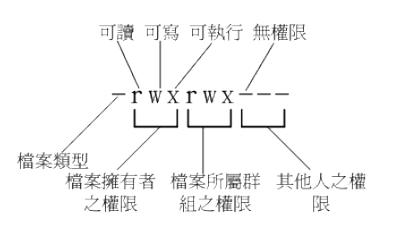
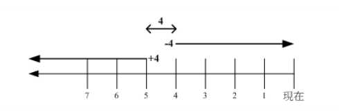
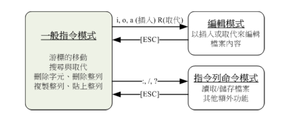

## 磁盘分区的配置

在目前的 Linux 环境下， 如果磁盘没有超过 2TB 的话，那么 Linux **默认是会以 MBR** 模式来处理分区表的。可以安装的时候加上某些参数， 强迫系统使用 GPT 的分区表来配置磁盘。而预计实际分区的情况如下：

| 所需目录  | 磁盘容量 |  文件空间  | 分区格式 |
| :-------: | :------: | :--------: | :------: |
| BIOS boot |   2MB    | 系统自定义 |  主分区  |
|   /boot   |   1GB    |    xfs     |  主分区  |
|     /     |   10GB   |    xfs     | LVM方式  |
|   /home   |   5GB    |    xfs     | LVM方式  |
|   swap    |   1GB    |    swap    | LVM方式  |

## 装置类型

- **标准分区区**：就是我们一直谈的分区槽，类似 /dev/vda1 之类的分区就是了。
- **LVM**：这是一种可以**弹性增加/削减**文件系统容量的装置设定。
- **LVM紧张供应**：是 LVM 的进阶版，与传统 LVM 直接分配固定的容量不同，  LVM 紧张供应可以让你在使用多少容量才分配磁盘多少容量给你，所以如果LVM 装置内的数据量较少，那么你的磁盘其实还可以作更多的资料储存，而不会被平白无故的占用。

## 文件系统

**就是实际格式化的时候，可以格式化成什么文件系统的意思**

+ **ext2/ext3/ext4**：Linux 早期适用的文件系统类型。由于 ext3/ext4 文件系统多了日志的记录， 对于系统的复原比较快速。不过由于磁盘容量越来越大，近来比较少使用 ext4 项目了。
+ **swap**：就是磁盘仿真成为内存，由于 swap 不会使用到目录树的挂载，所以用 swap 就不需要指定挂载点。
+ **BIOS boot**：就是 GPT 分区表可能会使用到的项目，若你使用 MBR 分区，那就不需要这个项目了。
+  **xfs**：这个是目前 CentOS 预设的文件系统，最早是由大型服务器所开发出来的。 他对于大容量的磁盘管理
    非常好，而且格式化的时候速度相当快，很适合当今动不动就是好几个 TB 的磁盘的环境，**非常常用。**
+  **vfat**：同时被 Linux 与 Windows 所支持的文件系统类型。如果主机硬盘内同时存在 Windows 与 Linux操作系统，为了数据的交换， 确实可以建置一个 vfat 的文件系统。

## KDUMP
这个项目主要在处理，当 Linux 系统因为核心问题导致的当机事件时，会将该当机事件的内存内数据储存出来的一项特色。若不需要，也能够关闭它，对系统的影响似乎并不太大。

## 指令基本格式

**`command [options] [arguments]`，command称为指令，options称为选项，arguments称为参数**

选项和参数都作为Shell命令执行时的输入，它们**之间用空格分隔开，空格的多少不影响指令的执行**。

- **Linux是区分大小写的**
- 如果指令太长可以输入**`\`**，之后**按回车**，使指令连续到下一行

**一般来说**，后面跟的选项如果**单字符**选项前使用**`-`**。**单词选项**前使用**`--`**

- 这是一般的情况，有些命令还是不归属这种规律的，相对较少。

- 例子：**`ls -a`**和**`ls -all`**，单个字符**`a` **使用**`-`**，一个单词**`all` **使用**`--`**

在Linux中，**可执行的文件**也进行了分类：

- **内置命令**：出于效率的考虑，将一些常用命令的解释程序**构造在Shell内部**。
- **外置命令**：存放在/bin、/sbin目录下的命令
- **实用程序**：存放在/usr/bin、/usr/sbin、/usr/share、/usr/local/bin等目录下的实用程序
- **用户程序**：用户程序经过编译生成可执行文件后，可作为Shell命令运行
- **Shell脚本**：由Shell语言编写的批处理文件，可作为Shell命令运行

## 常用快捷键

**`Tab`**：命令补全和文件补全（按一次自动补全，连续按两次，提示所有以输入开头字母的所有命令）

**`Ctrl` + `a`**：将光标移到行首

**`Ctrl` + `e`**：将光标移到行尾

**`Ctrl` + `c`**：中断目前程序

**`Ctrl` + `d`**：相当于离开（exit）

**`Ctrl` + ` l`**：清空终端，相当于（clear）

**`Ctrl` + ` z`**：将正在运行的程序送到后台

**`Ctrl` + `u`**：删除当前光标到行首的命令

**`shift` + ` Page UP` / `Page Down`**：上下翻页

## 指令

### 常用指令

+ **`date`**：显示日期
  +   **`date +%Y%m%d-%H%M%S`**：2019/04/12-15:32:59

+ **`cal`**：显示日历

  + **`cal`**：今天的日历

  * **`cal 2015`**：当年的日历
  * **`cal 07 1996`**：当年当月的日历

+ **`bc`**：简单好用的计算器

  + **`scale=n`**：n为小数点位数，bc预设只输出整数，如果要输出浮点数，必须执行该命令
  + **`+`**：加法
  + **`-`**：减法
  + **`*`**：乘法
  + **`/`**：除法
  + **`^`**：指数
  + **`%`**：取余
  + **`quit`**：退出

* **`nano`**：简单的文本编辑器
  * 界面包含按键提示

## 帮助

+ **`--help`**：指令的基本用法与选项介绍
+ **`man`**： manual 的缩写，将指令的具体信息（man page）显示出来
  + man page的数据默认存放在**`/usr/share/man`**目录里面
  + **`/String`**：在man page中向下搜寻字符串
  + **`？String`**：在man page中向上搜寻字符串
  + **`n`**：继续下一个搜寻
  + **`N`**：反向搜寻
  + **` q`**：结束搜寻
+ **`info`**：与 man 类似， info 会将文档分成一个个页面，每个页面可以进行跳转

#### 1. man page

**man page组成部分**

| 代号        | 内容说明                                                     |
| ----------- | ------------------------------------------------------------ |
| NAME        | 简短的指令、数据名称说明                                     |
| SYNOPSIS    | 简短的指令下达语法(syntax)简介                               |
| DESCRIPTION | 较为完整的说明，这部分最好仔细看看                           |
| OPTIONS     | 针对 SYNOPSIS 部分中，有列举的所有可用的选项说明             |
| COMMANDS    | 当这个程序(软件)在执行的时候，可以在此程序(软件)中下达的指令 |
| FILES       | 这个程序或数据所使用或参考或连结到的某些文件                 |
| SEE ALSO    | 可以参考的，跟这个指令或数据有相关的其他说明                 |
| EXAMPLE     | 一些可以参考的范例                                           |

**man page中第一行括号中数字的含义**

| 代号  | 代表内容                                                     |
| ----- | ------------------------------------------------------------ |
| **1** | **用户在 shell 环境中可以操作的指令或可执行文件**            |
| 2     | 系统核心可呼叫的函数与工具等                                 |
| 3     | 一些常用的函数(function)与函式库(library)，大部分为 C 的函式库(libc) |
| 4     | 装置文件的说明，通常在/dev 下的文件                          |
| **5** | **配置文件或者是某些文件的格式**                             |
| 6     | 游戏                                                         |
| 7     | 惯例与协议等，例如 Linux 文件系统、网络协议、ASCII code 等等的说明 |
| **8** | **系统管理员可用的管理指令**                                 |
| 9     | 跟 kernel 有关的文件                                         |

#### 2. info page

**info page组成部分**

| 代号 | 内容说明                                        |
| ---- | ----------------------------------------------- |
| File | 文件来源                                        |
| Node | 当前节点                                        |
| Next | 后一个节点                                      |
| Up   | 回到上一层的节点总揽画面，也可以按下U回到上一层 |
| Prev | 前一个节点                                      |

**3. 其他有用的文件**

更多的说明文件都存放在**`/usr/share/doc`**目录中

## 关机

* **`sync`**：synchronize的缩写，为了加快对磁盘文件的读写速度，位于内存中的文件数据不会立即同步到磁盘上，因此关机之前需要先进行 sync 同步操作，即使**`shutdown`/`reboot`/`halt`**等指令在关机前已经进行了sync的调用
  * 普通用户也可使用，普通用户只保存自己的数据，管理员可以保存整个系统的数据
* **`shutdown`**：关机，默认1分钟后关机，关机讯息会显示在登入者的屏幕上
  * 只有管理员有权限执行
  * **` shutdown -[h/r/k] [时间] '警告讯息'`**
    * 可以指定具体时间，如**`19:30`**
    * 指定多少分钟后关机，如**`10`**、**`+10`**（二者效果一样）
    * 立即关机，**`now`**
  * **` shutdown -h`**：将系统的服务停掉后，立即关机，常用
  * **` shutdown -r`**：将系统的服务停掉之后就重新启动，常用
  * **` shutdown -k`**：不进行关机，只发送警告讯息
  * **` shutdown -c`**：取消已经在进行的 shutdown 指令
* **`reboot`**：重启
* **`halt`**：系统停止，屏幕可能会保留系统已经停止的讯息，其实就是调用**` shutdown -h`**
* **`poweroff`**：系统关机，没有提供额外的电力，屏幕空白

## 文件与目录

### 一切皆文件

在Linux操作系统中，所有被操作系统管理的资源，例如网络接口卡、磁盘驱动器、打印机、输入输出设备、普通文件或是目录都被看作是一个文件。**也是Linux系统中一个重要的概念！**

### 文件属性

> **`drwxr-xr-x.   5   root   root   2046   May   29   16:08   .config`**
>
> **`-rw-------.   1   root   root    176   Apr    2   19:14   wlgq`**
>
> **`-rw-r--r--.   1   root   root     18   Dec   28    2013   .bashrc`**
>
> ①——————   ②      ③—       ④—        ⑤—      ⑥————————      ⑦———

#### ①：文件的类型与权限

* 第一组为**文件拥有者可具备的权限**（user）
* 第二组为**加入此群组之账号的权限**（group）
* 第三组为**非本人且没有加入本群组之其他账号的权限**（others）
* **超级用户root具有一切权限**

| 文件类型标识 |                           文件类型                           |
| :----------: | :----------------------------------------------------------: |
|    **-**     |                         **普通文件**                         |
|    **d**     |                           **目录**                           |
|    **l**     |           **链接文件**，类似Windows下面的快捷方式            |
|    **s**     | **套接字文件**，这类文件通常用在网络数据连接，可以启动一个程序来监听客户端的要求，客户端就可以通过套接字来进行数据通信 |
|    **b**     | **块设备文件**，存储数据以供系统存取的接口设备，简单而言就是硬盘 |
|    **c**     |      **字符设备**，串行端口的接口设备，如键盘、鼠标等等      |
|    **p**     | **管道文件（FIFO）**，是一种特殊的文件类型，Linux系统下，进程之间通信可以通过该文件完成 |

#### ②：表示有多少档名连结到此节点(i-node)

* 每个文件都会将他的权限与属性记录到文件系统的 i-node 中，不过，我们使用的目录树却是使用文件名来记录， 因此每个档名就会连结到一个 i-node 。这个属性记录的，就是有多少不同的档名连结到相同的一个 i-node 号码去就是了

#### ③：文件的拥有者账号

#### ④：文件所属的群组

#### ⑤：文件的容量大小

#### ⑥：最近的修改日期

#### ⑦：文件的档名

* 文件或者目录

### 改变文件属性与权限

* **`chgrp`**：change group的缩写，改变所属群组
  * **`chgrp [群组名] [文件]`**：改变所属群组
  * **`chgrp -R [群组名] [文件]`**：进行递归的持续变更，即同次目录下的所有文件、目录都更新成为这个群组。常常用在变更某一目录内所有的文件的情况。
* **`chown`**：change owner的缩写，改变文件拥有者
  * **`chown [账号名] [文件]`**：改变文件拥有者
  * **`chown [账号名:群组] [文件]`**：改变文件拥有者和所属群组
  * **`chown -R [账号名] [文件]`**：进行递归的持续变更
* **`chmod`**：change mode的缩写，改变权限
  * 数字类型改变文件权限
    * 如**`chomod 756 test`**：将test文件的权限**`-rwxrwxrwx`**修改为**`-rwxr-xrw-`**
    * 权限分数对照：**`r:4`**、**`w:2`**、**`x:1`**
  * 符号类型改变文件权限
    * 如**`chomod u=rwx,g-x,o+x test`**：将test文件的权限**`-rwxrwx---`**修改为**`-rwxrw---x`**
    * 权限身份对照：**`u:user`**、**`g:group`**、**`o:others`**、**`a:all`**
    * **`u/g/o`**可以连写，如**`u=rx,go-rwx`**、**`ugo=rwx`**
    * 运算符对照：**`+:加入权限`**、**`-:去除权限`**、**`=:设定权限`**
  * **`chomod [权限] [文件]`**：修改文件权限
  * **`chomod -R [权限] [文件]`**：进行递归的持续变更

### rwx

* **文件**
  * **r (read)**：可读取此文件的实际内容，如读取文本文件的文字内容等
  * **w (write)**：可以编辑、新增或者是修改该文件的内容（但不含删除该文件）
  * **x (execute)**：该文件具有可以被系统执行的权限
* **目录**
  * **r (read contents in directory)**：表示具有读取目录结构列表的权限
  * **w (modify contents of directory)**：表示具有异动该目录结构列表的权限
    * 建立新的文件与目录
    * 删除已经存在的文件与目录（不论该文件的权限为何）
    * 将已存在的文件或目录进行更名
    * 移动该目录内的文件或目录的位置
  * **x (access directory)**：目录的 x 代表的是用户能否进入该目录成为工作目录（work directory）就是你
    目前所在的目录
    * 能不能进入一个目录，只与x权限有关，即使具有该目录的r或w权限
  * 如果用户具有某个目录的rwx权限，没有里面某个文件的rwx权限，用户无法读写或执行该文件，但是可以删除该文件

### 文件的默认权限和隐藏权限（待添加）

### 指令与文件的搜寻

* **`which`**：指令的搜索
  * **`which [指令]`**：搜索指令
  * **`which -a [指令]`**：将所有由 PATH 目录中可以找到的指令均列出，而不止第一个被找到的指令名称
* **`whereis [指令]`**：文件的搜索，只搜索特定目录**`/bin/sbin`**、**`/usr/share/man`**
  * **`whereis -l [指令]`**：列出**`whereis`**会去查询的几个主要目录
  * **`whereis -b [指令]`**：只找 binary 格式的文件
  * **`whereis -m [指令]`**：只找在说明文件 manual 路径下的文件
  * **`whereis -s [指令]`**：只找 source 来源文件
  * **`whereis -u [指令]`**：搜寻不在上述三个项目当中的其他特殊文件
* **`locate`**：可以用关键字或者正则表达式进行搜索
  * **`locate -i [关键字]`**：忽略大小写的差异
  * **`locate -c [关键字]`**：不输出档名，仅计算找到的文件数量
  * **`locate -l [行数] [关键字]`**：只输出几行的意思
  * **`locate -r [关键字]`**：接正则表达式
  * **`updatedb`**：更新数据库，**`locate`**无法搜索新建的文件（默认一天更新一次）
* **`find`**：可以使用文件的属性和权限进行搜索
  * **`find [目录] [选项] [参数]`**：使用文件的属性和权限进行搜索
  * 与时间有关的选项**`-atime`**、**`-ctime`**、**`-mtime`**，以**`-mtime`**为例
    * **`find [目录] -mtime n`**：列出在 n 天之前的一天之内被修改过内容的文件
      * **`find [目录] -mtime 0`**：0表示当前时间，该指令表示现在到24小时之前被修改过的文件
    * **`find [目录] -mtime +n`**：列出在 n 天之前，不含当天，被修改过内容的文件
    * **`find [目录] -mtime -n`**：列出在 n 天之内，含当天，被修改过内容的文件
    * **`find [目录] -mtime -newer [文件]`**：列出比某个文件还要新的文件
  * 
  * 与文件拥有者和所属群组有关的选项
    - **`find [目录] -uid [UID]`**：列出属于 UID 为 n 的文件
    - **`find [目录] -gid [GID]`**：列出属于 GID 为 n 的文件
    - **`find [目录] -user [用户名]`**：列出属于该用户的文件
    - **`find [目录] -group [群组名]`**：列出属于该群组的文件
    - **`find [目录] -nouser`**：列出不属于任何用户的文件
    - **`find [目录] -nogroup`**：列出不属于任何群组的文件
  * 与文件权限和名称有关的选项
    * **`find [目录] -name [文件名]`**：按文件名搜索文件
    * **`find [目录] -size [+-][文件大小]`**：搜寻比某个文件容量还要大(+)或小(-)的文件
    * **`find [目录] -type [文件类型]`**：按文件类型搜索文件
    * **`find [目录] -perm [文件权限]`**：搜索等于权限的文件
    * **`find [目录] -perm -[文件权限]`**：搜索包括权限的文件
    * **`find [目录] -perm /[文件权限]`**：搜索包括任一权限的文件

### 文件的管理

* **`ls`**：list的缩写，文件的检视，默认按档名进行排序
  * **`ls -a [文件]`**：全部的文件，连同隐藏档（开头为 . 的文件）一起列出来，常用
  * **`ls -A [文件]`**：全部的文件，连同隐藏档一起列出来，不包括**`.`**与**`..`**两个目录
  * **`ls -d [文件]`**：只列出目录本身，不列出目录内的文件数据，常用
  * **`ls -f [文件]`**：只列出结果，不进行排序
  * **`ls -F [文件]`**：根据文件、目录等信息，给予附加数据结构
  * **`ls -i [文件]`**：列出 inode 号码
  * **`ls -l [文件]`**：长数据串行出，包含文件的属性与权限等等数据，常用
  * **`ls -r [文件]`**：将排序结果反向输出
  * **`ls -R [文件]`**：连同子目录内容一起列出来，该目录下的所有文件都会显示出来
  * **`ls -S [文件]`**：按文件容量大小排序
  * **`ls -t [文件]`**：按时间排序
* **`cp`**：copy的缩写，复制文件
  - **`cp [来源文件] [目标文件]`**：复制来源文件到目标文件，同时复制执行者的属性和权限
  - **`cp -a [来源文件] [目标文件]`**：相当于 **`-dr --preserve=all`** 的意思，常用
  - **`cp -d [来源文件] [目标文件]`**：若来源文件为链接文件，则复制链接文件属性而非文件本身
  - **`cp -f [来源文件] [目标文件]`**：若目标文件已经存在且无法开启，则移除后再尝试一次
  - **`cp -i [来源文件] [目标文件]`**：若目标文件已经存在时，在覆盖前会先询问
  - **`cp -p [来源文件] [目标文件]`**：连同文件的属性一起复制过去，而非使用默认属性，备份常用
  - **`cp -r [来源文件] [目标文件]`**：递归持续复制，常用
  - **`cp -s [来源文件] [目标文件]`**：复制成为符号链接文件，即快捷方式文件
  - **`cp -u [来源文件] [目标文件]`**：目标文件比来源文件旧或目标文件不存在才进行更新
  - **`cp --preserve=all [来源文件] [目标文件]`**：除了 -p 的权限相关参数外，还加入 SELinux 的属性, links, xattr 等也复制了
  - 来源文件有两个以上时，目标文件必须是目录
* **`rm`**：remove的缩写，移除文件
  - **`rm [文件]`**：移除文件
  - **`rm -f [文件]`**：忽略不存在的文件，不会出现警告讯息
  - **`rm -i [文件]`**：删除前会先询问
  - **`rm -r [文件]`**：递归删除，非常危险

* **`mv`**：move的缩写，移动文件、更名
  * **`mv [来源文件] [目标文件]`**：移动来源文件到目标文件
  * **`mv -f [来源文件] [目标文件]`**：如果目标文件已经存在，不会询问直接覆盖
  * **`mv -i [来源文件] [目标文件]`**：移动前会先询问
  * **`mv -u [来源文件] [目标文件]`**：如果目标文件已经存在，并且来源文件比较新，才会更新
  * 来源文件有两个以上时，目标文件必须是目录

### 文件内容的查阅

* **`cat`**：concatenate的缩写，检视文件内容
  * **`cat -A [文件]`**：相当于**`-vET`**的整合选项，可列出一些特殊字符
  * **`cat -b [文件]`**：列出行号，仅针对非空白行做行号显示，空白行不标行号
  * **`cat -E [文件]`**：将结尾的断行字符 $ 显示出来
  * **`cat -n [文件]`**：打印出行号，连同空白行也会有行号
  * **`cat -T [文件]`**：将 tab 按键以 ^I 显示出来
  * **`cat -v [文件]`**：列出一些看不出来的特殊字符

* **`tac`**：是 **`cat`** 的反向操作，从最后一行开始打印
* **`more`**：可翻页检视，只能向下翻页
* **`less`**：可翻页检视，可以上下翻页

### 资料撷取

* **`head`**：可以取得文件前几行
  * **`head -n [行数] 文件`**：取得文件前多少行
* **`tail`**：是**`head`**的反向操作，取得文件的后几行
* **`od`**：可以以字符或者十六进制的形式显示二进制文件
* **`touch`**：修改文件时间或者建立新文件
  * **`touch [文件]`**：新建一个空文件
  * **`touch -a [文件]`**：只修改 atime
  * **`touch -c [文件]`**：更新 ctime，若该文件不存在则不建立新文件
  * **`touch -m [文件]`**：只修改 mtime
  * **`touch -d [文件]`**：后面可以接更新日期而不使用当前日期，也可以使用 **`--date="日期或时间"`**
  * **`touch -t [文件]`**：后面可以接更新时间而不使用当前时间，格式为 [YYYYMMDDhhmm]
  * 变动时间
    * **mtime（modification time ）**：当该文件的内容数据变更时，就会更新这个时间。内容数据指的是文件的内容，而不是文件的属性和权限
    * **ctime（status time）**：当该文件的状态改变时，就会更新这个时间，如权限或属性被更改
    * **atime（access time）**：当该文件的内容被取用时，就会更新这个读取时间

### 目录结构

### 常见目录

- **/bin：** binaries的缩写，存放二进制可执行文件(ls,cat,mkdir等)，常用命令一般都在这里
- **/etc：** etcetera的缩写，存放系统管理和配置文件
- **/home：** 存放所有用户文件的根目录，是用户主目录的基点，比如用户user的主目录就是/home/user，可以用~user表示
- **/usr ：** unix system resources的缩写，用于存放系统应用程序
- **/opt：** optional的缩写，额外安装的可选应用程序包所放置的位置。一般情况下，我们可以把tomcat等都安装到这里
- **/proc： **processes的缩写，虚拟文件系统目录，是系统内存的映射。可直接访问这个目录来获取系统信息
- **/root：** 超级用户（系统管理员）的主目录
- **/sbin：** super binaries的缩写，存放二进制可执行文件，只有root才能访问。这里存放的是系统管理员使用的系统级别的管理命令和程序
- **/dev：** devices的缩写，用于存放设备文件
- **/mnt：** mount的缩写，系统管理员安装临时文件系统的安装点，系统提供这个目录是让用户临时挂载其他的文件系统
- **/boot：** 存放用于系统引导时使用的各种文件
- **/lib ：** libraries的缩写，存放着和系统运行相关的库文件 
- **/tmp：** temporary的缩写，用于存放各种临时文件，是公用的临时文件存储点
- **/var：** variable的缩写，用于存放运行时需要改变数据的文件，也是某些大文件的溢出区，比方说各种服务的日志文件等
- **/lost+found：** 这个目录平时是空的，系统非正常关机而留下“无家可归”的文件就在这里

### 相对路径和绝对路径

* 绝对路径：由根目录**`/`**开始写起的文件名或目录名称， 如**` /home/test`**
* 相对路径：相对于目前路径的文件名写法，如 **` ./home/test`**或 **` ../../home/test`** 等等。开头不是**` /`**就属于相对路径的写法
  * **`.`**：代表当前的目录，也可以使用**`./`**来表示
  * **`..`**：代表上一层目录，也可以使用**`../`**来表示
  * **`-`**：代表前一层目录
  * **`~`**：代表当前用户的家目录
  * **`~[用户名]`**：代表用户的家目录

### 目录的相关操作

* **`cd`**：change directory的缩写，变换目录
* **`pwd`**：print working directory的缩写，显示目前所在的目录
* **`mkdir`**：make directory的缩写，建立新目录
  * **`mkdir -p [目录名称]`**：递归建立目录，如**`mkdir -p t1/t2/t3`**
  * **`mkdir -m [目录名称]`**：建立目录时配置文件的权限**`mkdir -m 770 test`**
* **`rmdir`**：remove directory的缩写，删除空目录
  * **`mkdir -p [目录名称]`**：连同上层的空目录一同删除

## 磁盘和文件管理系统（待添加）

## 压缩、打包与备份

### 常见的压缩文件扩展名

| 扩展名    | 压缩程序                              |
| --------- | ------------------------------------- |
| *.Z       | compress（用得少）                    |
| *.zip     | zip                                   |
| *.gz      | gzip（常用）                          |
| *.bz2     | bzip2（常用）                         |
| *.xz      | xz（常用）                            |
| *.tar     | tar 程序打包的数据，没有经过压缩      |
| *.tar.gz  | tar 程序打包的文件，经过 gzip 的压缩  |
| *.tar.bz2 | tar 程序打包的文件，经过 bzip2 的压缩 |
| *.tar.xz  | tar 程序打包的文件，经过 xz 的压缩    |

### 压缩

* **`gzip`**：应用最广的压缩指令，可以解开 compress 、zip 、gzip 等软件压缩的文件
  * **`gzip -c [文件]`**：将压缩的数据输出到屏幕上
  * **`gzip -d [文件]`**：解压缩
  * **`gzip -t [文件]`**：检验一个压缩文件的一致性
  * **`gzip -v [文件]`**：显示出原文件/压缩文件案的压缩比等信息
  * **`gzip -[数字] [文件]`**：代表压缩等级，1 最快，压缩比最差，9 最慢，压缩比最好。默认是 6
  * 压缩后，源文件不存在
  * 可以使用**`zcat`**/**`zmore`**/**`zless`**/**`zgrep`**读取压缩文件内容
* **`bzip2`**：提供比**`gzip`**更高的压缩比
  * **`gzip -[c/d/v/数字] [文件]`**：同上
  * **`gzip -k [文件]`**：保留源文件
  * **`gzip -z [文件]`**：压缩的参数（默认值，可以不加）
  * 可以使用**`bzcat`**/**`bzmore`**/**`bzless`**/**`bzgrep`**读取压缩文件内容
* **`xz`**：提供比**`bzip2`**更高的压缩比
  * **`xz -[c/d/k/t/数字] [文件]`**：同上
  * **`xz -l [文件]`**：显示压缩文件的相关信息
  * 可以使用**`xzcat`**/**`xzmore`**/**`xzless`**/**`xzgrep`**读取压缩文件内容

### 打包

* **`tar -[z|/j|/J] [cv] -[f] [新建的tar文件] [文件名]`**：打包与压缩
  * 如**`tar -jcv -f test.tar.bz2 test`**
* **`tar -[z|/j|/J] [tv] -[f] [tar文件]`**：查看文件
  - 如**`tar -jtv -f test.tar.bz2`**
* **`tar -[z|/j|/J] [xv] -[f] [tar文件] -C [文件名]`**：解压缩
  - 如**`tar -jxv -f test.tar.bz2 -C test`**

* **`tar`**：多个文件或目录包成一个大文件，压缩指令只能对单个文件进行压缩
  * **`tar -c `**：建立打包文件
  * **`tar -t `**：察看打包文件的内容含有哪些档名
  * **`tar -x`**：解打包或解压缩的功能
  * **`tar -z `**：使用 gzip 的支持进行压缩/解压缩
  * **`tar -j `**：使用 bzip2 的支持进行压缩/解压缩
  * **`tar -J `**：使用 xz 的支持进行压缩/解压缩
  * **`tar -v `**：在压缩/解压缩的过程中，将正在处理的文件名显示出来
  * **`tar -f [文件名] `**：要被处理的文件，建议**`-f`**单独写一个选项
  * **`tar -C `**：用在解压缩中，如果需要在特定目录解压缩，可以使用这个选项
  * **`tar -p `**：保留备份数据的原本权限与属性，常用于备份重要的配置文件
  * **`tar -P `**：保留绝对路径，即允许备份数据中含有根目录
  * **`tar --exclude=[文件] `**：在压缩的过程中，不要将某文件打包

### 备份（待添加）

## vim程序编辑器

### vi的三种模式

* **一般指令模式 (command mode)**：以 vi 打开一个文件就直接进入一般指令模式了。在这个模式中， 你可以使用上下左右按键来移动光标，你可以使用删除字符或删除整列来处理文件内容，也可以使用复制、粘贴来处理你的文件数据
* **编辑模式 (insert mode)**：在一般指令模式中可以进行删除、复制、粘贴等操作，但无法编辑文件内容的。要按下 i, I, o, O, a, A, r, R 等任何一个字母之后才会进入编辑模式。通常在 Linux中，按下这些按键时，在画面的左下方会出现 INSERT 或 REPLACE 的字样，此时才可以进行编辑。而如果要回到一般指令模式时， 可按下 Esc 按键退出编辑模式
* **指令列命令模式 (command-line mode)**：在一般模式当中，输入 : / ?  三个中的任何一个按钮，就可以将光标移动到最底下那一列。在这个模式当中， 可以提供搜寻资料的操作，而读取、保存、离开 vi 、显示行号等操作则是在此模式中达成的

### vi按键说明

#### 一般模式可用指令

* 移动光标

  * **`h`** / **`←`**：光标向左移动一个字符
  * **`j`** / **`↓`**：光标向下移动一个字符
  * **`k`** / **`↑`**：光标向上移动一个字符
  * **`l`** / **`→`**：光标向右移动一个字符
  * 多次移动，如**`30j`**、**`25←`**
  * **`Ctrl`** + **`f`**：向下移动一页，常用
  * **`Ctrl`** + **`b`**：向上移动一页，常用
  * **`Ctrl`** + **`d`**：向下移动半页
  * **`Ctrl`** + **`u`**：向上移动半页
  * **`+`**：光标移动到非空格符的下一列
  * **`-`** ：光标移动到非空格符的上一列
  * **`数字`** + **`space`**：光标会向右移动这一列的几个字符
  * **`0`** / **`Home`**：光标移动到这一列的最前面字符处，常用
  * **`$`** / **`End`**：光标移动到这一列的最后面字符处，常用
  * **`H`**：光标移动到这个屏幕的最上方那一列的第一个字符
  * **`M`**：光标移动到这个屏幕的中央那一列的第一个字符
  * **`L`**：光标移动到这个屏幕的最下方那一列的第一个字符
  * **`G`**：光标移动到这个文件的最后一列，常用
  * **`数字`** + **`G`**：光标移动到这个文件的第几列
  * **`gg`**：光标移动到这个文件的第一列，常用
  * **`数字`** + **`Enter`**：光标向下移动几列

* 搜索与替代

  * **`/String`**：向光标之下寻找一个字符串
  * **`？String`**：向光标之上寻找一个字符串
  * **`n`**：继续下一个搜寻
  * **`N`**：反向搜寻
  * **`:数字1,数字2s/String1/String2/g`**：在数字1列到数字2列之间寻找并替换String1为String2
  * **`:1,$s/String1/String2/g`**：从第一列到最后一列寻找并替换String1为String2
  * **`:1,$s/String1/String2/gc`**：从第一列到最后一列寻找并替换String1为String2，在替换前需要用户确认

* 删除、复制、粘贴

  * **`x`**：向后删一个字符，常用
  * **`X`**：向前删一个字符，常用
  * **`数字`** + **`x`**：连续向后删除几个字符
  * **`dd`**：删除游标所在的那一整列，常用
  * **`数字`** + **`dd`**：删除光标所在的向下几列
  * **`d1G`**：删除光标所在到第一列的所有数据
  * **`dG`**：删除光标所在到最后一列的所有数据
  * **`d$`**：删除光标所在处，到该列的最后一个字符
  * **`d0`**：删除光标所在处，到该列的最前面一个字符
  * **`yy`**：复制光标所在的那一列，常用
  * **`数字`** + **`yy`**：复制光标所在的向下几列，常用

  - **`y1G`**：复制光标所在列到第一列的所有数据
  - **`yG`**：复制光标所在列到最后一列的所有数据
  - **`y$`**：复制光标所在的那个字符到该列行尾的所有数据
  - **`y0`**：复制光标所在的那个字符到该列行首的所有数据
  - **`p`**：将已复制的数据在光标下一列粘贴上
  - **`P`**：将已复制的数据在光标上一列粘贴上
  - **`J`**：将光标所在列与下一列的数据结合成同一列
  - **`c`**：重复删除多个数据，如**`10cj`**
  - **`u`**：复原前一个动作，常用
  - **`Ctrl`** + **`r`**：重做前一个动作，常用
  - **`.`**：重复前一个动作

#### 一般指令模式切换到编辑模式的可用的指令

* 进入插入模式
  * **`i`**：从目前光标所在处插入
  * **`I`**：在目前所在列的第一个非空格符处开始插入
  * **`a`**：从目前光标所在的下一个字符处开始插入
  * **`A`**：从目前光标所在的最后一个字符处开始插入
  * **`o`**：在目前光标所在的下一列处插入新的一列
  * **`O`**：在目前光标所在处的上一列插入新的一列
* 进入取代模式
  - **`r`**：只会取代光标所在的那一个字符一次
  - **`A`**：一直取代光标所在的文字，直到按下**`Esc`**为止
  - **`Esc`**：退出编辑模式，回到一般指令模式中

#### 一般指令模式切换到指令列模式的可用的指令

* **`:w`**：将编辑的数据写入硬盘文件中，常用
* **`:w!`**：若文件属性为只读时，强制写入该文件
* **`:q`**：离开 vi ，常用
* **`:wq`**：储存后离开，常用
* **`:wq!`**：强制储存后离开
* **`ZZ`**：强制离开不储存文件
* **`:w [文件名]`**：将编辑的数据储存成另一个文件
* **`:r [文件名]`**：在编辑的数据中读入另一个文件的数据
* **`:数字1,数字2 w [文件名]`**：数字1列到数字2列之间的内容储存成新文件
* **`:! [指令]`**：暂时离开 vi 到指令列模式下执行指令的显示结果
* **`:set nu`**：显示行号
* **`:set nonu`**：取消行号

###  vim的暂存档、救援回复与开启时的警告讯息（待添加）

## BASH（待添加）

## Shell脚本（待添加）

## 账号和群组

