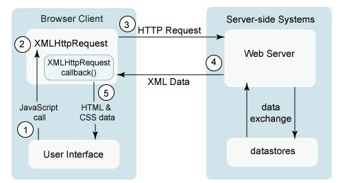
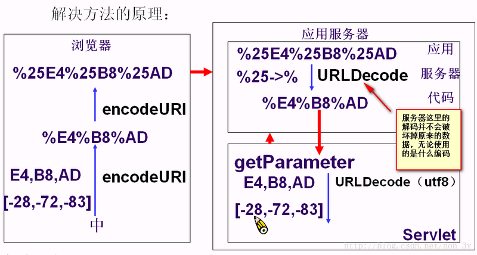

## Ajax

Ajax（Asynchronous JavaScript and XML）异步 JavaScript 和 XML，是一种用于创建快速动态网页的技术。它不是一种新的编程语言，而是一种用于创建更好更快以及交互性更强的 Web 应用程序的技术

通过在后台与服务器进行少量数据交换，可以在不重新加载整个网页的情况下，对网页的某部分进行更新，使网页实现异步更新

### 优点

* **异步请求**，不妨碍用户浏览页面或者其他操作
* **局部刷新**，无需重新刷新页面
* 界面与应用分离。有利于分工合作、减少非技术人员对页面的修改造成的 Web 应用程序错误、提高效率、也更加适用于现在的发布系统
* 基于标准被广泛支持，不需要下载浏览器插件或者小程序，但需要客户允许 JavaScript 在浏览器上执行
* 前端和后端负载平衡，将一些后端的工作移到前端，减少服务器与带宽的负担

### 缺点

* **对浏览器机制的破坏**，无法使用 back 和 History，破坏浏览器前进、后退按钮的正常功能
* 安全问题，暴露了与服务器交互的细节，易受到黑客攻击
* 对搜索引擎支持较弱
* 不能很好支持移动设备
* 违背 URL 和资源定位的初衷
* 破坏程序的异常处理机制
* 客户端肥大，太多客户段代码造成开发上的成本

### Ajax 工作原理
相当于在客户端与服务端之间加了一个抽象层（Ajax 引擎），使用户请求和服务器响应异步化，并不是所有的请求都提交给服务器，像一些数据验证和数据处理都交给 Ajax 引擎来完成，只有确认需要向服务器读取新数据时，才会让 Ajax 引擎向服务器提交请求

*更多：[AJAX工作原理及其优缺点](https://www.cnblogs.com/SanMaoSpace/archive/2013/06/15/3137180.html)*

### Ajax 请求总共有八种 Callback

- onSuccess
- onFailure
- onUninitialized
- onLoading
- onLoaded
- onInteractive
- onComplete
- onException

## XMLHttpRequest

XMLHttpRequest 对象是 Ajax 技术的核心。提供了异步发送请求的能力，使用 Ajax 更多的是编写客户端代码，而不是服务端的代码

### 创建 XMLHttpRequest 对象

创建 XMLHttpRequest 对象是要分两种情况考虑，不同的浏览器，对象的创建方式是不同的

```javascript
var httpRequest;

if(window.XMLHttpRequest) {
	httpRequest = new XMLHttpRequest();// IE6以上的版本以及其他内核的浏览器等
}else if(window.ActiveXObject) {
	httpRequest = new ActiveXObject();// IE6以下的版本
}
```

### XMLHttpRequest 工作原理

传统的 Web 前端与后端的交互中，浏览器直接访问 Tomcat 的 Servlet 来获取数据，Servlet 通过转发把数据发送给浏览器。当使用 Ajax 之后，浏览器会先把请求发送到 XMLHttpRequest 异步对象之中，异步对象对请求进行封装，然后再发送给服务器。XMLHttpRequest 异步对象会 **不停监听服务器状态的变化**，得到服务器返回的数据，就写到浏览器上。因为不是转发的方式，而是以 **流** 的方式把数据返回给浏览器，所以是无刷新就能够获取服务器端的数据



### 常用的方法和属性

```javascript
// 建立与服务器的连接
// method是指定提交方式(post、get等)，url为需要请求的地址，async指定异步(true)还是同步
// username和password是可选的，在http认证的时候会用到
open()(String method,String url,boolean async,String username,String password)

// 发送请求给服务器
// 指定请求的参数，如果是get方式，不需要填写参数，或填写null；如果是post方式，把要提交的参数写上去
send(content)

// 设置消息头（使用post方式才会使用到，get方法并不需要调用该方法）
// 如setRequestHeader("Content-type","application/x-www-form-urlencoded")
setRequestHeader(String header,String value)
```

* **onreadystatechange**：请求状态改变的事件触发器，readyState 变化时会调用此方法，一般用于指定回调函数
* **readyState**：XMLHttpRequest 的状态信息
  * 0：对象没有完成初始化
  * 1：发送请求调用了 open 方法，但还没有调用 send 方法，请求还没有发出
  * 2：请求发送完成，send 方法已经调用，数据已经提交到服务器，但没有任何响应
  * 3：开始读取响应，还没有结束收到了所有的响应消息头，但正文还没有完全收到
  * **4：数据接收完成，读取响应结束一切都收到了**
* **responseText**：服务器返回的文本内容
* **responseXML**：服务器返回的兼容 DOM 的 XML 内容
* **status**：服务器返回的状态码
* statusText：服务器返回状态码的文本信息

### 解决中文乱码

可以屏蔽任何浏览器和任何服务器的编码格式，浏览器发送给服务器的数据不造成乱码问题

- 发送数据给服务器的时候，JavaScript **使用两次 EncodeURI()**
- 服务器得到数据，**使用 URLEncode.decode(数据,"utf-8") 进行解码**



### 解决缓存问题

产生缓存的原因就是，请求了同一个地址，做了相同的操作。服务端认为操作没有发生变化，就直接把缓存的信息返回过来。这样的话，就不能更换验证码图片等操作了

- 在每次请求 URL 中加入一个时间戳参数，这样每次的 URL 就不一样了
- 加入时间戳参数到 URL 时，也分两种情况
  - URL 本身就带有参数了，也就是说有 `?` 号了，那么添加时间戳的时候就需要用 `&` 号
  - URL 没有参数，直接使用 `?` 号来添加时间戳

```javascript
if(url.indexOf("?") >= 0){
	url = url + "&t=" + (new Date()).valueOf();
} else{
	url = url + "?t=" + (new Date()).valueOf();
}
```

## 编写 Ajax

- 创建 XMLHttpRequest 对象，也就是创建一个异步调用对象
- 创建一个新的 HTTP 请求，并指定该 HTTP 请求的方法、URL 及验证信息
- 设置响应 HTTP 请求状态变化的函数
- 发送 HTTP 请求
- 获取异步调用返回的数据
- 使用 JavaScript 和 DOM 实现局部刷新

```html
<body>
	<input type="text" id="username">
	<input type="button" onclick="checkUsername()" value="检测用户名是否合法">
	<div id="result">
	</div>

<script type="text/javascript">

var httpRequest;
function checkUsername() {
    // 创建XMLHttpRequest对象
	if(window.XMLHttpRequest) {
		httpRequest = new XMLHttpRequest();
	}else if(window.ActiveXObject) {
		httpRequest = new ActiveXObject();
	}

    // 创建http请求
    httpRequest.open("POST", "Servlet1", true);
    // 因为使用的是post方式，所以需要设置消息头
    httpRequest.setRequestHeader("Content-type", "application/x-www-form-urlencoded");
    // 指定回调函数
    httpRequest.onreadystatechange = res;
    // 得到文本框的数据
    var name = document.getElementById("username").value;
    // 发送http请求，把要检测的用户名传递进去
    httpRequest.send("username=" + name);
}

// 创建回调函数
function res() {
	// 判断请求状态码是否是4，即数据接收完成
	if(httpRequest.readyState==4) {
        // 判断状态码是否为200，即服务器响应一切正常
        if(httpRequest.status==200) {
            // 得到服务端返回的文本数据
            var text = httpRequest.responseText;
			//把服务端返回的数据写在div上
            var div = document.getElementById("result");
            div.innerText = text;
		}
	}
}
</script>
</body>
```

## jQuery 中的 Ajax

```javascript
$(function () {
    test();

    function test() {
        $.ajax({
            url: "/test/one",
            type: "get",
            dataType: "json",
            success: function (result) {
                var dataTR = "";
                $.each(result, function (index, value) {
                    dataTR += "<tr>"
                        + "<td>"
                        + value.id
                        + "</td>"
                        + "<td>"
                        + value.name
                        + "</td>"
                        + "</tr>";
                });
                $("#tbody").html(dataTR);
            }
        });
    }
})
```

* url：发送请求的地址，默认值为当前页地址
* type：设置请求方式， 默认为 get
* data：发送到服务器的数据，将自动转换为请求字符串格式
* dataType：预期服务器返回的数据类型。如果不指定，jQuery 将自动根据 HTTP 包 MIME 信息来智能判断
  - xml：返回 XML 文档，可用 jQuery 处理
  - html：返回纯文本 HTML 信息，包含的 script 标签会在插入 dom 时执行
  - script：返回纯文本 JavaScript 代码。不会自动缓存结果。除非设置了 cache 参数。在远程请求时（不在同一个域下），所有 POST 请求都将转为 GET 请求
  - json：返回 JSON 数据 
  - jsonp：返回 JSONP 数据
  - text：返回纯文本字符串
* async：默认为 true，即所有请求均为异步请求。设置 false 为发送同步请求
* contentType：发送信息至服务器时内容编码类型，String 类型
  - 默认值为 `application/x-www-form-urlencoded`
* timeout：设置请求超时时间，单位为毫秒
* success：请求成功后自动调用此函数
* error：请求失败时自动调用此函数

## JSON

JSON（JavaScript Object Notation）JavaScript 对象表示法，是一种数据交换格式，独立于编程语言，可以用来存储和交换文本信息，类似 XML。JSON 的数据格式是以 **名-值对** 的方式存储的，可以将其看做是一个字符串

* JavaScript 原生支持 JSON，解析速度会很快

* 非常利于人类阅读和编写，同时也利于机器的解析和生成

* JSON 文件格式压缩，可以提升网络传输效率

在 JSON 中规定的字符编码时 utf-8，无需担心乱码问题。几乎所以的编程语言都有解析 JSON 数据的第三方库，因此 JSON 的应用非常多

```javascript
// 创建一个JSON对象
var queen = {name:"瑟曦",age:38};

// 创建一个JSON数组
var person = [{name:"囧",age:18},{name:"豌豆射手",count:28}];
```

### JSON 数据类型

JSON 中的数据类型包括：对象、字符串、数字、布尔值、NULL 和数组

* JSON 中的对象类型十分简单，JSON 本身就是对象，也就是 **被一对花括号 `{}` 包裹的键值对的列表**。对象可以嵌套使用，对象可以包含多个键值对，**键必须是字符串，值可以是合法的 JSON 数据类型**
* JSON 中字符串必须并且只能使用双引号包裹起来。**在 JSON 中，键都是字符串类型**。在 Javascript 中，使用 **单引号和双引号没有任何区别**。但是 JSON 不是 Javascript 对象字面量，它只是基于 Javascript 对象字面量
* JSON 中的数字类型可以是整数、小数、负数或者是指数
* JSON 中的 **布尔值只可使用小写形式**：true 或 false，其他任何写法都会报错
* JSON 中，使用 Null 表示一无所有、不存在等意思
* JSON 中数组始终应该 **被方括号 `[]` 包裹**，数组中的值使用逗号隔开。这些值可以是任何合法的 JSON 数据类型。在数组中也可包含不同数据类型的值，但应该避免这样使用

## 更多

- [AJAX入门这一篇就够了](https://segmentfault.com/a/1190000013286987)
- [AJAX跨域完全讲解](https://segmentfault.com/a/1190000013473001)
- [XML+JSON面试题都在这里](https://segmentfault.com/a/1190000013285207)
- [《JSON必知必会》学习笔记（一）](https://segmentfault.com/a/1190000010407527)
- [fastjson json字符串和JavaBean、List、Map及复杂集合类型的相互转换](https://blog.csdn.net/SilenceCarrot/article/details/79381189)