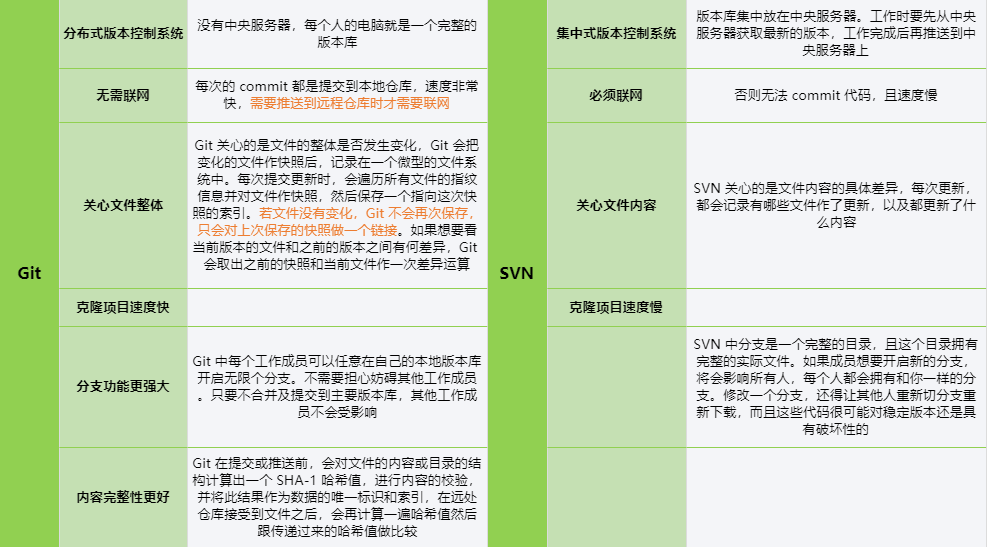
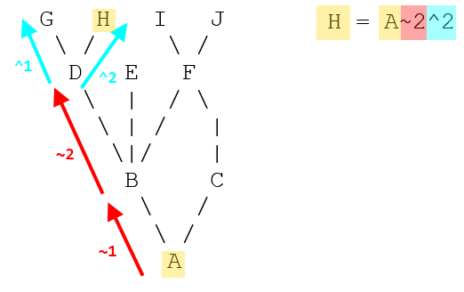
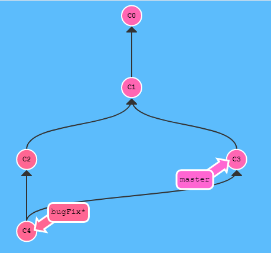
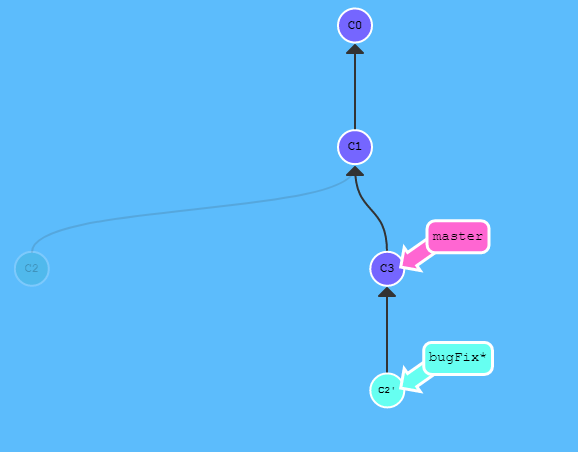
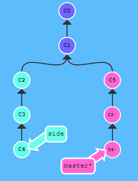
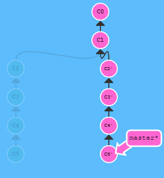

## 什么是 Git

目前世界上最先进的分布式版本控制系统

## Git 与 SVN 的区别



*更多：[详细透彻解读 Git与 SVN的区别](https://blog.csdn.net/hellow__world/article/details/72529022)*

## Git 的优缺点

### 优点

* Git 中每个克隆的版本库都是平等的。可以从任何一个版本库的克隆来创建属于自己的版本库
* Git 的每一次提取操作，实际上都是一次对代码仓库的完整备份
* 提交完全在本地完成，并且提交总是会成功，不会被打断
* push 给他人或者他人 pull 你的版本库，合并会发生在 push 和 pull 过程中，不能自动解决的冲突会提示手工完成

### 缺点

- Git 没有严格的权限管理控制，一般通过系统设置文件读写权限的方式来做权限控制
- 工作目录只能是整个项目，而 SVN 可以基于项目中的某一个目录

## 安装Git

步骤很简单，安装完成后还需要最后一步设置，在 Git Bash 中输入

```bash
$ git config --global user.name "Your Name"
$ git config --global user.email "email@example.com"
```

因为 Git 是分布式版本控制系统，所以，每个机器都必须自报家门：你的名字和 Email 地址。用了 **`--global`** 参数，表示这台机器上所有的 Git 仓库都会使用这个配置，当然也可以对某个仓库指定不同的用户名和 Email 地址

## 版本库

版本库（repository）又名仓库，可以简单理解成一个目录，这个目录里面的所有文件都可以被 Git 管理，每个文件的增删改，Git 都能跟踪，以便任何时刻都可以追踪历史，或者在将来某个时刻可以还原

```bash
# 初始化版本库
$ git init

# 把文件添加到暂存区
$ git add <file>
# 添加当前目录的所有文件到暂存区
$ git add .

# 把文件提交到仓库，message为本次提交的说明
$ git commit -m "message"
# 提交暂存区的指定文件到仓库
$ git commit <file> -m "message"

# 如果已经push到远端服务器，想修改已经提交过的commit信息
# 如果已经push到远端服务器，有漏掉的文件想提交到上一次的commit信息
$ git commit --amend
```

## 版本控制

```bash
# 查看版本库当前状态
$ git status

# 查看文件修改的内容
$ git diff <file>

# 显示从最近到最远的提交日志
$ git log
# 逐行显示
$ git log --pretty=oneline

# 显示某次提交的元数据和内容变化
$ git show <commit id>
```

### 版本号（commit id）

和 SVN 不同，Git 的 commit id 不是 1、2、3 递增的数字，而是 **一个 SHA-1 计算出来的一个非常大的数字，用十六进制表示**。因为 Git 是分布式的版本控制系统，多人在同一个版本库里工作，如果大家都用 1、2、3 作为版本号，那肯定就冲突了

```bash
$ git log --pretty=oneline
e1181d2d5eeb6e3187748f86ad121f73f4a5eb65 (HEAD -> master, origin/master) add
57085c6a77156f4cc5ea051df716efe057998796 fix
```

### 版本回退

#### reset

把当前版本回退到上一个版本，可以使用 **`git reset`** 命令。首先，Git 必须知道当前版本是哪个版本，在 Git 中，**用 HEAD 表示当前版本**，上一个版本就是 **`HEAD^`**，上上一个版本就是 **`HEAD^^`**，往上100个版本可以写成 **`HEAD~100`**

```bash
$ git reset --hard HEAD^
```

#### reset的三种模式

|     模式      | HEAD的位置 | 缓存区 | 工作目录 |        使用场合        |
| :-----------: | :--------: | :----: | :------: | :--------------------: |
|     soft      |    修改    | 不修改 |  不修改  |       只取消提交       |
| mixed（默认） |    修改    |  修改  |  不修改  | 复原修改过的索引的状态 |
|     hard      |    修改    |  修改  |   修改   |   彻底取消最近的提交   |

#### reset 、 revert 与 checkout

* reset 是回到某次提交，提交及之前的 commit 都会被保留，但是此次之后的修改都会被退回到暂存区
* revert 用法与 reset 类似，是生成一个新的提交来撤销某次提交，此次提交之前的 commit 都会被保留
* checkout 就是切换到另一个分支，舍弃更改

| 命令         | 作用域   | 常用情景                           |
| ------------ | -------- | ---------------------------------- |
| git reset    | 提交层面 | 在私有分支上舍弃一些没有提交的更改 |
| git reset    | 文件层面 | 将文件从缓存区中移除               |
| git checkout | 提交层面 | 切换分支或查看旧版本               |
| git checkout | 文件层面 | 舍弃工作目录中的更改               |
| git revert   | 提交层面 | 在公共分支上回滚更改               |
| git revert   | 文件层面 | （然而并没有）                     |

#### 回到未来的版本

```bash
# 查看使用过的命令
$ git reflog

# 回退到指定版本
# 版本号写前几位就可以了，Git会自动去找
$ git reset --hard <commit id>
```

*更多：[Git恢复之前版本的两种方法 reset、revert](https://blog.csdn.net/yxlshk/article/details/79944535)*

### 工作区和暂存区

**工作区（Working Directory）**：电脑里的目录

**暂存区（stage）**：工作区有一个 **隐藏目录 `.git`**，这个不算工作区，而是 Git 的版本库。里面存了很多东西，其中最重要的就是 **暂存区（stage 或 index）**，还有 Git 为我们 **自动创建的第一个分支 master**，以及 **指向 master 的一个指针叫 HEAD**




把文件往 Git 版本库里添加的时候，是分两步执行的

* 第一步是用 `git add` 把文件添加进去，实际上就是把文件修改添加到暂存区

* 第二步是用 `git commit` 提交更改，实际上就是把暂存区的所有内容提交到当前分支

在创建版本库时，Git 会自动为我们创建唯一的 master 分支，所以现在 `git commit` 就是往 master 分支上提交更改。可以简单理解为，**需要提交的文件修改通通放到暂存区，然后，一次性提交暂存区的所有修改**

### Git 工作流程


### 管理修改

为什么 Git 比其他版本控制系统设计得优秀，因为 Git **跟踪并管理的是修改，而非文件**

当两次修改，第一次 add，第二次没有 add 时

> 第一次修改 -> `git add` -> 第二次修改 -> `git commit`

当用 `git add` 命令后，在工作区的第一次修改被放入暂存区，准备提交，但是，在工作区的第二次修改并没有放入暂存区，所以，`git commit` 只负责把暂存区的修改提交了，即第一次的修改被提交了，第二次的修改不会被提交

```bash
# 查看工作区和版本库里面最新版本的区别
$ git diff HEAD -- <file>
```

### 撤销修改

* 把文件在工作区的修改全部撤销，有两种情况
  * 文件自修改后还没有被放到暂存区，**撤销修改就回到和版本库一模一样的状态**
  * 文件已经添加到暂存区后，又作了修改，**撤销修改就回到添加到暂存区后的状态**

总之，就是让这个文件回到最近一次 `git commit` 或 `git add` 时的状态

```bash
$ git checkout -- <file>
```

* 如果修改后已经使用 `git add` 到暂存区，用以下命令可以把暂存区的修改撤销掉，重新放回工作区，之后再用上面的命令撤销修改

```bash
$ git reset HEAD <file>
```

### 删除文件

```bash
# 删除版本库文件，删除后记得commit代码
$ git rm <file>

# 如果误删，因为版本库里还保存着，所以可以很轻松地把误删的文件恢复到最新版本
# 其实就是用版本库里的版本替换工作区的版本，无论工作区是修改还是删除，都可以还原
$ git checkout -- <file>
```

### 忽略文件

在 Git 工作区的根目录下创建一个特殊的 **`.gitignore`** 文件，然后把要忽略的文件名填进去，Git 就会自动忽略这些文件，也可自己定义需要忽略的文件

* 如果某个文件被 `.gitignore` 忽略了，可以使用 **`git add -f <file>`** 强制添加到 Git

* 可以使用 **`git check-ignore`** 检查 `.gitignore` 的忽略规则

* `.gitignore` 文件本身要放到版本库里，并且可以对其做版本管理

## 远程仓库

### SSH Key

由于本地 Git 仓库和 GitHub 仓库之间的传输是通过 SSH 加密的，所以需要进行设置

#### 第1步：创建 SSH Key

在用户主目录下，查看有没有 `.ssh` 目录，目录里面有没有 id_rsa 和 id_rsa.pub 两个文件，如果已经有了，可直接跳到下一步。如果没有，则需要创建 SSH Key

```bash
$ ssh-keygen -t rsa -C "email@example.com"
```

如果命令运行成功的话，就可以在用户主目录里找到 `.ssh` 目录，里面有 id_rsa 和 id_rsa.pub 两个文件，这两个是 SSH Key 的秘钥对，**id_rsa 是私钥**，不能泄露出去，**id_rsa.pub 是公钥**，可以放心地告诉任何人

#### 第2步：登录 GitHub

打开 SSH Keys 页面，然后点 Add SSH Key ，填上任意 Title，在 Key 文本框里粘贴 `id_rsa.pub` 文件的内容

#### 为什么 GitHub 需要 SSH Key

因为 GitHub 需要识别出你推送的提交确实是你推送的，而不是别人冒充的，而 Git 支持 SSH 协议，所以， GitHub 只要知道了你的公钥，就可以确认只有你自己才能推送。**GitHub 允许添加多个 Key**。在 GitHub 上免费托管的 Git 仓库，任何人都可以看到，但只有自己才能修改

### 添加远程仓库

```bash
# 远程库的名字就是origin，这是Git默认的叫法
$ git remote add origin <adress>
```

Git 支持多种协议，默认的 git@ 使用 ssh，但也可以使用 https 等其他协议。使用 https 除了速度慢以外，每次推送都必须输入口令，但是在某些只开放 http 端口的公司内部就无法使用 ssh 协议而只能用 https

### 将本地仓库的所有内容推送到远程仓库

由于远程库是空的，在第一次推送 master 分支时，加上 **`-u`** 参数，Git 不但会把本地的 master 分支内容推送的远程新的 master 分支，还会 **把本地的 master 分支和远程的 master 分支关联起来**，在以后的推送或者拉取时就可以简化命令，直接使用 **`git push origin master`**

```bash
$ git push -u origin master
```

### 从远程仓库克隆

假设从零开发，那么最好的方式是先创建远程库，然后，从远程库克隆一个本地库

```bash
$ git clone <address>
```

### 从远程仓库获取更新

**`git fetch`** ：将本地仓库中的远程分支更新成了远程仓库相应分支最新的状态，不会改变你本地仓库的状态。它不会更新你的 master 分支，不会修改磁盘上的文件。**可以理解为单纯的下载操作**，它完成了两个步骤

* 从远程仓库下载本地仓库中缺失的提交记录
* 更新远程分支指针（如 origin/master ）

```bash
# 常用的更新命令
$ git pull
# 相当于
$ git fetch
$ git merge <branch>

# 使用rebase合并
$ git pull --rebase
```

## 分支管理

当开发新的功能模块时，可能会遇到各种 bug 或者冲突，如果还在主分支上开发，万一冲突很严重，造成当前稳定版本的分支出问题，就会很麻烦。如果主分支始终保留着最新的稳定版本，在新的分支上开发，冲突严重时，最多也就是把当前分支删掉，从那个稳定分支重新分一支出来，这样处理起来就方便了，而且分支还可以保留开发中可能出现的各种 bug 方便修复但不影响主分支多的使用

- 当需要切换分支，如切换到主分支时候，会保存当前分支的状态，以便日后继续开发，防止丢失开发进度

### 管理分支

因为创建、合并和删除分支非常快，所以 Git 鼓励使用分支完成某个任务，合并后再删掉分支，这和直接在 master 分支上工作效果是一样的，但过程更安全

```bash
# 创建分支
$ git branch <branch>

# 切换分支
$ git checkout <branch>

# 创建并切换到分支
$ git checkout -b <branch>

# 当前分支前面会标一个*号
# 列出所有本地分支
$ git branch

# 列出所有远程分支
$ git branch -r

# 列出所有分支
$ git branch -a

# 删除分支
$ git branch -d <branch>
```

### 合并分支

#### merge

把分支的工作成果合并到 master 分支上，**`git merge `** 命令用于 **合并指定分支到当前分支**

```bash
$ git merge master
```



#### rebase

rebase 实际上就是取出一系列的提交记录，复制它们，然后在另外一个地方逐个的放下去。如果想要一个干净的、线性的提交历史，没有不必要的合并提交，可以使用，**绝不要在公共的分支上使用 rebase** 

```bash
$ git rebase master
```



*更多：[merge和 rebase的区别](https://www.cnblogs.com/xueweihan/p/5743327.html)*

### 整理提交记录

**`git cherry-pick`** 可以理解为挑拣提交，它会获取某一个分支的单笔提交，并作为一个新的提交引入到当前分支上。当需要在本地合入其他分支的提交时，如果不想对整个分支进行合并，而是只想将某一次提交合入到本地当前分支上，那么就要使用 **`git cherry-pick`** 了

```bash
$ git cherry-pick c2 c4
```



如果知道所需要的提交记录，并且还知道这些提交记录的哈希值时，用 **`git cherry-pick`** 再好不过了。但是如果不清楚想要的提交记录的哈希值呢就可以利用交互式的 rebase 

```bash
$ git rebase -i HEAD~4
```



### 解决冲突

当 Git 无法自动合并分支时，就必须首先解决冲突。解决冲突后，再提交，合并完成。解决冲突就是 **把 Git 合并失败的文件手动编辑为我们希望的内容**，再提交

### 分支管理策略

通常合并分支时，Git 会用 Fast forward 模式，但这种模式下，删除分支后，会丢掉分支信息。如果要强制禁用 Fast forward 模式，Git 就会在 merge 时生成一个新的 commit，这样，从分支历史上就可以看出分支信息

**Fast-forward 模式**：快进模式，也就是直接把一个分支指向另一个分支的当前提交，所以合并速度非常快。可以使用 **`--no-ff`** 参数禁用

在实际开发中，我们应该按照几个基本原则进行分支管理

* 首先，**master 分支应该是非常稳定的**，即仅用来发布新版本，平时不能在上面干活

* 干活都在 dev 分支上，即 dev 分支是不稳定的，到某个时候，如 1.0 版本发布时，再把 dev 分支合并到 master 上，在 master 分支发布 1.0 版本

* 所有人都在 dev 分支上干活，每个人都有自己的分支，时不时地往 dev 分支上合并就可以了

所以，团队合作的分支看起来就像这样


### Bug 分支

当需要修复 bug 或其他操作时，当前分支工作未完成无法提交，可以使用 **stash** 功能，把当前工作现场储存起来，等以后恢复现场后继续工作

```bash
$ git stash
```

修复完成后，切换到当前分支，使用以下命令查看保存的工作

```bash
$ git stash list
stash@{0}: WIP on dev: f52c633 add merge
```

恢复的办法有两种

* **`git stash apply <stash>`**：恢复后，stash 内容并不删除，可以使用 **`git stash drop`** 来删除
* **`git stash pop`**：恢复的同时把 stash 内容一并删除

### Feature 分支

软件开发中，总有新的功能要不断添加进来。添加一个新功能时，肯定不希望因为一些实验性质的代码，把主分支搞乱了，所以，每添加一个新功能，最好新建一个 feature 分支，在上面开发，完成后，合并，最后删除该分支

- 如果要丢弃一个没有被合并过的分支，可以通过以下命令强行删除

```bash
$ git branch -D <branch>
```

### 多人协作

* 首先，可以试图用 **`git push origin <branch>`** 推送自己的修改
* 如果推送失败，则因为远程分支比你的本地更新，需要先用 **`git pull`** 试图合并
* 如果合并有冲突，则解决冲突，并在本地提交
* 没有冲突或者解决掉冲突后，再用 **`git push origin <branch>`** 推送就能成功
* 如果 **`git pull`** 提示 **no tracking information**，则说明本地分支和远程分支的链接关系没有创建，用命令 **`git branch --set-upstream-to <branch> origin/<branch>`**
* 要查看远程库的信息，用 **`git remote`**，或者用 **`git remote -v`** 显示更详细的信息
* 本地新建的分支如果不推送到远程，对其他人就是不可见的
* 在本地创建和远程分支对应的分支，使用 **`git checkout -b <branch> origin/<branch>`**，本地和远程分支的名称最好一致

*更多：[Git分支的基本使用](https://www.cnblogs.com/TonyYPZhang/p/6219265.html)*

## 标签管理

发布一个版本时，通常会先在版本库中打一个标签（tag），这样就唯一确定了打标签时刻的版本。将来无论什么时候，取某个标签的版本，就是把那个打标签的时刻的历史版本取出来

**标签也是版本库的一个快照**，虽然是版本库的快照，但其实它就是指向某个 commit 的指针，类似分支，但是分支可以移动，标签不能移动，所以，创建和删除标签都是瞬间完成的。**标签总是和某个 commit 挂钩**。如果这个 commit 既出现在 master 分支，又出现在 dev 分支，那么在这两个分支上都可以看到这个标签

标签 **默认是打在最新提交的 commit** 上的。如果需要给历史版本打标签，方法是找到历史提交的 commit id，然后打上就可以了

### 管理标签

```	bash
# 切换到需要打标签的分支后，创建标签
$ git tag <tag-name>
# 创建带有说明的标签
$ git tag -a <tag-name> -m "message"

# 查看所有标签
# 不是按时间顺序列出，而是按字母排序的
$ git tag

# 查看标签信息
$ git show <tag-name>

# 创建的标签都只存储在本地，不会自动推送到远程。打错的标签可以在本地安全删除
$ git tag -d <tag-name>

# 推送标签到远程库
$ git push origin <tag-name>
# 一次性推送全部尚未推送到远程的本地标签
$ git push origin --tags

# 如果标签已经推送到远程，要先从本地删除，然后，从远程删除
$ git tag -d <tag-name>
$ git push origin <origin-tag-name>
```

## 更多

- [廖雪峰的Git教程](https://www.liaoxuefeng.com/wiki/0013739516305929606dd18361248578c67b8067c8c017b000)
- [官方文档](https://git-scm.com/docs)
- [Pro Git](https://git-scm.com/book/zh/v2)
- [CS-Notes/Git.md](https://github.com/CyC2018/CS-Notes/blob/master/docs/notes/Git.md#%E5%8F%82%E8%80%83%E8%B5%84%E6%96%99)
- [JavaGuide/Git.md](https://github.com/Snailclimb/JavaGuide/blob/master/docs/tools/Git.md#%E6%8E%A8%E8%8D%90%E9%98%85%E8%AF%BB)
- [git-recipes](https://github.com/geeeeeeeeek/git-recipes)
- [git-flight-rules](https://github.com/k88hudson/git-flight-rules)
- [猴子都能懂的Git教程](https://backlog.com/git-tutorial/cn/)
- [LearnGitBranching](https://learngitbranching.js.org/)