## Web 及网络基础

### 使用 HTTP 协议访问 Web

Web 使用一种名为 HTTP（HyperText Transfer Protocol，超文本传输协议）的协议作为规范，完成从客户端到服务器端等一系列运作流程。通过发送请求获取服务器资源的 Web 浏览器等，都可称为客户端（client）

* WWW（World Wide Web，万维网）构建技术
  * 把 SGML（Standard Generalized Markup Language，标准通用标记语言）作为页面的文本标记语言的 HTML（HyperText Markup Language，超文本标记语言）
  * 作为文档传递协议的 HTTP
  * 指定文档所在地址的 URL（Uniform Resource Locator，统一资源定位符）

### HTTP 历史

* HTTP/0.9：于 1990 年问世。那时的 HTTP 并没有作为正式的标准被建立
* HTTP/1.0：1996 年的 5 月 HTTP 正式作为标准被公布
* HTTP/1.1：1999 年发布，是目前主流的 HTTP 协议版本
* HTTP/2.0：下一代 HTTP 协议
  * [HTTP/2.0 对比](https://http2.akamai.com/demo)

*更多：[HTTP1.0、HTTP1.1 和 HTTP2.0 的区别](https://www.jianshu.com/p/be29d679cbff)*

### 网络基础 TCP/IP

通常使用的网络（包括互联网）是在 TCP/IP 协议族的基础上运作的。而 HTTP 属于它内部的一个子集

#### TCP/IP 协议族

计算机与网络设备要相互通信，双方就必须基于相同的方法。不同的硬件、操作系统之间的通信，所有的这一切都需要一种规则。这种规则被称为 **协议（protocol）**

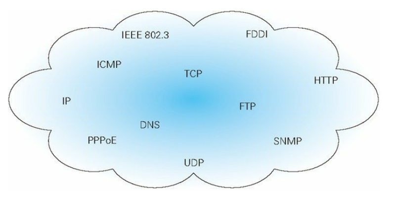

#### TCP/IP 是互联网相关的各类协议族的总称

协议中存在各式各样的内容。从电缆的规格到 IP 地址的选定方法、寻找异地用户的方法、双方建立通信的顺序，以及 Web 页面显示需要处理的步骤等

像这样把与互联网相关联的协议集合起来总称为 TCP/IP。也有说法认为，TCP/IP 是指 TCP 和 IP 这两种协议。还有一种说法认为，TCP/IP 是在 IP 协议的通信过程中，使用到的协议族的统称

#### TCP/IP 的分层管理

TCP/IP 协议族里重要的一点就是分层，TCP/IP 协议族按层次分为 4 层

- 应用层：决定了向用户提供应用服务时通信的活动
  - TCP/IP 协议族内预存了各类通用的应用服务。比如，FTP（File Transfer Protocol，文件传输协议）和 DNS（Domain Name System，域名系统）服务就是其中两类。**HTTP 协议也处于该层**
- 传输层：对上层应用层，提供处于网络连接中的两台计算机之间的数据传输
  - 在传输层有两个性质不同的协议：TCP（Transmission Control Protocol，传输控制协议）和 UDP（User Data Protocol，用户数据报协议）
- 网络层（又名网络互连层）：用来处理在网络上流动的数据包
  - **数据包是网络传输的最小数据单位**。该层规定了通过怎样的路径（所谓的传输路线）到达对方计算机，并把数据包传送给对方。与对方计算机之间通过多台计算机或网络设备进行传输时，网络层所起的作用就是在众多的选项内选择一条传输路线
- 链路层（又名数据链路层，网络接口层）：用来处理连接网络的硬件部分
  - 包括控制操作系统、硬件的设备驱动、NIC（Network Interface Card，网络适配器，即网卡），及光纤等物理可见部分（还包括连接器等一切传输媒介）。硬件上的范畴均在链路层的作用范围之内

把 TCP/IP 层次化是有好处的，分层之后如果需要修改，只需把变动的层替换掉即可。把各层之间的接口部分规划好之后，每个层次内部的设计就能够自由改动了

层次化之后，设计也变得相对简单了。处于应用层上的应用可以只考虑分派给自己的任务，而不需要弄清对方在地球上哪个地方、对方的传输路线是怎样的、是否能确保传输送达等问题

#### TCP/IP 通信传输流

利用 TCP/IP 协议族进行网络通信时，会通过分层顺序与对方进行通信。**发送端从应用层往下走，接收端则往应用层往上走**

用 HTTP 举例来说明，首先作为发送端的客户端在应用层（HTTP 协议）发出一个想看某个 Web 页面的 HTTP 请求。为了传输方便，在传输层（TCP 协议）把从应用层处收到的数据（HTTP 请求报文）进行分割，并在各个报文上打上标记序号及端口号后转发给网络层。在网络层（IP 协议），增加作为通信目的地的 MAC 地址后转发给链路层。这样一来，发往网络的通信请求就准备齐全了

接收端的服务器在链路层接收到数据，按序往上层发送，一直到应用层。当传输到应用层，才能算真正接收到由客户端发送过来的 HTTP 请求


发送端在层与层之间传输数据时，每经过一层时必定会被打上一个该层所属的首部信息。反之，接收端在层与层传输数据时，每经过一层时会把对应的首部消去。这种把数据信息包装起来的做法称为 **封装（encapsulate）**

### 负责传输的 IP 协议
按层次分，IP（Internet Protocol）网际协议位于网络层。几乎所有使用网络的系统都会用到 IP 协议。TCP/IP 协议族中的 IP 指的就是网际协议。IP 协议的作用是把各种数据包传送给对方。而要保证确实传送到对方那里，则需要满足各类条件。其中两个重要的条件是 **IP 地址** 和 **MAC 地址（Media Access Control Address）**

* IP 地址指明了节点被分配到的地址
* MAC 地址是指网卡所属的固定地址
* IP 地址可以和 MAC 地址进行配对。**IP 地址可变换，但 MAC 地址基本上不会更改**

#### 使用 ARP 协议凭借 MAC 地址进行通信

ARP（Address Resolution Protocol）是一种 **用以解析地址的协议**，根据通信方的 IP 地址就可以反查出对应的 MAC 地址。**IP 间的通信依赖 MAC 地址**。在网络上，通信的双方在同一局域网（LAN）内的情况是很少的，通常是经过多台计算机和网络设备中转才能连接到对方。而在进行中转时，会利用下一站中转设备的 MAC 地址来搜索下一个中转目标。这时，会采用 ARP 协议进行解析

#### 没有人能够全面掌握互联网中的传输状况

在到达通信目标前的中转过程中，计算机和路由器等网络设备只能获悉很粗略的传输路线。这种机制称为 **路由选择（routing）**，有点像快递公司的送货过程。想要寄快递的人，只要将自己的货物送到集散中心，就可以知道快递公司是否肯收件发货，该快递公司的集散中心检查货物的送达地址，明确下站该送往哪个区域的集散中心。接着，那个区域的集散中心自会判断是否能送到对方的家中

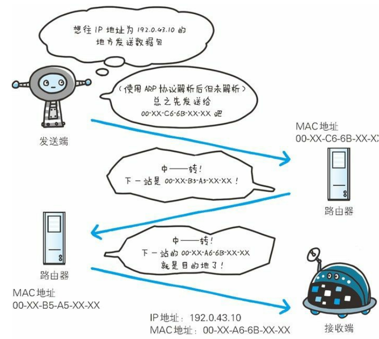

### 确保可靠性的 TCP 协议

按层次分，TCP 位于传输层，提供可靠的 **字节流服务（Byte Stream Service）**。为了方便传输，将大块数据分割成以 **报文段（segment）** 为单位的数据包进行管理。而可靠的传输服务是指，能够把数据准确可靠地传给对方。TCP 协议为了更容易传送大数据才把数据分割，而且 TCP 协议能够确认数据最终是否送达到对方

#### 确保数据能到达目标

为了准确无误地将数据送达目标处，TCP 协议采用了 **三次握手（three-way handshaking）策略**。用 TCP 协议把数据包送出去后，TCP 不会对传送后的情况置之不理，它一定会向对方确认是否成功送达

握手过程中使用了 TCP 的标志（flag）： **SYN（synchronize）**、**ACK（acknowledgement）**

发送端首先发送一个带 SYN 标志的数据包给对方。接收端收到后，回传一个带有 SYN/ACK 标志的数据包以示传达确认信息。最后，发送端再回传一个带 ACK 标志的数据包，代表握手结束。若在握手过程中某个阶段莫名中断，TCP 协议会再次以相同的顺序发送相同的数据包

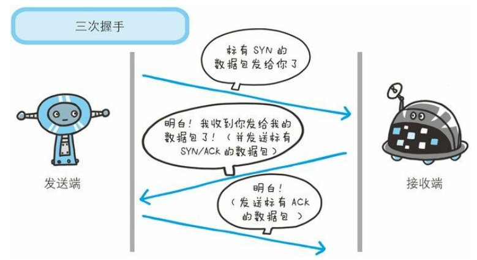

### 负责域名解析的 DNS 服务

DNS（Domain Name System）服务是和 HTTP 协议一样位于应用层的协议。它提供域名到 IP 地址之间的解析服务。用户通常使用主机名或域名来访问对方的计算机，因为与 IP 地址的一组纯数字相比，主机名或域名更符合人类的记忆习惯。但要让计算机去理解名称就变得困难了，因为计算机更擅长处理一长串数字。因此，DNS 服务就诞生了。DNS 协议提供通过域名查找 IP 地址，或逆向从 IP 地址反查域名的服务

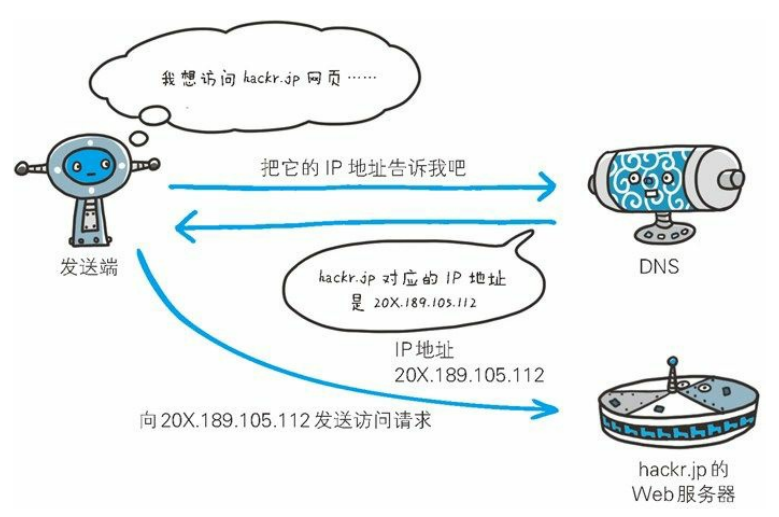

### 各种协议与 HTTP 协议的关系

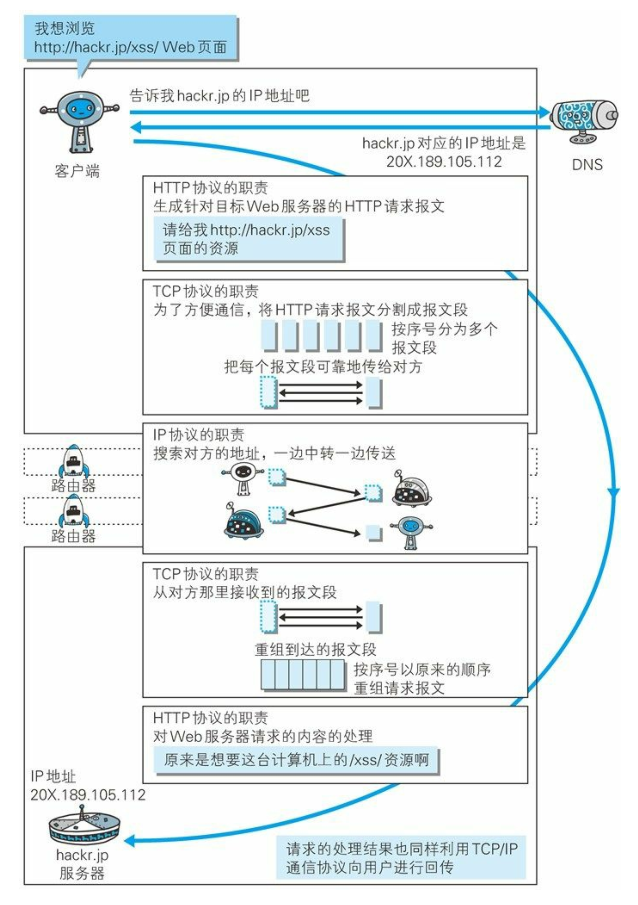

### URI 和 URL

与 **URI（Uniform Resource Identifier，统一资源标识符）** 相比，我们更熟悉 **URL（Uniform Resource Locator，统一资源定位符）**。URL 正是使用 Web 浏览器等访问 Web 页面时需要输入的网页地址

#### 统一资源标识符

* Uniform：规定统一的格式可方便处理多种不同类型的资源，而不用根据上下文环境来识别资源指定的访问方式。另外，加入新增的协议方案（如http: 或 ftp:）也更容易
* Resource：资源的定义是 **可标识的任何东西**。除了文档文件、图像或服务（例如当天的天气预报）等能够区别于其他类型的，全都可作为资源。另外，资源不仅可以是单一的，**也可以是多数的集合体**
* Identifier：表示可标识的对象，也称为标识符

综上所述，URI 就是由某个协议方案表示的资源的定位标识符。协议方案是指访问资源所使用的协议类型名称

#### URI 格式

表示指定的 URI，要使用涵盖全部必要信息的绝对 URI、绝对 URL 以及相对 URL。相对 URL，是指从浏览器中基本 URI 处指定的 URL，形如 /image/logo.gif

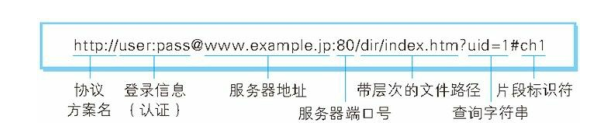

* 协议方案名
  * 使用 http: 或 https: 等协议方案名获取访问资源时要指定协议类型。**不区分字母大小写**，最后加上一个冒号。也可使用 data: 或 javascript: 这类指定数据或脚本程序的方案名
* 登录信息（认证）
  * 指定用户名和密码作为从服务器端获取资源时必要的登录信息（身份认证）。**可选项**
* 服务器地址
  * 使用绝对 URI 必须指定待访问的服务器地址。地址可以是类似 hackr.jp 这种 DNS 可解析的名称，或是 192.168.1.1 这类 IPv4 地址名，还可以是 [0:0:0:0:0:0:0:1] 这样用方括号括起来的 IPv6 地址名
* 服务器端口号
  * 指定服务器连接的网络端口号。**可选项，若用户省略则自动使用默认端口号**
* 带层次的文件路径
  * 指定服务器上的文件路径来定位特指的资源，与 UNIX 系统的文件目录结构相似

* 查询字符串
  * 针对已指定的文件路径内的资源，可以使用查询字符串传入任意参数。**可选项**
* 片段标识符
  * 使用片段标识符通常可标记出已获取资源中的子资源（文档内的某个位置）。但在 RFC 中并没有明确规定其使用方法。**可选项**

#### URI、URL、URN 的区别

* URI（Uniform Resource Identifier）：是一个紧凑的字符串用来标示抽象或物理资源

* URL（Uniform Resource Locator）：**URI 的子集**，除了确定一个资源，还提供一种定位该资源的主要访问机制

* URN（Uniform Resource Name）：是唯一标识的一部分，就是一个特殊的名字

URI 可以分为 URL、URN 或同时具备 locators 和 names 特性的一个东西。URN 作用就好像一个人的名字，URL就像一个人的地址。即 **URN 确定了东西的身份，URL 提供了找到它的方式**

让 URI 能成为 URL 的当然就是那个 **访问机制、网络位置**。如：`http://`、`ftp://`

URI 强调的是给资源标记命名，URL 强调的是给资源定位，URL 显然比 URI 包含信息更多，大多数情况下大家觉得给一个网络资源分别命名和给出地址太麻烦，干脆就用地址既当地址用，又当标记名用，所以，URL也充当了万维网里面 URI 的角色


## HTTP 协议

通常应用程序会按照 RFC（Request for Comments，征求修正意见书）标准实现。要是不按照 RFC 标准执行，就有可能导致无法通信的状况。但也存在某些应用程序因客户端或服务器端的不同，而未遵照 RFC 标准，自成一套的标准扩展，如果这款应用程序的使用者非常多，其他的客户端或服务器端会不得不去配合它

### HTTP 协议用于客户端和服务器端之间的通信
在两台计算机之间使用 HTTP 协议通信时，在一条通信线路上必定有一端是客户端，另一端则是服务器端。有时候，按实际情况，两台计算机作为客户端和服务器端的角色有可能会互换。但就仅从一条通信路线来说，服务器端和客户端的角色是确定的，而用 HTTP 协议能够明确区分哪端是客户端，哪端是服务器端

### 通过请求和响应的交换达成通信

**请求必定由客户端发出，而服务器端回复响应**。HTTP 协议规定，请求从客户端发出，最后服务器端响应该请求并返回。即是先从客户端开始建立通信的，服务器端在没有接收到请求之前不会发送响应

### 请求报文

请求报文是由请求方法、请求 URI、协议版本、可选的请求首部字段和内容实体构成的

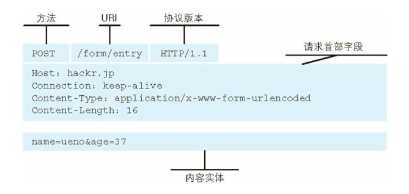

### HTTP 是不保存状态的协议

HTTP 是一种不保存状态，即 **无状态（stateless）协议**。HTTP 协议自身不对请求和响应之间的通信状态进行保存。即在 HTTP 这个级别，协议对于发送过的请求或响应 **都不做持久化处理**

使用 HTTP 协议，**每当有新的请求发送时，就会有对应的新响应产生**。协议本身并不保留之前一切的请求或响应报文的信息。这是为了更快地处理大量事务，确保协议的可伸缩性，而特意把 HTTP 协议设计成如此简单的。随着 Web 的不断发展，因无状态而导致业务处理变得棘手的情况增多了。比如，用户登录到一家购物网站，即使他跳转到该站的其他页面后，也需要能继续保持登录状态。针对这个实例，网站为了能够掌握是谁送出的请求，需要保存用户的状态

HTTP/1.1 虽然是无状态协议，但为了实现期望的保持状态功能，于是引入了 Cookie 技术。有了 Cookie 再用 HTTP 协议通信，就可以管理状态了

### 请求 URI 定位资源

当客户端请求访问资源而发送请求时，URI 需要将作为请求报文中的请求 URI 包含在内。指定请求 URI 的方式有很多。除此之外，如果不是访问特定资源而是对服务器本身发起请求，可以用一个 `*` 来代替请求 URI。

````http
OPTIONS * HTTP/1.1
````

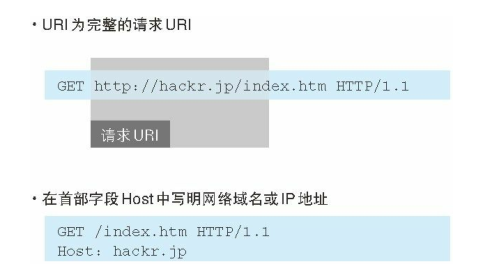

### 告知服务器意图的 HTTP 方法

* GET ：**获取资源**，用来请求访问已被 URI 识别的资源
  * 指定的资源经服务器端解析后返回响应内容。即如果请求的资源是文本，那就保持原样返回；如果是像 CGI（Common Gateway Interface，通用网关接口）那样的程序，则返回经过执行后的输出结果
* POST：**传输实体主体**
  * 虽然用 GET 方法也可以传输实体的主体，但一般不用 GET 方法进行传输，而是用 POST 方法。虽说 POST 的功能与 GET 很相似，但 POST 的主要目的并不是获取响应的主体内容

* PUT：**传输文件**
  * 就像 FTP 协议的文件上传一样，要求在请求报文的主体中包含文件内容，然后保存到请求 URI 指定的位置。但是，鉴于 HTTP/1.1 的 PUT 方法自身不带验证机制，任何人都可以上传文件 , 存在安全性问题，因此 **一般的 Web 网站不使用该方法**
  * 若配合 Web 应用程序的验证机制，或架构设计采用 REST（REpresentational State Transfer，表征状态转移）标准的同类 Web 网站，就可能会开放使用 PUT 方法

* HEAD：**获得报文首部**
  * HEAD 方法和 GET 方法一样，但不返回报文主体部分，用于确认 URI 的有效性及资源更新的日期时间等
* DELETE：**删除文件**，按请求 URI 删除指定的资源，与 PUT 相反的方法
  * HTTP/1.1 的 DELETE 方法本身和 PUT 方法一样不带验证机制，所以 **一般的 Web 网站也不使用该方法**。当配合 Web 应用程序的验证机制，或遵守 REST 标准时还是有可能会开放使用的
  
* OPTIONS：**询问支持的方法**，用来查询针对请求 URI 指定的资源支持的方法
* TRACE：**追踪路径**，是让 Web 服务器端将之前的请求通信环回给客户端的方法
  * 发送请求时，在 Max-Forwards 首部字段中填入数值，每经过一个服务器端就将该数字减 1，当数值刚好减到 0 时，就停止继续传输，最后接收到请求的服务器端则返回状态码 200 OK 的响应
  * 客户端通过 TRACE 方法可以查询发送出去的请求是怎样被加工修改 / 篡改的。这是因为，请求想要连接到源目标服务器可能会通过代理中转，TRACE 方法就是用来确认连接过程中发生的一系列操作
  * TRACE 方法本来就不常用，再加上容易引发 XST（Cross-Site Tracing，跨站追踪）攻击，通常就更不会用到了
* CONNECT：**要求用隧道协议连接代理**，在与代理服务器通信时建立隧道，实现用隧道协议进行 TCP 通信
  * 主要使用 SSL（Secure Sockets Layer，安全套接层）和 TLS（Transport Layer Security，传输层安全）协议把通信内容加 密后经网络隧道传输

### 使用方法下达命令

向请求 URI 指定的资源发送请求报文时，采用称为方法的命令。方法的作用在于，可以指定请求的资源按期望产生某种行为。方法中有 GET、POST 和 HEAD 等

### 持久连接节省通信量

HTTP 协议的初始版本中，每进行一次 HTTP 通信就要断开一次 TCP 连接。以当年的通信情况来说，因为都是些容量很小的文本传输，所以问题不大。可随着 HTTP 的普及，文档中包含大量图片的情况多了起来。使用浏览器浏览一个包含多张图片的 HTML 页面时，在发送请求访问 HTML 页面资源的同时，也会请求该 HTML 页面里包含的其他资源。因此，每次的请求都会造成无谓的 TCP 连接建立和断开，增加通信量的开销。

#### 持久连接

持久连接（HTTP Persistent Connections，也称为 HTTP keep-alive 或 HTTP connection reuse），**只要任意一端没有明确提出断开连接，则保持 TCP 连接状态**

持久连接旨在建立 1 次 TCP 连接后进行多次请求和响应的交互。持久连接的好处在于减少了 TCP 连接的重复建立和断开所造成的额外开销，减轻了服务器端的负载。另外，减少开销的那部分时间，使 HTTP 请求和响应能够更早地结束，这样 Web 页面的显示速度也就相
应提高了。

在 HTTP/1.1 中，所有的连接默认都是持久连接，但在 HTTP/1.0 内并未标准化。虽然有一部分服务器通过非标准的手段实现了持久连接，但服务器端不一定能够支持持久连接。除了服务器端，客户端也需要支持持久连接

#### 管线化

**持久连接使得多数请求以管线化（pipelining）方式发送成为可能**。从前发送请求后需等待并收到响应，才能发送下一个请求。管线化技术出现后，**不用等待响应亦可直接发送下一个请求**。这样就能够做到同时并行发送多个请求，而不需要一个接一个地等待响应了

### 使用 Cookie 的状态管理

HTTP 是无状态协议，它不对之前发生过的请求和响应的状态进行管理。即无法根据之前的状态进行本次的请求处理。假设要求登录认证的 Web 页面本身无法进行状态的管理（不记录已登录的状态），那么每次跳转新页面不是要再次登录，就是要在每次请求报文中附加参数来管理登录状态

无状态协议当然也有它的优点。由于不必保存状态，自然可减少服务器的 CPU 及内存资源的消耗。从另一侧面来说，也正是因为 HTTP 协议本身是非常简单的，所以才会被应用在各种场景里

如果让服务器管理全部客户端状态则会成为负担。保留无状态协议这个特征的同时又要解决类似的矛盾问题，于是引入了 Cookie 技术。Cookie 技术通过在请求和响应报文中写入 Cookie 信息来控制客户端的状态

Cookie 会根据从服务器端发送的响应报文内的一个叫做 **Set-Cookie 的首部字段信息**，通知客户端保存 Cookie。当下次客户端再往该服务器发送请求时，客户端会自动在请求报文中加入 Cookie 值后发送出去。服务器端发现客户端发送过来的 Cookie 后，会去检查是从哪一个客户端发来的连接请求，对比服务器上的记录，最后得到之前的状态信息

## HTTP 报文内的 HTTP信息
### HTTP 报文

**用于 HTTP 协议交互的信息** 被称为 HTTP 报文。请求端（客户端）的 HTTP 报文叫做请求报文，响应端（服务器端）的叫做响应报文。HTTP 报文本身是由 **多行（用 CR+LF 作换行符）数据构成的字符串文本**。

HTTP 报文大致可分为报文首部和报文主体两块。两者由 **最初出现的空行（CR+LF）来划分**。通常，**并不一定要有报文主体**

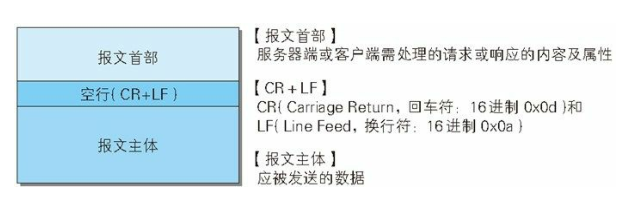

### 请求报文及响应报文的结构

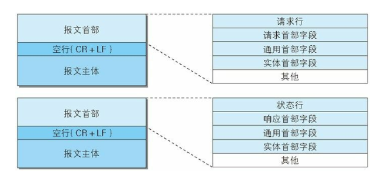

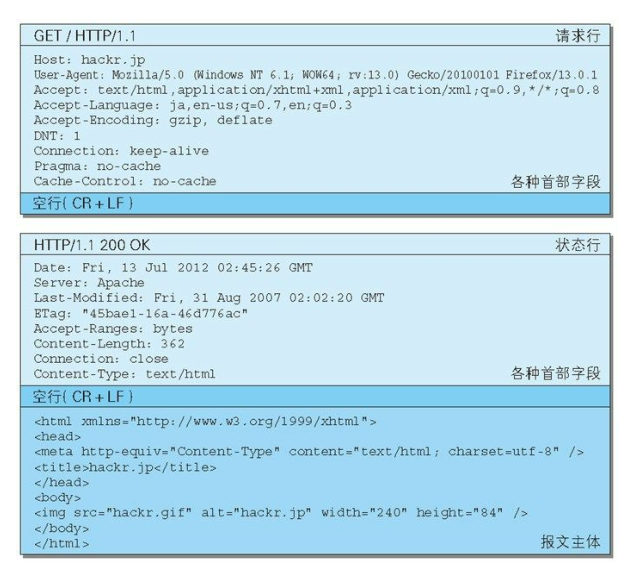

* 请求行：包含用于请求的方法，请求 URI 和 HTTP 版本
* 状态行：包含表明响应结果的状态码，原因短语和 HTTP 版本
* 首部字段：包含表示请求和响应的各种条件和属性的各类首部
  * 一般有 4 种首部，分别是：通用首部、请求首部、响应首部、实体首部
* 其他：可能包含 HTTP 的 RFC 里未定义的首部（Cookie 等）

### 编码提升传输速率

HTTP 在传输数据时可以按照数据原貌直接传输，但也可以在传输过程中通过编码提升传输速率。通过在传输时编码，能有效地处理大量的访问请求。但是，编码的操作需要计算机来完成，因此会消耗更多的 CPU 等资源

#### 报文主体和实体主体的差异

* 报文（message）：是 HTTP 通信中的基本单位，由 8 位组字节流（octet sequence，其中 octet 为 8 个比特）组成，通过 HTTP 通信传输
* 实体（entity）：作为请求或响应的有效载荷数据（补充项）被传输，其内容由实
  体首部和实体主体组成

HTTP 报文的主体用于传输请求或响应的实体主体。通常，报文主体等于实体主体。只有当传输中进行编码操作时，实体主体的内容发生变化，才导致它和报文主体产生差异

#### 压缩传输的内容编码

向待发送邮件内增加附件时，为了使邮件容量变小，我们会先用 ZIP 压缩文件之后再添加附件发送。HTTP 协议中有一种被称为内容编码的功能也能进行类似的操作。内容编码指明应用在实体内容上的编码格式，并保持实体信息原样压缩。内容编码后的实体由客户端接收并负责解码

常用的内容编码有以下几种

* gzip（GNU zip）
* compress（UNIX 系统的标准压缩）
* deflate（zlib）
* identity（不进行编码）

#### 分割发送的分块传输编码

在 HTTP 通信过程中，请求的编码实体资源尚未全部传输完成之前，浏览器无法显示请求页面。在传输大容量数据时，通过把数据分割成多块，能够让浏览器逐步显示页面。这种把实体主体分块的功能称为分块传输编码（Chunked Transfer Coding）

分块传输编码会将实体主体分成多个部分（块）。每一块都会用十六进制来标记块的大小，而实体主体的最后一块会使用“0(CR+LF)”来标记。使用分块传输编码的实体主体会由接收的客户端负责解码，恢复到编码前的实体主体。

HTTP/1.1 中存在一种称为传输编码（Transfer Coding）的机制，它可以在通信时按某种编码方式传输，但只定义作用于分块传输编码中

#### 发送多种数据的多部分对象集合

发送邮件时，我们可以在邮件里写入文字并添加多份附件。这是因为采用了 MIME（Multipurpose Internet Mail Extensions，多用途因特网邮件扩展）机制，它允许邮件处理文本、图片、视频等多个不同类型的数据。例如，图片等二进制数据以 ASCII 码字符串编码的方式指明，就是利用 MIME 来描述标记数据类型。而在 MIME 扩展中会使用一
种称为多部分对象集合（Multipart）的方法，来容纳多份不同类型的数据

相应地，HTTP 协议中也采纳了多部分对象集合，发送的一份报文主体内可含有多类型实体。通常是在图片或文本文件等上传时使用。

多部分对象集合包含的对象如下

* multipart/form-data：在 Web 表单文件上传时使用
* multipart/byteranges：状态码 206（Partial Content，部分内容）响应报文包含了多个范围的内容时使用
* multipart/form-data
* multipart/byteranges

在 HTTP 报文中使用多部分对象集合时，需要在首部字段里加上 Content-type。有关这个首部字段，我们稍后讲解。使用 boundary 字符串来划分多部分对象集合指明的各类实体。在 boundary 字符串指定的各个实体的起始行之前插入“--”标记（例如：--AaB03x、--THIS_STRING_SEPARATES），而在多部分对象集合对应的字符串的最后插入“--”标记（例如：--AaB03x--、--THIS_STRING_SEPARATES--）作为结束。

多部分对象集合的每个部分类型中，都可以含有首部字段。另外，可以在某个部分中嵌套使用多部分对象集合

### 获取部分内容的范围请求

以前，用户不能使用现在这种高速的带宽访问互联网，当时，下载一个尺寸稍大的图片或文件就已经很吃力了。如果下载过程中遇到网络中断的情况，那就必须重头开始。为了解决上述问题，需要一种可恢复的机制。所谓恢复是指能从之前下载中断处恢复下载。

要实现该功能需要指定下载的实体范围。像这样，指定范围发送的请求叫做范围请求（Range Request）。对一份 10 000 字节大小的资源，如果使用范围请求，可以只请求
5001~10 000 字节内的资源

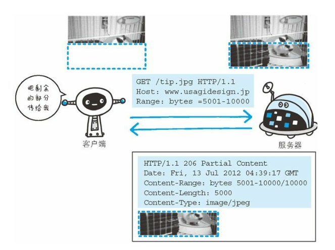

执行范围请求时，会用到首部字段 Range 来指定资源的 byte 范围

byte 范围的指定形式如下。

* 5001~10 000 字节
  * Range: bytes=5001-10000
* 从 5001 字节之后全部的
  * Range: bytes=5001-
* 从一开始到 3000 字节和 5000~7000 字节的多重范围
  * Range: bytes=-3000, 5000-7000

针对范围请求，响应会返回状态码为 206 Partial Content 的响应报文。另外，对于多重范围的范围请求，响应会在首部字段 Content-Type 标明 multipart/byteranges 后返回响应报文。如果服务器端无法响应范围请求，则会返回状态码 200 OK 和完整的实体内容

### 内容协商返回最合适的内容

同一个 Web 网站有可能存在着多份相同内容的页面。比如英语版和中文版的 Web 页面，它们内容上虽相同，但使用的语言却不同。当浏览器的默认语言为英语或中文，访问相同 URI 的 Web 页面时，则会显示对应的英语版或中文版的 Web 页面。这样的机制称为内容
协商（Content Negotiation）

内容协商机制是指客户端和服务器端就响应的资源内容进行交涉，然后提供给客户端最为适合的资源。内容协商会以响应资源的语言、字符集、编码方式等作为判断的基准。

包含在请求报文中的某些首部字段（如下）就是判断的基准

* Accept
* Accept-Charset
* Accept-Encoding
* Accept-Language
* Content-Language

内容协商技术有以下 3 种类型

* 服务器驱动协商（Server-driven Negotiation）
  * 由服务器端进行内容协商。以请求的首部字段为参考，在服务器端自动处理。但对用户来说，以浏览器发送的信息作为判定的依据，并不一定能筛选出最优内容
* 客户端驱动协商（Agent-driven Negotiation）
  * 由客户端进行内容协商的方式。用户从浏览器显示的可选项列表中手动选择。还可以利用 JavaScript 脚本在 Web 页面上自动进行上述选择。比如按 OS 的类型或浏览器类型，自行切换成 PC 版页面或手机版页面
* 透明协商（Transparent Negotiation）
  * 是服务器驱动和客户端驱动的结合体，是由服务器端和客户端各自进行内容协商的一种方法。

## 返回结果的 HTTP 状态码
HTTP 状态码负责表示客户端 HTTP 请求的返回结果、标记服务器端的处理是否正常、通知出现的错误等工作

### 状态码告知从服务器端返回的请求结果

状态码的职责是当客户端向服务器端发送请求时，描述返回的请求结果。借助状态码，用户可以知道服务器端是正常处理了请求，还是出现了错误

响应的状态码可描述请求的处理结果。状态码如 200 OK，以 3 位数字和原因短语组成。数字中的第一位指定了响应类别，后两位无分类

|      | 类别                             | 原因短语                   |
| ---- | -------------------------------- | -------------------------- |
| 1XX  | Informational（信息性状态码）    | 接收的请求正在处理         |
| 2XX  | Success（成功状态码）            | 请求正常处理完毕           |
| 3XX  | Redirection（重定向状态码）      | 需要进行附加操作以完成请求 |
| 4XX  | Client Error（客户端错误状态码） | 服务器无法处理请求         |
| 5XX  | Server Error（服务器错误状态码） | 服务器处理请求出错         |

只要遵守状态码类别的定义，即使改变 RFC2616 中定义的状态码，
或服务器端自行创建状态码都没问题。
仅记录在 RFC2616 上的 HTTP 状态码就达 40 种，若再加上
WebDAV（Web-based Distributed Authoring and Versioning，基于万维网
的分布式创作和版本控制）（RFC4918、5842） 和附加 HTTP 状态码
（RFC6585）等扩展，数量就达 60 余种。别看种类繁多，实际上经
常使用的大概只有 14 种。接下来，我们就介绍一下这些具有代表性
的 14 个状态码

### 2XX 成功


