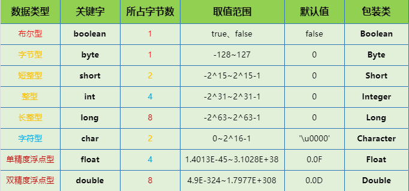

## Java 概述

* JDK：Java Development Kit，Java 开发工具包，提供了 Java 的开发环境和运行环境

* JRE：Java Runtime Environment，Java 运行环境，为 Java 的运行提供了所需环境

* SE：Standard Edition，标准版，用于桌面或简单服务器应用的 Java 平台

* EE：Enterprise Edition，企业版，用于复杂服务器应用的 Java 平台

### Java 特点

简单性、面向对象、分布式、健壮性、安全性、体系结构中立、可移植性、解释型、高性能、多线程、动态性

### Java 跨平台原理

Java 程序不是直接在电脑上运行的，**是在虚拟机上运行的，JVM 也是一个软件**，不同的平台有不同的版本。JVM 就是负责将字节码文件翻译成特定平台下的机器码然后运行。Java 代码首先被编译成字节码文件，再由 JVM 将字节码文件翻译成机器语言。**字节码不能直接运行，必须通过 JVM 翻译成机器码才能运行**。不同平台下编译生成的字节码是一样的，但是由 JVM 翻译成的机器码却不一样。即使将 Java 程序打包成可执行文件，仍然需要 JVM 的支持。**跨平台的是 Java 程序，不是 JVM**，JVM 是用 C/C++ 开发的，是编译后的机器码，不能跨平台，不同平台下需要安装不同版本的 JVM

#### JVM

当我们运行一个程序时，JVM 负责将字节码转换为特定机器代码，JVM 提供了内存管理、垃圾回收和安全机制等。这种独立于硬件和操作系统，正是 Java 程序可以一次编写多处执行的原因

## 数据类型

Java 语言是强类型语言，不同的数据类型，在内存中分配了不同大小的内存空间。在定义变量的时候，声明这个变量的数据类型，就会给这个变量开辟一块合理大小的内存区域，可以合理的分配内存空间，从而避免空间浪费

### 基本类型与引用类型

基本类型：**保存在栈内存中的简单数据段**，即这种值完全保存在内存中的一个位置

引用类型：**保存在堆内存中的对象**，即变量中保存的实际是对象的内存地址

### 八大基本数据类型



八种基本数据类型 **除 boolean 类型之外都可以相互转换**。byte、short、char 做混合运算的时候，会先转换成 int 再做运算。多种数据类型做混合运算，先转换成容量最大的那种再做运算。在 Java 语言里面除了基本数据类型，其他的都是引用数据类型

#### char 类型变量中能不能存储一个中文汉字

char 类型变量是用来存储 Unicode 编码的字符的，Unicode 编码字符集中包含了汉字。Unicode 类编码占用两个字节，所以，char 类型的变量也是占用两个字节

#### short s1 = 1，s1 = s1 + 1 与 short s1 = 1，s1 += 1

* `short s1 = 1;s1 = s1 + 1`：由于 `s1+1` 运算时 **会自动提升表达式的类型**，所以结果是 int 型，再赋值给 short 类型 s1 时，编译器将报告需要强制转换类型的错误

* `short s1 = 1;s1 += 1`：`+=` 是 Java 语言规定的运算符，Java 编译器会对它进行特殊处理，因此可以正确编译

### 五种引用数据类型

类、接口类型、数组类型、枚举类型、注解类型

### 参数传递

Java 中方法参数传递方式是 **按值传递**。基本类型，传递的是基本类型的字面量值的拷贝，不改变其值。引用类型，传递的是该参量所引用的对象在堆中地址值的拷贝，改变其值

String 类虽然是引用数据类型，但它做参数传递时和基本数据类型是一样的

*更多：[Java 到底是值传递还是引用传递](https://www.zhihu.com/question/31203609)*

## 包装类

在 Java 中，一切皆对象，但八大基本类型却不是对象。所以八大基本数据类型都有相应的包装类，包装类都在 java.lang 包里。可以在对象中定义更多的功能方法操作该数据，方便开发者操作数据

### 包装类的作用

**包装类的优点**

可以在对象中定义更多的功能方法操作该数据，方便开发者操作数据，例如基本数据类型和字符串之间的转换。

主要是方便对基本类型进行操作，可以解决一些基本类型解决不了的问题

* 集合不允许存放基本类型数据，只能存放引用类型数据，如包装类

* 基本类型和包装类之间可以相互转换，即自动装箱与自动拆箱。使得我们在编程时能够更注重于业务的开发，而不是每转换一次就需要写一堆转换代码

* 使用包装类可以实现八种基本数据类型之间，以及 String 类型的相互转换
* 有时候需要传递一个 Object 变量，所以不能传递基本数据类型，就可以使用包装类

### 基本类型与包装类型


### 类型转换

```java
// int转Integer
Integer i1 = Integer.valueOf(10);
// int转String
String s1 = 10 + "";	

// Integer转int
int i2 = i1.intValue();		
// Integer转String
String s2 = i1.toString();	

// String转int
int i3 = Integer.parseInt("10");	
// String转Integer
Integer i4 = Integer.valueOf("10");	
```

### 自动装箱与拆箱

* 装箱：将基本类型用对应的引用类型包装起来，**通过包装类的 `valueOf()` 实现**

* 拆箱：将包装类型转换为基本数据类型，**通过包装类的 `xxxValue()` 实现**

```java
Integer a = 10;		// 自动装箱
int b = a;			// 自动拆箱
```

### int 与 Integer 的比较

```java
// false，生成两个对象，内存地址不同
Integer a = new Integer(10);
Integer b = new Integer(10);
System.out.println(a == b);		

// true，Integer变量和int变量比较时，会自动拆箱，变为两个int变量的比较
int c = 10;
System.out.println(a == c);

// false，非new生成的Integer变量指向的是常量池中的对象，而使用new生成的变量指向堆中新建的对象
// 两者在内存中的地址不同
Integer d = 10;
System.out.println(a == d);		

// true，两个非new生成的Integer对象比较时，如果两个变量的值在区间-128到127之间，Java会进行缓存
// 除Integer外，Byte、Short、Long、Character、Boolean都支持缓存池
Integer e = 10;
System.out.println(d == e);
// false
Integer i = 128;
Integer j = 128;
System.out.println(i == j);		
```

*更多：[java面试题之 int和 Integer的区别](https://www.cnblogs.com/guodongdidi/p/6953217.html)*

## 运算符

### && 和 & 的区别

&& 具有短路效果。如果左边结果是 false，则右边不执行

& 是无论左边是 false 还是 true，右边都会执行

### ^ 逻辑异或

逻辑异或，两边只要是不一致就是 true

 ### = 赋值运算符

基本类型，赋值运算符会直接改变变量的值，原来的值被覆盖掉
引用类型，赋值运算符会改变引用中所保存的地址，原来的地址被覆盖掉。**但是原来的对象不会被改变**

### 移位运算符

* `<<`：左移运算符，`num << 1`，相当于 num 乘以 2
* `>>`：右移运算符，`num >> 1`，相当于 num 除以 2

* `>>> `：无符号右移，忽略符号位，空位都以 0 补齐

```java
// 以下数据类型为int
 7：00000000000000000000000000000111
// -7的二进制为7的反码加上补码1，正数的原码、反码、补码相同
-7：11111111111111111111111111111001    //末尾1表示-1，0表示-2

  7<<1：00000000000000000000000000001110		//结果为14
  7>>1：00000000000000000000000000000011		//结果为3
 -7<<1：11111111111111111111111111110010		//结果为-14
 -7>>1：11111111111111111111111111111100		//结果为-4
-7>>>1：01111111111111111111111111111100		//结果为2147483644
```

### 三元运算符

`布尔表达式 : 值1 ? 值2`：表达式为 true，返回值1，表达式为 false，返回值2

### == 与 equals()

* ==：**基本数据类型比较的是值，引用数据类型比较的是内存地址**

* equals()：没有被重写，比较的是内存地址；被重写，则比较两个对象内容是否相等
  * String、Integer 等中的 equals 方法是被重写过的，因为 Object 的 equals 方法是比较的对象的内存地址，而 String 的 equals 方法比较的是对象的值

## 控制语句

### switch

switch 后面的括号中可以填写 byte、short、char、int 类型，即能够自动转换为 int 类型的都可以，在 JDK7 版本之后可以填写 String 类型。**case 后面只能是常量**，不能是变量，case 的值不能重复

### while

while 循环本质上和 for 循环是一样的，可以相互替换，作用相同，格式不同，实际工作中建议使用 for 循环，因为变量会及早的从内存中消失，可以提高内存的使用效率

### break、continue、return 区别

* break：跳出一层循环，可以控制结束嵌套循环
* continue：结束一趟循环，也可以像 break 那样加上循环的名字
* return：它的作用不是结束循环的，而是结束方法

## 面向对象

### 面向过程和面向对象

* 面向过程：将问题分解成一个一个步骤，对每个步骤进行相应的抽象，形成对象，通过不同对象之间的调用，组合解决问题
  * 注重过程，把问题分解成多个不同的步骤，然后把各个步骤变成方法，使用的时候依次调用
* 易维护、易复用、易扩展，由于面向对象有封装、继承、多态性的特性，可以设计出低耦合的系统，使系统更加灵活、更加易于维护
* 面向对象：把问题分解成一个一个步骤，每个步骤用函数实现，依次调用即可
  * 注重对象之间的交互，将复杂的事情简单化，把问题分解成各个对象，然后各个对象之间进行交互，每个对象内部都进行了封装
  * 性能比面向对象高，类调用时需要实例化，开销比较大，比较消耗资源。没有面向对象易维护、易复用、易扩展

### 类、对象、方法

* 类是具有相同属性和方法的一组对象的集合

* 对象是系统中描述客观事物的一个实体

* 方法是指为了完成某个任务，对象所能执行的操作，可以提高代码的复用性
  * 不要在两个方法里面互相调用，程序会报出 StackOverflowError 错误
  * 方法自己调用自己叫做递归，必须要有结束条件，否则将会造成 StackOverflowError 错误

### 包

在类名前面使用关键字 package 加入包名来避免命名冲突问题，通常使用倒写的域名命名

* package 语句只能出现在 Java 文件的第一行，且只能有一个

* 如果没有 package，默认表示无包名

* Java.lang 包下所有类不需要手动导入，系统自动导入，Object类，String类都在这个包里面

### 权限修饰符

可以限定其他类对该类、属性和方法的使用权限

|  修饰符   | 同一个类 | 同一个包 | 子类 | 其他包 |
| :-------: | :------: | :------: | :--: | :----: |
|  public   | 〇 |    〇    |  〇  |   〇   |
| protected |    〇    | 〇 | 〇 | X |
|  default  |    〇    | 〇 | X | X |
|  private  |    〇    | X | X | X |

* **protected 和 private 不能用于修饰类**

### 成员变量与局部变量

* 成员变量：写在类里面，方法体的外面，声明时可以不进行初始化值，会自动以类型的默认值而赋值，可以被本类或其他类的方法进行调用，可以被访问控制修饰符及 static 所修饰，存在于堆内存，随着对象的创建而存在
* 局部变量：写在方法体的里面，声明时必须进行初始化，只能在声明局部变量的方法内进行调用，不能被访问控制修饰符及 static 所修饰，存在于栈内存，随着方法的调用而自动消失

### 创建对象的五种方法

除了 clone 方法和反序列化外都调用了构造方法

#### 使用 new 关键字

最常见也是最简单的创建对象的方式了。通过这种方式，可以调用任意的构造函数（无参的和有参的）

#### 使用 Class 类的 newInstance 方法

newInstance 方法会调用无参的构造函数创建对象

```java
// 第一种写法，需填入类的全限定名
Test test = (Test) Class.forName("com.test.Test").newInstance();

// 第二种方法
Test test = Test.class.newInstance();
```

#### 使用 Constructor 类的 newInstance 方法

与 Class 类的 newInstance 方法类似， java.lang.reflect.Constructor 类里也有一个 newInstance 方法可以创建对象。可以通过这个 newInstance 方法调用有参数的和私有的构造函数

```java
Constructor<Test> constructor = Test.class.getConstructor();
Test test = constructor.newInstance();
```

#### 使用clone方法

调用一个对象的 clone 方法，JVM 就会创建一个新的对象，将之前对象的内容全部拷贝进去。用 clone 方法创建对象并不会调用任何构造函数，要使用 clone 方法，需要先实现 Cloneable 接口并实现其定义的 clone 方法

```java
public class Test implements Cloneable {
    public Object clone() throws CloneNotSupportedException {
        return super.clone();
    }

    public static void main(String[] args) throws CloneNotSupportedException {
        Test test = new Test();
        Test test = (Test) Test.clone();
    }
}
```

#### 使用反序列化

当序列化和反序列化一个对象，JVM 会给我们创建一个单独的对象。在反序列化时，JVM 创建对象并不会调用任何构造函数。为了反序列化一个对象，需要先让类实现 Serializable 接口

```java
public class Test implements Serializable {
    
public static void main(String[] args) throws IOException, ClassNotFoundException {
    // 序列化
    Test test = new Test();
    ObjectOutputStream oos = new ObjectOutputStream(new FileOutputStream("test"));
    oos.writeObject(test);
    oos.flush();
	// 反序列化
    ObjectInputStream stream = new ObjectInputStream(new FileInputStream("test"));
    Test newTest = (Test) stream.readObject();
    }
}
```

#### 两种 newInstance 方法的区别

|           Class 类的 newInstance           |              构造器类的 newInstance              |
| :----------------------------------------: | :----------------------------------------------: |
|       Class 类位于 Java 的 lang 包中       |         构造器类是 Java 反射机制的一部分         |
|    只能触发 **无参的构造方法** 创建对象    |   能触发 **无参的或有参的构造方法** 来创建对象   |
| 需要其构造方法是共有的或者对调用方法可见的 | 可以在特定环境下调用 **私有构造方法** 来创建对象 |
|            抛出类构造函数的异常            |    包装了一个 InvocationTargetException 异常     |

* Class 类本质上调用了反射包构造器类中无参数的 newInstance 方法，捕获了 InvocationTargetException，将构造器本身的异常抛出

*更多：[Java中创建对象的 5种方式](https://www.cnblogs.com/wxd0108/p/5685817.html)*

## 重载与重写

### 方法重载（Overload）

* 发生在同一个类中

* 方法名相同，参数列表不同

* 与方法返回值类型、修饰符无关

### 方法重写（Override）

* 必须是继承关系的两个类
* 必须具有 **相同的方法名、返回值类型和参数列表**
* 重写的方法 **不能比被重写的方法拥有更低的访问权限，抛出更宽泛的异常**
* 私有方法、构造方法不能被重写
* 静态的方法不存在重写
* 重写指的是成员方法，和成员变量无关

### 为什么不能根据返回类型来区分重载

因为调用时不能指定类型信息，编译器不知道你要调用哪个函数

```java
// 当执行method(1,2)时，无法确定调用哪个方法
String method(int a, int b);
double method(int a, int b);
```

### 能否重写一个 private 或 static 的方法

* 不能重写私有方法，因为 private 修饰的变量和方法只能在当前类中使用，其他的类访问是不到。
* 静态方法不能被重写，因为方法重写是基于运行时动态绑定的，而静态方法是编译时就静态绑定的。静态方法跟类的任何实例都不相关

## This 与 Super

### This

代表着对当前对象的引用，在堆内存中的每个 Java 对象上都有一个 this 指向自己

#### This 的作用

* 可以使用 **`this.方法名`** 的方式调用当前对象的方法
* 可以区分成员变量和局部变量，使用 this 调用成员变量
* 如果要是使用 this 调用构造方法的话，那么 this **必须出现在构造方法的第一行**

### Super

代表的是当前子类对象中的父类型特征

#### Super 的作用

* 子类重写了父类的某个方法，可以使用 **`this.方法名`** 的方式调用父类方法

* 子类和父类中都有某个数据，可以使用使用 super 调用父类的数据

* 子类调用父类中的构造方法时，需要使用 super。一个构造方法第一行如果没有 this()，也没有显示的去调用super()，**系统会默认调用 super()**，如果已经有 this 了，那么就不会调用 super 了，**super 只能放在构造方法的第一行**。只是调用了父类中的构造方法，**并不会创建父类的对象**

### Super 与 This 的区别

|       |   调用成员变量   |   调用构造方法   |   调用成员方法   |
| :---: | :--------------: | :--------------: | :--------------: |
| this  | 调用本类成员变量 | 调用本类构造方法 | 调用本类成员方法 |
| super | 调用父类成员变量 | 调用父类构造方法 | 调用父类成员方法 |

## static

* 可以修饰变量
  * 被修饰的变量叫做静态变量，程序运行时静态变量存放在方法区里面

* 可以修饰方法
  * 被修饰的方法叫做静态方法，**不用创建对象就能直接访问该方法**。静态方法不能直接访问非静态的数据，静态方法不能使用 this 和 super

* 可以定义静态语句块
  * 静态语句块在类加载阶段执行，并且只执行一次，并且是自上而下的顺序执行，在构造方法之前执行

* 被修饰的变量、方法、代码块都是属于 **类级别** 的，跟对象无关。可以通过 **`类名.静态方法名 `** 的方式访问

### 静态变量与实例变量

* 语法定义上的区别
  * 静态变量前要加 static 关键字，而实例变量前则不加。

* 程序运行时的区别
  * 实例变量属于某个对象的属性，必须创建了实例对象，其中的实例变量才会被分配空间，才能使用这个实例变量
  * 静态变量不属于某个实例对象，而是属于类，所以也称为类变量，只要程序加载了类的字节码，不用创建任何实例对象，静态变量就会被分配空间，静态变量就可以被使用了

### 为什么不能用静态方法调用非静态方法

非静态方法是要与对象关联在一起的，必须创建一个对象后，才可以在该对象上进行方法调用，而静态方法调用时不需要创建对象，可以直接调用

当一个静态方法被调用时，可能还没有创建任何实例对象，如果从一个静态方法中发出对非静态方法的调用，那个非静态方法是关联到哪个对象上的呢，这个逻辑无法成立

## final

* 修饰的 **类无法被继承**
* 修饰的 **方法无法被重写**
* 修饰的 **局部变量，一旦赋值，不可再改变**
* 修饰的 **成员变量必须初始化值**
* 修饰的引用类型，该引用不可再重新指向其他的 Java 对象。但是 **fianl 修饰的引用，地址值不能被改变，该引用指向的对象的属性值是可以修改的**

```java
public final String str = "string";

public static void main(String[] args) {
	Test t = new Test();
    t.str = "another"; // 报错
    System.out.println(t.str+"append");// 可以运行，输出stringappend
}
```

## 构造方法

构造方法的作用，就是给对象数据进行初始化

### 特点

* 方法名与类名相同，**不能被继承，因此不能被重写，但可以被重载**

* 没有返回值类型、不能使用 return 返回值，不能被 void 修饰

* 如果一个类没有提供任何构造方法，系统 **默认提供一个无参数构造方法**。如果一个类已经手动的提供了构造方法，那么系统不会再提供任何构造方法。如果需要使用无参构造方法，就必须显式的写出
* 在创建对象的时候会 **默认执行无参构造方法，构造方法不能手动调用**

## 面向对象三大特性

### 封装

把客观事物封装成抽象的类，隐藏对象的属性和实现细节，仅对外提供公共访问方式。不用关心具体实现，提高安全性，提高了代码的复用性，减少耦合

#### 封装的使用

* 将成员变量用 private 修饰，private 仅仅是封装的一种体现形式，封装不是私有

* 提供对应的 get 和 set 方法

### 继承

**子类自动共享父类数据结构和方法的机制**，是类之间的一种关系。在定义和实现一个类的时候，可以在一个已经存在的类的基础之上来进行，把这个已经存在的类所定义的内容作为自己的内容，并加入若干新的内容。**Java 只支持单继承和多层继承**，子类可以继承父类中的 **非 private 修饰的成员方法和成员变量，构造方法不能被继承**。如果一个类没有显示的继承其他类，那么这个类会 **默认继承 Object 类**，Object 是 SUN 公司提供的 Java 中的根类

#### 优缺点

* 提高了代码的复用性
* 提高了代码的维护性
* 让类与类之间产生了关系，是多态的前提

* 增强了类之间的耦合，软件开发的一个原则是 **高内聚，低耦合**
  * 内聚：一个模块内各个元素彼此结合的紧密程度
  * 耦合：一个软件里面不同模块之间相互连接的数量

 ### 多态

**一种行为，多种状态**。同一个接口，不同的实例执行不同的操作，在面向对象语言中，接口的多种不同的实现方式即为多态。**提高了程序的扩展性，降低了代码之间的耦合**

#### 多态的实现

* 有继承
* 有方法重写
* 有父类引用指向子类对象

#### 动态绑定与静态绑定

* 动态绑定：在运行根据具体对象的类型进行绑定
* 静态绑定：在程序执行前已经被绑定

#### 类型转换

子类向父类型进行转换，是 **自动类型转换**，也叫向上转型。父类向子类型转换，是 **强制类型转换**，也叫向下转型。如果有多个子类需要强转的话，需要先使用 instanceof 判断一下对象属于哪个子类

#### 多态的使用

```java
class Father {
    public int num = 111;
    public int ff = 666;
    public void same() { System.out.println("father same"); }
    public void differentFather(){ System.out.println("father different"); }
}

class Son extends Father {
    public int num = 222;
    public int ff = 999;
    public void same() { System.out.println("son same"); }
    public void differentSon(){ System.out.println("son different"); }
}

public class Test {
    public static void main(String[] args) {
        Father f = new Son();
        f.same();// 运行的是子类的方法，输出son same
        f.differentFather();// 输出father different
        ((Son) f).differentSon();// 调用子类特有方法，需强转，输出son different
        System.out.println(f.num);// 输出父类成员变量111
        System.out.println(f.ff);// 输出父类成员变量666
        System.out.println(((Son) f).ss);// 调用子类特有成员变量，需强转，输出999
    }
}
```

## 代码块

使用 {} 括起来的代码被称为代码块

* 普通代码块：在方法中出现，限定变量生命周期，及早释放，提高内存利用率
* 同步代码块：在方法中出现，被 synchronized 修饰，语句块会自动被加上内置锁，从而实现同步

* 构造代码块：在类中方法外出现，每次调用构造方法都会执行，并且在构造方法前执行

* 静态代码块：在类中方法外出现，被 static 修饰，在类被加载的时候执行，**且只执行一次**，常用来加载驱动

### 执行顺序
```java
class Father {
    static{ System.out.println("father static"); }
    public Father(){ System.out.println("father constructor"); }
    { System.out.println("father"); }
}

class Son extends Father {
    static{ System.out.println("son static"); }
    public Son(){ System.out.println("son constructor"); }
    { System.out.println("son"); }
}

public class Test {
    public static void main(String[] args) {
        Father f = new Son();
    }
}
// 父类静态代码块->子类静态代码块->父类普通代码块->父类构造方法->子类普通代码块->子类构造方法
```

## 抽象类与接口


### 接口的优点

- 接口其实是一个特殊的抽象类，接口不是被类继承了，而是要被类实现
- 可以使项目分层，面向接口开发，提高开发效率
- 降低了代码之间的耦合度，提高了代码的可插拔性
- 开发中尽量使用接口，少用抽象类，一个类可以实现多个接口，却只能继承一个父类

## 内部类

内部类就是在一个类的内部声明一个类，内部类 **不能定义静态变量和方法**。接口内也可以使用内部类，但没必要

### 内部类的作用

* 可以很好的实现隐藏
  * 内部类可以被 private 与 protected 修饰

* 内部类拥有外部类的所有元素的访问权限
  * 可以直接调用所有外部类的成员，包括 private 修饰的变量和方法、非静态变量和方法等

* 可以间接的实现多重继承
  * 一个类中可以写多个内部类，分别继承不同的类

* 可以避免实现的接口或继承的类中有同名的方法

### 成员内部类

定义在一个类的内部

```java
public class Test {
    public int i1 = 1;
    private static int i2 = 2;
    public void method(){ System.out.println("Test"); }

    class InnerClass{
        public void InnerMethod(){
            System.out.println(i1);
            System.out.println(i2);
            method();
        }
    }
}
```

外部类想访问成员内部类的成员，必须 **先创建一个成员内部类的对象**。当成员内部类中拥有和外部类同名的成员变量或者方法时，**默认会调用成员内部类的成员**。如果要使用外部类的同名成员，可以通过 **`外部类名.this.成员变量/成员方法`** 调用

```java
// 其他类使用内部类，要先创建外部类的对象
public class Other{
    public static void main(String[] args){
        Test t =new Test();
        Test.InnerClass tic = t.new InnerClass();
        tic.InnerMethod();
    }
}
```

### 局部内部类

定义在一个方法或者代码块里面的类，只能访问 **方法内或者代码块内的成员**。**不能被权限修饰符或 static 修饰**

```java
public class Test {
    public static void main(String[] args) {
        class InnerClass {
            int num = 1;
        }
        int n = new InnerClass().num;
        System.out.println(n);
    }
}
```

### 匿名内部类

就是没有名称的类，利用父类的构造函数和自身类体构造成一个类，其他地方不能引用，没有构造器，不能实例化，只能使用一次

```java
public class Test {
    public static void main(String[] args) {
        Test test = new Test();
        One one = new One() {
        	public void print() {
            	System.out.println("one");
        	}
    	};
        test.one.print();
        test.two.print();
    }
    Two two = new Two() {
        public void print() {
            System.out.println("two");
        }
    };
}
```

### 静态内部类

被 static 修饰的成员内部类，不需要依赖于外部类的，可以看做静态变量，不能使用外部类的非静态变量或方法

```java
public class Test {
    private static int num = 9;

    public static void main(String[] args) {
        Test.InnerClass.one();
        InnerClass ic = new Test.InnerClass();
        ic.two();
    }

    static class InnerClass {
        public static void one(){ System.out.println(num); }
        public void two(){ System.out.println(num); }
    }
}
```

## 数组

相同数据类型的元素按一定顺序排列的集合，也可以看成是一个容器。数组是一种简单的数据结构，线性的结构。

**数组一旦创建其长度是不可变的**

### 静态初始化数组

数组初始化就是为数组开辟连续的内存空间，并为每个数组元素赋予值。知道数组的首元素的内存地址，要查找的元素只要知道下标就可以快速的计算出偏移量，通过首元素内存地址加上偏移量可以快速计算出要查找元素的内存地址，通过内存地址快速定位该元素，所以数组查找元素的效率较高

### 动态初始化数组

动态初始化数组，会先在堆内存中分配这个数组，并且数组中每一个元素都采用默认值

```java
// 静态初始化
int[] arr = {1, 2, 3, 4, 5};
// 动态初始化
int[] arr = new int[5];
```

### 二维数组

```java
int[][] arr = new int[2][3];
// 赋值
for (int i = 0; i < arr.length; i++) {
    for (int j = 0; j < arr[i].length; j++) {
        arr[i][j] = i + j;
    }
}
// 遍历
for (int i = 0; i < arr.length; i++) {
    for (int j = 0; j < arr[i].length; j++) {
        System.out.print(arr[i][j]);
    }
    System.out.println();
}
```

### 常用方法

```java
// 返回一个List
List<Integer> list = Arrays.asList(1, 2, 3);
// 排序
Arrays.sort(arr);
// 二分法查找，参数为数组和需要查找的元素
int result = Arrays.binarySearch(arr, 3);
// 数组转字符串
String s = Arrays.toString(arr);
// 填充数组，参数为数组和需要填充的元素
Arrays.fill(arr, 5);
// 复制数组，参数为数组和新数组的长度
int[] newArr = Arrays.copyOf(arr, 2);
// 复制数组，参数为数组和需要复制的范围
int[] newArr2 = Arrays.copyOfRange(arr, 2, 3);
```

## Object 类

Object 是所有类的父类，所有类都 **隐式地** 继承 Object，因此省略了 extends Object 关键字

### String toString()

返回 Java 对象的字符串表示形式，工作中一般对 toString 方法进行重写。如果直接打印一个引用数据类型的对象，系统会默认调用其 toString 方法。Object 中的 toString 方法返回的是 `类名@Java对象` 的内存地址经过哈希算法得出的 int 类型值再转换成十六进制，一般将这个看做 Java 对象在堆中的内存地址

### boolean equals()

判断两个对象是否相同，Object 中的 equals 方法比较的是两个引用的内存地址。工作中，不应该比较内存地址，应该比较地址里面的内容，所以需要对 equals 方法进行重写

```java
// 自反性
x.equals(x)

// 对称性
x.equals(y) == y.equals(x)

// 传递性
x.equals(y);y.equals(z);x.equals(z)
    
// 一致性，多次调用equals()方法结果不变
// 非空性，对任何不是null的对象equals(null)，结果都为false
x.equals(null)
```

### void finalize()

不需要程序员去调用，由 **系统自动调用**。Java 对象如果没有更多的引用指向它，则该 Java 对象成为垃圾数据，等待垃圾回收器的回收，垃圾回收器在回收这个 Java 对象之前会自动调用该对象的 finalize 方法。程序员只能 **建议** 垃圾回收器回收垃圾 **`System.gc();`**

#### final、finally 和 finalize 的区别

* final：修饰类，不能被继承；修饰方法，不能被重写；修饰变量，只能赋值一次

* finally：try 语句中的一个语句体，不能单独使用，语句体中的语句一定会执行

* finalize：Object 中的一个方法，当没有引用指向某个对象时，对象的垃圾回收器在回收之前调用此方法

### Class<?> getClass()

返回此 Object 的运行时的类型。不可重写，一般和 getName() 联合使用，如 getClass().getName();

### wait、notify、notifyAll

|               wait               |            notify            |          notifyAll           |
| :------------------------------: | :--------------------------: | :--------------------------: |
| 调用该方法后当前线程进入睡眠状态 | 唤醒在该对象上等待的某个线程 | 唤醒在该对象上等待的所有线程 |

### Object Clone()

clone() 是 Object 的 protected 方法，一个类不显式去重写 clone()，其它类就不能直接去调用该类实例的 clone() 方法。clone 方法用于对象的克隆，一般想要克隆出的对象是 **独立** 的，即与原有的对象是分开的

#### 深拷贝与浅拷贝

* 浅拷贝：拷贝对象和原始对象的引用类型引用同一个对象
  * 基本数据类型进行值传递，引用数据类型进行引用传递
* 深拷贝：拷贝对象和原始对象的引用类型引用不同对象
  * 基本数据类型进行值传递，引用数据类型，创建一个新的对象，并复制其内容

- 深拷贝指的是该对象的成员变量（如果是可变引用）都应该克隆一份，浅拷贝指的是成员变量没有被克隆一份

#### clone 用法

* 克隆的对象要 **实现 Cloneable 接口**
  * clone() 不是 Cloneable 接口的方法，而是 Object 的一个 protected 方法。Cloneable 接口只是规定，如果一个类没有实现 Cloneable 接口又调用了 clone 方法，会抛出 CloneNotSupportedException
* **重写 clone 方法**，最好使用 public 修饰

```java
// 浅拷贝：仅仅拷贝了Person对象，而date没有拷贝！
public class Person implements Cloneable {
    // 可变的成员变量
    private Date date;

    public Object clone() throws CloneNotSupportedException {
        return super.clone();
    }
}
```

```java
// 深拷贝：不仅拷贝了Person对象，也拷贝了date成员变量
public class Person implements Cloneable {
    // 可变的成员变量
    public  Date date;

    @Override
    public Object clone() throws CloneNotSupportedException {
        // 拷贝Person对象
        Person person = (Person) super.clone();
        // 将可变的成员变量也拷贝
        person.date = (Date) date.clone();
        // 返回拷贝的对象
        return person;
    }
}
```

#### clone 方法的保护机制

Object 中 clone() 是被 protected 修饰的，这样就可以保证只有在本类里面才能进行克隆对象。一般来说，protected 修饰的类或属性，对于自己、本包和其子类可见。所以 Person 类一个包的 Test 类，Person 类的子类 Someone 类应该是可以调用 clone() 方法创建 person 对象的拷贝，然而事实上会报错

```java
public class Person{}
public class Test{
    public static void main(String[] args){
        Person person = new Person();
        person.clone();// 'clone()' has protected access in 'java.lang.Object'
    }
}
public class Someone extends Person{
    public static void main(String[] args){
        Person person = new Person();
        person.clone();// 'clone()' has protected access in 'java.lang.Object'
    }
}
```

事实上，对于 protected 的成员或方法，要分子类和父类是否在同一个包中。与基类不在同一个包中的子类，只能访问自身从基类继承而来的受保护成员，而不能访问基类实例本身的受保护成员。上面的代码的问题在于 Person 与 Object **不是在同一个包下** 的，而 Person 直接访问了 Object 的 clone 方法，显然是不行的

*更多：[Java:由 Object.clone()而引出的 protected权限问题](https://blog.csdn.net/wangyanguiyiyang/article/details/49800493)*

#### 为什么要用 clone()

在实际编程过程中，我们常常要遇到这种情况：有一个对象 A，在某一时刻 A 中已经包含了一些有效值，此时可能会需要一个和 A 完全相同新对象 B，并且此后对 B 任何改动都不会影响到 A 中的值，也就是说，A 与 B 是两个独立的对象，但 B 的初始值是由 A 对象确定的。在 Java 语言中，用简单的赋值语句是不能满足这种需求的。要满足这种需求虽然有很多途径，但实现 clone() 方法是其中最简单，也是最高效的手段

使用 clone() 方法来拷贝一个对象即复杂又有风险，它会抛出异常，并且还需要类型转换。最好不要去使用 clone()，可以使用拷贝构造函数或者拷贝工厂来拷贝一个对象

#### clone 与 copy 的区别

```java
// 假设有一个Person对象
Person one = new Person("one",18);
// copy了一下引用，one和two都指向内存中同一个object，这样one或two的一个操作都可能影响到对方
Person two = one;
// 使用clone，就可以得到一个one的拷贝，这样one和two之间互不影响
Person two = (Person)one.clone();
```

#### new 一个对象的过程和 clone 一个对象的过程区别

* new 操作符的本意是分配内存。程序执行到 new 操作符时，首先去看 new 操作符后面的类型，因为知道了类型，才能知道要分配多大的内存空间。分配完内存之后，再调用构造函数，填充对象的各个域，这一步叫做对象的初始化，构造方法返回后，一个对象创建完毕，可以把他的引用（地址）发布到外部，在外部就可以使用这个引用操纵这个对象

* clone 在第一步是和 new 相似的，都是分配内存，调用 clone 方法时，分配的内存和原对象相同，然后再使用原对象中对应的各个域，填充新对象的域，填充完成之后，clone 方法返回，一个新的相同的对象被创建，同样可以把这个新对象的引用发布到外部

*更多：[详解 Java中的 clone方法](https://blog.csdn.net/zhangjg_blog/article/details/18369201#0-qzone-1-28144-d020d2d2a4e8d1a374a433f596ad1440)*

### int hashcode()

返回散列值，它实际上是返回一个 int 整数，默认是由对象的地址转换而来的。这个哈希码的作用是确定该对象在哈希表中的索引位置。同一个对象，如果该对象没有被修改，那么重复调用 hashCode() 返回的散列值都是相同的

#### 为什么要有 hashCode

**对底层是散列表的对象有提升性能的功能**，散列表存储的是键值对，它的特点是：能根据 key 快速的检索出对应的 value。这其中就利用到了哈希码，从而可以快速找到所需要的对象，hashCode() 的作用就是 **获取哈希码**

例如当把对象加入 HashSet 时，HashSet 会先计算对象的 hashcode 值来判断对象加入的位置，同时也会与其他已经加入的对象的 hashcode 值作比较，如果没有相符的 hashcode，HashSet 会假设对象没有重复出现。但是如果发现有相同 hashcode 值的对象，这时会调用 equals() 方法来检查 hashcode 相等的对象是否真的相同。如果两者相同，HashSet 就不会让其加入操作成功。如果不同的话，就会重新散列到其他位置。这样我们就大大减少了 equals 的次数，相应就大大提高了执行速度

#### hashCode() 与 equals()

* 两个对象相等，则 hashcode 一定也是相同的
* 两个对象相等，对两个对象分别调用 equals 方法都返回 true
* 两个对象有相同的 hashcode，也不一定是相等的
* equals 方法被重写，则 hashCode 方法也必须被重写
* hashCode() 的默认行为是对堆上的对象产生独特值。如果没有重写 hashCode()，则该 class 的两个对象无论如何都不会相等，即使这两个对象指向相同的数据

*更多：[Object对象你真理解了吗？](https://segmentfault.com/a/1190000014710646)*

## 异常

* Java 号称安全性，异常考虑到可能出现的错误，使用异常处理后把错误处理和真正的工作分开来
* 代码更易组织，更清晰，复杂的工作任务更容易实现
* 更安全，不至于由于一些小的疏忽而使程序意外崩溃了
* 在 Java 中，所有的异常都有一个共同的祖先 java.lang 包中的 **Throwable类**。Throwable： 有两个重要的子类：**Exception** 和 **Error**

### Error 与 Exception

#### Error

程序无法处理的错误，表示运行应用程序中较严重问题。大多数错误与代码编写者执行的操作无关，而表示代码运行时 JVM 出现的问题。这些异常发生时，JVM 一般会选择线程终止

这些错误是不可查的，因为它们在应用程序的控制和处理能力之外，而且绝大多数是程序运行时不允许出现的状况。对于设计合理的应用程序来说，即使确实发生了错误，本质上也不应该试图去处理它所引起的异常状况

#### Exception

程序本身可以处理的异常。Exception 类有一个重要的子类 RuntimeException。RuntimeException 异常由 Java 虚拟机抛出。异常和错误的区别在于，异常能被程序本身可以处理，错误是无法处理

### 可查的异常与不可查异常

#### 可查异常（checked exceptions）

编译器要求必须处置的异常，正确的程序在运行中，很容易出现的、情理可容的异常状况。可查异常虽然是异常状况，但在一定程度上它的发生是可以预计的，而且一旦发生这种异常状况，就必须采取某种方式进行处理

除了 RuntimeException 及其子类以外，其他的异常都属于可查异常。这种异常的特点是 Java 编译器会检查它，也就是说，当程序中可能出现这类异常，要么用 try-catch 语句捕获它，要么用 throws 子句声明抛出它，否则编译不会通过

#### 不可查的异常（unchecked exceptions）

编译器不要求强制处置的异常，一般是由程序逻辑错误引起的，在程序中可以选择捕获处理，也可以不处理。包括 RuntimeException 与其子类 和 Error

### 运行时异常与非运行时异常

#### 运行时异常

RuntimeException 类及其子类异常，这些异常都是不检查异常，程序中可以选择捕获处理，也可以不处理。这些异常一般是由程序逻辑错误引起的，程序应该从逻辑角度尽可能避免这类异常的发生。

运行时异常的特点是 Java 编译器不会检查它，当程序中可能出现这类异常，即使没有用 try-catch 语句捕获它，也没有用 throws 子句声明抛出它，也会编译通过

**常见 RuntimeException**

|              异常              |       说明       |
| :----------------------------: | :--------------: |
|      ArithmeticException       |     算数异常     |
| ArrayIndexOutOfBoundsException | 数组下标越界异常 |
|       ClassCastException       |   类型转换异常   |
|     ClassNotFoundException     |   找不到类异常   |
|    IllegalArgumentException    |   非法参数异常   |
|     IllegalStateException      |   非法状态异常   |
|   IndexOutOfBoundsException    |   下标越界异常   |
|      NullPointerException      |    空指针异常    |
|     NumberFormatException      |   数字格式异常   |

#### 非运行时异常 （编译异常）

除 RuntimeException 类及其子类以外的异常。从程序语法角度讲是必须进行处理的异常，如果不处理，程序就不能编译通过

### Throwable 类常用方法

- `String getMessage()`：返回异常发生时的详细信息
- `String toString()`：返回异常发生时的简要描述
- `String getLocalizedMessage()`：返回异常对象的本地化信息。使用 Throwable 的子类覆盖这个方法，可以声称本地化信息。如果子类没有覆盖该方法，则该方法返回的信息与 `getMessage()` 返回的结果相同
- `void printStackTrace()`：在控制台上打印Throwable对象封装的异常信息

### 异常处理

在 Java 应用程序中，异常处理机制为：**抛出异常，捕获异常**

#### 抛出异常

任何 Java 代码都可以抛出异常，当一个方法出现错误引发异常时，方法创建异常对象并交付运行时系统，异常对象中包含了异常类型和异常出现时的程序状态等异常信息，运行时系统负责寻找处置异常的代码并执行

#### 捕获异常

一个方法所能捕捉的异常，一定是 Java 代码在某处所抛出的异常，即异常总是 **先被抛出，后被捕捉**。在方法抛出异常之后，运行时系统将转为寻找合适的异常处理器。潜在的异常处理器是异常发生时依次存留在调用栈中的方法的集合

当异常处理器所能处理的异常类型与方法抛出的异常类型相符时，即为合适的异常处理器。运行时系统从发生异常的方法开始，依次回查调用栈中的方法，直至找到含有合适异常处理器的方法并执行。当运行时系统遍历调用栈而未找到合适的异常处理器，则运行时系统终止。同时，意味着 Java 程序的终止

### try-catch 与 finally

* try 块：用于捕获异常。其后可接零个或多个 catch 块，如果没有 catch 块，则必须跟一个 finally 块
* catch 块：用于处理 try 捕获到的异常
* finally 块：无论是否捕获或处理异常，finally 块里的语句都会被执行，除非以下四种特殊情况
  * 在 finally 语句块中发生了异常
  * 在前面的代码中用了 `System.exit()` 退出程序
  * 程序所在的线程死亡
  * 关闭 CPU

try 块里面的内容称为监控区域。Java 方法在运行过程中出现异常，则创建异常对象。将异常抛出监控区域之外，由运行时系统寻找匹配的 catch 子句以捕获异常。若有匹配的 catch 子句，则运行其异常处理代码，try-catch 语句结束。如果抛出的异常对象属于 catch 子句的异常类或子类 ，则认为生成的异常对象与 catch 块捕获的异常类型相匹配

#### finally 和 return 的执行顺序

* try 和 catch 中有 return
  * finally 中的代码总会执行，而且 finally 语句在 return 语句执行之后，在 return 返回之前执行

* finally 中有 return
  * 会直接返回，不会再去返回 try 或者 catch 中的返回值

* finally 中对于返回变量做的改变会影响最终的返回结果吗
  * 如果 try 和 catch 的 return 是一个变量时且函数是从其中一个返回时，后面 finally 中语句即使有对返回的变量进行赋值的操作时，也不会影响返回的值

*更多：[finally和 return的执行顺序](https://blog.csdn.net/jdfk423/article/details/80406297)*

### throw 与 throws

#### throw

throw 总是出现在函数方法体中，用来抛出一个 Throwable 类型的异常。 程序会在 throw 语句后立即终止，它后面的语句不执行，然后在包含它的所有 try 块中，从里向外寻找含有与其匹配的 catch 子句的 try 块

如果抛出了检查异常 ，还应该在 **方法头部声明方法可能抛出的异常类型**，该方法的调用者也必须检查处理抛出的异常。如果所有方法都层层向上抛获取的异常，最终 JVM 会进行处理，打印异常消息和堆栈信息

#### throws

如果一个方法可能会出现异常，但没有能力处理这种异常，可以在方法声明处用 throws 子句来声明抛出异常。throws 语句用在方法定义时声明该方法要抛出的异常类型 ，多个异常可使用逗号分割。当方法抛出异常列表的异常时，方法将不对这些类型及其子类类型的异常作处理，而抛向调用该方法的方法或对象，由他去处理。还可以层层向上抛获取的异常，最终必须要有能够处理该异常的调用者

#### throw和throws的区别

|                  throw                  |                  throws                   |
| :-------------------------------------: | :---------------------------------------: |
|   用在方法体内，跟的是 **异常对象名**   |   用在方法声明后面，跟的是 **异常类名**   |
|         只能抛出一个异常对象名          |      可以跟多个异常类名，用逗号隔开       |
| 表示抛出异常，由方法体内的 **语句处理** | 表示抛出异常，由该方法的 **调用者来处理** |

### 自定义异常类

```java
// 继承Exception类
public class MyException extends Exception{
    // 创建构造方法，调用父类构造方法
    public MyException(String str){
        super(str);
    }
}
```

### 异常链

将异常发生的原因一个传一个串起来，即把底层的异常信息传给上层，这样逐层抛出。当程序捕获到了一个底层异常，在处理部分选择了继续抛出一个更高级别的新异常给此方法的调用者。 这样异常的原因就会逐层传递。这样，位于高层的异常递归调用 getCause() 方法，就可以遍历各层的异常原因。 这就是 Java 异常链的原理

异常链的实际应用很少，发生异常时候逐层上抛不是个好注意，上层拿到这些异常又能怎么处理呢，而且异常逐层上抛会消耗大量资源，因为要保存一个完整的异常链信息

*更多：[Java异常](https://blog.csdn.net/qq_35101189/article/details/52938657)、[深入理解 Java中异常体系](https://blog.csdn.net/zhanaolu4821/article/details/81012382)*

## 泛型

把明确类型的工作推迟到创建对象或调用方法的时候，可以把运行时的问题提前到编译时期。提供了编译期的类型安全，确保你只能把正确类型的对象放入集合中，避免了在运行时出现 ClassCastException 异常

### 泛型的优点

* 可以明确集合中的数据类型，提高安全性，可以使用增强 for 循环遍历

- 代码更加简洁，不需要强制转换
- 程序更加健壮，只要编译时期没有警告，那么运行时期就不会出现 ClassCastException 异常
- 可读性和稳定性，在编写集合的时候，就限定了类型

### 泛型的通配符

其实这些通配符并没有实际用途，只有字面意思，只是一个约定的规范，`Test<T>` 与 `Test<A>` 在执行效果上并没有什么区别

* T：代表一个具体的 Java 类型
* E：代表 Element 的意思，或者 Exception 异常的意思
* K：代表 Key 的意思，通常与 K 一起配合使用
* V：代表 Value 的意思，通常与 K 一起配合使用
* S：代表 Subtype 的意思
* ?：**无限定的通配符**
* `? extends E`：**设定通配符上限**，接收 E 类型或者 E 的子类型
* `? super E`：**设定通配符下限**，接收 E 类型或者 E 的父类型

### 可以把 `List<String>` 传递给一个接受 `List<Object>` 参数的方法吗

会导致编译错误，因为 `List<Object>` 可以存储任何类型的对象包括 String、Integer 等等，而 `List<String>`却只能用来存储 String　

### `Class<T>` 和 `Class<?>` 的区别

`Class<T>` 在实例化的时候，T 要替换成具体类，`Class<?>` 是个通配泛型，? 可以代表任何类型，主要用于声明时的限制情况

### PECS 原则

- 如果要从集合中读取类型 T 的数据，并且不能写入，可以使用 ? extends 通配符；(Producer Extends)
- 如果要从集合中写入类型 T 的数据，并且不需要读取，可以使用 ? super 通配符；(Consumer Super)
- 如果既要存又要取，那么就不要使用任何通配符

### 泛型的使用

#### 泛型类

泛型类型用于类的定义中，用户使用该类的时候，才把类型明确下来。通过泛型可以完成对一组类的操作对外开放相同的接口，如 List、Set、Map 等容器类。泛型类的子类，如果有明确的类型参数，需将用泛型的地方全部替换成传入的实参类型，否则需将泛型的声明也一起加到类中。**类上声明的泛形只对非静态成员有效**，如果静态方法要使用泛型的话，**必须将静态方法也定义成泛型方法**

```java
public class Test<T> {
    private T obj;
    
    public T getObj() {
        return obj;
    }
    
    public void setObj(T obj) {
        this.obj = obj;
    }
    
    public static void main(String[] args) {
        // 在实例化泛型类时，必须指定T的具体类型
        Test<Integer> test = new Test<>();
        test.setObj(110);
        System.out.println(test.getObj());
    }
}
```

#### 泛型接口

与泛型类相似

```java
public interface Test<T> {
    T anything();
}

// 当实现泛型接口的类，未传入泛型实参时，在声明类的时候，需将泛型的声明也一起加到类中
// 如果不声明泛型，编译器会报错
public class One<T> implements Test<T> {
    T anything();
}

// 当实现泛型接口的类，传入泛型实参时，需将用泛型的地方全部替换成传入的实参类型
public class One<String> implements Test<String> {
    String anything();
}
```

#### 泛型方法

在调用方法的时候指明泛型的具体类型，类型参数写在返回值前面，声明的类型参数，还可以当作返回值的类型

```java
public class Test {
    // 只有声明了<T>的方法才是泛型方法，泛型类中的使用了泛型的成员方法并不是泛型方法
	public <T> T method(T t){
        return t;
    }
    
    public static void main(String[] args) {
        Test test = new Test();
        System.out.println(test.method("fuck"));
        System.out.println(test.method(12));
    }
}
```

### 泛型擦除

泛型是通过类型擦除来实现的，泛型信息只存在于代码编译阶段，在进入 JVM 之前，与泛型相关的信息会被擦除

#### 局限性

类型擦除，是泛型能够与之前的 Java 版本代码兼容共存的原因。但也因为类型擦除，它会抹掉很多继承相关的特性，这是它带来的局限性

```java
List<Integer> list = new ArrayList<>();
list.add(1);
// 因为泛型的限制，以下代码会报错，基于对类型擦除的了解，利用反射，就可以绕过这个限制
// list.add("String");
// list.add(27.12);
try {
    Method method = list.getClass().getDeclaredMethod("add", Object.class);
    method.invoke(list, "String");
    method.invoke(list, 27.12);
} catch (NoSuchMethodException e) {
    e.printStackTrace();
} catch (IllegalAccessException e) {
    e.printStackTrace();
} catch (InvocationTargetException e) {
    e.printStackTrace();
}
// 成功打印
for (Object o : list) {
    System.out.println(o);
}
```

### 泛型数组

Java 不能创建具体类型的泛型数组

```java
// 这两行代码是无法在编译器中编译通过的。原因是类型擦除带来的影响
List<Integer>[] list = new ArrayList<Integer>[];
List<Boolean> list = new ArrayList<Boolean>[];
```

`List<Integer>` 和 `List<Boolean>` 在 JVM 中等同于 `List<Object>`，所有的类型信息都被擦除，程序也无法分辨一个数组中的元素类型具体是 `List<Integer>` 类型还是 `List<Boolean>` 类型

```java
List<?>[] list = new ArrayList<?>[10];
list[1] = new ArrayList<String>();
List<?> v = list[1];
```

借助于无限定通配符却可以，？代表未知类型，所以它涉及的操作都基本上与类型无关，因此 JVM 不需要针对它对类型作判断，因此它能编译通过

*更多：[泛型就这么简单](https://segmentfault.com/a/1190000014120746)、[java 泛型详解](https://blog.csdn.net/s10461/article/details/53941091)、[Java 泛型，你了解类型擦除吗](https://blog.csdn.net/briblue/article/details/76736356)、[JAVA泛型通配符T，E，K，V区别](https://www.jianshu.com/p/95f349258afb)*

## 反射

Java 反射机制是在 **运行时** 动态的获取信息和调用对象的方法，对于任意一个类，都能够获取这个类的所有属性和方法；对于任意一个对象，都能够调用它的任意一个方法和属性

程序中一般的对象的类型都是在编译期就确定下来的，而 Java 反射机制可以动态地创建对象并调用其属性，这样的对象的类型在编译期是未知的。所以可以通过反射机制直接创建对象，即使这个对象的类型在编译期是未知的

### 反射的作用

* 可以实现简单的反编译，获取类中的属性和方法等基本信息
* 获取类的属性、方法等，甚至可以调用 private 方法
* 在使用 IDE 时，当输入一个对象或类并想调用它的属性或方法时，输入点号，编译器就会自动列出它的属性或方法，这里就会用到反射

* 反射最重要的用途就是开发各种通用框架。很多框架都是配置化的，比如通过 XML 文件配置 Bean，为了保证框架的通用性，可能需要根据配置文件加载不同的对象或类，调用不同的方法，这个时候就必须用到反射，运行时动态加载需要加载的对象

当输入一个对象或类并想调用它的属性或方法时，输入点号，编译器就会自动列出它的属性或方法，这里就会用到反射

### 反射的优点

提高程序的灵活性和扩展性，降低耦合性。允许程序创建和控制任何类的对象，无需提前硬编码目标类

### 反射的缺点

* 影响性能：使用反射时，代码量更多，并且反射包括了一些动态类型，所以 JVM 无法对这些代码进行优化。因此，反射操作的效率要比那些非反射操作低得多，应该避免在经常被执行的代码或对性能要求很高的程序中使用反射
* 安全限制：使用反射技术要求程序必须在一个没有安全限制的环境中运行

* 破坏封装性：由于反射允许代码执行一些在正常情况下不被允许的操作，如访问私有的属性和方法，降低可移植性。反射代码破坏了抽象性，因此当平台发生改变的时候，代码的行为就有可能也随着变化

### Class对象

在类加载器将 .class 文件读取到内存中的时候，JVM 会创建这个 .class 文件的对象，并且只创建一个存放到 JVM 的方法区内存中，即在 **运行期间，一个类，只有一个 Class 对象产生**。在 java.lang 包下有个 Class 类，这个类就是 .class 文件的对象类型，任何类在被使用时，都会创建这个类的 Class 对象。反射相关的类一般都在 java.lang.relfect 包里

Class 和 java.lang.reflect 一起对反射提供了支持，java.lang.reflect 类库主要包含了以下三个类

- **Field** ：可以使用 get() 和 set() 方法读取和修改 Field 对象关联的字段
- **Method** ：可以使用 invoke() 方法调用与 Method 对象关联的方法
- **Constructor** ：可以用 Constructor 创建新的对象

#### 获取 Class 对象的三种方式

```java
// 1.调用某个对象的getClass方法，不常用，已经有对象了，需要反射的意义不大
Person person = new Person();
Class one = person.getClass();

// 2.使用Class类的 forName静态方法，常用，字符串可以传入也可写在配置文件中等多种方法
Class two = Class.forName("com.test.Person");

// 3.直接获取某一个对象的class，不常用，需要导入类的包，依赖太强，不导包就抛编译错误
Class three = Person.class;

// 因为Person这个类在JVM中只有一个，所以内存地址应该都是相同的，指向堆中唯一的Class对象
System.out.println(one == two);		// true
System.out.println(two == three);	// true

// 也可以使用isInstance方法来判断是否为某个类的实例
System.out.println(one.isInstance(person));		// true
System.out.println(two.isInstance(person));		// true
System.out.println(three.isInstance(person));	// true
```

#### 使用反射创建对象

```java
// 1.通过Class对象的newInstance()方法
Test test = (Test) Class.forName("com.test.Test").newInstance();
// 或
Test test = Test.class.newInstance();

// 2.通过Constructor对象的newInstance()方法
Constructor<Test> constructor = Test.class.getConstructor();
Test test = constructor.newInstance();
```

#### 获取方法

```java
Class person = Class.forName("com.test.Person");

// 获取类或接口的所有方法，但不包括继承的方法
Method[] methods = person.getDeclaredMethods();
// 返回一个特定的方法，第一个参数为方法名称，后面的参数为方法的参数对应Class的对象
Method method = person.getDeclaredMethod("say", String.class);
// 获取类或接口的所有公共方法，包括继承的方法
Method[] methods = person.getMethods();
// 返回一个特定的方法，第一个参数为方法名称，后面的参数为方法的参数对应Class的对象
Method method = person.getMethod("say", String.class);
// 获取类中所有的构造方法
Constructor[] constructors = person.getDeclaredConstructors();
// 返回一个特定的构造方法，参数为方法的参数对应Class的对象
Constructor constructor = person.getConstructor(String.class);

// 使用反射调用类中的方法
Method say = person.getDeclaredMethod("say", String.class);
Object obj = one.newInstance();
method.invoke(obj, "Hello!!!");
```

#### 获取成员变量

```java
Class person = Class.forName("com.test.Person");

// 获取类或接口的所有的成员变量，但不包括继承的成员变量
Field[] fields = person.getDeclaredFields();
// 返回一个特定的成员变量，参数为成员变量名
Field field = person.getDeclaredField("name");
// 获取类或接口的所有的公共成员变量，包括继承的成员变量
Field[] fields = person.getFields();
// 返回一个特定的成员变量，参数为成员变量名
Field field = person.getField("name");

// 使用反射获取类中指定的属性并赋值
Field field = person.getDeclaredField("name");
Object obj = person.newInstance();
// 从外部打破封装性
field.setAccessible(true);
field.set(obj, "jiage");
System.out.println(field.get(o));
```

* 可以使用 `void setAccessible(true)` 方法，之后调用私有方法或成员变量，

#### 获取父类或父接口

```java
// 获取父类
Class sup = c.getSuperclass();
// 获取父接口
Class[] inter = c.getInterfaces();
```

*更多：[深入解析 Java反射（）](https://www.sczyh30.com/posts/Java/java-reflection-1/#%E5%9B%9B%E3%80%81%E5%8F%8D%E5%B0%84%E7%9A%84%E4%B8%80%E4%BA%9B%E6%B3%A8%E6%84%8F%E4%BA%8B%E9%A1%B9)、[深入解析 Java反射（2）](https://www.sczyh30.com/posts/Java/java-reflection-2/)*