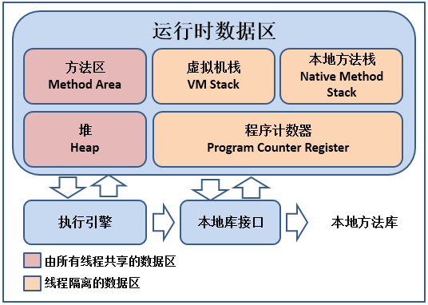

## Java内存区域

### 运行时数据区域

Java 虚拟机在执行 Java 程序的过程中会把管理的内存划分为若干个不同的数据区域

### 程序计数器

程序计数器（Program Counter Register）是一块**较小**的内存空间，可以看作**当前线程所执行文件的字节码的行号指示器**。字节码解释器工作时就是通过**改变计数器的值来选取下一条需要执行的字节码指令**，分支、循环、跳转、异常处理、线程恢复等基础功能都需要依赖这个计数器来完成。该区域是**唯一一个在 Java 虚拟机规范中没有规定任何 OutOfMemoryError 情况的区域**

由于 Java 虚拟机的多线程是通过线程轮流切换并分配处理器执行时间的方式来实现的，在任何一个确定的时刻，一个处理器（多核处理器为一个内核）都只会执行一个线程中的指令。因此为了线程切换后能恢复到正确的执行位置，每条线程都需要有一个独立的程序计数器，各条线程之间计数器互不影响，独立存储，这类内存区域被称为“线程私有”的内存

* 如果线程正在执行的是一个 Java 方法
  * 计数器记录的是**正在执行的虚拟机字节码指令的地址**
* 如果执行的是 Native 方法
  * 计数器的值则**为空（Underfined）**

### Java 虚拟机栈

Java 虚拟机栈（Java Virtual Machine Stacks）是线程私有的，它的**生命周期与线程相同**。虚拟机描述的是 Java 方法执行的内存模型：每个方法在执行的同时都会创建一个栈帧（Stack Frame）用于存储局部变量表、操作数栈、动态链接、方法出口等信息。**每个方法从调用到执行完成的过程，就对应着一个栈帧在虚拟机栈中入栈到出栈的过程**。通常所说的“栈”就是虚拟机栈，或者说是虚拟机栈中的局部变量表部分

局部变量表存放了编译器可知的各种**基本数据类型、对象引用、returnAddress 类型**

* 对象引用：reference 类型，它不等同于对象本身，可能是一个指向对象起始地址的引用指针，也可能是指向一个代表对象的句柄或其他与此对象相关的位置
* returnAddress 类型：指向了一条字节码指令的地址

64 位长度的 long 和 double 类型的数据会占用 2 个局部变量空间（Slot），其余的数据类型只占一个。**局部变量表所需的内存空间在编译期间完成分配**，在方法运行期间不会改变局部变量表的大小

在 Java 虚拟机规范中，对这个区域规定了两种异常状况

* 如果线程请求的栈深度大于虚拟机所允许的深度
  * 抛出 StackOverflowError 异常
* 如果虚拟机栈可以动态扩展，但扩展时无法申请到足够的内存
  * 抛出 OutOfMemoryError 异常

大部分 Java 虚拟机都可动态扩展，但 Java 虚拟机规范中也允许固定长度的虚拟机栈

### 本地方法栈

本地方法栈（Native Method Stack）与虚拟机栈所发挥的作用相似，虚拟机栈为虚拟机执行 Java 方法（也就是字节码）服务，本地方法栈为虚拟机使用到的 Native 方法服务。在虚拟机规范中对本地方法栈中方法使用的语言、使用方式与数据结构没有强制规定，因此具体的虚拟机可以自由实现它。甚至 HotSpot 等虚拟机就直接将本地方法栈和虚拟机栈合二为一。本地方法栈会抛出 StackOverflowError 异常和 OutOfMemoryError 异常

### Java 堆

Java 堆（Java Heap）是大部分应用中 Java 虚拟机所管理的内存中**最大**的一块。Java 堆被所有线程共享，**在虚拟机启动时创建**。此内存区域的**唯一目的就是存放对象实例**，几乎所有对象的实例都在这里分配内存。Java 堆是垃圾收集器管理的主要区域，因此很多时候也被称为 GC 堆（Garbage Collected Heap）

Java 堆的细分

* 从内存回收角度
  * 由于现在收集器基本都采用分代收集法，所以 Java 堆中还可以细分为：新生代和老年代；再细致点的有 Eden 区、From Survivor 空间、To Survivor 空间等
* 从内存分配角度
  * 线程共享的 Java 堆可能划分出多个线程私有的分配缓冲区（Thread Local Allocation Buffer，TLAB）

根据 Java 虚拟机规范的规定，Java 堆可以处于物理上不连续的内存空间中，只要逻辑上是连续的即可。在实现时，可以实现成固定大小，也可以是可扩展的，主流的虚拟机都是可扩展的（通过 -Xmx 和 -Xms 控制）。如果堆中没有内存完成实例分配，并且堆也无法再扩展时，会抛出 OutOfMemoryError 异常

### 方法区

方法区（Method Area）是线程共享的内存区域，用于存储已被虚拟机加载的类信息、常量、静态变量、即时编译器编译后的代码等数据。虽然 Java 虚拟机规范把方法区描述为堆的一个逻辑部分，但是却有一个别名叫做非堆（Non-Heap），目的是与 Java 堆区分开

对于很多人把方法区称为永久代，其实两者并不等价，只是因为 HotSpot 虚拟机的设计团队使用永久代来实现方法区而已，而且并不是个好主意，因为更容易遇到内存溢出问题。在 JDK 1.7 的 HotSpot 已经把原本放在永久代的字符串常量池移除

方法区除了和 Java 堆一样不需要连续的内存和可以选择固定大小或可扩展外，还**可以选择不实现垃圾收集**。该区域的内存回收目标主要是针对常量池的回收和对类型的卸载。当方法区无法满足内存分配需求时，将抛出 OutOfMemoryError 异常

#### 运行时常量池

运行时常量池（Runtime Constant Pool）是方法区的一部分。Class 文件中除了有类的版本、字段、方法、接口等描述信息外，还有一项信息是常量池（Constant Pool Table），用于存放编译期生成的各种字面量和符号引用，这部分内容将在类加载后进入方法区的运行时常量池中存放

Java 虚拟机对 Class 文件的格式有严格的要求，但 Java 虚拟机规范没有对运行时常量池做任何细节的要求，不同的虚拟机可以按照自己的需求来实现这个内存区域。除了保存 Class 文件中描述的符号引用，还会把翻译出来的直接引用也存储在运行时常量池中

运行时常量池相对于 Class 文件常量池的另外一个重要特征就是具备动态性，Java 语言并不要求常量一定只有编译期才能产生，运行期间也可能将常量池放入池中，开发中利用的最多的就是 String 类的 intern() 方法

当常量池无法再申请到内存时会抛出 OutOfMemoryError 异常

### 直接内存

**直接内存（Direct Memory）不是虚拟机运行时数据区的一部分，也不是 Java 虚拟机规范中定义的内存区域**。但这部分内存被频繁的使用，而且也可能导致 OutOfMemoryError 异常出现

NIO 类引入了一种基于通道与缓冲区的 I/O 方式，可以使用 Native 函数库直接分配堆外内存，然后通过存储在 Java 堆中的 DirectByteBuffer 对象作为这块内存的引用进行操作。因为避免了在 Java 堆和 Native 堆中来回复制数据，可以在一些场景中显著的提高性能

直接内存的分配不会受到 Java 堆大小的限制，但仍会受到本机总内存大小和处理器寻址空间的限制。当根据实际内存设置 -Xmx 等参数信息时，忽略了直接内存，使得各个内存区域总和大于物理内存限制，会导致动态扩展时出现 OutOfMemoryError 异常

## HotSpot 虚拟机对象揭秘

### 对象的创建

虚拟机遇到一条 new 指令时，首先会去检查这个指令的参数是否能在常量池中定位到一个类的符号引用，并且检查这个符号引用代表的类是否已被加载、解析和初始化过。如果没有，就必须先执行相应的类加载过程

在类加载检查通过后，虚拟机将为新生对象分配内存。对象所需内存的大小在类加载完成后便可完全确定，为对象分配空间的任务等同于把一块确定大小的内存从 Java 堆中划分出来

两种分配方式

* 指针碰撞（Bump the Pointer）
  * 假设 Java 堆中内存是绝对规整的，已使用的内存放一边，空闲的内存放另一边，中间放着一个指针作为分界点的指示器，那所分配内存就仅仅是把那个指针向空闲空间那边挪动一段与对象大小相等的距离
* 空闲列表（Free List）
  * 如果 Java 堆中内存不是规整的，已使用的内存和空闲内存相互交错，就没办法进行简单的指针碰撞。虚拟机必须维护一个列表，记录哪些内存块是可用的，在分配时从列表中找到一块足够大的空间划分给对象实例，并更新列表上的记录

选择哪种分配方式由 **Java 堆是否规整**决定，而 Java 堆是否规整又由所采用的垃圾回收器**是否带有压缩整理功能**决定。使用 Serial、Parnew 等带有 Compact 过程的收集器，使用指针碰撞。使用 CMS 等基于 Mark-Sweep 算法的收集器，使用空闲队列

另一个需要考虑的问题是对象创建在虚拟机中是非常频繁的行为，即使是仅仅修改一个指针所指向的位置，在并发情况下也并不是线程安全的，可能出现正在给对象A分配内存，指针还没来得及修改，对象B又同时使用了原来的指针来分配内存的情况

两种解决方案

* 对分配内存空间的动作进行同步处理，实际上虚拟机采用 CAS 配上失败重试的方式来保证更新操作的原子性
* 把内存分配的动作按照线程划分在不同的空间之中进行，即每个线程在 Java 堆中预先分配一小块内存，称为本地线程分配缓存（TLAB）。哪个线程要分配内存，就在哪个线程的 TLAB 上分配，只有 TLAB 用完并分配新的 TLAB 时，才需要同步锁定。可以通过 -XX:+/-UseTLAB 参数来设定是否使用 TLAB

内存分配完成后，虚拟机需要将分配到的内存空间都初始化为零值，不包括对象头。使用 TLAB 后这一工作过程可以提前到 TLAB 分配时进行。这一步操作保证了对象的实例字段在 Java 代码中可以不赋初始值就直接使用，程序能访问到这些字段的数据类型所对应的零值

之后虚拟机要对对象进行必要的设置，例如这个对象是哪个类的实例、如何才能找到类的元数据信息、对象的哈希码、对象的 GC 分代年龄等信息。这些信息存放在对象的对象头之中。根据虚拟机当前的运行状态的不同，如是否启用偏向锁等，对象头会有不同的设置方式

在上面工作完成后，虚拟机的视角来看，一个新的对象已经产生了，但从 Java 程序的视角来看，对象创建才刚刚开始，init 方法还没有执行，所有的字段都还为零。所以一般来说，执行 new 指令之后会接着执行 init 方法，把对象按照程序员的意愿进行初始化，这样一个真正可用的对象才算完全产生出来

### 对象的布局

对象在内存中的存储的布局可分为：**对象头（Header）、实例数据（Instance Data）、对齐填充（Padding）**

#### 对象头

对象头包含两部分信息

* 用于存储对象自身的运行时数据，官方称为 **Mark Word**
  * 如哈希码、GC 分代年龄、锁状态标志、线程持有的锁、偏向线程 ID 等
  * Mark Word 被设计成一个非固定的数据结构以便在极小的空间内存储尽量多的信息，会根据对象的状态复用自己的存储空间

HotSpot 虚拟机对象头 Mark Word

| 存储内容                              | 标志位 |        状态        |
| ------------------------------------- | :----: | :----------------: |
| 对象哈希码、对象分代年龄              |   01   |       未锁定       |
| 指向锁记录的指针                      |   00   |     轻量级锁定     |
| 指向重量级锁的指针                    |   10   | 膨胀（重量级锁定） |
| 空、不需要记录信息                    |   11   |      GC 标记       |
| 偏向线程 ID、偏向时间戳、对象分代年龄 |   01   |       可偏向       |

* **类型指针**
  * 即对象指向它的类元数据的指针，虚拟机通过这个指针来确定这个对象是哪个类的实例
  * 不是所有的虚拟机实现都必须在对象数据上保留类型指针，也就是说查找对象的元数据信息不一定要经过对象本身
  * 如果对象是一个数组，对象头中必须有一块用于记录数组长度的数据，因为虚拟机可以通过普通 Java 对象的元数据信息确定 Java 对象的大小，但是从数组的元数据中却无法确定数组的大小

#### 实例数据

实例数据部分是对象真正存储的有效信息，也是在程序代码中所定义的各种类型的字段内容。无论是从父类继承的还是子类中定义的，都需要记录起来。这部分的存储顺序会受到虚拟机分配策略参数（FieldsAllocationStyle）和字段在 Java 源码中定义顺序的影响

HotSpot 虚拟机默认的分配策略为相同宽度的字段分配到一起。在满足这个前提下，在父类中定义的变量会出现在子类之前。如果 CompactFields 参数值为 true（默认为 true），那么子类之中较窄的变量可能会插入到父类变量的空隙之中

#### 对齐填充

对齐填充并不是必须存在的，只是起到占位符的作用。对象的大小必须是 8 字节的整数倍，而对象头部分正好是 8 字节的整数倍，当对象实例数据部分没有对齐时，就需要通过对齐填充来补充

### 对象的访问定位

