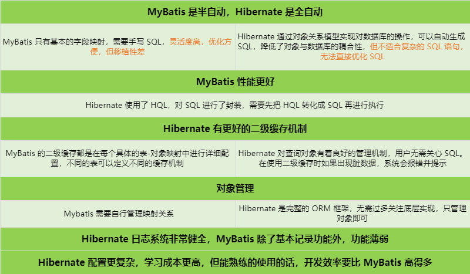
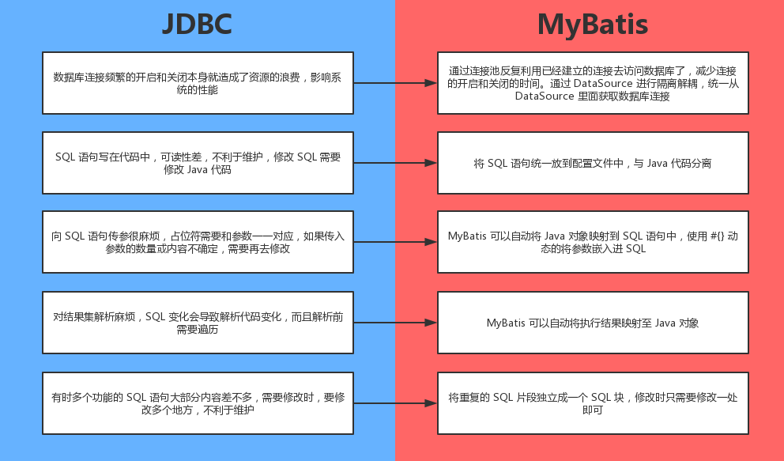
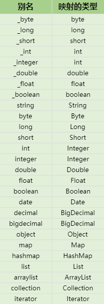
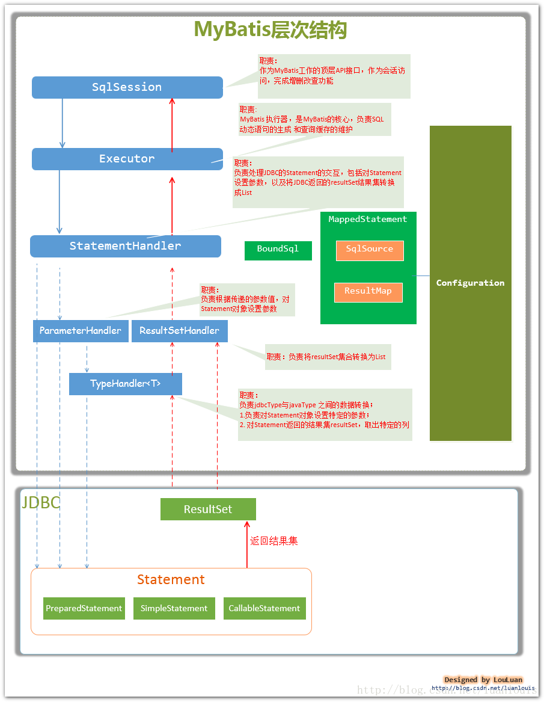
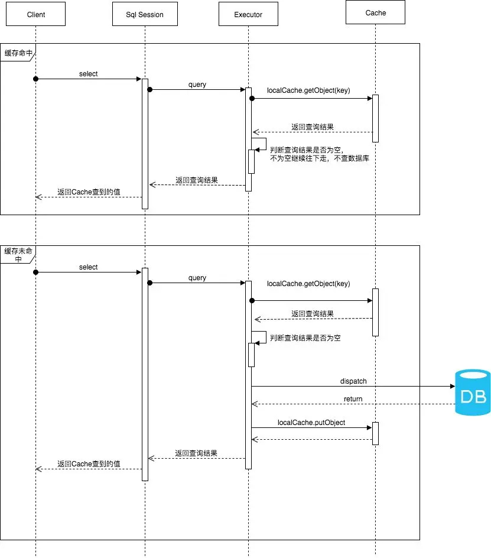

## MyBatis 概述

MyBatis 是一个基于 Java 的 **持久层框架**，对 JDBC 进行了封装，主要作用就是在 Java 中操作数据库，开发者只需要关注 SQL 语句本身，避免了几乎所有的 JDBC 代码和手动设置参数以及获取结果集

### Hibernate

Hibernate 是一个开源的全自动的 **对象关系映射框架**，它对 JDBC 进行了封装，它将实体类与数据库表建立映射关系，Hibernate 可以自动生成 SQL 语句，自动执行

#### 对象关系映射（Object-Relationship-Mapping，ORM）

对象关系映射是一种思想，**将关系数据库中的业务数据用对象的形式表示出来**，并通过面向对象的方式将这些对象组织出来，实现系统的业务逻辑。**也就是 Java 实体对象跟数据库数据的映射关系**

### MyBatis 与 Hibernate



### 从 JDBC 到 MyBatis



*更多：[从 JDBC到 MyBatis](https://blog.csdn.net/fjscqjj1/article/details/79653592)*

## MyBatis 项目

### MyBatis 三大基本要素

- 核心接口和类、核心配置文件、SQL 映射文件

### 项目搭建步骤

* 导入 JAR 包：mybatis、mysql-connector-java

* 编写核心配置文件

* 创建实体类和 SQL 映射文件

### MyBatis 编程步骤

1. 创建 SqlSessionFactory
2. 通过 SqlSessionFactory 创建 SqlSession
3. 通过 SqlSession 执行数据库操作
4. 调用 session.commit() 提交事务
5. 调用 session.close() 关闭会话

### Maven 项目

Maven 项目需要在 pom.xml 文件中的 build 标签中添加以下内容，因为要在 dao 包下编写 xml 文件，**如果不添加下面内容的话，Maven 是不会将 XML 文件发布到编译后的 classes 目录下**，就会导致 MyBatis 到不到该文件

```xml
<resources>
	<resource>
		<directory>src/main/java</directory>
		<includes>
			<include>**/*.xml</include>
		</includes>
	</resource>
</resources>
```

### 映射文件

```xml
<!-- 映射文件一般会跟DAO接口放在同一个包下 -->
<?xml version="1.0" encoding="UTF-8" ?>
<!DOCTYPE mapper
        PUBLIC "-//mybatis.org//DTD Mapper 3.0//EN"
        "http://mybatis.org/dtd/mybatis-3-mapper.dtd">
<mapper namespace="com.test.dao.TestDao">
    <!-- resultType，返回的类型 -->
    <!-- 字段名与实体类中的属性名不一致，可以使用别名或resultMap -->
    <select id="selectAll" resultType="test">
		select * from test;
    </select>
    
    <!-- paramerType可省略，MyBatis会自动检测 -->
	<insert id="insertOne" paramerType="test">
		insert into test values (id,name);
        
        <!-- 获取主键，order为SQL语句执行之前或之后 -->
        <selectKey resultType="int" keyProperty="id" order="AFTER">
			SELECT @@identity
		</selectKey>
	</insert>
    
    <!-- 模糊查询 -->
    <select id="selectByName" resultType="test">
		select * from test where name like '%' #{name} '%'
        <!-- 另一种写法 -->
        select * from test where name like '%${name}%'
	</select>
</mapper>
```

#### ${} 和 #{} 的区别

* ${} 是 **字符串拼接**，参数会被直接拼接到 SQL 语句中，可能 **会有 SQL 注入问题**，如果 SQL 语句由程序员直接写好，不需要用户输入的话，可以使用 ${}，当然更建议使用 #{}
* #{} 是 **预编译处理**，MyBatis 会将 SQL 中的 #{} 替换为 ? 号，调用 PreparedStatement 的 set 方法进行赋值
  * #{} 中的内容是实体类的属性名，底层是通过 **反射机制**，调用实体类相关属性的 get 方法来获取值。如果需要获取用户的输入进行动态拼接的话，就用 #{}
  * 可以防止 SQL 注入的问题，因为预编译完成之后，SQL 的结构已经固定，用户的任何输入都不会对 SQL 的结构产生影响。而 SQL 注入是发生在编译的过程中，恶意注入某些特殊字符，最后被编译成了恶意的执行操作

#### resultType 与 resultMap

* resultType：设置返回的类型，MyBatis 后台会自动创建一个 resultMap，基于属性名来映射到实体类属性上
* resultMap：将数据库表中的字段与实体类中的属性 **建立映射关系**，即使两者名字不一致，也会根据映射关系正常执行。**涉及到两张表的操作，即使字段名和实体类属性名一致，也要编写 resultMap 来进行关联**
* **两者的区别**
  * resultType 对应的是 Java 对象中的属性，**大小写不敏感**
  * resultMap 对应的是对已经定义好了 id 的 resultType 的引用，**大小写敏感**

```xml
<!-- type属性用来指定要映射的实体类 -->
<resultMap id="testMapper" type="test">
    <!-- column表示数据库中的字段名，property表示实体类中的属性名 -->
    <!-- 在resultMap中添加id的属性指定主键，可以提高MyBatis的查询性能 -->
    <id column="id" property="id"/>
    <result column="name" property="username"/>
</resultMap>

<select id="selectTest" resultMap="testMapper">
    select id,name from test
</select>
```

#### 别名



### Dao 实现类

```java
public class StudentDaoImpl implements StudentDao {
    @Override
    public List<Test> selectAll() {
        List<Test> test = null;
        try(SqlSession sqlSession = MyBatisUtil.getSqlSession()) {
            // 返回对象集合
            stu = sqlSession.selectList("selectAll");
        }
        return test;
    }
    
    @Override
    public void insertStudent(Student student) {
        try(SqlSession sqlSession = MyBatisUtil.getSqlSession()) {
            sqlSession.insert("insertOne", test);
            // 提交事务
            sqlSession.commit();
        }
    }
}
```

### 核心配置文件

```xml
<?xml version="1.0" encoding="UTF-8" ?>
<!DOCTYPE configuration
        PUBLIC "-//mybatis.org//DTD Config 3.0//EN"
        "http://mybatis.org/dtd/mybatis-3-config.dtd">
<configuration>
    <!-- 获取数据库配置文件 -->
    <properties resource="db.properties"/>
    
    <!-- 设置实体类的别名，无需再写包名，减少冗余，有两种写法 -->
    <typeAliases>
        <!-- 1.默认别名为实体类的首字母小写，可以使用alias手动设置别名 -->
        <typeAlias type="com.test.bean.Test" alias="test"/>
        <!-- 2.指定一个包，MyBatis会自动搜索该包下需要的实体类 -->
        	<!-- 默认别名为实体类的首字母小写，可以在实体类上使用@Alias注解手动设置别名 -->
        <package name="com.test.bean"/>
    </typeAliases>
    
    <environments default="development">
        <environment id="development">
            <!-- 指定MyBatis使用的事务管理器，MyBatis支持两种事务管理器类型 -->
            	<!-- JDBC：直接使用了JDBC的提交和回滚设置，默认需要手动提交 -->
            	<!-- MANAGED：由容器来管理事务，默认情况下会关闭连接 -->
            <transactionManager type="JDBC"/>
            <!-- 配置数据源和数据库连接基本属性，有三种内建的数据源类型 -->
            	<!-- UNPOOLED：不使用连接池，每次请求都会创建一个数据库连接，使用完毕后关闭 -->
            	<!-- POOLED：使用MyBatis自带的数据库连接池 -->
            	<!-- JNDI：配置外部数据源 -->
            <dataSource type="POOLED">
                <property name="driver" value="${driver}"/>
                <property name="url" value="${url}"/>
                <property name="username" value="${user}"/>
                <property name="password" value="${password}"/>
            </dataSource>
        </environment>
    </environments>
    <!-- mapper映射器，告诉配置文件mapper所在的路径，有四种写法 -->
    <mappers>
        <!-- 1.使用相对于类路径的资源引用 -->
        <mapper resource="com/test/dao/TestMapper.xml"/>
        <!-- 2.使用完全限定资源定位符 -->
        <mapper url="D:\MyBatis\src\main\java\com\test\dao\TestMapper.xml"/>
        <!-- 3.使用映射器接口的完全限定类名，需满足三个要求 -->
        	<!-- 映射文件名要与DAO接口名称相同 -->
        	<!-- 映射文件要与接口在同一包中 -->
        	<!-- 映射文件中的namespace属性值为DAO接口的全类名 -->
        <mapper class="com.test.dao.TestDao"/>
        <!-- 4.将包内的映射器接口实现全部注册为映射器，需满足四个要求 -->
        	<!-- DAO使用mapper动态代理实现 -->
        	<!-- 映射文件名要与DAO接口名称相同 -->
        	<!-- 映射文件要与接口在同一包中 -->
        	<!-- 映射文件中的namespace属性值为DAO接口的全类名 -->
        <package name="com.test.dao"/>
    </mappers>
</configuration>
```

### 数据库配置文件

```properties
driver=com.mysql.jdbc.Driver
url=jdbc:mysql://127.0.0.1:3306/test
user=root
password=1234
```

### 工具类

```java
public class MyBatisUtil {
    private static SqlSessionFactory ssf;

    // 只创建一个SqlSessionFactory对象
    static {
        // 读取配置文件
        try (InputStream is = Resources.getResourceAsStream("mybatis-config.xml")) {
            ssf = new SqlSessionFactoryBuilder().build(is);
        } catch (IOException e) {
            e.printStackTrace();
        }
    }

    public static SqlSession getSqlSession() {
        // 括号内为false或不写为不自动提交事务，括号内为true自动提交事务
        return ssf.openSession();
    }
	
    public static void close(SqlSession ss) {
        if (ss != null) {
            ss.close();
        }
    }
}
```

### 测试类

```java
@Test
public void selectAll(){
	TestDao td = new TestDaoImpl();
	td.selectAll().forEach((t -> {
		System.out.println(t);
	}));
}
```

## 常用注解

MyBatis 的注解位于 org.apache.ibatis.annotations 包下

* Select、Insert、Update、Delete
  * 映射会被执行的 SQL 语句
* SelectProvider、InsertProvider、UpdateProvider、DeleteProvider
  * 构建动态 SQL，允许指定类名和返回在运行时执行的 SQL 语句的方法
  * 属性有 type 属性需填入类，method 填入该类定义了的方法名
* Param：当映射器方法需要多个参数时，这个注解可以被应用于映射器方法参数来给每个参数取一个名字。否则，多参数将会以它们的顺序位置和 SQL 语句中的表达式进行映射，这是默认的
* One：复杂类型的单独属性值映射，必须指定 select 属性，表示已映射的 SQL 语句的完全限定名
* Many：映射到复杂类型的集合属性，必须指定 select 属性，表示已映射的 SQL 语句的完全限定名

## DAO 接口

### 工作原理

DAO 接口即 Mapper 接口。接口的全限名，就是映射文件中的 namespace 的值；接口的方法名，就是映射文件中 Mapper 的 Statement 的 id 值；接口方法内的参数，就是传递给 SQL 的参数

Mapper 接口是没有实现类的，当调用接口方法时，接口 **全限名 + 方法名** 拼接的字符串作为 key 值，可唯一定位一个 MappedStatement。在 MyBatis 中，每一个 SQL 标签，都会被解析为一个 MappedStatement 对象

- DAO 接口里的方法，因为是使用全限名 + 方法名的保存和寻找策略，所以 **不能被重载**

### DAO 接口调用要求

* 接口方法名和映射文件中定义的每个 SQL 的 id 相同

* 接口方法的输入参数类型和映射文件中定义的每个 SQL 的 parameterType 的类型相同

* 接口方法的输出参数类型和映射文件中定义的每个 SQL 的 resultType 的类型相同

* 接口的类路径和映射文件文件中的 namespace 相同

### 接口绑定

接口绑定，就是在 MyBatis 中任意定义接口，然后把接口里面的方法和 SQL 语句绑定，我们直接调用接口方法就可以，这样比起原来了 SqlSession 提供的方法我们可以有更加灵活的选择和设置

接口绑定有两种实现方式

* 一通过注解绑定，就是在接口的方法上面加上 @Select、@Update 等注解，里面包含 SQL 语句来绑定
* 通过 XML 里面写 SQL 来绑定，要指定 XML 映射文件里面的 namespace 为接口的全路径名

### DAO 接口和 XML 文件里的 SQL 是如何建立关系的

MyBatis 在初始化 SqlSessionFactoryBean 的时候，找到 mapperLocations 路径去解析里面所有的 XML 文件，创建 **SqlSource 和 MappedStatement**。MyBatis 会把每个 SQL 标签封装成 SqlSource 对象。把 XML 文件中的每一个 SQL 标签都对应一个 MappedStatement 对象。这里面有两个属性很重要，id 和 sqlSource

* id 是全限定类名 + 方法名组成的 ID
* sqlSource 就是当前 SQL 标签对应的 SqlSource 对象

创建完 MappedStatement 对象，会将它缓存到 Configuration 中。把所有的 XML 都解析完成之后，Configuration 就包含了所有的 SQL 信息。当执行 MyBatis 方法的时候，就通过全限定类名 + 方法名找到 MappedStatement 对象，然后解析里面的 SQL 内容，执行即可

DAO 接口是没有实现类的，在调用它的时，MyBatis 会使用 **JDK 动态代理** 为 DAO 接口生成代理对象 proxy，当我们调用 DAO 接口方法的时候，代理对象会拦截接口方法，转而执行 MappedStatement 所代表的 SQL，然后将执行结果返回

*更多：[阿里面试题：Mybatis中的 Dao接口和 XML文件里的 SQL是如何建立关系的](https://juejin.im/post/5c9f4af6f265da30bf15c45a)*

## MyBatis 核心对象与生命周期

* SqlSessionFactoyBuilder：**用过即丢**
  * 用来创建 SqlSessionFactory，创建完毕后，就不再需要它了。所以最佳作用域是 **方法作用域**，即局部方法变量，**用完即销毁**，生命周期就是调用方法的开始到结束。可以重用 SqlSessionFactoryBuilder 来创建多个 SqlSessionFactory，但最好还是不要让其一直存在，让 XML 解析资源可以被释放给更重要的事情

* SqlSessionFactory：**Application**
  * 一旦被创建就在应用的运行期间一直存在，没有任何理由丢弃它或重新创建另一个实例。**在应用运行期间不要重复创建多次**，因此 SqlSessionFactory 的最佳作用域是 **应用作用域**，如使用单例模式

* SqlSession：**Session**
  * 每个线程都应该有它自己的 SqlSession 实例。SqlSession 的实例 **不是线程安全** 的，因此 **不能被共享** ，所以最佳的作用域是 **请求或方法作用域**。绝对不能将 SqlSession 实例的引用放在一个类的静态域，甚至一个类的实例变量也不行。也绝不能将 SqlSession 实例的引用放在任何类型的托管作用域中，如 Servlet 框架中的 HttpSession。如果现在正在使用一种 Web 框架，要考虑 SqlSession 放在一个和 HTTP 请求对象相似的作用域中。换句话说，每次收到的 HTTP 请求，就可以打开一个 SqlSession，返回一个响应，就关闭它，**应该把关闭操作放到 finally 块中** 以确保每次都能执行关闭
* 映射器实例：**Session**
  * 映射器是一些由你创建的、绑定你映射的语句的接口。映射器接口的实例是从 SqlSession 中获得的，因此，映射器实例的最大作用域是和请求它们的 SqlSession 相同的，最佳作用域是 **方法作用域**。映射器实例应该在调用它们的方法中被请求，用过即丢，不需要显式地关闭映射器实例。尽管在整个请求作用域保持映射器实例也不会有什么问题，但就像 SqlSession 一样，在这个作用域上管理太多的资源的话会难于控制，最好把映射器放在方法作用域内

## MyBatis 主要部件

- Configuration：所有的配置信息都保存在 Configuration 对象之中，配置文件中的大部分配置都会存储到该类中
- SqlSession：工作的主要顶层 API，表示和数据库交互时的会话，完成必要数据库增删改查功能
- Executor：执行器，是 MyBatis **调度的核心**，负责 SQL 语句的生成和查询缓存的维护
- StatementHandler：封装了 JDBC Statement操作，负责对 JDBC statement 的操作
- ParameterHandler：负责对用户传递的参数转换成 JDBC Statement 所对应的数据类型
- ResultSetHandler：负责将 JDBC 返回的 ResultSet 结果集对象转换成 List 类型的集合
- TypeHandler：负责 Java 数据类型和 JDBC 数据类型之间的映射和转换
- MappedStatement：维护一条 <select|update|delete|insert> 节点的封装
- SqlSource：根据用户传递的 parameterObject，动态地生成 SQL 语句，将信息封装到 BoundSql 对象中，并返回
- BoundSql：表示动态生成的 SQL 语句以及相应的参数信息



*更多：[MyBatis的架构设计以及实例分析](https://blog.csdn.net/luanlouis/article/details/40422941)*

## Executor 执行器

MyBatis 有三种基本的 Executor 执行器，所有的作用范围都严格限制在 SqlSession 生命周期范围内

* SimpleExecutor：每次执行 update 或 select，都会开启一个 Statement 对象，用完立刻关闭 Statement 对象

* ReuseExecutor：执行 update 或 select，以 SQL 作为 key 查找 Statement 对象，存在就使用，不存在就创建，用完后，不关闭Statement对象，而是放置于 Map<String, Statement> 内，供下一次使用。简言之，就是重复使用 Statement 对象

* BatchExecutor：执行 update，将所有 SQL 都添加到批处理中（addBatch()），等待统一执行（executeBatch()），它缓存了多个 Statement 对象，每个 Statement 对象都是 addBatch() 完毕后，等待逐一执行 executeBatch() 批处理，与 JDBC 批处理相同

### 如何指定使用哪一种 Executor 执行器

在 MyBatis 配置文件中，可以指定默认的 ExecutorType 执行器类型，也可以手动给 DefaultSqlSessionFactory 的创建 SqlSession 的方法传递 ExecutorType 类型参数

## mapper 动态代理

使用 mapper 动态代理就无需再编写 DAO 实现类，直接通过 DAO 接口来定位到 mapper 中的 SQL 语句

### 如何使用

1. 在映射文件 mapper 标签 **添加 namespace** 属性，将当前映射文件与 DAO 接口关联起来
2. 映射文件中的 **id 名要与 DAO 接口中的方法名一致**
3. 将方法和 SQL 语句关联起来，**映射文件名要与接口名相同**

```xml
<mapper namespace="com.test.dao.TestDao">
```

```xml
<mappers>
	<package name="com.test.dao"/>
</mappers>
```

**测试类**

```java
private SqlSession ss;
private TestDao td;

@Test
public void selectAll(){
    ss = MyBatisUtil.getSqlSession();
    // 获得TestDao对象
    td = ss.getMapper(TestDao.class);
    
    td.selectAll().forEach((t -> {
		System.out.println(t);
	}));
    
    MyBatisUtil.close(ss);
}
```

将 DAO 的实现类删除之后，MyBatis 底层 **只会调用 selectOne() 或 selectList() 方法**。框架选择方法的标准是测试类中用于接收返回值的对象类型。**若接收类型为 List，选择 selectList() 方法；否则选择 selectOne() 方法**

## 分页

MyBatis 使用 RowBounds 对象进行分页，`RowBounds(offset, limit)`，它是针对 ResultSet 结果集执行的内存分页，而非物理分页，可以在 SQL 内直接书写带有物理分页的参数，如 limit，来完成物理分页功能，也可以使用分页插件来完成物理分页。分页插件的基本原理是使用 MyBatis 提供的插件接口，实现自定义插件，在插件的拦截方法内拦截待执行的 SQL，然后重写 SQL，根据方言，添加对应的物理分页语句和物理分页参数

## MyBatis 插件运行原理

MyBatis 可以针对 ParameterHandler、ResultSetHandler、StatementHandler、Executor 四种接口编写插件，MyBatis 使用 JDK 的动态代理，为需要拦截的接口生成代理对象以实现接口方法拦截功能，每当执行这四种接口对象的方法时，就会进入拦截方法，具体就是 InvocationHandler 的 invoke() 方法，当然，只会拦截那些你指定需要拦截的方法

### 如何编写一个插件

实现 MyBatis 的 Interceptor 接口并复写 intercept() 方法，然后在给插件编写注解，指定要拦截哪一个接口的哪些方法即可，然后在配置文件中配置编写的插件

## 动态 SQL

执行查询操作的时候可能会有多个条件，但用户在输入的时候，填写的条件数不确定，可以使用动态 SQL 来解决这个问题，**动态 SQL 会根据传入的条件动态拼接 SQL 语句**

在 MyBatis 的动态 SQL 中，有时会对一些数据进行比较，可能会导致 xml 文件解析出现问题，可以使用实体符号代替，还可以将这些数据放到 **`<![CDATA[ ]]>`** 里面，这里面的内容 xml 是不会解析的

|   元符号   |      实体符号      |
| :--------: | :----------------: |
| `＜`、`<=` |  `&lt;`、`&lt;=`   |
| `＞`、`>=` |   `&gt`、`&gt;=`   |
|    `&`     |      `&amp;`       |
|  `"`、`'`  | `&quot;`、`&apos;` |

### if 标签

```xml
<select id="selectIf" resultType="test">
	select * from test
    <!-- 添加1=1为true的条件，否则当两个条件均未设定只剩下一个where，这时SQL语句就不正确了 -->
    where 1=1
    <if test="name!=null and name!=''">
		and name '%' #{name} '%'
    </if>
    <if test="age>=0">
		and age > #{age}
    </if>
</select>
```

### where 标签

```xml
<select id="selectWhere" resultType="test">
    select * from test
    <!-- 使用where标签就无需再写1=1了，第一个if标签可以不加and -->
    <where>
        <if test="name!=null and name!=''">
            name '%' #{name} '%'
        </if>
        <if test="age>=0">
            and age > #{age}
        </if>
    </where>
</select>
```

### choose 标签

```xml
<select id="selectWhere" resultType="test">
    select * from test
    <!-- 不需要再写and -->
    <where>
        <choose>
        	<when test="name!=null and name!=''">
            	name '%' #{name} '%'
        	</when>
        	<when test="age>=0">
            	age > #{age}
        	</when>
            <otherwise>
            	1!=1
            </otherwise>
		</choose>
    </where>
</select>
```

### foreach 标签

```xml
<!-- 遍历数组或集合，相当于SQL中的in语句 -->
<select id="selectForEach" resultType="test">
    select * from test
    <!-- 遍历数组使用array，遍历集合使用list-->
    <if test="array!=null and array.length>0">
		where id in
        <!-- collection表示要遍历的类型 -->
        <!-- open、close、separator表示对遍历内容的SQL拼接 -->
        <!-- 可以遍历自定义数据类型的集合 -->
        <foreach collection="array" open="(" close=")" item="id" separator=",">
            #{id}
        </foreach>
    </if>
</select>
```

### sql 标签

```xml
<!-- 定义一个可被复用的sql片段，在使用时写上include标签将sql标签中的内容引入 -->
<sql id="select">
    select * from test
</sql>

<select id="selectSQL" resultType="test">
    <!--使用sql片段-->
    <include refid="select"/>

    <if test="array!=null and array.length>0">
		where id in
        <foreach collection="array" open="(" close=")" item="id" separator=",">
            #{id}
        </foreach>
    </if>
</select>
```

### bind 标签

```xml
<!-- 字符串拼接 -->
<select id="selectByName" resultType="test">
    <bind name="like" value="'%' + name + '%'" />
	select * from test where name like #{like}
</select>
```

## 关联查询

### 一对多查询

在查询一方对象的时候同时把跟它所关联的多方对象也查询出来

```java
public class Player {
    private int id;
    private String name;
}
// 一个Team关联着多个Player
public class Team {
    private int id;
    private String name;
    private List<Player> playerList;
}
```

```xml
<mapper namespace="com.test.dao.TestDao">
    <!-- 当到两张表的操作，即使字段名和实体类属性名一致也要编写resultMap进行关联 -->
	<resultMap type="team" id="tt">
		<id column="tid" property="id" />
		<result column="tname" property="name" />
        <!-- collection中填写的内容关联的是Player中的属性 -->
        <!-- property指定关联属性，即实体类的集合的属性，ofType指定集合属性的泛型类型 -->
		<collection property="playerList" ofType="player">
			<id column="pid" property="id" />
			<result column="pname" property="name" />
		</collection>
	</resultMap>

	<select id="selectTeamById" resultMap="tt">
		select t.id tid,t.name tname,
        p.id pid,p.name pname
		from team t,player p
		where t.id = p.tid
		and p.tid = #{id}
	</select>
</mapper>
```

### 多对一查询

在查询多方对象的时候，同时将其所关联的一方对象也查询出来。由于在查询多方对象时也是一个一个查询，所以    ，**其实就是一对一关联查询**

```java
public class Player {
    private int id;
    private String name;
    private Team team;
}

public class Team {
    private int id;
    private String name;
}
```

```xml
<mapper namespace="com.test.dao.TestDao">
    <resultMap type="player" id="pp">
		<id column="pid" property="id" />
		<result column="pname" property="name" />
		<!-- association标签体现出两个实体类对象之间的关系 -->
        <!-- property指定关联属性，即实体类的属性，javaType指定关联属性的类型 -->
		<association property="team" javaType="team">
			<id column="tid" property="id" />
			<result column="tname" property="name" />
		</association>
	</resultMap>
	<select id="selectPlayerById" resultMap="pp">
		select t.id tid,t.name tname,
        p.id pid,p.name pname
		from team t,player p
		where t.id = p.tid
		and p.id = #{id}
	</select>
</mapper>
```

### 注意

若定义的类是双向关联，即双方的属性中均有对方对象作为域属性出现，在定义各自的 toString() 方法时，只让某一方可以输出另一方，**不要让双方的 toString() 方法均可输出对方**，这样会造成栈内存溢出的错误

*更多：[MyBatis 关联查询](https://blog.csdn.net/abc5232033/article/details/79054247)*

## 自关联查询

自己同时充当多方和一方，即多和一都在同一张表中，一般这样的表其实可以看做是一个树形结构，在数据库表中有一个外键，该外键表示当前数据的父节点

### 一对多关联查询

```java
public class Employee {
    private int id;
    private String name;
    private String job;
    // 表示多的一方，即当前员工的所有下属
    private List<Employee> children;
}
```

```xml
<mapper namespace="com.test.dao.TestDao">
	<resultMap type="employee" id="em">
		<id column="id" property="id" />
        <!-- 形成递归查询 -->
        <!-- select属性表示会继续执行selectChildrenByPid这个sql语句 -->
        <!-- column表示将id作为属性传入SQL中，此处是pid -->
        <!-- column中的id要跟SQL语句中的id一致，查询出的id会作为条件pid再次传入SQL中执行 -->
		<collection property="children" ofType="employee" select="selectChildrenById"
			column="id">
		</collection>
	</resultMap>

	<select id="selectChildrenById" resultMap="em">
		select id,name,job
		from employee
		where mgr = #{mgr}
	</select>
</mapper>
```

### 多对一关联查询

```java
public class Employee {
    private int id;
    private String name;
    private String job;
    // 表示一的一方，即当前员工的上级领导对象
    private Employee leader;
}
```

```xml
<mapper namespace="com.test.dao.TestDao">
	<resultMap type="employee" id="em">
		<id column="id" property="id" />
        
		<association property="leader" javaType="employee" select="selectLeaderById"
			column="mgr">
        </association>
	</resultMap>

	<select id="selectLeaderById" resultMap="em">
		select id,name,job,mgr
		from employee
		where id = #{id}
	</select>
</mapper>
```

### 多对多关联查询

由两个互反的一对多关系组成，多对多关系都会通过一个中间表来建立

```java
public class Student {
    private int id;
	private String name;
	private int age;
	private double score;
	private List<Course> courses;
}

public class Course {
    private int id;
    private String name;
    private List<Student> students;
}
```

```xml
<mapper namespace="com.test.dao.TestDao">
	<resultMap type="course" id="cc">
		<id column="cid" property="id" />
		<result column="cname" property="name" />
		<collection property="students" ofType="student">
			<id column="sid" property="id" />
			<result column="sname" property="name" />
		</collection>
	</resultMap>

	<select id="selectCourseStudent" resultMap="cc">
		select c.id cid,c.name cname,s.id sid,s.name sname
		from course c,student s,student_course sc
		where c.id = #{id} and s.id = sc.sid and c.id = sc.cid;
	</select>
</mapper>
```

## 延迟加载

也称为懒加载，**在进行表的关联查询时，按照设置延迟对关联对象的 select 查询。**如在进行一对多查询的时候，只查询出一方，当程序中需要多方的数据时，MyBatis 再发出 SQL 语句进行查询，这样 **延迟加载就可以的减少数据库压力**

### 基本原理

使用 CGLIB 创建目标对象的代理对象，当调用目标方法时，进入拦截器方法，如调用 a.getB().getName()，拦截器 invoke() 方法发现 a.getB() 是 Null 值，那么就会单独发送事先保存好的查询关联 B 对象的 SQL，把 B 查询上来，然后调用 a.setB(b)，于是 A 的对象 b 属性就有值了，接着完成 a.getB().getName() 方法的调用

### 关联对象加载时机

MyBatis 根据对 **关联对象查询的 select 语句的执行时机**，分为三种类型。

* 直接加载
  * 执行完对主加载对象的 select 语句，马上执行对关联对象的 select 查询

* 侵入式延迟
  * 执行对主加载对象的查询时，不会执行对关联对象的查询。但当要访问主加载对象的详情属性时，才会执行关联对象的 select 查询

* 深度延迟
  * 执行对主加载对象的查询时，不会执行对关联对象的查询。访问主加载对象的详情时也不会执行关联对象的 select 查询。只有当真正访问关联对象的详情时，才会执行对关联对象的 select 查询

### 如何使用

关联对象的查询与主加载对象的查询必须是 **分别进行的 select 语句，不能是使用多表连接所进行的 select 查询**。多表连接查询，其实就是对一张表的查询，对由多个表连接后形成的一张表的查询。会一次性将多张表的所有信息查询出来。延迟加载 **只是对关联对象的查询有迟延设置**，对于 **主加载对象都是直接执行查询语句** 的，只对 resultMap 中的 collection 和 association 起作用

#### 单独查询

```xml
<mapper namespace="com.test.dao.TestDao">
	<resultMap type="team" id="tt">
		<id column="id" property="id" />
		<collection property="playerList" ofType="player" select="selectPlayerById"
			column="id" />
	</resultMap>

	<select id="selectTeamByIdAlone" resultMap="tt">
		select id,name
		from team
		where id = #{id}
	</select>

	<select id="selectPlayerById" resultType="player">
		select id,name
		from player
		where tid = #{tid}
	</select>
</mapper>
```

#### 开启延迟加载

```xml
<!-- 全局参数设置，该标签需要放在properties与typeAliases之间 -->
<settings>
	<!-- 延迟加载的总开关，true表示开启，false为关闭 -->
	<setting name="lazyLoadingEnabled" value="true"/>
	<!-- 侵入式延迟加载，true表示开启，默认为false -->
    <!-- value为false时表示开启深度延迟加载 -->
	<setting name="aggressiveLazyLoading" value="true"/>
</settings>
```

- 若只希望某些查询支持深度延迟加载的话，可以在 resultMap 中的 collection 或 association 添加 **fetchType 属性**，配置为 **lazy 为开启深度延迟**，配置 **eager 为不开启**。fetchType 属性将取代全局配置参数 lazyLoadingEnabled 的设置

## 缓存

查询缓存主要是为了提高查询访问速度，当用户执行一次查询后，会将数据结果放到缓存中，下次再执行此查询时直接从缓存中获取数据。如果在缓存中找到了数据叫做 **命中**

### 如何判断某个 SQL 语句是否在缓存中存在

**mapper 中的 id 具有唯一性**，所以通过这个 id 就可以判断缓存中是否存在。如果有两个 SQL 语句一模一样，但 id 不一样，MyBatis 不会为这两个 SQL 语句建立相同缓存。如果一条 select 语句中有查询条件的话，该查询条件也会被作为特征值，即再有相同条件查询的时候，会命中

### 作用域

查询缓存的作用域根据映射文件 mapper 的 namespace 划分，相同 namespace 的 mapper 查询数据存放在同一个缓存区域。不同 namespace 下的数据互不干扰。一级缓存和二级缓存，都是按 namespace 进行分别存放的

可以使用 cache-ref 标签，让多个 namespace 共享相同的缓存配置和实例

```xml
<cache-ref namespace="com.test.dao.AnotherDao"/>
```

### 增删改对缓存的影响

增删改操作，无论是否进行提交 commit()，均会清空一级、二级查询缓存。二级缓存中的 key 是不会清空，只清空 key 对应的值。如果想要设置增删改操作的时候不清空二级缓存的话，可以在 insert、delete、update 标签中添加属性 **`flushCache="false"`**，默认为 true

### 一级缓存

也叫作本地缓存，是基于 PerpetualCache 类的 **HashMap 本地缓存**，**作用域是 SqlSession**，**一级缓存默认开启，且不能关闭**

每个 SqlSession 中持有了 Executor，每个 Executor 中有一个 LocalCache 。当用户发起查询时，MyBatis 根据当前执行的语句生成 MappedStatement，在 Local Cache 进行查询，如果缓存命中的话，直接返回结果给用户，如果缓存没有命中的话，查询数据库，结果写入 Local Cache ，最后返回结果给用户

MyBatis 的一级缓存最大范围是 SqlSession 内部，有多个 SqlSession 或者分布式的环境下，数据库写操作会引起脏数据，建议设定缓存级别为 Statement

```xml
<setting name="localCacheScope" value="SESSION"/>
```

#### 工作流程



### **二级缓存**

内置的二级缓存也是采用 PerpetualCache 类的 HashMap 本地缓存。与一级缓存不同的是 **二级缓存的生命周期与整个应用同步**，与 SqlSession 是否关闭没有关系。默认不开启二级缓存，开启后，会使用 CachingExecutor 装饰 Executor，进入一级缓存的查询流程前，先在 CachingExecutor 进行二级缓存的查询

在分布式环境下，由于默认的 MyBatis Cache 实现都是基于本地的，分布式环境下必然会出现读取到脏数据，需要使用集中式缓存将 MyBatis 的 Cache 接口实现，有一定的开发成本，直接使用 Redis 等分布式缓存可能成本更低，安全性也更高

#### 开启二级缓存

先 **序列化实体类**，让实体类实现 Serializable 接口，如果该实体类有父类的话，父类也要实现 Serializable 接口。在配置文件中开启二级缓存，之后，在映射文件中的 mapper 标签下添加 **`<cache/>`** 标签

```xml
<setting name="cacheEnabled" value="true"/>
```

- 局部关闭可以只关闭某个 select 查询的二级缓存，在 select 标签中 **将 useCache 属性设置为 false**

#### cache 标签

```xml
<cache eviction="LRU" flushInterval="100" readOnly="false" size="1024" />
<!-- eviction：逐出策略，定义回收的策略，默认为LRU，FIFO：先进先出；LRU：未被使用时间最长的 -->
<!-- flushInterval：配置一定时间自动刷新缓存，单位是毫秒，一般不指定 -->
<!-- size：最多缓存对象的个数，默认为1024个 -->
<!-- readOnly：是否只读，只读的缓存性能会好一些，但是不能被修改，默认是false，会慢一些，但是安全 -->
```

#### 注意

* 在一个命名空间下使用二级缓存
  * 不同的命名空间 namespace 的数据是互不干扰的，若多个 namespace 中对同一个表进行操作，就会导致这不同的 namespace 中的数据不一致的情况

* 在单表上使用二级缓存
  * 在做关联关系查询时，就会发生多表的操作，当这些表可能存在于多个 namespace 中时，就会出现数据不一致的情况

* 查询多于修改时使用二级缓存
  * 因为任何增删改操作都将刷新二级缓存，对二级缓存的频繁刷新将降低系统性能

*更多：[聊聊 MyBatis缓存机制](https://mp.weixin.qq.com/s?__biz=MjM5NjQ5MTI5OA==&mid=2651747419&idx=2&sn=a7c25803179504b7232c0d6777fe4831&chksm=bd12ad168a65240095187adf72f82d0c7f2fcff52987e97fa385065eb63ff843e45dc896189e&mpshare=1&scene=23&srcid=0708i2B3zxQQJCepUAUUrZFw#rd)*

## MyBatis 中设计模式

MyBatis 至少遇到了以下的设计模式的使用

* 建造者模式：如 SqlSessionFactoryBuilder
* 工厂方法模式：如 SqlSessionFactory、TransactionFactory、TransactionFactory、LogFactory
* 单例模式：如 ErrorContext、LogFactory
* 代理模式：MyBatis 实现的核心，如 MapperProxy、ConnectionLogger，用的 JDK 的动态代理；还有 executor.loader 包使用了 cglib 或者 javassist 达到延迟加载的效果
* 组合模式：如 SqlNode 和各个子类 ChooseSqlNode 等
* 模板方法模式：如 BaseExecutor 和 SimpleExecutor，还有 BaseTypeHandler 和所有的子类
* 适配器模式：如 Log 的 MyBatis 接口和它对 JDBC、log4j 等各种日志框架的适配实现
* 装饰者模式：如 Cache 包中的 cache.decorators 子包中等各个装饰者的实现
* 迭代器模式：如 PropertyTokenizer

*更多：[Mybatis源码解读-设计模式总结](https://blog.csdn.net/qq_35807136/article/details/79931345)*

## 更多

* [MyBatis官方中文文档](http://www.MyBatis.org/MyBatis-3/zh/index.html)
* [MyBatis常见面试题](https://blog.csdn.net/a745233700/article/details/80977133)

* [MyBatis中文官网](http://www.mybatis.cn/)