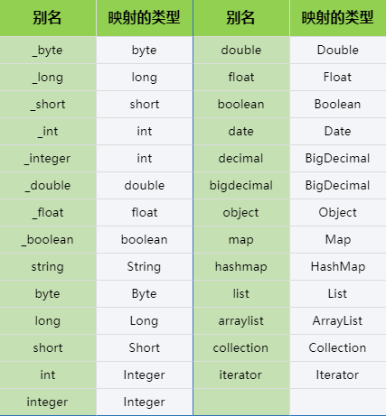

## MyBatis 概述

### MyBatis 是什么

MyBatis 是一个基于 Java 的 **持久层框架**，它支持定制化 SQL、存储过程以及高级映射。主要作用就是在 Java 中操作数据库，其实就是在 JDBC 的基础上进行了封装，开发者只需要关注 SQL 语句本身，避免了几乎所有的 JDBC 代码和手动设置参数以及获取结果集


### Hibernate 是什么

Hibernate 是一个开源的全自动的 **对象关系映射框架**，它对 JDBC 进行了封装，它将 POJO 与数据库表建立映射关系，Hibernate 可以自动生成SQL语句，自动执行

 

#### 什么是对象关系映射

对象关系映射（Object - Relationship - Mapping，ORM），是一种思想，他的实质就是 **将关系数据库中的业务数据用对象的形式表示出来**，并通过面向对象的方式将这些对象组织出来，实现系统的业务逻辑。**说到底就是 Java 实体对象跟数据库数据的映射关系**


### MyBatis 和 Hibernate 的区别

* MyBatis 是半自动，Hibernate 是全自动
  * MyBatis 只有基本的字段映射，需要通过手写sql来实现和管理，Hibernate 可以自动生成 SQL

* Hibernate 数据库移植性大于 MyBatis
  * Hibernate 通过它强大的映射结构和 HQL 语言，降低了对象与数据库的耦合性，而 MyBatis 由于需要手写 SQL，移植性也会随之降低很多

* Hibernate 拥有完整的日志系统，MyBatis 则欠缺一些
  * Hibernate 日志系统非常健全，涉及广泛，而 MyBatis 则除了基本记录功能外，功能薄弱很多

* Hibernate 配置要比 MyBatis 复杂的多，学习成本也比 MyBatis 高，但是如果使用 Hibernate 很熟练的话，实际上开发效率甚至超越 MyBatis

* MyBatis 使用简单，需要比 Hibernate 关心很多技术细节

* SQL 直接优化上，MyBatis 比 Hibernate 更方便
  * 由于 MyBatis 的sql都是写在xml里，因此优化sql比Hibernate方便很多。而Hibernate的sql很多都是自动生成的，无法直接维护sql；总之写sql的灵活度上Hibernate不及MyBatis。


### 三个基本要素

- 核心接口和类
- MyBatis 核心配置文件
- SQL 映射文件


## 基础的 MyBatis 项目

### 搭建步骤

* 导入 JAR 包：mybatis、mysql-connector-java

* 编写核心配置文件：mybatis-config.xml

* 创建持久化类和 SQL 映射文件


### Mybatis 编程步骤

1. 创建 SqlSessionFactory
2. 通过 SqlSessionFactory 创建 SqlSession
3. 通过 SqlSession 执行数据库操作
4. 调用 session.commit() 提交事务
5. 调用 session.close() 关闭会话


### 基本目录结构

* src/main/java
  * 实体类
  * DAO 接口
  * DAO 实现类
  * 工具类
* src/main/resources
  * 数据库配置文件
  * 核心配置文件
* src/test/java
  * 测试类


#### Maven 项目

Maven 项目需要在 pom.xml 文件中的 build 标签中添加以下内容，因为要在 dao 包下编写 xml 文件，**如果不添加下面内容的话，Maven 是不会将 xml 文件发布到编译后的 classes 目录下**，就会导致 MyBatis 到不到该文件

```xml
<resources>
	<resource>
		<directory>src/main/java</directory>
		<includes>
			<include>**/*.xml</include>
		</includes>
	</resource>
</resources>
```


#### 映射文件

```xml
<!-- 映射文件一般会跟DAO接口放在同一个包下 -->
<?xml version="1.0" encoding="UTF-8" ?>
<!DOCTYPE mapper
        PUBLIC "-//mybatis.org//DTD Mapper 3.0//EN"
        "http://mybatis.org/dtd/mybatis-3-mapper.dtd">
<mapper namespace="com.test.dao.TestDao">
    <!-- resultType，返回的类型 -->
    <select id="selectAll" resultType="test">
		select * from test;
    </select>
    
    <!-- 字段名与实体类中的属性名不一致，可以使用别名或resultMap -->
    select id,name username from test;
    
    <!-- paramerType可省略，MyBatis会自动检测 -->
	<insert id="insertOne" paramerType="test">
		insert into test values (id,name);
        <!-- 获取主键 -->
        <!-- order为SQL语句执行之前或之后 -->
        <selectKey resultType="int" keyProperty="id" order="AFTER">
			SELECT @@identity
		</selectKey>
	</insert>
    
    <!-- 模糊查询 -->
    <select id="selectByName" resultType="test">
		select * from test where name like '%' #{name} '%'
        <!-- 另一种写法，会有SQL注入问题 -->
        select * from test where name like '%${name}%'
	</select>
</mapper>
```


##### ${} 和 #{} 的区别

* #{} 其实是占位符，以 ? 进行占位，类似 JDBC 的 PreparedStatement，可以防止 SQL 注入的问题， **#{} 里面的内容可以写成任意字符串**。因此如果 SQL 语句需要获取用户的输入从而进行动态拼接的话，就需要使用 #{}

* ${} 是字符串拼接，参数会被直接拼接到 SQL 语句中，会有 SQL 注入问题，如果 SQL 语句由程序员直接写好，不需要用户输入的话，可以使用 ${}，当然更建议使用 #{}


##### resultType 与 resultMap

* resultType：设置返回的类型，MyBatis 后台会自动创建一个 resultMap，基于属性名来映射到实体类属性上
* resultMap：将数据库表中的字段与实体类中的属性 **建立映射关系**，这样即使两者名字不一致，MyBatis 也会根据 resultMap 中的映射关系正常执行。**涉及到两张表的操作，即使字段名和实体类属性名一致，也要编写 resultMap 来进行关联**
* **两者的区别**
  * resultType 对应的是 Java 对象中的属性，大小写不敏感
  * resultMap 对应的是对已经定义好了 id 的 resultType 的引用，**大小写敏感**

```xml
<!-- type属性用来指定要映射的实体类 -->
<resultMap id="testMapper" type="test">
    <!-- column表示数据库中的字段名，property表示实体类中的属性名 -->
    <!-- 在resultMap中添加id的属性指定主键，可以提高MyBatis的查询性能 -->
    <id column="id" property="id"/>
    <result column="name" property="username"/>
</resultMap>

<select id="selectTest" resultMap="testMapper">
    select id,name from test
</select>
```


##### 别名




#### Dao 实现类

```java
public class StudentDaoImpl implements StudentDao {
    @Override
    public List<Test> selectAll() {
        List<Test> test = null;
        try(SqlSession sqlSession = MyBatisUtil.getSqlSession()) {
            // 返回对象集合
            // 返回单个对象为selectOne
            stu = sqlSession.selectList("selectAll");
        }
        return test;
    }
    
    @Override
    public void insertStudent(Student student) {
        try(SqlSession sqlSession = MyBatisUtil.getSqlSession()) {
            sqlSession.insert("insertOne", test);
            // 提交事务
            sqlSession.commit();
        }
    }
}
```


#### 核心配置文件

```xml
<?xml version="1.0" encoding="UTF-8" ?>
<!DOCTYPE configuration
        PUBLIC "-//mybatis.org//DTD Config 3.0//EN"
        "http://mybatis.org/dtd/mybatis-3-config.dtd">
<configuration>
    <!-- 获取数据库配置文件 -->
    <properties resource="db.properties"/>
    
    <!-- 设置实体类的别名，无需再写包名，减少冗余，有两种写法 -->
    <typeAliases>
        <!-- 1.默认别名为实体类的首字母小写，可以使用alias手动设置别名 -->
        <typeAlias type="com.test.bean.Test" alias="test"/>
        <!-- 2.指定一个包，MyBatis会自动搜索该包下需要的实体类 -->
        	<!-- 默认别名为实体类的首字母小写，可以在实体类上使用@Alias注解手动设置别名 -->
        <package name="com.test.bean"/>
    </typeAliases>
    
    <environments default="development">
        <environment id="development">
            <!-- 指定MyBatis使用的事务管理器，MyBatis支持两种事务管理器类型 -->
            	<!-- JDBC：通过commit()方法提交，rollback()方法回滚，默认需要手动提交 -->
            	<!-- MANAGED：由容器来管理事务，默认情况下会关闭连接 -->
            <transactionManager type="JDBC"/>
            <!-- 配置数据源和数据库连接基本属性，有三种内建的数据源类型 -->
            	<!-- UNPOOLED：不使用连接池，每次请求都会创建一个数据库连接，使用完毕后关闭 -->
            	<!-- POOLED：使用MyBatis自带的数据库连接池 -->
            	<!-- JNDI：配置外部数据源 -->
            <dataSource type="POOLED">
                <property name="driver" value="${driver}"/>
                <property name="url" value="${url}"/>
                <property name="username" value="${user}"/>
                <property name="password" value="${password}"/>
            </dataSource>
        </environment>
    </environments>
    <!-- mapper映射器，告诉配置文件mapper所在的路径，有四种写法 -->
    <mappers>
        <!-- 1.使用相对于类路径的资源引用 -->
        <mapper resource="com/test/dao/TestMapper.xml"/>
        <!-- 2.使用完全限定资源定位符 -->
        <mapper url="D:\MyBatis\src\main\java\com\test\dao\TestMapper.xml"/>
        <!-- 3.使用映射器接口的完全限定类名，需满足三个要求 -->
        	<!-- 映射文件名要与DAO接口名称相同 -->
        	<!-- 映射文件要与接口在同一包中 -->
        	<!-- 映射文件中的namespace属性值为DAO接口的全类名 -->
        <mapper class="com.test.dao.TestDao"/>
        <!-- 4.将包内的映射器接口实现全部注册为映射器，需满足四个要求 -->
        	<!-- DAO使用mapper动态代理实现 -->
        	<!-- 映射文件名要与DAO接口名称相同 -->
        	<!-- 映射文件要与接口在同一包中 -->
        	<!-- 映射文件中的namespace属性值为DAO接口的全类名 -->
        <package name="com.test.dao"/>
    </mappers>
</configuration>
```


#### 数据库配置文件（db.propertie）

```properties
driver = com.mysql.jdbc.Driver
url = jdbc:mysql://127.0.0.1:3306/test
user = root
password = root
```


#### 工具类

```java
public class MyBatisUtil {
    private static SqlSessionFactory ssf;

    // 只创建一个SqlSessionFactory对象
    static {
        // 读取配置文件
        try (InputStream is = Resources.getResourceAsStream("mybatis-config.xml")) {
            ssf = new SqlSessionFactoryBuilder().build(is);
        } catch (IOException e) {
            e.printStackTrace();
        }
    }

    public static SqlSession getSqlSession() {
        // 自动提交事务：ssf.openSession(true);
        // 括号内为false或不写为不自动提交事务
        return ssf.openSession();
    }
	
    // 该方法可省略，SqlSession的父类实现了AutoCloseable接口，执行结束会自动执行close方法
    public static void close(SqlSession ss) {
        if (ss != null) {
            ss.close();
        }
    }
}
```


#### 测试类

```java
@Test
public void selectAll(){
	TestDao td = new TestDaoImpl();
	td.selectAll().forEach((t -> {
		System.out.println(t);
	}));
}
```


## mapper 动态代理

MyBatis 无需编写 DAO 实现类，直接通过 DAO 接口来定位到 mapper 中的 SQL 语句


### 如何使用 mapper 动态代理

映射文件 mapper 标签 **添加 namespace** 属性，将当前映射文件与 DAO 接口关联起来。映射文件中的 **id 名要与 DAO 接口中的方法名一致**，将方法和 SQL 语句关联起来

```xml
<mapper namespace="com.test.dao.TestDao">
```

**测试类**

```java
private SqlSession ss;
private TestDao td;

@Test
public void selectAll(){
    ss = MyBatisUtil.getSqlSession();
    // 获得TestDao对象
    td = ss.getMapper(TestDao.class);
    
    td.selectAll().forEach((t -> {
		System.out.println(t);
	}));
}
```

将 DAO 的实现类删除之后，MyBatis 底层 **只会调用 selectOne() 或 selectList() 方法**。框架选择方法的标准是测试类中用于接收返回值的对象类型。**若接收类型为 List，选择 selectList() 方法；否则选择 selectOne() 方法**


## 动态 SQL

执行查询操作的时候可能会有多个条件，但用户在输入的时候，填写的条件数不确定，可以使用动态 SQL 来解决这个问题，**动态 SQL 会根据传入的条件动态拼接 SQL 语句**

```xml
<!-- if标签 -->
<select id="selectIf" resultType="test">
	select * from test
    <!-- 添加1=1为true的条件，当两个条件均未设定只剩下一个where，这时SQL语句就不正确了 -->
    where 1=1
    <if test="name!=null and name!=''">
		and name '%' #{name} '%'
    </if>
    <if test="age>=0">
		and age > #{age}
    </if>
</select>

<!-- where标签 -->
<select id="selectWhere" resultType="test">
    select * from test
    <!-- 使用where标签就无需再写1=1了，第一个if标签可以不加and -->
    <where>
        <if test="name!=null and name!=''">
            name '%' #{name} '%'
        </if>
        <if test="age>=0">
            and age > #{age}
        </if>
    </where>
</select>

<!-- choose标签 -->
<select id="selectWhere" resultType="test">
    select * from test
    <!-- 不需要再写and -->
    <where>
        <choose>
        	<when test="name!=null and name!=''">
            	name '%' #{name} '%'
        	</when>
        	<when test="age>=0">
            	age > #{age}
        	</when>
            <otherwise>
            	1!=1
            </otherwise>
		</choose>
    </where>
</select>

<!-- foreach标签遍历数组或集合，相当于SQL中的in语句 -->
<select id="selectForEach" resultType="test">
    select * from test
    <!-- 遍历数组使用array，遍历集合使用list-->
    <if test="array!=null and array.length>0">
		where id in
        <!-- collection表示要遍历的类型 -->
        <!-- open、close、separator表示对遍历内容的SQL拼接 -->
        <!-- 可以遍历自定义数据类型的集合 -->
        <foreach collection="array" open="(" close=")" item="id" separator=",">
            #{id}
        </foreach>
    </if>
</select>

<!-- sql标签定义一个可被复用的sql片段，在使用时写上include标签将sql标签中的内容引入 -->
<sql id="select">
    select * from test
</sql>

<select id="selectSQL" resultType="test">
    <!--使用sql片段-->
    <include refid="select"/>

    <if test="array!=null and array.length>0">
		where id in
        <foreach collection="array" open="(" close=")" item="id" separator=",">
            #{id}
        </foreach>
    </if>
</select>
```

在 MyBatis 的动态 SQL 中，有时会对一些数据进行比较，可能会导致 xml 文件解析出现问题，可以使用实体符号代替，还可以将这些数据放到 **`<![CDATA[ ]]>`** 里面，这里面的内容 xml 是不会解析的

|   元符号   |      实体符号      |
| :--------: | :----------------: |
| `＜`、`<=` |  `&lt;`、`&lt;=`   |
| `＞`、`>=` |   `&gt`、`&gt;=`   |
|    `&`     |      `&amp;`       |
|  `"`、`'`  | `&quot;`、`&apos;` |


## 关联查询


## 更多

* [MyBatis官方中文文档](http://www.MyBatis.org/MyBatis-3/zh/index.html)
* 