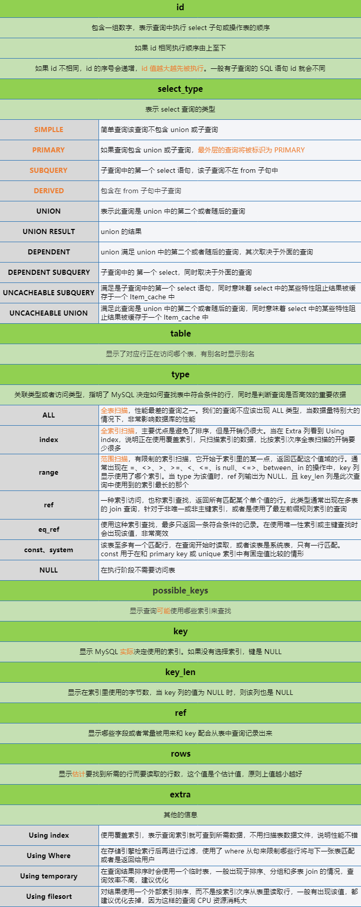

## 开始使用

### 启动、重启和关闭

```bash
# 启动
service mysql start

# 关闭
service mysql stop

# 重启
service mysql restart
```

### 连接 MySQL

```bash
# 可以省略空格
mysql -h [主机地址] -u [用户名] -p [密码]
```

### 修改密码

* 未登录 mysql

```bash
mysqladmin -u[用户名] -p password [新密码]
# 回车后输入原来的密码
```
* 登录 mysql

```mysql
USE mysql；
UPDATE user SET password = password('新密码') WHERE user = 'root';
FLUSH PRIVILEGES;
```

## 对数据库进行操作

```mysql
# 创建数据库
CREATE DATABASE [数据库名];

# 创建数据库并设置字符编码
CREATE DATABASE [数据库名] CHARACTER SET [字符编码];

# 修改数据库字符编码
ALTER DATABASE [数据库名] CHARACTER SET [字符编码];

# 显示所有的数据库
SHOW DATABASES;

# 显示数据库的定义信息
SHOW CREATE DATABASE [数据库名];

# 删除数据库
DROP DATABASE [数据库名];

# 查看当前使用的数据库
SELECT DATABASE();

# 切换数据库
USE [数据库名];
```

## 对表进行操作

```mysql
# 创建表
CREATE TABLE `user` (
	`id` INT (11) NOT NULL AUTO_INCREMENT,
	`name` VARCHAR (255) DEFAULT NULL,
	`age` INT (11) DEFAULT NULL,
	PRIMARY KEY (`id`)
) ENGINE = INNODB DEFAULT CHARSET = utf8;

# 命令解释如下 
CREATE TABLE `表名` (
	`字段名` [字段类型] [约束条件],
	...
	...
    # 设置主键
	PRIMARY KEY (`字段名`)
) ENGINE = [存储引擎] DEFAULT CHARSET = [字符编码];
```

```mysql
# 查看数据库中所有的表
SHOW TABLES;

# 查看系统支持的存储引擎
SHOW ENGINES；

# 查看表的字段信息
DESC [表名];

# 显示表的定义信息
SHOW CREATE TABLE [表名];

# 显示表中字段的定义信息
SHOW FULL COLUMNS FROM [表名];

# 添加字段和约束
ALTER TABLE [表名] ADD [字段名] [数据类型] [约束条件];

# 修改字段和约束
ALTER TABLE [表名] MODIFY [字段名] [数据类型] [约束条件];

# 修改表的存储引擎
ALTER TABLE [表名] ENGINE = [存储引擎];

# 修改表名
RENAME TABLE [表名] TO [新表名];

# 修改表的字符编码
ALTER TABLE [表名] CHARACTER SET [字符编码];

# 修改字段名
ALTER TABLE [表名] CHANGE [字段名] [新字段名] [数据类型];

# 删除字段
ALTER TABLE [表名] DROP [字段名];

# 删除表
ALTER TABLE [表名];

# 删除表数据，保留表结构
TRUNCATE TABLE [表名];
```

## 对字段进行操作

### 增删改

```mysql
# 插入数据
# 可以使用null插入空值，日期和字符要使用单引号
INSERT INTO [表名] (字段名) VALUES (值);
INSERT INTO [表名] VALUES (值);

# 删除数据
# 没有where条件会删除所有的数据
DELETE FROM [表名] WHERE [字段名] = [值];

# 修改数据
# 没有where条件会修改所有的数据
UPDATE [表名] SET [字段名] = [值] WHERE [字段名] = [值];
```

### 查

```mysql
# 查询数据
# 不建议使用*，因为会先将其编译成字段，然后再去查询，会影响一些性能，而且也不明确
SELECT [字段名] FROM [表名] WHERE [字段名] = [值];

# 在mysql中<>表示不等于，!=也表示不等于，两者的含义和使用方式是一样的
SELECT [字段名] FROM [表名] WHERE [字段名] != [值];
SELECT [字段名] FROM [表名] WHERE [字段名] <> [值];

# between...and...，按范围查找
SELECT [字段名] FROM [表名] WHERE id BETWEEN 1 AND 3;	# 包括1和3
SELECT [字段名] FROM [表名] WHERE id NOT BETWEEN 1 AND 3;	# 不包括1和3

# and的优先级大于or
# 如要查询name为user，id为1或2，错误写法为
SELECT [字段名] FROM [表名] WHERE name = 'user' AND id = 1 OR id = 2;
# 正确写法为
SELECT [字段名] FROM [表名] WHERE name = 'user' AND (id = 1 OR id = 2);

# in，表示只要满足其中一项条件即可，也可以采用or来表示，采用in会更简洁一些
# not in，则表示不满足其中任何一项，并且结果集不能有null，否则没有返回结果
SELECT [字段名] FROM [表名] WHERE id IN (1,2);

# is null，查询为空的数据
# is not null，查询不为空的数据
SELECT [字段名] FROM [表名] WHERE name IS NULL;

# order by，排序，可排序多个字段，默认为升序排列asc，降序排列使用desc
# 如存在where子句，order by必须放到where语句后面
SELECT [字段名] FROM [表名] ORDER BY [字段名] DESC;
```

### 模糊查询

```mysql
# like
# _表示匹配一个任意字符，%匹配任意个任意字符
SELECT [字段名] FROM [表名] WHERE name LIKE '_end';

# 更高效的模糊查询，可以使用索引
# locate，>0可以省略，=0表示不包括该条件的所有数据，<0结果为null
SELECT [字段名] FROM [表名] WHERE LOCATE('end',字段名) > 0;
# position
SELECT [字段名] FROM [表名] WHERE POSITION('end' in 字段名);
# instr，同locate
SELECT [字段名] FROM [表名] WHERE INSTR(字段名,'end') > 0;
```

### 处理函数

- 转换为小写：**`LOWER(字段名)`**
- 转换为大写：**`UPPER(字段名)`**
- 截取子串，下标从1开始：**`SUBSTR(字段名)`**
- 获取字段中值的长度：**`LENGTH(字段名)`**
- 空值处理：**`IFNULL(字段名)`**
  - 有 NULL 参与的运算结果都为 NULL ，建议先使用 IFNULL 函数处理，将 NULL 替换为 0 或别的值
- 去除首尾空格，MySQL 默认去除字段后面的空格：**`TRIM(字段名)`**
- 四舍五入：**`ROUND(字段名，保留的小数位数)`**
- 生成随机数：**`RAND()`**
  - 生成 0~100 随机数：**`ROUND(RAND()*100)`**
- 格式化日期，转换为字符串：**`DATE_FORMAT(日期类型数据,日期格式)`**
- 字符串转日期：**`STR_TO_DATE(日期字符串,日期格式)`**

### 聚合函数

聚合函数在计算时会 **自动忽略空值，不能直接写在where语句的后面。聚合函数可以一起使用**

- 求和：**`SUM(字段名)`**
- 取平均值：**`AVG(字段名)`**
- 取最大值，日期也可以进行比较：**`MAX(字段名)`**
  - 取最小值：**`MIN(字段名)`**
- 计算数据总数，不会统计数据为 NULL 的记录：**`COUNT(字段名)`**

### 去重

```mysql
# 去除重复记录，将查询结果中某一字段的重复记录去除掉
# 只能出现在所有字段最前面，后面如果有多个字段即为多字段联合去重
SELECT DESTINCT 字段名 FROM [表名];
```

### 分组

```mysql
# 在有group by的语句中，select语句后面只能跟聚合函数和参与分组的字段
# order by语句只能放在group by语句后面
# 如果想对分组的数据进行过滤，需要使用having子句。
# 能够在where后过滤的数据不要放到having中进行过滤，否则影响SQL询句的执行效率
SELECT [字段名] FROM [表名] GROUP BY id HAVING id != 1;
```

**where 和 having 区别**

* where 和 having 都是为了完成数据的过滤，它们后面都是添加条件

* where 是在 group by 之前完成过滤
* having 是在 group by 之后完成过滤

### 返回的记录的数目

```mysql
# limit子句可以获取前几条或中间某几行数据，下标从0开始
# 主要用来分页处理，limit关键字只在MySQL中起作用
SELECT [字段名] FROM [表名] LIMIT [起始下标],[截取长度];
# 如果只给定一个参数，表示返回最大的记录行数目
SELECT [字段名] FROM [表名] LIMIT [截取长度];
```

### 合并结果集

```mysql
# union操作符用于连接两个以上的select语句的结果组合到一个结果集合中。多个select语句会删除重复的数据
# 合并结果集时查询字段的个数必须一致，多个select语句会删除重复的数据
SELECT id FROM test
UNION
SELECT name FROM test
```

## select 语句执行顺序

1. from：将硬盘上的表文件加载到内存
2. where：将符合条件的数据筛选出来，生成一张新的临时表
3. group by：根据列中的数据种类，将当前临时表划分成若干个新的临时表
4. having：可以过滤掉 group by 生成的不符合条件的临时表
5. select：对当前临时表进行整列读取
6. order by：对 select 生成的临时表，进行重新排序，生成新的临时表
7. limit：对最终生成的临时表的数据行，进行截取

## explain 命令

用来分析 SQL 语句执行时是否高效，MySQL 5.6 之前只允许解释 select 语句，之后非 select 语句也可以被解释了

```mysql
EXPLAIN [SQL语句];
```

### 输出结果

输出的结果有 10 列：`id、select_type、table、type、possible_keys、key、key_len、ref、rows、Extra`



*更多：[面试前必须知道的 MySQL命令【explain】](https://segmentfault.com/a/1190000017278335)*

## 连接查询

在实际开发中，数据通常是存储在多张表中，这些表与表之间存在着关系，在检索数据的时候需要多张表联合起来检索，这种多表联合检索被称为连接查询。如果多表进行连接查询时没有任何条件，最终的结果会是多表结果数量的乘积

```mysql
# 内连接，inner可省略
SELECT a.name,b.name FROM atable a INNER JOIN btable b ON a.id = b.id

# 右连接，outer可省略
SELECT a.name,b.name FROM atable a RIGHT OUTER JOIN btable b ON a.id = b.id

# 左连接
SELECT a.name,b.name FROM atable a LEFT JOIN btable b ON a.id = b.id

# 也可以直接使用where语句进行查询
SELECT a.name,b.name FROM atable a,btable b WHERE a.id = b.id
```

**内连接与外连接的区别**

* 内连接：指连接结果仅包含符合连接条件的行，参与连接的两个表都应该符合连接条件
* 外连接：连接结果不仅包含符合连接条件的行同时也包含自身不符合条件的行。包括左外连接、右外连接和全外连接（MySQL 不支持）
  * 左外连接：左边表数据行全部保留，右边表保留符合连接条件的行
  * 右外连接：右边表数据行全部保留，左边表保留符合连接条件的行

## 子查询

select 语句嵌套 select 语句被称为子查询，select 子句可出现在 select（使用较少）、from、where 关键字后面

```mysql
# 以下命令只做参考，没有实际用途
# select后
SELECT
  id,
  (
	SELECT name
 	FROM other
 	WHERE id = 1
  ) name
FROM test

# from后
SELECT
  a.name,b.name
FROM
  test a,
  (SELECT name FROM other) b

# where后
SELECT
  id,name
FROM
  test
WHERE
  id IN (SELECT id FROM other)
```

### in 与 exists

exists 表示存在，常与子查询配合使用，会检查子查询是否至少会返回一行数据，子查询不返回任何数据，只返回 true 或 false 

* 当子查询返回为真时，外层查询语句将进行查询
* 当子查询返回为假时，外层查询语句将不进行查询或者查询不出任何记录

**外层查询表小于子查询表，则用 exists，外层查询表大于子查询表，则用 in**

```mysql
# in语句只会执行一次，会查出子句中的所有id字段并且缓存起来，之后，检查test表的id是否和子句中的id相当，如果相等则加入结果期，直到遍历完test的所有记录
SELECT
  id,name
FROM
  test
WHERE
  id IN (SELECT id FROM other)

# exists语句会执行test.length次，它不会去缓存exists的结果集
SELECT
  id,name
FROM
  test
WHERE
  EXISTS (SELECT id FROM other)
```

*更多：[在 MySQL里，有个和 in一样的东东叫做 exists，但是它比 in更牛叉，你会么](https://segmentfault.com/a/1190000008709410)*

## 条件控制

### if...then...else...end if

````mysql
CREATE PROCEDURE ifthen()
BEGIN
IF 1 > 3 THEN
	SELECT 'fuck';
ELSE
	SELECT 'shit';
END IF;
END
````

### if...then...elseif...then...end if

````mysql
CREATE PROCEDURE elseif()
BEGIN
	DECLARE a INT;	# 定义变量
	DECLARE b INT;
	SET a = 1;	# 赋值
	SET b = 2;
IF a > b THEN
	SELECT 'fuck';
ELSEIF a = b THEN
	SELECT 'damn';
ELSE
	SELECT 'shit';
END IF;
END
````

### case...when...then...end case

````mysql
CREATE PROCEDURE casewhen()
BEGIN
CASE number
WHEN 1 THEN
	SELECT 'fuck';
WHEN 2 THEN
	SELECT 'shit';
ELSE
	SELECT 'damn';
END CASE;
END
````

## 循环

### while...do...end while

```mysql
CREATE PROCEDURE ww()
BEGIN
DECLARE i int;
SET i = 0;
WHILE i < 10 DO
	INSERT INTO test VALUES(i);
	SET i = i + 1;
END WHILE;
END
```

### repeat...until...end repeat

```mysql
CREATE PROCEDURE pp()
BEGIN
DECLARE i INT;
SET i = 0;
REPEAT
	INSERT INTO test VALUES(i);
	SET i = i + 1;
UNTIL i > 10;
END repeat;
END
```

### loop...end loop

```mysql
CREATE PROCEDURE ll()
BEGIN
DECLARE i INT;
SET i = 0;
loop_lable:LOOP
	INSERT INTO test VALUES(i);
	SET i = i + 1;
	IF i >= 10 THEN
	LEAVE loop_lable;
	END IF;
END LOOP;
END
```
