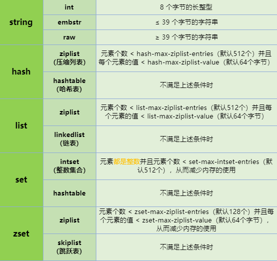
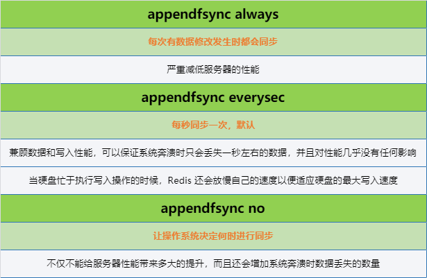
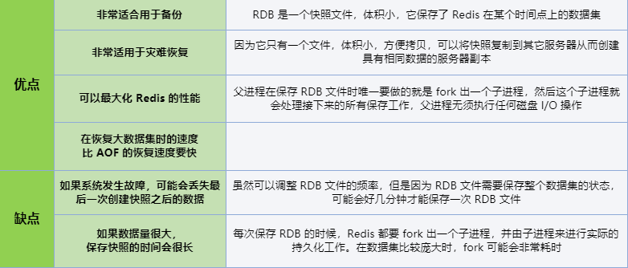
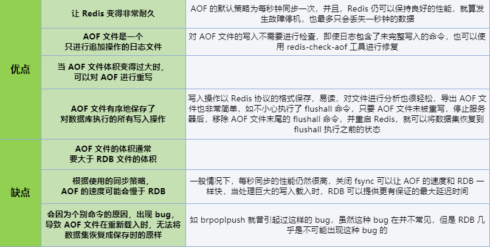

## Redis 概述

Redis 是完全开源免费的，遵守 BSD 协议，是一个 **高性能的键值数据库**，是当前最热门的 NoSQL 数据库之一，也被称为数据结构服务器

### Reids 主要的特性


### Redis 典型使用场景

缓存系统、计数器、消息队列系统、排行榜、社交网络、实时系统

### 为什么 Redis 处理速度这么快

- 绝大部分请求是 **纯粹的内存操作**
- 采用 **单线程**，避免了线程切换和竞争消耗
  - 单线程指的是网络请求模块使用了一个线程（所以不需考虑并发安全性），即一个线程处理所有网络请求，其他模块仍用了多个线程
  - 线程安全：Redis 实际上是采用了线程封闭的观念，把任务封闭在一个线程，自然避免了线程安全问题，不过对于需要依赖多个 Redis 操作的复合操作来说，依然需要锁，而且有可能是分布式锁
  - 一次最好只执行一条命令，不要使用长命令、慢命令
- **非阻塞 I/O**，Redis 使用 epoll 作为 **I/O 多路复用** 技术的实现，再加上 Redis 自身的事件处理模型将 epoll 中的连接、读写、关闭都转换为事件，不在网络 I/O 上浪费过多的时间

### 为什么要用缓存

* **高性能**：当用户第一次访问数据库中的某些数据，这个过程会比较慢，因为是从硬盘上读取的。将该用户访问的数据存在缓存中，这样下一次再访问这些数据的时候就可以直接从缓存中获取了。操作缓存就是直接操作内存，所以速度相当快。如果数据库中的对应数据改变的之后，同步改变缓存中相应的数据即可
* **高并发**：直接操作缓存能够承受的请求是远远大于直接访问数据库的，所以可以考虑把数据库中的部分数据转移到缓存中去，这样用户的一部分请求会直接到缓存这里而不用经过数据库

### 为什么要用 Redis 而不用 Map 做缓存

- Map 是 **本地缓存**，最主要的特点是轻量以及快速，如果有多台实例的话，**每个实例都需要各自保存一份缓存，缓存不具有一致性**。生命周期随着 JVM 的销毁而结束，而且 JVM 内存太大容易挂掉的，一般用做于容器来存储临时数据。Map 所存储的数据结构，缓存过期机制等需要程序员自己手写的
- Redis 是专业做缓存的，实现的是 **分布式缓存**，如果有多台实例的话，**每个实例都共享一份缓存，缓存具有一致性**。可以用几十个 G 内存来做缓存。Redis 一般用作于缓存，可以将缓存数据保存在硬盘中，Redis 重启了后可以将其恢复。原生提供丰富的数据结构、缓存过期机制等简单好用的功能。缺点是需要保持 Redis 服务的高可用，整个程序架构上较为复杂

### Redis 和 Memcached 的区别

|                            Redis                             |                          Memcached                           |
| :----------------------------------------------------------: | :----------------------------------------------------------: |
|                     支持更丰富的数据类型                     |                    支持文本型和二进制类型                    |
| **支持数据的持久化**，可以将内存中的数据保持在磁盘中，重启的时候可以再次加载进行使用 |                    把数据全部存在内存之中                    |
|                   原生支持 cluster 模式的                    | 没有原生的集群模式，需要依靠客户端来实现往集群中分片写入数据 |
|                 **单线程的多路 IO 复用模型**                 |             **多线程，非阻塞 IO 复用的网络模型**             |
|          提供了事务的功能，可以保证一串命令的原子性          |              提供了 cas 命令来保证数据的一致性               |

### Redis 可执行文件说明

|    可执行文件    |        说明        |
| :--------------: | :----------------: |
|   redis-server   |    Redis 服务器    |
|    redis-cli     | Redis 命令行客户端 |
| redis-benchmark  | Redis 性能测试工具 |
| redis-check-aof  |  AOF 文件检查工具  |
| redis-check-dump |  RDB 文件检查工具  |
|  redis-sentinel  |  Sentinel 服务器   |

### Redis 启动方式

* 最简启动（默认）：直接运行 **`redis-server`**
* 动态参数启动：**`redis-server --port 6380`**
* 配置文件启动，**生产环境推荐**：**`redis-server config/redis-6379.conf`**

### Redis 客户端连接

```bash
# 建立连接
$ redis-cli -h <address> -p <port>
# 使用密码登录
$ redis-cli -a <password>

# 使用默认方式建立连接
$ redis-cli
# 相当于
$ redis-cli -h 127.0.0.1 -p 6379

# 退出
$ exit

# 关闭
$ shutdown
```

### Redis 命令返回值

* **状态回复（status reply）**
  * 直接显示状态信息，如发送 `set` 命令设置某个键的值后，Redis 会回复 OK 表示成功；发送 `ping` 命令，Redis 会回复 PONG
* **错误回复（error reply）**
  * 当出现命令不存在或命令格式有错误等情况时，Redis 会返回错误回复。错误回复以 error 开头，并在后面跟上错误信息
* **整数回复（integer reply）**
  * Redis 虽然没有整数类型，但提供了一些用于整数操作的命令，如递增键值的 `incr` 命令会以整数形式返回递增后的增值。此外，一些其他命令也会返回整数。整数回复以 integer 开头，并在后面跟上整数数据
* **字符串回复（bulk reply）**
  * 最常见的一种回复类型，当请求一个字符串类型键的键值或者一个其他类型键中的某个元素时，就会得到一个字符串回复，字符串回复以双引号包裹
* **多行字符串回复（multi-bulk reply）**
  * 常见的一种回复类型，当请求一个非字符串类型键的元素列表时，就会收到多行字符串回复，多行字符串回复中的每行字符串都以一个序号开头

## 通用命令

```bash
# Redis命令大小写不敏感
# 查找所有符合给定模式pattern的key，一般不在生产环境使用，可能造成性能问题
$ keys [pattern]
# ?：匹配一个字符，*：匹配任意个字符，[]：匹配括号间的任一个字符，\：转义

# 返回当前数据库的key的数量
$ dbsize

# 检查给定key是否存在
$ exists <key>

# 删除指定的key
$ del <key>

# 设置key的生存时间，key过期后会被自动删除
$ expire <key> <seconds>

# 返回key的剩余生存时间，time to live
$ ttl <key>

# 移除key的过期时间
$ persist <key>

# 返回key所储存的值的类型，返回类型有string、hash、list、set、zset、none（key不存在）
$ type <key>

# 将key改名为newkey
$ rename <key> <newkey>

# 随机返回一个key
$ randomkey

# 清除数据库
$ flushall
```

* 以上命令时间复杂度
  * **`keys`**：O(N)
  * **`del`**
    * 删除单个字符串类型的 key ，时间复杂度为 O(1)
    * 删除单个列表、集合、有序集合或哈希表类型的 key ，时间复杂度为 O(N)
  * 其他：O(1)

## 内部编码

**`type <key>`** 命令实际返回的就是当前键的数据结构类型，但这些只是 Redis 对外的数据结构。实际上每种数据结构都有自己底层的内部编码实现，**每种数据结构都有两种以上的内部编码实现**，这样 Redis 会根据当前值的类型和长度决定使用内部编码实现，**有些内部编码可以作为多种外部数据结构的内部实现**。可以使用 **`object encoding <key>`** 命令查询内部编码

### 使用内部编码的好处

- 可以改进内部编码，而对外的数据结构和命令没有影响，这样一旦开发开发出优秀的内部编码，无需改动外部数据结构和命令
- 多种内部编码实现可以在不同场景下发挥各自的优势

### 五种数据结构的内部编码方式



* ziplist 使用更加紧凑的结构实现多个元素的连续存储，在节省内存方面更加优秀，**但当元素过多或过大时，读写效率会下降**

*更多：[Redis的五种数据结构的内部编码](https://www.cnblogs.com/yangmingxianshen/p/8054094.html)*

## 数据结构

### 字符串

Redis 中 **所有的 key 都是字符串**。字符串的值不仅可以是字符串，也可以是数字。**最大不能超过 512M**

#### 使用场景

- 缓存功能：字符串最经典的使用场景，Redis 作为缓存层，MySQL 作为储存层，绝大部分请求数据都是从 Redis 中获取，由于 Redis 具有支撑高并发特性，所以缓存通常能起到加速读写和降低后端压力的作用
- 计数器：许多应用都会使用 Redis 作为计数的基础工具，可以实现快速计数、查询缓存的功能，同时数据可以一步落地到其他的数据源。如：视频播放数、粉丝数等
- 共享 Session：出于负载均衡的考虑，分布式服务会将用户信息的访问均衡到不同服务器上，用户刷新一次访问可能会需要重新登录，为避免这个问题可以用 Redis 将用户 Session 集中管理，在这种模式下只要保证 Redis 的高可用和扩展性，每次获取用户更新或查询登录信息都直接从 Redis 中集中获取
- 限速：处于安全考虑，每次进行登录时让用户输入手机验证码，为了短信接口不被频繁访问，会限制用户每分钟获取验证码的频率

#### 常用命令

* 时间复杂度：O(1)

```bash
# 为key赋值，如果key已经存储其他值，就覆写旧值，无视类型
$ set <key> <value>
# 为 key 赋值，并设定生存时间，原子操作
$ set <key> <value> ex <seconds>/<milliseconds>
# 只在key不存在时，为key赋值
$ set <key> <value> nx
# 只在key已经存在时，为key赋值
$ set <key> <value> xx
# 因为set命令可以通过参数来实现和setnx 、setex、psetex三个命令的效果
# 将来的Redis版本可能会废弃并最终移除setnx、setex、psetex三个命令

# 获取指定key的值
$ get <key>

# 为key赋值，并返回key的旧值
$ getset <key> <value>

# 为key追加值，如果key不存在，就将给定的key赋值为value
$ append <key> <value>

# 获取key所储存的字符串的长度，注意中文占两个字节
$ strlen <key>

# 将key中储存的数字增1，如果key不存在，那么key的值会被初始化为0，再执行操作
# 这是一个针对字符串的操作，因为Redis没有专用的整数类型
# 所以key内储存的字符串被解释为十进制64位有符号整数来执行操作
$ incr <key>
# 将key中储存的数字加上指定的增量值，可以为负值，同上
$ incrby <key> <increment>
# 将key中储存的数字加上指定的浮点数增量值，同上
$ incrbyfloat <key> <increment>
# 将key中储存的数字减1，同上
$ decr <key>
# 将key中储存的数字减去指定的减量值，同上
$ decrby <key> <decrement>
# 没有decrbyfloat命令
```

* 时间复杂度：O(N)

``` bash
# 同时设置多个key-value对，原子操作，总是返回OK，该命令不可能失败
$ mset <key> <value>

# 同时设置多个key-value对，当且仅当所有给定key都不存在，原子操作
$ msetnx <key> <value>

# 返回所有给定key的值，该命令不可能失败
$ mget <key>

# 获取key中字符串的截取的字符串
# 字符串的截取范围由start和end两个偏移量决定，包括start和end在内
# 负数偏移量表示从字符串最后开始计数，-1表示最后一个字符，-2表示倒数第二个，以此类推
$ getrange <key> <start> <end>
```

### 哈希

Hash 是一个 String 类型的 field 和 value 的映射表，field 不能相同，value 可以相同，Hash 特别适合用于存储对象，后续操作时，可以直接修改这个对象中的某个字段的值

#### 使用场景

哈希结构相对于字符串序列化缓存信息更加直观，在更新操作上更加便捷。所以常用于存储用户信息，商品信息等

#### 常用命令

* 时间复杂度：O(1)

```bash
# 为哈希表中的字段赋值，如果key已经存储其他值，就覆写旧值，无视类型
$ hset <key> <field> <value>

# 为哈希表中的字段赋值，当且仅当给定的字段不存在
$ hsetnx <key> <field> <value>

# 返回哈希表中字段的值
$ hget <key> <field>

# 查看哈希表的指定字段是否存在
$ hexists <key> <field>

# 返回哈希表中字段的数量
$ hlen <key>

# 为哈希表中的字段值加上指定增量值，同incrby
$ hincrby <key> <field> <increment>

# 为哈希表中的字段值加上指定浮点数增量值，同incrbyfloat
$ hincrbyfloat <key> <field> <increment>
```

* 时间复杂度：O(N)

```bash
# 删除哈希表中的字段
$ hdel <key> <field>

# 同时将多个field-value对设置到哈希表中
$ hmset <key> <field> <value>

# 返回哈希表中字段的值
$ hmget <key> <field>

# 返回哈希表中所有的字段和值
$ hgetall <key>

# 返回哈希表中的所有的字段
$ hkeys <key>

# 返回哈希表所有字段的值
$ hvals <key>
```

### 列表

列表类型是用来储存多个有序的字符串，列表中的每个字符串称为元素（element），元素是 **有序的、可重复的**。列表的应用场景非常多，也是 Redis 最重要的数据结构之一，列表的实现为一个 **双向链表**，方便操作，不过也带来额外的内存开销

#### 使用场景

列表不但有序，同时支持按照索引范围获取元素，微博的关注列表，粉丝列表，消息列表等功能都可以用列表结构来实现。另外可以通过 lrange 命令，可以实现简单的高性能分页，可以做类似微博那种下拉不断分页的东西

- lpush + lpop = Stack（栈）
- lpush + rpop = Queue（队列）
- lpush + ltrim = Capped Collection（有限集合）
- lpush + brpop = Message Queue（消息队列）

#### 常用命令

* 时间复杂度：O(1)

```bash
# 将值插入到表头（最左边）
$ lpush <key> <value>

# 将值插入到表头，如果key不存在，不会执行操作
$ lpushx <key> <value>

# 移除并返回列表的头元素
$ lpop <key> <value>

# 对表尾（最右边）进行以上操作
rpush、rpushx、rpop

# 返回列表的长度
$ llen <key>

# 移出并获取列表的第一个元素
# lpop的阻塞版本，如果列表没有元素，会阻塞列表直到等待超时或发现可弹出元素为止
# timeout是阻塞超时时间，timeout为0表示永不阻塞
$ blpop <key> ... <timeout>
# 移出并获取列表的最后一个元素，同上
$ brpop <key> ... <timeout>
```

* 时间复杂度：O(N)

```bash
# 在列表的元素前或者后插入元素
$ linsert <key> before/after value newvalue

# 根据参数count的值，移除列表中与参数value相等的元素
# count>0：从左到右，移除count个与value相等的元素
# count<0：从右到左，移除count个与value相等的元素
# count=0：移除表中所有与value相等的值
$ lrem <key> <count> <value>

# 返回列表中指定区间内的元素
# 截取范围由start和end两个偏移量决定，包括start和end在内
$ lrange <key> <start> <end>

# 对一个列表进行修剪，只保留指定区间内的元素，不在指定区间之内的元素都将被删除
$ ltrim <key> <start> <end>
```

* 对头元素或尾元素进行操作，时间复杂度为 O(1)；其他情况下，为 O(N)

```bash
# 通过索引设置元素的值
$ lset <key> <index> <value>

# 通过索引获取列表中的元素
# 可以使用负数下标，-1表示最后一个元素，-2表示倒数第二个，以此类推
$ lindex <key> <index>
```

### 集合

集合提供的功能与列表类似，特殊之处在于集合是可以 **自动排重** 的并且是 **无序** 的，不能通过索引下标获取元素，Redis 除了支持集合内的增删改查，同时还 **支持集合间操作**，取交集、并集、差集

#### 使用场景

比较典型的使用场景就是标签，如一个用户对娱乐、体育比较感兴趣，另一个可能对新闻感兴趣，这些兴趣就是标签，有了这些数据就可以得到同一标签的人，以及用户的共同爱好的标签，这些数据对于用户体验以及曾强用户粘度比较重要。用户和标签的关系维护应该放在一个事物内执行，防止部分命令失败造成数据不一致

在微博应用中，可以将一个用户所有的关注人存在一个集合中，将其所有粉丝存在一个集合。Redis 可以非常方便的实现如共同关注、共同粉丝、共同喜好等功能

- sadd = tagging（标签）
- spop / srandmember = random item（生成随机数，比如抽奖）
- sadd + sinter = social Graph（社交需求）

#### 常用命令

* 时间复杂度：O(1)

```bash
# 返回集合中元素的数量
$ scard <key>

# 判断元素是否是集合的成员
$ sismember <key> <member>

# 随机移除集合中元素
$ spop <key>
```

* 时间复杂度：O(N)

```bash
# 将元素加入到集合中
$ sadd <key> <member>

# 移除集合中的元素
$ srem <key> <member>

# 返回集合中的所有的成员
$ smembers <key>
```

* 如果提供了 count 参数，时间复杂度为 O(N)，其他情况下，为 O(1)

```bash
# 随机返回集合中的元素
$ srandmember <key> <count>
# 如果count为正数，且小于集合基数
# 返回一个包含count个元素的数组，数组中的元素各不相同；如果count大于等于集合基数，返回整个集合
# 如果count为负数，返回一个数组，数组中的元素可能会重复出现多次，而数组的长度为 count 的绝对值
```

* 集合间操作
  * `sinter` 和 `sinterstore` 的时间复杂度为 O(N * M)，N 为给定集合当中基数最小的集合，M 为给定集合的个数，其他所有命令的时间复杂度都为 O(N)

```bash
# 返回给定集合之间的差集/并集/交集
sdiff/sunion/sinter <key> ...

# 将给定集合之间的差集/并集/交集存储在指定的集合destkey中
sdiffstore/sunionstore/sinterstore <destkey> <key> ...
```

### 有序集合

和集合相比，有序集合增加了一个权重参数 score，使得集合中的元素能够按 score 进行有序排列。score 可重复，element 不可重复

#### 使用场景

- 排行榜：有序集合经典使用场景。例如视频网站需要对用户上传的视频做排行榜，榜单维护可能是多方面：按照时间、按照播放量、按照获得的赞数等
- 在直播系统中，实时排行信息包含直播间在线用户列表，各种礼物排行榜，弹幕消息等信息，适合使用有序集合结构进行存储

#### 常用命令

* 时间复杂度：O(1)

```bash
# 返回有序集合中元素的数量
$ zcard <key>

# 返回有序集合中成员的分数值
$ zscore <key>
```

* 时间复杂度：O(logN)

```bash
# 将成员元素及其分数值加入到有序集当中
$ zadd <key> <score> <member> ...

# 移除有序集合中的元素
$ zrem <key> <member> ...

# 返回有序集合中成员的排名，按分数值递增顺序排列
$ zrank <key> <member>
# 返回有序集合中成员的排名，按分数值递减顺序排列
$ zrevrank <key> <member>

# 为有序集合中的成员加上指定增量值
$ zincrby <key> <increment> <member>

# 返回有序集合中指定成员的排名，按分数值递增顺序排列
$ zrank <key> <member>
# 返回有序集合中指定成员的排名，按分数值递减顺序排列
$ zrevrank <key> <member>
```

* 时间复杂度：O(log(N) + M)，N 为有序集的基数，M 为结果集的基数

```bash
# 返回有序集合中指定分数区间的成员数量，范围包括min和max
$ zcount <key> <min> <max>

# 返回有序集合中指定区间的成员，按分数值递增顺序排列，分数相同按字典顺序排列，下同
# 使用withscores将成员的分数一并返回，下同
$ zrange <key> <start> <end> [withscores]

# 返回有序集合中指定区间的成员，按分数值递减顺序排列
$ zrevrange <key> <start> <end> [withscores]

# 返回有序集合中指定分数区间的成员，按分数值递增顺序排列
# limit为指定返回结果的数量及区间，limit offset count
$ zrangebyscore <key> <min> <max> [withscores] [limit]

# 移除有序集合中指定排名区间内的所有成员
$ zremrangebyrank <key> <start> <end>

# 移除有序集合中指定分数区间内的所有成员
$ zremrangebyscore <key> <min> <max>
```

## 键的过期时间

Redis 是基于内存，而内存又是有限的。所以经常会清除不常用的数据，保留常用的数据。按照传统的数据库处理方式，一般都是自己判断过期，这样无疑会严重影响项目性能，这就需要设置一下键的过期时间了

* 对于散列表这种容器，只能为整个键设置过期时间，而不能为键里面的单个元素设置过期时间

### 删除策略

- **定时删除（对内存友好，对 CPU 不友好）**
  - 到时间就把所有过期的键都删除
- **定期删除（折中）**
  - 每隔一段时间（Redis 默认100ms），**随机抽取** 一些设置了过期时间的 key，检查其是否过期，如果过期就删除。之所以要随机抽取，是因为 Redis 如果存了几十万个 key ，每隔 100ms 就遍历所有的设置过期时间的 key 的话，就会给 CPU 带来很大的负载
- **惰性删除（对 CPU 极度友好，对内存极度不友好）**
  - 定期删除可能会导致很多过期 key 到了时间并没有被删除掉，还停留在内存里，只有去查一下那个 key 时，才会被 Redis 给删除掉

Redis 采用的是 **惰性删除 + 定期删除** 策略，即在 Redis 中如果键到了过期时间，**不一定会被马上删除**

### 内存淘汰机制

如果定期删除漏掉了很多过期 key，然后也没有及时去查（惰性删除），大量的过期 key 堆积在内存里，会导致 Redis 内存块耗尽

可以设置内存最大使用量（在 redis.conf 中设置 **`maxmemory <bytes>`**），当内存使用量超出时，会施行数据淘汰策略。作为内存数据库，出于对性能和内存消耗的考虑，Redis 的淘汰算法实际实现上并非针对所有 key，而是抽样一小部分并且从中选出被淘汰的 key，抽样数量可通过 **`maxmemory-samples`** 配置

使用 Redis 缓存数据时，为了 **提高缓存命中率**，需要保证缓存数据都是热点数据。可以将内存最大使用量设置为热点数据占用的内存量，然后启用 allkeys-lru 淘汰策略，将最近最少使用的数据淘汰。更改淘汰策略可修改配置文件 maxmemory-policy

#### Redis 提供的六种数据淘汰策略

|      策略       |                             描述                             |
| :-------------: | :----------------------------------------------------------: |
|  volatile-lru   |     从已设置过期时间的数据集中挑选最近最少使用的数据淘汰     |
|  volatile-ttl   |       从已设置过期时间的数据集中挑选将要过期的数据淘汰       |
| volatile-random |          从已设置过期时间的数据集中任意选择数据淘汰          |
| **allkeys-lru** | **当内存不足以容纳新写入数据时，在键空间中，移除最近最少使用的 key，常用** |
| allkeys-random  |                  从数据集中任意选择数据淘汰                  |
|   no-eviction   | 禁止驱逐数据，当内存不足以容纳新写入数据时，新写入操作会报错 |

Redis 4.0 引入了 volatile-lfu 和 allkeys-lfu 淘汰策略，LFU 策略通过统计访问频率，将访问频率最少的键值对淘汰

## Redis 持久化

Redis 是基于内存的，如果没有进行持久化操作，一旦 Redis 重启或者发生故障，内存里的数据将会全部丢失

### 持久化方法

- RDB：snapshotting，将某一时刻的所有数据保存到一个 RDB 文件中
- AOF：append-only-file，当 Redis 服务器执行写命令的时候，将执行的写命令保存到 AOF 文件中

### RDB

通过创建快照把某个时间点的所有数据都存放到硬盘上，生成的 RDB 文件是一个 **经过压缩的二进制文件**。Redis 服务器启动时，如果发现有 RDB 文件，就会 **自动载入RDB** 文件，在载入期间服务器会处于阻塞状态，直到载入工作完成

#### 生成 RDB 文件

* **`save`**：会 **阻塞 Redis 服务器进程**，服务器不能接收任何请求，直到 RDB 文件创建完毕为止
  * 执行成功返回 OK
  * 当 Redis 接收到关闭服务器的请求 `shutdown`，会执行一个 `save` 命令，在命令执行完毕后关闭服务器

- **`bgsave`**：创建出一个子进程，由子进程来负责创建 RDB 文件，服务器进程可以继续接收请求，常用
  - 可以通过 **`lastsave`** 命令查看是否执行成功

* 自动生成

```bash
save 900 1			# 在900秒之后，至少有1个key发生变化
save 300 10			# 在300秒之后，至少有10个key发生变化
save 60  10000		# 在60秒之后，至少有10000个key发生变化

# 满足以上任一条件，就会自动触发bgsave命令，一般不使用自动配置
# 因为Redis每个时段的读写请求肯定不是均衡的，为了平衡性能与数据安全，所以需要配置多条规则触发备份
```

#### RDB 的工作机制

当 Redis 执行 **`bgsave`** 命令时，服务器执行以下操作

1. Redis 调用 fork() ，同时拥有父进程和子进程
2. 子进程将数据集写入到一个临时 RDB 文件中
3. 当子进程完成对新 RDB 文件的写入时，用新 RDB 文件覆盖旧的 RDB 文件

这种工作方式使得 Redis 可以从写时复制（copy-on-write）机制中获益

至于 `save` 命令，一般不会去使用，会阻塞 Redis 服务器进程，它的工作流程就是上面没有子进程的工作流程

### AOF

保存 Redis 服务器所执行的写命令来记录数据库的数据。与快照持久化相比，AOF 持久化的实时性更好，因此是目前主流的持久化方案

Redis 默认是没有开启 AOF 的，可以通过修改配置文件 **`appendonly yes`** 开启。开启 AOF 持久化后每执行一条会更改的数据的命令，这个命令就会被追加到 AOF 文件的末尾

#### 三种同步策略

在配置文件中修改，命令会写入到缓冲区，同步缓冲区数据到硬盘中



#### AOF 的工作机制

1. 命令写入
2. 追加到 aof_buf 缓冲区
3. 调用 flushAppendOnlyFile 函数，考虑是否要将缓冲区写入 AOF 文件中

为什么要先写入缓冲区在同步到磁盘呢？如果实时写入磁盘会带来非常高的磁盘 IO，影响整体性能

#### 如果 AOF 文件出错了，怎么办

服务器可能在程序正在对 AOF 文件进行写入时停机，如果停机造成了 AOF 文件出错，那么 Redis 在重启时会拒绝载入这个 AOF 文件，从而确保数据的一致性

当发生这种情况时， 可以用以下方法来修复出错的 AOF 文件

1. 为现有的 AOF 文件创建一个备份
2. 使用 Redis 附带的 redis-check-aof 程序，对原来的 AOF 文件进行修复

```bash
$ redis-check-aof --fix
```

3. （可选）使用 **`diff -u`** 对比修复后的 AOF 文件和原始 AOF 文件的备份，查看两个文件之间的不同之处
4. 重启 Redis 服务器，等待服务器载入修复后的 AOF 文件，并进行数据恢复

#### AOF 重写

**随着服务器写请求的增多，AOF 文件会越来越大**，体积不断增大的 AOF 文件很可能会用完硬盘空间，而且还原操作执行时间可能会非常长

为了处理这种情况，Redis 支持一种有趣的特性：可以在不打断服务客户端的情况下，对 AOF 文件进行重写，去除 AOF 文件中的冗余命令。该功能是通过读取数据库中的键值对来实现的，程序无须对现有 AOF 文件进行任何读入、分析或者写入操作

整个重写操作是绝对安全的，因为 Redis 在创建新 AOF 文件的过程中，会继续将命令追加到现有的 AOF 文件里面，即使重写过程中发生停机，现有的 AOF 文件也不会丢失。 而一旦新 AOF 文件创建完毕，Redis 就会从旧 AOF 文件切换到新 AOF 文件，并开始对新 AOF 文件进行追加操作

#### 如何进行 AOF 重写

用户可以向 Redis 发送 **`bgrewriteaof`** 命令来进行重写，与创建快照命令 `bgsave` 的原理相似，AOF 文件重写也需要用到子进程，可能会导致性能问题。也可以通过修改配置文件进行重写

```
auto-aof-rewrite-percentage	100
auto-aof-rewrite-min-size 64mb
```

当 AOF 文件体积大于 64MB，并且 AOF 的体积比上一次重写之后的体积增长了 100% 时，Redis 就会自动执行 `bgrewriteaof` 命令，记住 **两个配置项要同时满足**

#### AOF 重写的工作机制

AOF 重写和 RDB 创建快照一样，都巧妙地利用了写时复制机制

以下是 AOF 重写的执行步骤

1. Redis 调用 fork() ，同时拥有父进程和子进程
2. 子进程将新 AOF 文件的内容写入到临时文件
3. 新执行的写入命令，父进程一边将它们累积到一个内存缓存中，一边将这些改动追加到现有 AOF 文件的末尾。这样做即使在重写的中途发生停机，现有的 AOF 文件也还是安全的
4. 当子进程完成重写工作时，它给父进程发送一个信号，父进程在接收到信号之后，将内存缓存中的所有数据追加到新 AOF 文件的末尾
5. Redis 原子地用新文件替换旧文件，之后所有命令都会直接追加到新 AOF 文件的末尾

### RDB 和 AOF 的选择

最好是同时使用两种持久化功能，服务器会 **优先使用 AOF 文件** 来还原数据。如果可以承受数分钟以内的数据丢失，可以只使用 RDB 持久化。有很多用户都只使用 AOF 持久化，但并不推荐这种方式：因为定时生成 RDB 快照非常便于进行数据库备份，并且 RDB 恢复数据集的速度更快，还可以避免之前提到的 AOF 程序的 bug

#### RDB 的优缺点



#### AOF 的优缺点



### 过期键

- RDB 文件不会保留已过期的键，载入 RDB 文件时，过期的键会被忽略
- AOF 文件则会保留未被删除的过期键，当过期的键被删除了以后，会 **追加一条 del 命令** 来显示记录该键被删除了，重写 AOF 文件时，过期的键会被忽略

### 从 RDB 持久化切换到 AOF 持久化

从 Redis 2.2 开始，可以在不重启的情况下，从 RDB 切换到 AOF

1. 为最新的 RDB 文件创建一个备份
2. 将备份放到一个安全的地方
3. 执行以下两条命令

```bash
# 开启AOF功能，Redis会阻塞直到初始AOF文件创建完成为止
# 之后Redis会继续处理命令请求，并开始将写入命令追加到AOF文件末尾
$ config set appendonly yes

# 关闭RDB功能，这一步是可选的，如果愿意的话，可以同时使用RDB和AOF两种持久化功能
$ config set save ""
```

- 确保命令执行之后，数据库的键的数量没有改变
- 确保写命令会被正确地追加到 AOF 文件的末尾
- 注意要在配置文件中打开 AOF 功能，否则，服务器重启之后，之前通过 `config set` 设置的配置就会被遗忘，程序会按原来的配置来启动服务器

### RDB 和 AOF 之间的相互作用

从 Redis 2.4 开始，`bgsave` 和 `bgrewriteaof` 不可以同时执行。这可以防止两个的后台进程同时对磁盘进行大量的 I/O 操作

如果 `bgsave` 正在执行，用户显式地调用 `bgrewriteaof` 命令，服务器会向用户回复一个 OK 状态，并告知用户，`bgrewriteaof` 已经被预定执行，当 `bgsave` 执行完毕 `bgrewriteaof` 才会开始执行

Redis 4.0 开始支持 RDB 和 AOF 的混合持久化，**默认关闭**，可以通过修改配置文件 **`aof-use-rdb-preamble yes`** 开启

- 当 Redis 重启时，优先使用 AOF 文件还原数据集，因为 AOF 文件保存的数据集通常是最完整的
- AOF 重写的时候会直接把 RDB 的内容写到 AOF 文件开头。这样就可以结合 RDB 和 AOF 的优点，快速加载同时避免丢失过多的数据。缺点是 AOF 里面的 RDB 部分是压缩格式，不再是 AOF 格式，可读性较差

### 配置文件

#### RDB 配置

```bash
# RDB的触发条件
save 900 1
save 300 10
save 60 10000
# save ""		---关闭RDB，在save命令的下方加上即可

# RDB文件名称
dbfilename dump-6379.rdb

# RDB和AOF文件的保存路径
dir /usr/local/redis/data/

# 如果持久化出错，主进程是否停止写入，保护持久化的数据一致性
stop-writes-on-bgsave-error yes

# 是否压缩
rdbcompression yes

# 是否需要校验
rdbchecksum yes
```

#### AOF 配置

```bash
# 是否开启AOF
appendonly yes

# AOF文件名称
appendfilename "appendonly-6379.aof"

# 同步方式
appendfsync everysec

# AOF重写期间进行同步
no-appendfsync-on-rewrite no

# 重写触发条件
auto-aof-rewrite-percentage 100
auto-aof-rewrite-min-size 64mb

# 加载AOF文件，如果发现末尾命令不完整则自动截掉，加载前面正确的数据
# 设置为no，发现错误就会停止，修复后才能重新加载
aof-load-truncated yes

# 文件重写策略
aof-rewrite-incremental-fsync yes
```

*更多：[一起看懂 Redis两种持久化方式的原理](https://segmentfault.com/a/1190000015983518)*

## 缓存问题

### 缓存雪崩

缓存在同一时刻大面积的失效，会有大量的请求进来直接走数据库，结果就是数据库撑不住，导致整个服务瘫痪

#### 解决方法

- Redis 挂掉了，请求全部走数据库
  - 事发前：实现 Redis 的 **高可用** （主从架构 + Sentinel 或者 Redis Cluster），尽量避免 Redis 挂掉情况的发生
  - 事发中：如果 Redis 挂了，可以设置 **本地缓存（ehcache）+ 限流（hystrix）**，尽量避免数据库被干掉，起码能保证服务能正常工作
  - 事发后：Redis 持久化，重启后自动从磁盘上加载数据，**快速恢复缓存数据**
- 对缓存数据设置相同的过期时间，导致某段时间内缓存失效，请求全部走数据库
  - 在缓存的时候给过期时间加上一个 **随机值**，这样就会大幅度的 **减少缓存在同一时间过期**

### 缓存穿透

查询一个 **一定不存在的数据**，由于缓存不命中，并且出于容错考虑，如果从 **数据库查不到数据则不写入缓存**，这将导致这个不存在的数据 **每次请求都要到数据库去查询**，失去了缓存的意义。一定量的次数后，数据库服务器必然承受不住，宕机崩溃

#### 解决方法

- 由于请求的参数是不合法的（每次都请求不存在的参数），可以使用布隆过滤器（BloomFilter）或者压缩 filter **提前拦截**，不合法就不让这个请求到数据库层
- 如果出现访问数据库中不存在的 key，数据库返回一个 null 值，然后把这个空结果存储在缓存中，并设置其过期时间极短，后面再出现查询这个 key 的请求的时候，直接返回 null

### 缓存击穿

缓存中没有但数据库中有的数据，比如某一个热点数据，大量用户同时并发请求这个 key，此时这个 key 正好失效，就会造成大量请求读缓存没读到数据，又同时去数据库去取数据，高并发下大量访问数据库，引起数据库压力瞬间增大，造成过大压力

#### 解决方法

可以在第一个线程查询数据的请求上使用一个互斥锁来锁住它，即在访问 key 之前，采用 SETNX（set if not exists）来使用一个短期锁锁住当前 key 的访问，查询结束后做缓存，再删除该短期 key。只有得到锁了的请求，才能去请求数据库，没得到锁，则休眠一段时间重试，后面来的线程进来发现已经有缓存了，接直接走缓存

### 热点数据集中失效问题

当为一些数据设置缓存的时候，如果采用相同的过期时间，当达到一个过期时间临界点的时候，大部分缓存过期，这时候如果一个高并发量的访问过来，就会同时访问数据库，造成数据压力大或者崩溃

#### 解决方法

* 热点数据缓存永远不过期
* 可以在原有的失效时间的基础上，加上以个随机值，1-5 分钟，这样就可以防止同时过期，造成大量数据库的访问
* 互斥锁在缓存失效后，通过加锁或者队列来控制读数据库写缓存的线程数量。比如对某个 key 只允许一个线程查询数据库和写缓存，其他线程都会被阻塞等待，知道锁被释放。但是由于它会阻塞其他的线程，此时系统吞吐量会下降。需要结合实际的业务去考虑是否要这么做

## 缓存与数据库双写一致性

如果仅仅查询的话，缓存的数据和数据库的数据是没问题的。但当需要 **更新** 时候呢各种情况很可能就 **造成数据库和缓存的数据不一致**

* 读操作
  * 如果需要的数据在缓存里边有，那么就直接取缓存的
  * 如果缓存里没有想要的数据，会先去查询数据库，然后 **将数据库查出来的数据写到缓存中**
  * 最后将数据返回给请求

从理论上说，只要给缓存 **设置过期时间**，就能保证缓存和数据库的数据 **最终是一致的**。因为缓存数据过期了，就会被删除。随后读的时候，因为缓存里没有，就可以查数据库的数据，然后将数据库查出来的数据写入到缓存中

### 操作缓存

- 更新缓存
- 删除缓存：一般采用该策略
  - 高并发环境下，无论是先操作数据库还是后操作数据库而言，如果加上更新缓存，那就 **更加容易** 导致数据库与缓存数据不一致问题（删除缓存 **直接和简单** 很多）
  - 如果每次更新了数据库，都要更新缓存（这里指的是频繁更新的场景，这会耗费一定的性能），倒不如直接删除掉。等再次读取时，缓存里没有，再去数据库找，在数据库找到再写到缓存里边（体现 **懒加载**）

### 先更新数据库，再删除缓存

如果原子性被破坏了

- 操作数据库成功，删除缓存失败，会导致 **数据库里是新数据，而缓存里是旧数据**
- 如果操作数据库失败了，我们可以直接返回错误（Exception），不会出现数据不一致

如果在高并发的场景下，出现数据库与缓存数据不一致的 **概率特别低**，但也不是没有

- 缓存 **刚好** 失效
- 线程 A 查询数据库，得一个旧值
- 线程 B 将新值写入数据库
- 线程 B 删除缓存
- 线程 A 将查到的旧值写入缓存

因为这个条件需要发生在读缓存时缓存失效，而且并发着有一个写操作。而实际上数据库的写操作会比读操作慢得多，而且还要锁表，**而读操作必需在写操作前进入数据库操作，而又要晚于写操作更新缓存**，所有的这些条件都具备的概率基本并不大

#### 删除缓存失败的解决思路

- 将需要删除的 key 发送到消息队列中
- 自己消费消息，获得需要删除的 key
- **不断重试删除操作，直到成功**

### 先删除缓存，再更新数据库

如果原子性被破坏了

- 删除缓存成功，操作数据库失败，数据库和缓存的数据还是一致的
- 如果操作数据库失败了，可以直接返回错误（Exception），不会出现数据不一致

高并发的场景下，出现数据库与缓存数据不一致的情况

- 线程 A 删除了缓存
- 线程 B 查询，发现缓存已不存在
- 线程 B 去数据库查询得到旧值
- 线程 B 将旧值写入缓存
- 线程 A 将新值写入数据库

#### 并发下解决数据库与缓存不一致的思路

- 将删除缓存、修改数据库、读取缓存等的操作积压到 **队列** 里边，实现 **串行化**

### 两种策略对比

- 先删除缓存，再更新数据库
  - 在高并发下表现不如意，在原子性被破坏时表现优异
- 先更新数据库，再删除缓存
  - 在高并发下表现优异，在原子性被破坏时表现不如意

*更多：[ 缓存雪崩、缓存穿透、缓存更新了解多少？](https://segmentfault.com/a/1190000017882763)*

## 更多

- [Redis命令参考及中文文档](http://doc.redisfans.com/index.html)
- [Redis命令参考](http://redisdoc.com/)
- [官方文档](https://redis.io/documentation)
- [Redis和MongoDB的区别](https://www.cnblogs.com/java-spring/p/9488227.html)
- [JavaGuide/Redis.md](https://github.com/Snailclimb/JavaGuide/blob/master/docs/database/Redis/Redis.md)
- [Interview-Notebook/Redis.md](https://github.com/jianghui-galaxy/Interview-Notebook/blob/master/notes/Redis.md)
- [CS-Notes/Redis.md](https://github.com/CyC2018/CS-Notes/blob/master/docs/notes/Redis.md)
- [3y/Redis.md](https://github.com/ZhongFuCheng3y/3y/blob/master/src/redis.md)