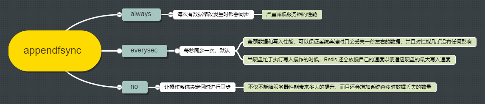
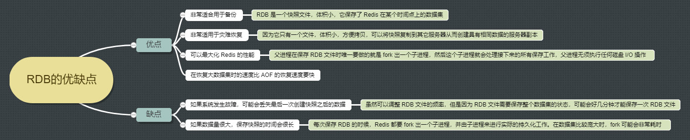
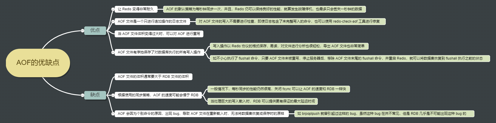

## Redis 持久化

Redis 是基于内存的，如果没有进行持久化操作，一旦 Redis 重启或者发生故障，内存里的数据将会全部丢失


### 持久化方法

- RDB：snapshotting，将某一时刻的所有数据保存到一个 RDB 文件中
- AOF：append-only-file，当 Redis 服务器执行写命令的时候，将执行的写命令保存到 AOF 文件中


## RDB

通过创建快照把某个时间点的所有数据都存放到硬盘上，生成的 RDB 文件是一个**经过压缩的二进制文件**。Redis 服务器启动时，如果发现有 RDB 文件，就会 **自动载入RDB** 文件，在载入期间服务器会处于阻塞状态，直到载入工作完成


### 生成 RDB 文件

#### 手动生成

- **`save`**：会 **阻塞 Redis 服务器进程**，服务器不能接收任何请求，直到 RDB 文件创建完毕为止
  - 执行成功返回 OK
  - 当 Redis 接收到关闭服务器的请求 `shutdown`，会执行一个 `save` 命令，在命令执行完毕后关闭服务器
- **`bgsave`**：创建出一个子进程，由子进程来负责创建 RDB 文件，服务器进程可以继续接收请求，常用
  - 可以通过 **`lastsave`** 命令查看是否执行成功


#### 自动生成

```
save 900 1			在900秒之后，至少有1个key发生变化
save 300 10			在300秒之后，至少有10个key发生变化
save 60  10000		在60秒之后，至少有10000个key发生变化

# 满足以上任一条件，就会自动触发bgsave命令
# 一般不使用自动配置
# 因为Redis每个时段的读写请求肯定不是均衡的，为了平衡性能与数据安全，所以需要配置多条规则触发备份
```


### RDB 的工作机制

当 Redis 执行 **`bgsave`** 命令时，服务器执行以下操作

1. Redis 调用 fork() ，同时拥有父进程和子进程
2. 子进程将数据集写入到一个临时 RDB 文件中
3. 当子进程完成对新 RDB 文件的写入时，用新 RDB 文件覆盖旧的 RDB 文件

这种工作方式使得 Redis 可以从写时复制（copy-on-write）机制中获益

至于 `save` 命令，一般不会使用，它的工作流程就是上面没有子进程的工作流程


## AOF

保存 Redis 服务器所执行的写命令来记录数据库的数据。与快照持久化相比，AOF 持久化的实时性更好，因此是目前主流的持久化方案

Redis 默认是没有开启 AOF 的，可以通过修改配置文件 **`appendonly yes`** 开启。开启 AOF 持久化后每执行一条会更改的数据的命令，这个命令就会被追加到 AOF 文件的末尾


### 三种同步策略

命令写入到缓冲区，同步缓冲区数据到硬盘中





### AOF 的工作机制

1. 命令写入
2. 追加到 aof_buf 缓冲区
3. 调用 flushAppendOnlyFile 函数，考虑是否要将缓冲区写入 AOF 文件中

为什么要先写入缓冲区在同步到磁盘呢？如果实时写入磁盘会带来非常高的磁盘 IO，影响整体性能


### 如果 AOF 文件出错了，怎么办

服务器可能在程序正在对 AOF 文件进行写入时停机，如果停机造成了 AOF 文件出错，那么 Redis 在重启时会拒绝载入这个 AOF 文件，从而确保数据的一致性

当发生这种情况时， 可以用以下方法来修复出错的 AOF 文件

1. 为现有的 AOF 文件创建一个备份
2. 使用 Redis 附带的 redis-check-aof 程序，对原来的 AOF 文件进行修复

```
$ redis-check-aof --fix
```

3. （可选）使用 **`diff -u`** 对比修复后的 AOF 文件和原始 AOF 文件的备份，查看两个文件之间的不同之处

4. 重启 Redis 服务器，等待服务器载入修复后的 AOF 文件，并进行数据恢复


## AOF 重写

**随着服务器写请求的增多，AOF 文件会越来越大，体积不断增大的AOF文件很可能会用完硬盘空间，而且还原操作执行时间可能会非常长**

为了处理这种情况，Redis 支持一种有趣的特性：可以在不打断服务客户端的情况下，对 AOF 文件进行重写，去除 AOF 文件中的冗余命令。该功能是通过读取数据库中的键值对来实现的，程序无须对现有 AOF 文件进行任何读入、分析或者写入操作

整个重写操作是绝对安全的，因为 Redis 在创建新 AOF 文件的过程中，会继续将命令追加到现有的 AOF 文件里面，即使重写过程中发生停机，现有的 AOF 文件也不会丢失。 而一旦新 AOF 文件创建完毕，Redis 就会从旧 AOF 文件切换到新 AOF 文件，并开始对新 AOF 文件进行追加操作


### 如何进行 AOF 重写

用户可以向 Redis 发送 **`bgrewriteaof`** 命令来进行重写，与创建快照命令 `bgsave` 的原理相似，AOF 文件重写也需要用到子进程，可能会导致性能问题。也可以通过修改配置文件进行重写

```
auto-aof-rewrite-percentage	100
auto-aof-rewrite-min-size 64mb
```

当 AOF 文件体积大于 64mb，并且 AOF 的体积比上一次重写之后的体积增长了 100% 时，Redis 就会自动执行 `bgrewriteaof` 命令，记住 **两个配置项要同时满足**


### AOF 重写的工作机制

AOF 重写和 RDB 创建快照一样，都巧妙地利用了写时复制机制

以下是 AOF 重写的执行步骤

1. Redis 调用 fork() ，同时拥有父进程和子进程
2. 子进程将新 AOF 文件的内容写入到临时文件
3. 新执行的写入命令，父进程一边将它们累积到一个内存缓存中，一边将这些改动追加到现有 AOF 文件的末尾。这样做即使在重写的中途发生停机，现有的 AOF 文件也还是安全的
4. 当子进程完成重写工作时，它给父进程发送一个信号，父进程在接收到信号之后，将内存缓存中的所有数据追加到新 AOF 文件的末尾
5. Redis 原子地用新文件替换旧文件，之后所有命令都会直接追加到新 AOF 文件的末尾


## RDB 和 AOF 的选择

最好是同时使用两种持久化功能，如果可以承受数分钟以内的数据丢失，可以只使用 RDB 持久化。有很多用户都只使用 AOF 持久化，但并不推荐这种方式：因为定时生成 RDB 快照非常便于进行数据库备份，并且 RDB 恢复数据集的速度更快，还可以避免之前提到的 AOF 程序的 bug


### RDB 的优缺点





### AOF 的优缺点





### 过期键

* RDB 文件不会保留已过期的键，载入 RDB 文件时，过期的键会被忽略
* AOF 文件则会保留未被删除的过期键，当过期的键被删除了以后，会追加一条 del 命令来显示记录该键被删除了，重写 AOF 文件时，过期的键会被忽略


### 从 RDB 持久化切换到 AOF 持久化

从 Redis 2.2 开始，可以在不重启的情况下，从 RDB 切换到 AOF

1. 为最新的 RDB 文件创建一个备份
2. 将备份放到一个安全的地方
3. 执行以下两条命令

```
config set appendonly yes
---开启AOF功能,Redis会阻塞直到初始AOF文件创建完成为止，之后Redis会继续处理命令请求， 并开始将写入命令追加到AOF文件末尾

config set save ""
---关闭RDB功能，这一步是可选的，如果愿意的话，可以同时使用RDB和AOF两种持久化功能
```

* 确保命令执行之后，数据库的键的数量没有改变
* 确保写命令会被正确地追加到 AOF 文件的末尾
* 注意要在配置文件中打开 AOF 功能，否则，服务器重启之后，之前通过 `config set` 设置的配置就会被遗忘，程序会按原来的配置来启动服务器


### RDB 和 AOF 之间的相互作用

从 Redis 2.4 开始，`bgsave` 和 `bgrewriteaof` 不可以同时执行。这可以防止两个的后台进程同时对磁盘进行大量的 I/O 操作

如果 `bgsave` 正在执行，用户显式地调用 `bgrewriteaof` 命令，服务器会向用户回复一个 OK 状态，并告知用户，`bgrewriteaof` 已经被预定执行，当 `bgsave` 执行完毕 `bgrewriteaof` 才会开始执行


Redis 4.0 开始支持 RDB 和 AOF 的混合持久化，**默认关闭**，可以通过修改配置文件 **`aof-use-rdb-preamble yes`** 开启

- 当 Redis 重启时，优先使用 AOF 文件还原数据集，因为 AOF 文件保存的数据集通常是最完整的
- AOF 重写的时候会直接把 RDB 的内容写到 AOF 文件开头。这样就可以结合 RDB 和 AOF 的优点，快速加载同时避免丢失过多的数据。缺点是 AOF 里面的 RDB 部分是压缩格式，不再是 AOF 格式，可读性较差


## 配置文件

#### RDB 配置

```
# RDB的触发条件
save 900 1
save 300 10
save 60 10000
# save ""		---关闭RDB，在save命令的下方加上即可

# RDB文件名称
dbfilename dump-6379.rdb

# RDB和AOF文件的保存路径
dir /usr/local/redis/data/

# 如果持久化出错，主进程是否停止写入，保护持久化的数据一致性
stop-writes-on-bgsave-error yes

# 是否压缩
rdbcompression yes

# 是否需要校验
rdbchecksum yes
```


#### AOF 配置

```
# 是否开启AOF
appendonly yes

# AOF文件名称
appendfilename "appendonly-6379.aof"

# 同步方式
appendfsync everysec

# AOF重写期间进行同步
no-appendfsync-on-rewrite no

# 重写触发条件
auto-aof-rewrite-percentage 100
auto-aof-rewrite-min-size 64mb

# 加载AOF文件，如果发现末尾命令不完整则自动截掉，加载前面正确的数据
# 设置为no，发现错误就会停止，修复后才能重新加载
aof-load-truncated yes

# 文件重写策略
aof-rewrite-incremental-fsync yes
```


## 更多

* [一起看懂Redis两种持久化方式的原理](https://segmentfault.com/a/1190000015983518)