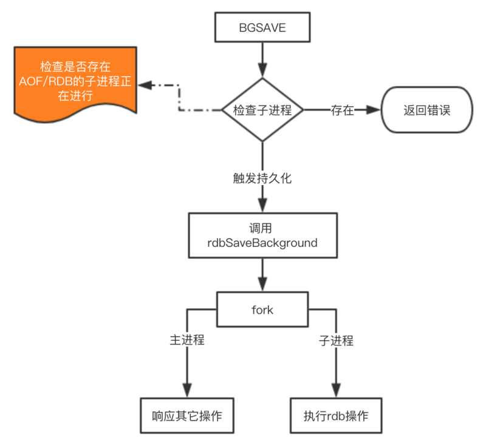
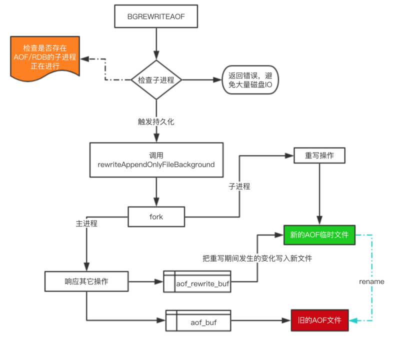

## Redis 持久化

Redis 是基于内存的，如果没有执行持久化操作，一旦 Redis 重启或者发生故障，内存的数据将会全部丢失


### 持久化方法

- RDB（snapshotting），将某一时刻的所有数据保存到一个 RDB 文件中
- AOF（append-only-file），当 Redis 服务器执行写命令的时候，将执行的写命令保存到 AOF 文件中
- 同时使用 AOF 和 RDB 持久化：Redis 4.0 开始支持 RDB 和 AOF 的混合持久化，默认关闭，可以通过修改配置文件 aof-use-rdb-preamble 开启
  - 当 Redis 重启时， 会优先使用 AOF 文件来还原数据集， 因为 AOF 文件保存的数据集通常比 RDB 文件所保存的数据集更完整
  - AOF 重写的时候就直接把 RDB 的内容写到 AOF 文件开头。这样做的好处是可以结合 RDB 和 AOF 的优点，快速加载同时避免丢失过多的数据。当然缺点也是有的，AOF 里面的 RDB 部分是压缩格式不再是 AOF 格式，可读性较差

* 可以关闭持久化功能，让数据只在服务器运行时存在


### RDB

通过创建快照某个时间点的所有数据都存放到硬盘上。RDB 持久化可以手动执行，也可以根据服务器配置定期执行。RDB 持久化所生成的 RDB 文件是一个**经过压缩的二进制文件**。Redis 服务器在启动的时候，如果发现有 RDB 文件，就会**自动载入RDB**文件，在载入期间服务器会处于阻塞状态，直到载入工作完成


#### 手动生成 RDB 文件

- **`save`**：会阻塞 Redis 服务器进程，服务器不能接收任何请求，直到 RDB 文件创建完毕为止
  - 执行成功返回 OK
  - 当 Redis 接收到关闭服务器的请求 **`shutdown`**，或者接收到标准 term 信号时，会执行一个 save 命令，阻塞所有客户端，不再执行客户端发送的任何命令，并在 save 命令执行完毕之后关闭服务器
- **`bgsave`**：创建出一个子进程，由子进程来负责创建 RDB 文件，服务器进程可以继续接收请求，常用
  - 可以通过 **`lastsave`** 命令查看是否执行成功
  - 当一个 Redis 服务器连接到另一个 Redis 服务器，并向对方发送 sync 命令来开始一次复制操作的时，如果主服务器目前或者刚刚没有执行 bgsave 操作，那么主服务器就会执行 bgsave 命令


#### 自动生成 RDB 文件

```
save 900 1			在900秒之后，至少有1个key发生变化，自动触发bgsave命令创建快照
save 300 10			在300秒之后，至少有10个key发生变化
save 60  10000		在60秒之后，至少有10000个key发生变化
```

为什么需要配置这么多条规则呢？因为 Redis 每个时段的读写请求肯定不是均衡的，为了平衡性能与数据安全，我们可以自由定制什么情况下触发备份


#### RDB 的工作机制

当 Redis 需要保存 RDB 文件时， 服务器执行以下操作

1. Redis 调用 fork() ，同时拥有父进程和子进程
2. 子进程将数据集写入到一个临时 RDB 文件中
3. 当子进程完成对新 RDB 文件的写入时，用新 RDB 文件覆盖旧的 RDB 文件

这种工作方式使得 Redis 可以从写时复制（copy-on-write）机制中获益





#### RDB 的优缺点

##### 优点

- RDB 是一个快照文件，体积小，它保存了 Redis 在某个时间点上的数据集，这种文件非常适合用于进行备份
- RDB 非常适用于灾难恢复（disaster recovery）
  - 因为它只有一个文件，体积小，方便拷贝，可以将快照复制到其它服务器从而创建具有相同数据的服务器副本
- RDB 可以最大化 Redis 的性能
  - 父进程在保存 RDB 文件时唯一要做的就是 fork 出一个子进程，然后这个子进程就会处理接下来的所有保存工作，父进程无须执行任何磁盘 I/O 操作
- RDB 在恢复大数据集时的速度比 AOF 的恢复速度要快


##### 缺点

- 如果系统发生故障，可能会丢失最后一次创建快照之后的数据
  - 虽然可以调整 RDB 文件的频率，但是因为 RDB 文件需要保存整个数据集的状态， 可能会好几分钟才能保存一次 RDB 文件。 在这种情况下， 一旦发生故障停机， 就可能会丢失好几分钟的数据
- 如果数据量很大，保存快照的时间会很长
  - 每次保存 RDB 的时候，Redis 都要 fork 出一个子进程，并由子进程来进行实际的持久化工作。 在数据集比较庞大时，fork 可能会非常耗时


### AOF

保存 Redis 服务器所执行的写命令来记录数据库的数据。与快照持久化相比，AOF 持久化的实时性更好，因此已成为主流的持久化方案。默认情况下 Redis 没有开启 AOF，可以通过修改配置文件 appendonly yes 开启。开启 AOF 持久化后每执行一条会更改的数据的命令，这个命令就会被追加到 AOF 文件的末尾。这样的话， 当 Redis 重启时， 程序就可以通过重新执行 AOF 文件中的命令来达到重建数据集的目的


#### 三种同步策略

|           方式           |           同步频率           |
| :----------------------: | :--------------------------: |
|    appendfsync always    | 每次有数据修改发生时都会同步 |
| **appendfsync everysec** |    **每秒同步一次，默认**    |
|      appendfsync no      |  让操作系统决定何时进行同步  |

appendfsync always 选项会严重减低服务器的性能。为了兼顾数据和写入性能，appendfsync everysec 选项比较合适，可以保证系统奔溃时只会丢失一秒左右的数据，并且对 Redis 的性能几乎没有任何影响。当硬盘忙于执行写入操作的时候，Redis 还会放慢自己的速度以便适应硬盘的最大写入速度。appendfsync no 选项并不能给服务器性能带来多大的提升，而且也会增加系统奔溃时数据丢失的数量


#### AOF 重写

##### 为什么需要 AOF 重写

**随着服务器写请求的增多，AOF 文件会越来越大**。例如对一个计数器调用了 100 次 incr，为了保存这个计数器的当前值， AOF 文件就需要使用 100 条记录。然而在实际上，只使用一条 set 命令就足以保存计数器的当前值了，其余 99 条记录实际上都是多余的。**体积不断增大的AOF文件很可能会用完硬盘空间，而且还原操作执行时间可能会非常长**

为了处理这种情况，Redis 支持一种有趣的特性：可以在不打断服务客户端的情况下， 对 AOF 文件进行重建，去除 AOF 文件中的冗余写命令。该功能是通过读取数据库中的键值对来实现的，程序无须对现有 AOF 文件进行任何读入、分析或者写入操作。AOF 重写会产生一个新的 AOF 文件，这个新的 AOF 文件和原有的 AOF 文件所保存的数据库状态一样，但体积更小


##### 手动进行 AOF 重写

用户可以向 Redis 发送 **bgrewriteaof** 命令 ，这个命令会通过移除 AOF 文件中的冗余命令来重写 AOF 文件。bgrewriteaof 命令和 bgsave 创建快照原理十分相似，所以 AOF 文件重写也需要用到子进程，这样会导致性能问题和内存占用问题，和快照持久化一样。更糟糕的是，如果不加以控制的话，AOF 文件的体积可能会比快照文件大好几倍

在执行 bgrewriteaof 命令时，Redis 服务器会维护一个 AOF 重写缓冲区，该缓冲区会在子进程创建新 AOF 文件期间，记录服务器执行的所有写命令。当子进程完成创建新 AOF 文件的工作之后，服务器会将重写缓冲区中的所有内容追加到新 AOF 文件的末尾，使得新旧两个 AOF 文件所保存的数据库状态一致。最后，服务器用新的 AOF 文件替换旧的 AOF 文件，以此来完成 AOF 文件重写操作将写命令添加到 AOF 文件的末尾


##### 自动进行 AOF 重写

```
auto-aof-rewrite-percentage	100
auto-aof-rewrite-min-size 64mb
```

当 AOF 文件体积大于 64mb，并且 AOF 的体积比上一次重写之后的体积大了至少一倍（100%）的时候，Redis 将自动执行 bgrewriteaof 命令


#### 如果 AOF 文件出错了，怎么办

服务器可能在程序正在对 AOF 文件进行写入时停机， 如果停机造成了 AOF 文件出错， 那么 Redis 在重启时会拒绝载入这个 AOF 文件， 从而确保数据的一致性

当发生这种情况时， 可以用以下方法来修复出错的 AOF 文件

1. 为现有的 AOF 文件创建一个备份
2. 使用 Redis 附带的 redis-check-aof 程序，对原来的 AOF 文件进行修复

```
$ redis-check-aof --fix
```

3. （可选）使用 **`diff -u`** 对比修复后的 AOF 文件和原始 AOF 文件的备份，查看两个文件之间的不同之处

4. 重启 Redis 服务器，等待服务器载入修复后的 AOF 文件，并进行数据恢复


#### AOF 的工作机制

AOF 重写和 RDB 创建快照一样，都巧妙地利用了写时复制机制

以下是 AOF 重写的执行步骤：

1. Redis 调用 fork() ，同时拥有父进程和子进程
2. 子进程开始将新 AOF 文件的内容写入到临时文件
3. 对于所有新执行的写入命令，父进程一边将它们累积到一个内存缓存中，一边将这些改动追加到现有 AOF 文件的末尾。这样做即使在重写的中途发生停机，现有的 AOF 文件也还是安全的
4. 当子进程完成重写工作时，它给父进程发送一个信号，父进程在接收到信号之后，将内存缓存中的所有数据追加到新 AOF 文件的末尾
5. Redis 原子地用新文件替换旧文件，之后所有命令都会直接追加到新 AOF 文件的末尾





#### AOF 的优缺点

##### 优点

* 使用 AOF 持久化会让 Redis 变得非常耐久
  * AOF 的默认策略为每秒钟同步一次，在这种配置下，Redis 仍然可以保持良好的性能，并且就算发生故障停机，也最多只会丢失一秒钟的数据，也可以根据实际情况设置fsync的策略

* AOF 文件是一个只进行追加操作的日志文件
  * 因此对 AOF 文件的写入不需要进行 seek ， 即使日志因为某些原因而包含了未写入完整的命令，redis-check-aof 工具也可以轻易地修复这种问题

* Redis 可以在 AOF 文件体积变得过大时，自动地在后台对 AOF 进行重写
  * 重写后的新 AOF 文件包含了恢复当前数据集所需的最小命令集合。整个重写操作是绝对安全的，因为 Redis 在创建新 AOF 文件的过程中，会继续将命令追加到现有的 AOF 文件里面，即使重写过程中发生停机，现有的 AOF 文件也不会丢失。 而一旦新 AOF 文件创建完毕，Redis 就会从旧 AOF 文件切换到新 AOF 文件，并开始对新 AOF 文件进行追加操作

* AOF 文件有序地保存了对数据库执行的所有写入操作， 这些写入操作以 Redis 协议的格式保存
  * 因此 AOF 文件的内容非常容易被人读懂， 对文件进行分析也很轻松，导出 AOF 文件也非常简单：如不小心执行了 flushall 命令，只要 AOF 文件未被重写，那么只要停止服务器，移除 AOF 文件末尾的 flushall 命令，并重启 Redis，就可以将数据集恢复到 flushall 执行之前的状态


##### 缺点

* AOF 文件的体积通常要大于 RDB 文件的体积

* 根据所使用的同步策略，AOF 的速度可能会慢于 RDB
  * 在一般情况下，每秒同步的性能非常高，而关闭 fsync 可以让 AOF 的速度和 RDB 一样快。 不过在处理巨大的写入载入时，RDB 可以提供更有保证的最大延迟时间

* AOF 会因为个别命令的原因，出现 bug，导致 AOF 文件在重新载入时，无法将数据集恢复成保存时的原样
  * 如 brpoplpush 就曾经引起过这样的 bug，虽然这种 bug 在 AOF 文件中并不常见，但是 RDB 几乎是不可能出现这种 bug 的


### RDB和AOF对过期键的策略

RDB持久化对过期键的策略

- 已过期的键不会保存在 RDB 文件中
- 载入 RDB 文件时，过期的键会被忽略

AOF持久化对过期键的策略

- AOF 文件会保留过期键，当过期的键被删除了以后，会追加一条 del 命令来显示记录该键被删除了
- 重写 AOF 时，过期的键会被忽略


### RDB 和 AOF 的选择

一般来说，如果想达到足以媲美 PostgreSQL 的数据安全性，应该同时使用两种持久化功能

如果你非常关心你的数据，但仍然可以承受数分钟以内的数据丢失，那么你可以只使用 RDB 持久化

有很多用户都只使用 AOF 持久化，但并不推荐这种方式：因为定时生成 RDB 快照非常便于进行数据库备份，并且 RDB 恢复数据集的速度也要比 AOF 恢复的速度要快，除此之外，使用 RDB 还可以避免之前提到的 AOF 程序的 bug


### 从 RDB 持久化切换到 AOF 持久化

在 Redis 2.2 或以上版本，可以在不重启的情况下，从 RDB 切换到 AOF

1. 为最新的 RDB 文件创建一个备份
2. 将备份放到一个安全的地方
3. 执行以下两条命令

```
config set appendonly yes
---开启AOF功能,Redis会阻塞直到初始AOF文件创建完成为止，之后Redis会继续处理命令请求， 并开始将写入命令追加到AOF文件末尾

config set save ""
---关闭RDB功能，这一步是可选的，如果愿意的话，可以同时使用RDB和AOF两种持久化功能
```

1. 确保命令执行之后，数据库的键的数量没有改变
2. 确保写命令会被正确地追加到 AOF 文件的末尾

注意要在配置文件中打开 AOF 功能，否则的话，服务器重启之后，之前通过 config set 设置的配置就会被遗忘，程序会按原来的配置来启动服务器


### RDB 和 AOF 之间的相互作用

在版本号大于等于 2.4 的 Redis 中，bgsave 和 bgrewriteaof 不可以同时执行。这可以防止两个的后台进程同时对磁盘进行大量的 I/O 操作

如果 bgsave 正在执行，并且用户显式地调用 bgrewriteaof 命令， 那么服务器将向用户回复一个  OK 状态，并告知用户，bgrewriteaof 已经被预定执行：当 bgsave 执行完毕 bgrewriteaof 才会开始执行

当 Redis 启动时， 如果 RDB 持久化和 AOF 持久化都被打开了， 那么程序会优先使用 AOF 文件来恢复数据集， 因为 AOF 文件所保存的数据通常是最完整的


### 配置文件

#### RDB 配置

```
# 时间策略
save 900 1
save 300 10
save 60 10000
# save ""	---禁用RDB配置

# 文件名称
dbfilename dump.rdb

# 文件保存路径
dir /home/work/app/redis/data/

# 如果持久化出错，主进程是否停止写入，保护持久化的数据一致性
stop-writes-on-bgsave-error yes

# 是否压缩
rdbcompression yes

# 导入时是否检查
rdbchecksum yes
```


#### AOF 配置

```
# 是否开启aof
appendonly yes

# 文件名称
appendfilename "appendonly.aof"

# 同步方式
appendfsync everysec

# aof重写期间是否同步
no-appendfsync-on-rewrite no

# 重写触发配置
auto-aof-rewrite-percentage 100
auto-aof-rewrite-min-size 64mb

# 加载aof时如果有错如何处理
aof-load-truncated yes

# 文件重写策略
aof-rewrite-incremental-fsync yes
```

