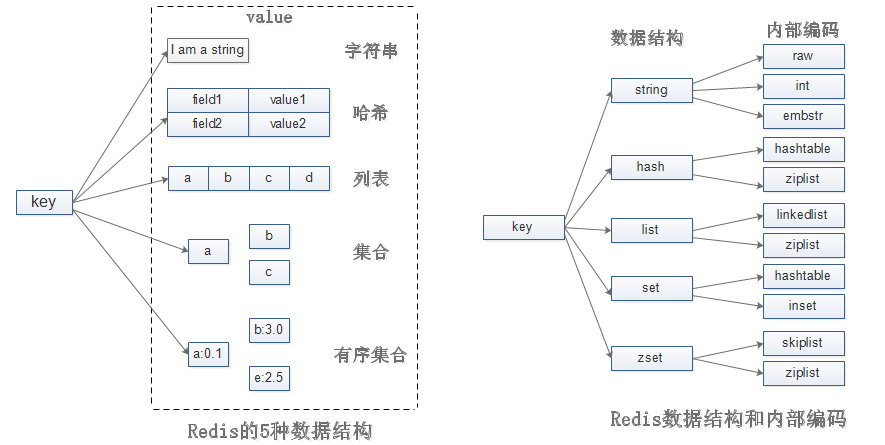
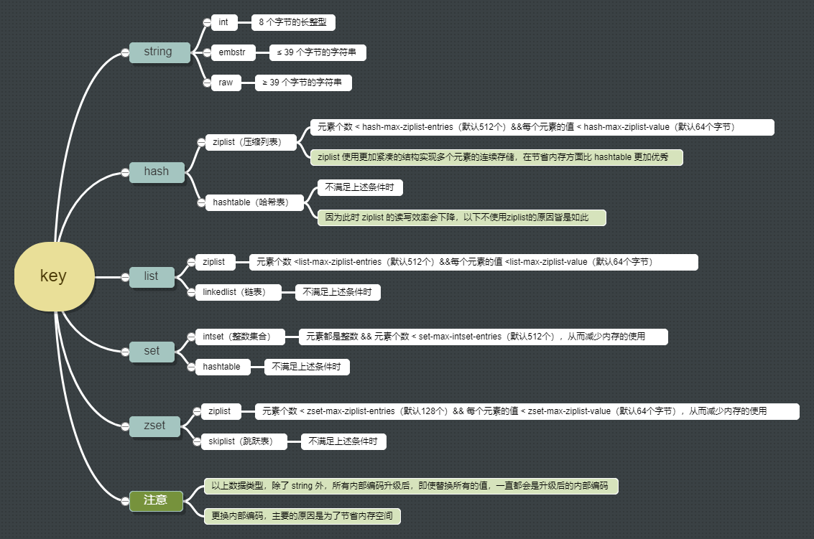

## 内部编码

**`type <key>`**命令实际返回的就是当前键的数据结构类型，但这些只是 Redis 对外的数据结构。实际上每种数据结构都有自己底层的内部编码实现，**每种数据结构都有两种以上的内部编码实现**，这样 Redis 会根据当前值的类型和长度决定使用内部编码实现，**有些内部编码可以作为多种外部数据结构的内部实现**。可以使用**`object encoding <key>`**命令查询内部编码

### 使用内部编码的好处

* 可以改进内部编码，而对外的数据结构和命令没有影响，这样一旦开发开发出优秀的内部编码，无需改动外部数据结构和命令
* 多种内部编码实现可以在不同场景下发挥各自的优势。如 ziplist 比较节省内存，但是在列表元素比较多的情况下，性能会有所下降，这时候 Redis 会根据配置选项将列表类型的内部实现转换为 linkedlist

### 五种数据结构的内部编码方式

## 数据结构

### 字符串

Redis 中**所有的 key 都是字符串**。字符串的值不仅可以是字符串，也可以是数字。最大不能超过 512M

#### 使用场景

* 缓存功能：字符串最经典的使用场景，Redis 作为缓存层，MySQL 作为储存层，绝大部分请求数据都是从 Redis 中获取，由于 Redis 具有支撑高并发特性，所以缓存通常能起到加速读写和降低后端压力的作用
* 计数器：许多应用都会使用 Redis 作为计数的基础工具，可以实现快速计数、查询缓存的功能，同时数据可以一步落地到其他的数据源。如：视频播放数、粉丝数等
* 共享 session：出于负载均衡的考虑，分布式服务会将用户信息的访问均衡到不同服务器上，用户刷新一次访问可能会需要重新登录，为避免这个问题可以用 Redis 将用户 session 集中管理，在这种模式下只要保证 Redis 的高可用和扩展性，每次获取用户更新或查询登录信息都直接从 Redis 中集中获取
* 限速：处于安全考虑，每次进行登录时让用户输入手机验证码，为了短信接口不被频繁访问，会限制用户每分钟获取验证码的频率

#### 常用命令

* **`set <key> <value>`**：为字符串赋值，如果 key 已经存储其他值，就覆写旧值，无视类型
  * 成功返回 OK，失败返回 nil
  * **`set <key> <value> ex <seconds>`**：将字符串赋值，并设定生存时间，**原子操作**，等同于**`setex <key> <seconds> <value>`**
  * **`set <key> <value> px <milliseconds>`**：同上，单位为毫秒，等同于**`psetex <key> <milliseconds> <value>`**
  * **`set <key> <value> nx`**：只在 key 不存在时，对 key 进行赋值，等同于**`setnx <key> <value>`**
  * **`set <key> <value> xx`**：只在 key 已经存在时，对 key 进行赋值
  * 因为 set 命令可以通过参数来实现和 setnx 、setex、psetex 三个命令的效果，所以将来的 Redis 版本可能会废弃并最终移除 setnx 、setex、psetex 三个命令
* **`get <key>`**：获取指定 key 的值
  * key 不存在，返回 nil；如果值不是字符串类型，返回一个错误

- **`mset <key> <value> ...`**：同时设置一个或多个 key-value 对，**原子操作**
  - 总是返回 OK，**该命令不可能失败**
- **`msetnx <key> <value> ...`**：同时设置一个或多个 key-value 对，**当且仅当所有给定 key 都不存在**，**原子操作**
  - 成功返回 1，失败返回 0
- **`mget <key> ...`**：返回所有给定 key 的值
  - 如果给定的某个 key 不存在，返回 nil，**该命令不可能失败**
- **`getset <key> <value>`**：设置指定 key 的值，并返回 key 的旧值
  - 返回 key 的旧值，当 key 没有旧值时，即 key 不存在时，返回 nil；当 key 存在但不是字符串类型时，返回一个错误

* **`getrange <key> <start> <end>`**：获取 key 中字符串的截取的字符串。字符串的截取范围由 start 和 end 两个偏移量决定，包括 start 和 end 在内。负数偏移量表示从字符串最后开始计数，-1 表示最后一个字符，-2 表示倒数第二个，以此类推
  - 返回截取得出的字符串

- **`append <key> <value>`**：为指定的 key 追加值，如果 key 不存在，就将给定的 key 设为 value
  - 返回追加后 key 的字符串的长度
- **`strlen <key>`**：获取指定 key 所储存的字符串的长度，注意**中文占两个字节**
  - 返回字符串的长度，key 不存在返回 0，当 key 存在但不是字符串类型时，返回一个错误

* **`incr <key>`**：将 key 中储存的数字增 1，如果 **key 不存在，那么 key 的值会被初始化为 0**，再执行操作
  * 执行成功返回更新后的值，如果值包含错误的类型，或字符串类型的值不能表示为数字，那么返回一个错误
  * 这是一个针对字符串的操作，因为 Redis 没有专用的整数类型，所以 key 内储存的字符串被解释为**十进制 64 位有符号整数**来执行操作
* **`incrby <key> <increment>`**：将 key 中储存的数字加上指定的增量值，**可以为负值**，同上
* **`incrbyfloat <key> <increment>`**：将 key 中储存的数字加上指定的浮点数增量值，同上
* **`decr <key>`**：将 key 中储存的数字减 1，同上
* **`decrby <key> <decrement>`**：将 key 中储存的数字减去指定的减量值，同上，没有**`decrbyfloat`**命令

以上命令时间复杂度

* **`mset`**、**`msetnx`**、**`mget`**、**`getrange`**：O(N)
* 其他：O(1)

### 哈希

Hash 是一个 String 类型的 field 和 value 的映射表，field 不能相同，value 可以相同，Hash 特别适合用于存储对象，后续操作时，可以直接修改这个对象中的某个字段的值

#### 使用场景

哈希结构相对于字符串序列化缓存信息更加直观，并且在更新操作上更加便捷。所以常用于存储用户信息，商品信息等

#### 常用命令

* **`hset <key> <field> <value>`**：为哈希表中的字段赋值，字段已经存在于哈希表中，旧值将被覆盖
  * 如果字段是新建的，并且赋值成功，返回 1；如果字段已经存在且旧值已被新值覆盖，返回 0 
* **`hsetnx <key> <field> <value>`**：为哈希表中的字段赋值，**当且仅当给定的字段不存在**
  - 成功返回 1，失败返回 0
* **`hget <key> <field>`**：返回哈希表中字段的值
  * 如果字段或 key 不存在时，返回 nil
* **`hmset <key> <field> <value> ...`**：同时将多个 field-value (字段-值)对设置到哈希表中
  - 命令执行成功返回 OK，当 key 不是哈希类型，返回一个错误
* **`hmget <key> <field> ...`**：返回哈希表中给定字段的值
  - 返回一个包含多个给定字段的关联值的表，表值的排列顺序和给定域参数的请求顺序一样。如果给定的字段或 key 不存在时，返回 nil
* **`hgetall <key>`**：返回哈希表中所有的字段和值
  - 以列表形式返回哈希表的字段及字段值，若 key 不存在，返回空列表

* **`hdel <key> <field> ...`**：删除哈希表中指定的字段，不存在的字段将被忽略
  * 返回被成功删除字段的数量，不包括被忽略的字段
* **`hexists <key> <field>`**：查看哈希表的指定字段是否存在
  * 存在返回 1，不存在返回 0
* **`hlen <key>`**：获取哈希表中字段的数量
  * 返回哈希表中字段的数量，不存在返回 0
* **`hkeys <key>`**：获取哈希表中的所有字段
  * 返回包含哈希表中所有字段列表，不存在时，返回一个空列表
* **`hvals <key>`**：获取哈希表所有字段的值
  - 返回一个包含哈希表中所有字段的值的列表，不存在时，返回一个空表

* **`hincrby <key> <field> <increment>`**：为哈希表中的字段值加上指定增量值，同 incrby
  - 执行成功返回更新后的值
* **`hincrbyfloat <key> <field> <increment>`**：为哈希表中的字段值加上指定浮点数增量值，同 incrbyfloat
  - 执行成功返回更新后的值

以上命令时间复杂度

- **`hdel`**、**`hmset`**、**`hmget`**、**`hgetall`**、**`hkeys`**、**`hvals`**：O(N)
- 其他：O(1)

### 列表

列表类型是用来储存多个有序的字符串，列表中的每个字符串称为元素（element），元素是有序的、可重复的。列表的应用场景非常多，也是 Redis 最重要的数据结构之一，列表的实现为一个双向链表，方便操作，不过也带来额外的内存开销

#### 使用场景

列表不但有序，同时支持按照索引范围获取元素，微博的关注列表，粉丝列表，消息列表等功能都可以用 Redis 的列表结构来实现。另外可以通过 lrange 命令，可以实现简单的高性能分页，可以做类似微博那种下拉不断分页的东西

lpush + lpop = Stack（栈）
lpush + rpop = Queue（队列）
lpush + ltrim = Capped Collection（有限集合）
lpush + brpop = Message Queue（消息队列）

#### 常用命令

* **`lpush <key> <value> ...`**：将一个或多个值插入到表头（最左边），如果 key 不存在，一个空列表会被创建再执行操作
  * 返回列表的长度，当 key 存在但不是列表类型时，返回一个错误

* **`lpushx <key> <value>`**：将值插入到表头，如果 key 不存在，不会执行操作
  - 返回列表的长度

* **`lpop <key> <value>`**：移除并返回列表的头元素
  - 返回列表的头元素，key 不存在返回 nil

* **`rpush rpushx rpop`**：对表尾（最右边）进行以上操作
* **`linsert <key> before/after value newvalue`**：在列表的元素前或者后插入元素
  * 执行成功返回列表的长度；指定元素不存在返回 -1；列表不存在或者为空，返回 0；如果 key 不是列表类型，返回一个错误
* **`lrem <key> <count> <value>`**：根据参数 count 的值，移除列表中与参数 value 相等的元素
  * count > 0：从左到右，移除 count 个与 value 相等的元素
  * count < 0：从右到左，移除 count 个与 value 相等的元素
  * count = 0：移除表中所有与 value 相等的值
  * 返回被移除元素的数量，key 不存在返回 0

* **`lset <key> <index> <value>`**：通过索引设置元素的值
  * 操作成功返回 OK ，失败返回错误信息

* **`llen <key>`**：返回列表的长度
  - key 不存在，返回 0；如果 key 不是列表类型，返回一个错误

* **`lindex <key> <index>`**：通过索引获取列表中的元素，可以使用负数下标，-1 表示最后一个元素，-2 表示倒数第二个，以此类推
  - 返回指定索引值的元素，如果指定索引值不在列表的区间范围内，返回 nil；如果 key 不是列表类型，返回一个错误

* **`lrange <key> <start> <end>`** ：返回列表中指定区间内的元素，截取范围由 start 和 end 两个偏移量决定，包括 start 和 end 在内
  - 返回一个包含指定区间内元素的列表

* **`ltrim <key> <start> <end>`** ：对一个列表进行修剪，只保留指定区间内的元素，不在指定区间之内的元素都将被删除
  - 执行成功返回 OK

* **`blpop <key> ... <timeout>`** ：移出并获取列表的第一个元素，lpop的阻塞版本，如果列表没有元素会阻塞列表直到等待超时或发现可弹出元素为止，timeout 是阻塞超时时间，timeout 为 0 表示永不阻塞
  - 返回一个含有两个元素的列表，第一个元素是被弹出元素所属的 key ，第二个元素是被弹出元素的值；如果列表为空，返回 nil

* **`brpop <key> ... <timeout>`** ：移出并获取列表的最后一个元素，同上

以上命令时间复杂度

- **`linsert`**、**`lrem`**、**`lrange`**、**`ltrim`**：O(N)
- 其他：O(1)
- **`lset`**、**`lindex`**：对头元素或尾元素进行操作，复杂度为 O(1)；其他情况下，为 O(N)

### 集合

集合提供的功能与列表类似，特殊之处在于集合是可以自动排重的并且是无序的，不能通过索引下标获取元素，Redis 除了支持集合内的增删改查，同时还支持多个集合取交集、并集、差集

#### 使用场景

比较典型的使用场景就是标签，如一个用户对娱乐、体育比较感兴趣，另一个可能对新闻感兴趣，这些兴趣就是标签，有了这些数据就可以得到同一标签的人，以及用户的共同爱好的标签，这些数据对于用户体验以及曾强用户粘度比较重要。用户和标签的关系维护应该放在一个事物内执行，防止部分命令失败造成数据不一致。

在微博应用中，可以将一个用户所有的关注人存在一个集合中，将其所有粉丝存在一个集合。Redis 可以非常方便的实现如共同关注、共同粉丝、共同喜好等功能

sadd = tagging（标签）
spop / srandmember = random item（生成随机数，比如抽奖）
sadd + sinter = social Graph(社交需求)

#### 常用命令

