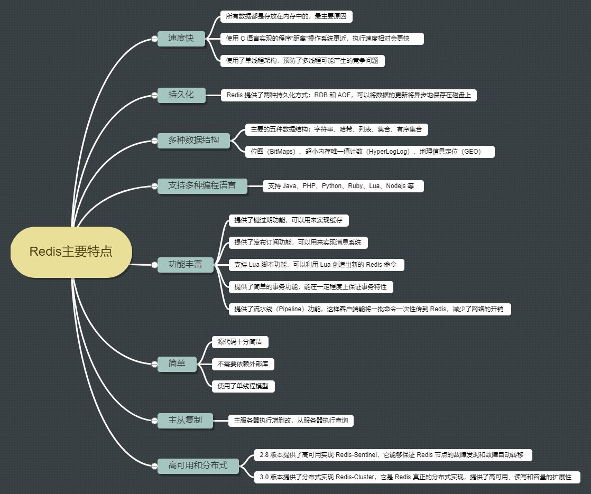

## Redis概述

### Redis是什么

Redis的的是完全开源免费的，遵守 BSD 协议，是一个高性能的键值数据库，是当前最热门的 NoSql 数据库之一，也被人们称为数据结构服务器


### Reids 主要的特性





### Redis 典型使用场景

缓存系统、计数器、消息队列系统、排行榜、社交网络、实时系统


### 为什么 Redis 处理速度这么快

- 绝大部分请求是纯粹的内存操作
- 采用单线程，避免了线程切换和竞争消耗
  - 单线程指的是网络请求模块使用了一个线程（所以不需考虑并发安全性），即一个线程处理所有网络请求，其他模块仍用了多个线程
  - 线程安全：Redis 实际上是采用了线程封闭的观念，把任务封闭在一个线程，自然避免了线程安全问题，不过对于需要依赖多个 Redis 操作的复合操作来说，依然需要锁，而且有可能是分布式锁
  - 一次最好只执行一条命令，不要使用长命令、慢命令
- 非阻塞 IO，IO 多路复用


### 为什么要用缓存

* **高性能**
  * 当用户第一次访问数据库中的某些数据，这个过程会比较慢，因为是从硬盘上读取的。将该用户访问的数据存在数缓存中，这样下一次再访问这些数据的时候就可以直接从缓存中获取了。操作缓存就是直接操作内存，所以速度相当快。如果数据库中的对应数据改变的之后，同步改变缓存中相应的数据即可
* **高并发**
  * 直接操作缓存能够承受的请求是远远大于直接访问数据库的，所以可以考虑把数据库中的部分数据转移到缓存中去，这样用户的一部分请求会直接到缓存这里而不用经过数据库


### 为什么要用 Redis 而不用 Map 做缓存

- Map 是**本地缓存**，最主要的特点是轻量以及快速，如果有多台实例的话，**每个实例都需要各自保存一份缓存，缓存不具有一致性**。生命周期随着 JVM 的销毁而结束，而且 JVM 内存太大容易挂掉的，一般用做于容器来存储临时数据。Map所存储的数据结构，缓存过期机制等需要程序员自己手写的
- Redis 是专业做缓存的，实现的是**分布式缓存**，如果有多台实例的话，**每个实例都共享一份缓存，缓存具有一致性**。可以用几十个G内存来做缓存。Redis一般用作于缓存，可以将缓存数据保存在硬盘中，Redis重启了后可以将其恢复。原生提供丰富的数据结构、缓存过期机制等简单好用的功能。缺点是需要保持 Redis 服务的高可用，整个程序架构上较为复杂


### Redis 和 Memcached 的区别

* Redis 支持更丰富的数据类型；Memcache 支持文本型和二进制类型

* Redis 支持数据的持久化，可以将内存中的数据保持在磁盘中，重启的时候可以再次加载进行使用；而 Memecache 把数据全部存在内存之中
* Memcached没有原生的集群模式，需要依靠客户端来实现往集群中分片写入数据；但是 Redis 是原生支持 cluster 模式的
* Memcached 是多线程，非阻塞 IO 复用的网络模型；Redis 使用单线程的多路 IO 复用模型
* Memcached 提供了 cas 命令来保证数据的一致性；而 Redis 提供了事务的功能，可以保证一串命令的原子性


### Redis 可执行文件说明

* redis-server：Redis 服务器
* redis-cli：Redis 命令行客户端
* redis-benchmark：Redis 性能测试工具
* redis-check-aof：AOF 文件检查工具
* redis-check-dump：RDB 文件检查工具
* redis-sentinel：Sentinel 服务器


### Redis 启动方式

* 最简启动，默认
  * 直接运行**`redis-server`**
* 动态参数启动
  * 如**`redis-server -port 6380`**
* 配置文件启动，生产环境推荐
  * 如**`redis-server config/redis-6379.conf`**


### Redis 客户端连接

```
redis-server							---启动Redis
redis-server --port 6380				---使用端口号启动Redis
----------------------------------------
redis-cli -h <address> -p <port>		---建立连接
redis-cli								---使用默认方式建立连接
---相当于
redis-cli -h 127.0.0.1 -p 6379
----------------------------------------
exit									---退出
```


### Redis 命令返回值

* 状态回复（status reply）
  * 直接显示状态信息，如发送 set 命令设置某个键的值后，Redis 会回复 OK 表示成功；发送 ping 命令，Redis 会回复 PONG
* 错误回复（error reply）
  * 当出现命令不存在或命令格式有错误等情况时，Redis 会返回错误回复。错误回复以 error 开头，并在后面跟上错误信息
* 整数回复（integer reply）
  * Redis 虽然没有整数类型，但提供了一些用于整数操作的命令，如递增键值的 incr 命令会以整数形式返回递增后的增值。除此之外，一些其他命令也会返回整数。整数回复以  integer 开头，并在后面跟上整数数据
* 字符串回复（bulk reply）
  * 最常见的一种回复类型，当请求一个字符串类型键的键值或者一个其他类型键中的某个元素时，就会得到一个字符串回复，字符串回复以双引号包裹
* 多行字符串回复（multi-bulk reply）
  * 常见的一种回复类型，当请求一个非字符串类型键的元素列表时，就会收到多行字符串回复，多行字符串回复中的每行字符串都以一个序号开头


## 通用命令

* **Redis 命令大小写不敏感**
* **`keys [pattern]`**：查找所有符合给定模式 pattern 的 key
  * **`?`**：匹配一个字符
  * **`*`**：匹配任意个字符
  * **`[]`**：匹配括号间的任一个字符
  * **`\`**：转义
  * 一般不在生产环境使用，可能造成性能问题
* **`dbsize`**：返回当前数据库的 key 的数量
* **`exists <key>`**：检查给定 key 是否存在
* **`del <key>`**：删除指定的 key
* **`expire <key> <seconds>`**：设置 key 的生存时间，key 过期后会被自动删除
* **`ttl <key>`**：返回 key 的剩余生存时间，time to live
* **`persist <key>`**：移除 key 的过期时间
* **`type <key>`**：返回 key 所储存的值的类型
  * 返回类型有 string、hash、list、set、zset、none（key 不存在）
* **`rename <key> <newkey>`**：将 key 改名为 newkey
* **`randomkey`**：随机返回一个 key


* 以上命令时间复杂度
  * **`keys`**：O(N)
  * **`del`**
    * 删除单个字符串类型的 key ，时间复杂度为 O(1)
    * 删除单个列表、集合、有序集合或哈希表类型的 key ，时间复杂度为 O(N)
  * 其他：O(1)


## 键的过期时间

Redis 是基于内存，而内存又是有限的。所以经常会清除不常用的数据，保留常用的数据。按照传统的数据库处理方式，一般都是自己判断过期，这样无疑会严重影响项目性能。这就需要设置一下键的过期时间了。对于散列表这种容器，只能为整个键设置过期时间，而不能为键里面的单个元素设置过期时间


### 删除策略

- **定时删除（对内存友好，对CPU不友好）**
  - 到时间就把所有过期的键都删除
- **定期删除（折中）**
  - 每隔一段时间（Redis 默认100ms），**随机抽取**一些设置了过期时间的 key，检查其是否过期，如果过期就删除。为什么要随机抽取呢，假如 Redis 存了几十万个 key ，每隔 100ms 就遍历所有的设置过期时间的 key 的话，就会给 CPU 带来很大的负载
- **惰性删除（对CPU极度友好，对内存极度不友好）**
  - 定期删除可能会导致很多过期 key 到了时间并没有被删除掉，还停留在内存里，只有去查一下那个 key 时，才会被 Redis 给删除掉

Redis 采用的是**惰性删除 + 定期删除**策略，也就是说，在 Redis 里边如果键到了过期的时间了，不一定会被马上删除


### 内存淘汰机制

如果定期删除漏掉了很多过期 key，然后也没有及时去查（惰性删除），大量的过期 key 堆积在内存里，会导致 Redis 内存块耗尽

可以设置内存最大使用量（在 redis.conf 中设置**`maxmemory <bytes>`**），当内存使用量超出时，会施行数据淘汰策略。作为内存数据库，出于对性能和内存消耗的考虑，Redis 的淘汰算法实际实现上并非针对所有 key，而是抽样一小部分并且从中选出被淘汰的 key，抽样数量可通过**`maxmemory-samples`**配置。

使用 Redis 缓存数据时，为了提高缓存命中率，需要保证缓存数据都是热点数据。可以将内存最大使用量设置为热点数据占用的内存量，然后启用 allkeys-lru 淘汰策略，将最近最少使用的数据淘汰。更改淘汰策略可修改配置文件 maxmemory-policy 

Redis 4.0 引入了 volatile-lfu 和 allkeys-lfu 淘汰策略，LFU 策略通过统计访问频率，将访问频率最少的键值对淘汰


#### Redis 提供的六种数据淘汰策略

|      策略       |                             描述                             |
| :-------------: | :----------------------------------------------------------: |
|  volatile-lru   |     从已设置过期时间的数据集中挑选最近最少使用的数据淘汰     |
|  volatile-ttl   |       从已设置过期时间的数据集中挑选将要过期的数据淘汰       |
| volatile-random |          从已设置过期时间的数据集中任意选择数据淘汰          |
| **allkeys-lru** | **当内存不足以容纳新写入数据时，在键空间中，移除最近最少使用的 key，常用** |
| allkeys-random  |                  从数据集中任意选择数据淘汰                  |
|   no-eviction   | 禁止驱逐数据，当内存不足以容纳新写入数据时，新写入操作会报错 |