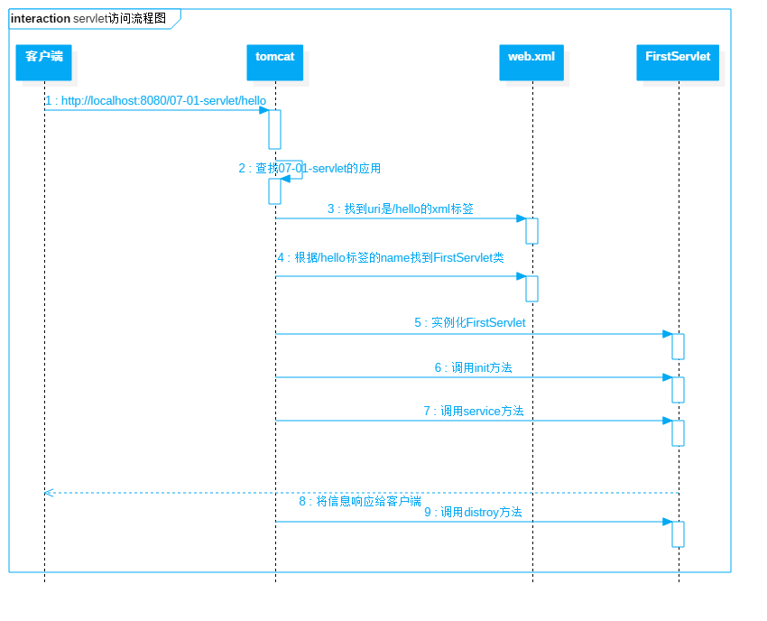
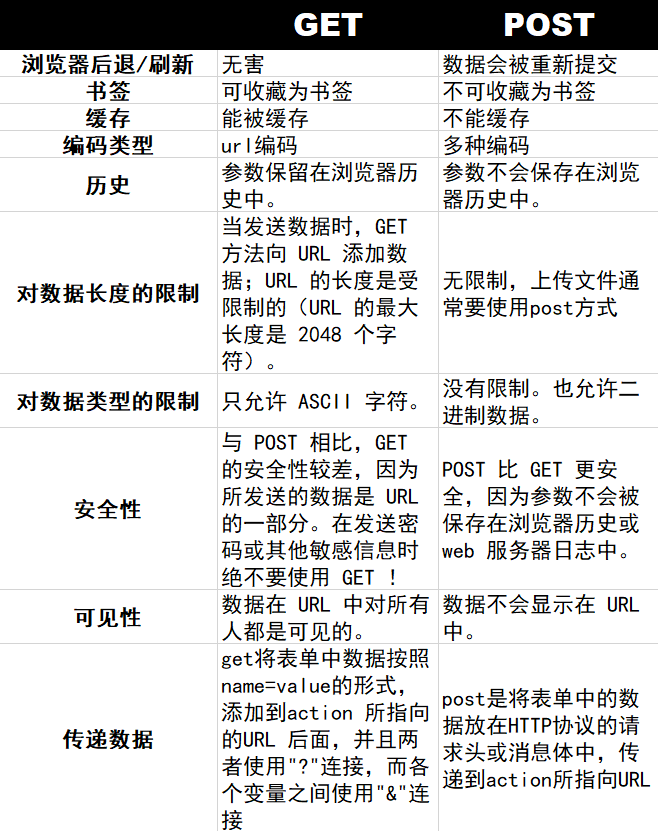

## Servlet

Servlet 是一门用于开发动态 Web 资源的技术，可以运行在 Web 服务器中的小型 Java 程序，有时也叫做服务器端的小应用程序。Servlet 可以通过  HTTP 协议接收和响应来自 Web 客户端的请求

### Servlet 生命周期

1. 初始化阶段：调用 init 方法
2. 响应客户请求阶段：调用 service 方法
3. 终止阶段：调用 destroy 方法

### Servlet 类


### Servlet 工作流程



### Servlet 的特点

* Servlet 是 **单例多线程** 的，只创建一个 Servlet 对象，但是每次请求都会起一个线程并在自己线程栈内存中执行 service 方法。为了保证其线程安全性，一般情况下是 **不建议在 Servlet 类中定义可修改的成员变量**，因为每个线程均可修改这个成员变量，会出现线程安全问题

* 一个 Servlet 实例 **只会执行一次无参构造器与 init 方法**，并且是在 **第一次访问时执行**。用户每提交一次对当前 Servlet 的请求，就会执行一次 service 方法。一个 Servlet 实例只会执行一次 destroy 方法，在应用停止时执行

* 默认情况下，**Servlet 在 Web 容器启动时是不会被实例化的**

- Servlet 主要负责接收用户请求 **HttpServletRequest**，在 doGet，doPost 方法中做相应的处理，并将 HttpServletResponse 反馈给用户。Servlet 可以设置初始化参数，供 Servlet 内部使用

* Servlet 需要部署在 Tomcat 中才能运行，有时 Tomcat 也被称为是 Servlet 的容器

### Servlet 与线程安全

Servlet 不是线程安全的，多线程并发的读写会导致数据不同步的问题。解决的办法是尽量 **不要定义成员变量**，而是要把成员变量分别定义在 doGet 和 doPost 方法内。虽然使用 synchronized 语句块可以解决问题，但是会造成线程的等待

- 多线程的并发的读写 Servlet 类属性会导致数据不同步。但是如果只是并发地读取属性而不写入，则不存在数据不同步的问题。因此 **Servlet 里的只读属性最好定义为 final 类型的**

### 创建 Servlet 的三种方式

* 定一个类实现 javax.servlet.**Servlet** 接口

* 定义一个类继承 javax.servet.**GenericServlet** 类
  * 该类是一个抽象类，实现了 Servlet 接口和 ServletConfig 接口并重写了除了 service 方法以外的全部方法，这样子类在继承 GenericServlet 类时，只需重写 service 方法

* 定义一个类继承 javax.servlet.http.**HttpServlet** 类，实际开发中经常使用继承 HttpServlet 类的方式创建一个 Servlet
  * **HttpServlet 的子类不需要重写 service 方法**，倘若重写了该方法后可能会导致所编写的 Servlet 无法正常工作

#### GenericServlet 类为什么有两个 init 方法

如果在子类中想要调用 init 方法的话，需要重写 init 方法，但这个重写的 init(ServletConfig) 方法 **必须要调用父类的 init(ServletConfig) 方法**，即在第一句必须写上 super.init(config)，否则将无法获取到ServletConfig对象。若 ServletConfig 对象未获取，程序在运行时就有可能会出现空指针异常。为了避免这个问题的出现，在 GenericServlet 类中自己定义了一个 **没有参数的 init 方法**，**该方法就是让子类去重写的**，子类重写该方法时，无需编写 super.init(config)，为了保证该无参方法在初始化时执行，在 init(ServletConfig config) 方法中对其进行了调用

## web.xml

web.xml 属于部署描述符，在整个 Java 中只要是容器都会存在部署描述符，此部署描述符可以控制整个 Web 中各个组件的运行状态，也可以配置整个窗口的状态

- web.xml 配置的时候要注意先后顺序。**监听器 -> 过滤器 -> Servlet**

### 设置欢迎页面

在浏览器地址栏中直接通过项目名称访问时，默认显示的页面就是欢迎页面，可以是 `.html、.jsp`，可以通过 welcome-file-list 进行设置。**可以为应用设置多个欢迎页面，但只会有一个起作用**，系统加载这些欢迎页面的顺序与其代码的顺序相同，即 **由上到下逐个查找**，一旦找到，则马上显示，不会再向下查找

- 如果当前应用没有指定欢迎页面，则系统会从当前项目的根目录下依次查找 index.html、index.htm、index.jsp 文件，**如果这些文件不存在的话，浏览器会报出 404 错误**

及 index.jsp 文件，如果这些文件不存在的话，浏览器会报出 404 错误

### 配置 Servlet

```xml
<!-- 创建一个Servlet实例 -->
<servlet>
    <!-- 为Servlet命名，需与servlet-mapping中的servlet-name一致 -->
	<servlet-name>testServlet</servlet-name>
    <servlet-class>com.test.servlet.TestServlet</servlet-class>
</servlet>

<!-- 为Servlet设置一个可以访问的地址 -->
<servlet-mapping>
	<servlet-name>testServlet</servlet-name>
    <url-pattern>/test</url-pattern>
</servlet-mapping>
```

### load-on-startup

添加 load-on-startup 的作用是，**标记是否在 Tomcat 启动时创建并初始化这个 Servlet实例**。它的值必须是一个 **整数**，表示 Servlet 应该被载入的顺序

- 如果该元素不存在或者这个数为负时，则容器会当该 Servlet 被请求时，再加载
- 当值大于等于 0 时，表示容器在启动时就加载并初始化这个 Servlet，**数值越小，该 Servlet的优先级就越高**，其被创建的也就越早
- 当值相同时，容器会自己选择创建顺序

````xml
<servlet>
	<servlet-name>testServlet</servlet-name>
    <servlet-class>com.test.servlet.TestServlet</servlet-class>
    <load-on-startup>1</load-on-startup>
</servlet>
````

### url-pattern

url-pattern 标签用于对请求进行筛选匹配，对当前注册的 Servlet 所要处理的请求类型进行筛选，**一个 Servlet 可以对应多个 url-pattern**

* 精确路径模式：请求路径必须与 url-pattern 的值完全相同才可被当前 Servlet 处理

* 通配符路径模式：该模式中的路径由精确路径部分与通配符部分两部分组成。请求路径中只有携带了url-pattern 值中指定的精确路径部分才可被当前 Servlet 处理

该模式中的路径由两部分组成：精确路径部分与通配符部分。请求路径中只有携带了url-pattern值中指定的精确路径部分才可被当前 Servlet 处理。

* 后辍名模式：请求路径最后的资源名称必须携带中指定的后辍名，其请求才可被当前 Servlet 处理

* 全路径模式：提交的所有请求全部可被当前的 Servlet 处理，其值可以指定为 `/*` 或 `/`

```xml
<!-- 精确路径模式 -->
<url-pattern>/test/first</url-pattern>

<!-- 通配符路径模式 -->
<url-pattern>/test/*</url-pattern>

<!-- 后缀名路径模式 -->
<url-pattern>*.do</url-pattern>

<!-- 全路径模式 -->
<url-pattern>/</url-pattern>
```

- `/*` 与 `/` 的区别：表示所有请求均会被当前 Servlet 所处理。如果一个 Servlet 的 url-pattern 是 `/*` 或 `/`，则该 Servlet 表示默认映射，**当一个请求找不到相应的 URL 的 Servlet 时，系统会调用这个默认映射的 Servlet**
  - 使用 `/*`：表示当前的 Servlet 会拦截用户对于静态资源（.css、.js、.html、.jpg、.png 等）与动态资源（.jsp 等）的请求。即用户不会直接获取到这些资源文件，而是将请求交给当前 Servlet 来处理了
  - 使用 `/`：表示当前的 Servlet 会拦截用户对于静态资源，**但对于动态资源的请求，是不进行拦截的**。即用户请求的静态资源文件是不能直接获取到的

#### url-pattern 路径优先级

```xml
<!-- 路径优先后缀匹配规则 -->
<url-pattern>/test/*.do</url-pattern>
<url-pattern>/test/*</url-pattern>

<!-- 精确路径优先匹配规则 -->
<url-pattern>/test/first</url-pattern>
<url-pattern>/test/*</url-pattern>

<!-- 最长路径优先匹配规则 -->
<url-pattern>/test/first/*</url-pattern>
<url-pattern>/test/*</url-pattern>
```

## URL 和 URI


- URI（Uniform Resource Identifier）：统一资源标识符，可以唯一标识一个资源

* URL (Uniform Resource Locator）：统一资源定位符，可以提供找到某个资源的路径，例如常见的网址等

* URN（Uniform Resource Name）：是唯一标识的一部分，就是一个特殊的名字

- URN 确定了东西的身份，URL 提供了找到它的方式；URI 强调的是给资源标记命名，URL 强调的是给资源定位，URL 显然比 URI 包含信息更多，大多数情况下 URL 也充当了万维网里面 URI 的角色

## ServletConfig 接口

在 Servlet 接口的 init 方法中有一个参数 ServletConfig，这个参数类型是个接口，里面是一些 在 web.xml 中对当前 Servlet 类的配置信息。Servlet 规范将 Servlet 的配置信息全部封装到了 ServletConfig 接口对象中。在 Tomcat 调用 init 方法时，**首先会将 web.xml 中当前 Servlet 类的配置信息封装为一个对象**。这个对象的类型实现了 ServletConfig 接口， Web 容器会将这个对象传递给 init 方法中的 ServletConfig 参数

- 每一个 Servlet 都对应一个 ServletConfig 用于封装各自的配置信息，即有几个 Servlet 就会产生几个 ServletConfig 对象

### 设置初始化参数

````xml
<servlet>
	<servlet-name>testServlet</servlet-name>
    <servlet-class>com.test.servlet.TestServlet</servlet-class>
    <init-param>
    	<param-name>username</param-name>
        <param-value>jiage</param-value>
    </init-param>
    <init-param>
    	<param-name>password</param-name>
        <param-value>123456</param-value>
    </init-param>
</servlet>
````

### ServletConfig 中的方法

````java
// 获取指定名称的初始化参数值
String getInitParameter(String name)

// 获取当前Servlet所有的初始化参数名称
Enumeration<String> getInitParameterNames()

// 获取当前Servlet的中指定的Servlet名称
String getServletName()

// 获取到当前Servlet的上下文对象ServletContext
ServletContext getServletContext()
````

## ServletContext 接口

Web 容器在启动时，它会为每个 Web 应用程序都创建一个对应的 ServletContext 对象，ServletContext 对象包含 Web 应用中所有 Servlet 在 Web 容器中的一些数据信息。**ServletContext 随着 Web 应用的启动而创建，随着 Web 应用的关闭而销毁。一个 Web 应用只有一个 ServletContext 对象**

* ServletContext 中不仅包含了 web.xml 文件中的配置信息，还包含了当前应用中所有 Servlet 可以共享的数据。即 ServeltContext 可以代表整个应用，所以 ServletContext 有另外一个名称：**Application**
* ServletConfig 对象中维护了 ServletContext 对象的引用，在编写 Servlet 时，可以通过 `ServletConfig.getServletContext()` 获得ServletContext对象

### 设置初始化参数

```xml
<context-name>
	<param-name>MySQLDriver</param-name>
    <param-value>com.mysql.jdbc.Driver</param-value>
</context-name>

<context-name>
	<param-name>dbURL</param-name>
    <param-value>jdbc:mysql:</param-value>
</context-name>
```

### ServletContext 中常用方法

````java
// 获取web.xml文件的中指定名称的上下文参数值
String getInitParameter()

// 获取web.xml文件的中的所有的上下文参数名称
Enumeration getInitParameterNames()：

// 在ServletContext的公共数据空间中，也称为域属性空间，放入数据
// 这些数据对于 Web应用来说，是全局性的，与整个应用的生命周期相同
void setAttribute(String name, Object object)

// 从ServletContext的域属性空间中获取指定名称的数据
Object getAttribute(String name)

// 从ServletContext的域属性空间中删除指定名称的数据
void removeAttribute(String name)

// 获取当前Web应用中指定文件或目录在本地文件系统中的路径
String getRealPath(String path)

// 获取当前应用在Web容器中的名称
String getContextPath()
````

## HttpServletRequest

Web 服务器收到客户端的 HTTP 请求，会针对每一次请求，创建一个用于代表请求的 HttpServletRequest 类型的 request 对象，并将 HTTP 请求协议的完整内容封装到该对象中。开发者获拿到 request 对象后就可以获取客户端发送给服务器的请求数据了

### HttpServletRequest 的生命周期

当客户端浏览器向服务器发送请求后，服务器会根据 HTTP 请求协议的格式对请求进行解析。同时服务器会创建  HttpServletRequest 类型的对象，**即请求对象**，然后将解析出的数据封装到该请求对象中。此时 HttpServletRequest 实例就创建并初始化完毕了，即 **请求对象是由服务器创建**。**当服务器向客户端发送响应结束后，HttpServletRequest 实例对象被服务器销毁**，HttpServletRequest 对象的生命周期很短暂

- **一次请求对应一个请求对象**， 另外一次请求对应另外一个请求对象，即每次请求都会创建一个 HttpServletRequest 类型的对象，这些对象之间没有关系

### HttpServletRequest 中常用的方法

````java
// 获得客户机请求头
String getHeader(String name)
Enumeration getHeaders(String name)
Enumeration getHeaderNames()

// 获得客户机请求参数，即客户端提交的数据
// 编写框架时常用。获取包含所有请求参数及值的Map对象。需要注意，该Map的value为String[]，即一个参数所对应的值为一个数组。说明一个参数可以对应多个值
Map getParameterMap()

// 根据指定的请求参数名称，获取其对应的所有值。这个方法一般用于获取复选框数据
String[] getParameterValues(String name)

// 根据指定的请求参数名称，获取其对应的值。若该参数名称对应的是多个值，则该方法获取到的是第一个值
String getParameter(String name)

// 获取客户端信息的方法
// 返回客户端发出请求时的完整URL
String getRequestURL()

// 返回请求行中的资源名部分
String getRequestURI()

// 返回发出请求的客户机的IP地址
String getRemoteAddr()

// 返回发出请求的客户机的完整主机名
String getRemoteHost()

// 返回客户机所使用的网络端口号
String getRemotePort()

// 返回Web服务器的IP地址
String getLocalAddr()

// 返回Web服务器的主机名
String getLocalName()

// 得到客户机请求方式
String getMethod()
````

#### request.getAttribute() 和 request.getParameter() 的区别

- getAttribute 返回的是 **Object**，需进行转换，可用 setAttribute 设置成任意对象，使用很灵活，可随时用

- getParameter 返回的是 **String**，用于读取提交的表单中的值，获取之后会根据实际需要转换为自己需要的相应类型，如整型，日期类型等

## 数据空间范围对比

在 JavaWeb 编程的 API 中，存在三个可以存放数据的空间范围对象，按所存储的数据作用范围，由大到小分别为：ServletContext、HttpSession、HttpServletRequest

- ServletContext：即 Application，置入其中的数据是整个 Web 应用范围的，可以完成 **跨会话共享数据**

- HttpSession：置入其中的数据是会话范围的，可以完成 **跨请求共享数据**
- HttpServletRequest：置入其中的数据是请求范围的，可以完成 **跨 Servlet 共享数据**。但这些 Servlet 必须在同一请求中

对于这三个域属性空间对象的使用原则是，在可以保证功能需求的前提下，优先使用小范围的。这样不仅可以节省服务器内存，还可以保证数据的安全性

## 乱码

当用户通过浏览器提交一个包含 UTF-8 编码格式的两个中文请求时，浏览器会将这两个中文字符变为 6 个字节，即形成 6 个类似 `%8E` 的字节表示形式，并将这 6 个字节上传至 Tomcat 服务器。Tomcat 服务器在接收到这 6 个字节后，并不知道它们原始采用的是什么字符编码。**而 Tomcat 默认的编码格式为 ISO-8859-1**。所以会将这 6 个字节按照 ISO-8859-1 的格式进行解码，解码后在控制台显示，所以在控制台会显示乱码

### 乱码的解决

#### 针对 POST 提交乱码的解决方式

在接收请求参数之前先通过 request 的 **setCharacterEncoding** 方法，指定请求体的字符编码格式。这样的话，在接收到请求中的参数后，就可按照指定的字符编码进行解码

- request 的 setCharacterEncoding 方法只能解决 POST 提交方式中的乱码问题，对于 GET 提交方式的不起作用。因为该方法设置的是 **请求体** 中的字符编码，**GET 提交中的参数不出现在请求体中，而出现在请求行**

#### 针对 GET 提交乱码的解决方式

可以通过修改 Tomcat 默认字符编码的方式来解决 GET 提交方式中携带中文的乱码问题。在 Tomcat 安装目录的 `conf/server.xml` 中，找到端口号为 8080 的标签，在其中添加 **`URIEncoding=”UTF-8″`** 的设置，即可将 Tomcat 默认字符编码修改为 UTF-8

#### 万能解决方案

- 代码量较大，开发中使用较少

````java
// 获取用户在input中填写的值
String username = request.getParameter("username");

// 将数据按照ISO8859-1编码后放到字节数组中
byte[] bytes = username.getBytes("ISO8859-1");

//将字节数组按照UTF-8解码为字符串
username = new String(bytes,"UTF-8");
````

## HttpServletResponse

Web 服务器收到客户端的 HTTP 请求，会针对每一次请求，分别创建一个用于代表响应的 HttpServletResponse 类型的 response 对象，开发者可以将要向客户端返回的数据封装到 response 对象中。这个对象中封装了向客户端发送数据、发送响应头，发送响应状态码的方法

### HttpServletResponse 向客户端发送数据

````java
// 两个方法不能同时使用
OutputStream op = response.getOutputStream();
byte[] b = str.getBytes("utf-8");
op.write(b);

PrintWriter out = response.getWriter();
out.write(str);
````

使用 PrintWriter 流处理字节数据，会导致数据丢失，因此在编写下载文件功能时，要使用 OutputStream 流，避免使用 PrintWrite r流，因为 OutputStream 流是字节流，可以处理任意类型的数据，而 PrintWriter 流是字符流，只能处理字符数据，如果用字符流处理字节数据，会导致数据丢失

- Servlet 向 OutputStream 或 PrintWriter 对象中写入的数据将 **被 Servlet 引擎从 response 里面获取**，Servlet 引擎将这些数据当作响应消息的正文，然后再与响应状态行和各响应头组合后输出到客户端

- Serlvet 的 service 方法结束后，Servlet 引擎将检查 getWriter 或 getOutputStream 方法返回的输出流对象是否已经调用过 close 方法，如果没有，Servlet 引擎将调用 close 方法关闭该输出流对象

### HttpServletResponse 响应乱码的解决方案

响应时会产生乱码的原因是在 HTTP 协议中规定，默认响应体的字符编码为 ISO-8859-1。所以，若要解决乱码问题，就需要修改响应体的默认编码。一般情况下，有两种方式可以修改：

* HttpServletResponse 的 **`setCharacterEncoding(“utf-8”)`** 方法，将编码修改为 UTF-8，然后再通过 **`setHead(“Content-type”,”text/html;charset=UTF-8″)`** 方法告诉客户端浏览器的编码方式
* 为了简便操作，开发者可以直接使用 HttpServletResponse 的 **`setContentType(“text/html;charset=utf-8”)`**方法，告诉浏览器的编码方式，该方法相当于方法一种的两条代码

* 注意，设置响应编码时必须在 PrintWriter 对象产生之前先设置，否则将不起作用

## GET 和 POST请求的区别



## 转发与重定向

### 转发（Forword）

转发是指浏览器发送请求到 Servlet1 之后，Servlet1 需要访问 Servlet2，因此在服务器内部跳转到的 Servlet2，转发有时也称为 **服务器内跳转**。整个过程浏览器 **只发出一次请求，服务器只发出一次响应**

- 整个过程中，只存在一次请求，即用户所提交的请求。因此 Servlet1 和 Servlet2 均可从这个请求中获取到用户提交请求时所携带的相关数据

### 重定向（Redirect）

重定向是浏览器发送请求到 Servlet1 之后，Servlet1 需要访问 Servlet2，但并未在服务器内直接访问，而是 **由服务器自动向浏览器发送一个响应，浏览器再自动提交一个新的请求**，这个请求就是对 Servlet2 的请求。对于 Servlet2 的访问，是先由服务器响应客户端浏览器，再由客户端浏览器向服务器发送对 Servlet2 的请求，所以重定向有时又称为 **服务器外跳转**

- 整个过程中，**浏览器共提交了两次请求，服务器共发送了两次响应**。只不过，第一次响应与第二次请求，对于用户来说是透明的，是感知不到的。用户认为，自己只提交了一次请求，且只收到了一次响应

### 转发和重定向的区别

|            |                             转发                             |                            重定向                            |
| ---------- | :----------------------------------------------------------: | :----------------------------------------------------------: |
|            |                          服务器行为                          |                          客户端行为                          |
| 请求响应   |                 只发出一次请求，收到一次响应                 |                 发出两次请求，接收到两次响应                 |
| 跳转       |                  只能跳转到当前应用的资源中                  | 不仅可以跳转到当前应用的其它资源，也可以跳转到到其它应用中资源 |
| 地址栏显示 | 转发是服务器请求资源，服务器直接访问目标地址的 URL,把那个 URL 的响应内容读取过来，然后把这些内容再发给浏览器。浏览器根本不知道服务器发送的内容从哪里来的，所以它的地址栏还是原来的地址 | 重定向是服务端根据逻辑，发送一个状态码，告诉浏览器重新去请求那个地址，所以地址栏显示的是新的 URL |
| 数据共享   |      转发页面和转发到的页面可以共享 request 里面的数据       |                         不能共享数据                         |
| 使用场景   |       一般用于用户登陆的时候，根据角色转发到相应的模块       |     一般用于用户注销登陆时返回主页面和跳转到其它的网站等     |
| 效率       |                              高                              |                              低                              |
|            |                     不会执行转发后的代码                     |                      会执行转发后的代码                      |

* 转发通过 RequestDispatcher 对象的 **`forward(HttpServletRequest request,HttpServletResponse response)`** 方法实现的。RequestDispatcher 可以通过 HttpServletRequest 的 getRequestDispatcher 方法获得
  * `request.getRequestDispatcher("/test.jsp").forward(request, response)`

* 重定向是利用服务器返回的状态码来实现的。客户端浏览器请求服务器的时候，服务器会返回一个状态码。服务器通过 HttpServletResponse 的 `setStatus(int status)` 方法设置状态码。如果服务器返回 301 或 302，则浏览器会到新的网址重新请求该资源。sendRedirect 内部的实现原理：使用 response 设置 302 状态码和设置 location 响应头实现重定向
  * `response.sendRedirect("/test.jsp")`

### 请求转发与重定向的选择

- 若需要跳转到其它应用，则使用重定向
- 若是处理表单数据的 Servlet1 要跳转到另外的 Servlet2 上，则需要选择重定向，为了 **防止表单重复提交**
- 若对某一请求进行处理的 Servlet 的执行需要消耗大量的服务器资源（CPU、内存），此时这个 Servlet 执行完毕后，也需要重定向
- 其它情况，一般使用请求转发

## Cookie 与 Session

### Cookie

因为 HTTP 协议是无状态的，即服务器不知道用户上一次做了什么，这严重阻碍了交互式 Web 应用程序的实现。服务器可以设置或读取 Cookie 中包含信息，借此维护用户跟服务器会话中的状态

- Cookie 是由服务端生成的，发送给客户端的。**Cookie 总是保存在客户端中**，按在客户端中的存储位置，可分为内存 Cookie 和硬盘 Cookie
  - 内存 Cookie 由浏览器维护，保存在内存中，浏览器关闭后就消失了，其存在时间是短暂的
  - 硬盘 Cookie 保存在硬盘里，有一个过期时间，除非用户手工清理或到了过期时间，硬盘 Cookie 不会被删除，其存在时间是长期的
  - 所以按存在时间，可分为非持久 Cookie 和持久 Cookie

- 一个 Web 站点可以给一个 Web 浏览器发送多个 Cookie，一个 Web 浏览器也可以存储多个 Web 站点提供的Cookie
- 不同的 Web 服务器在客户端所生成的 Cookie 之间是不能相互访问和共享的

* 浏览器一般只允许存放 **300 个 Cookie**，每个站点最多存放 **20 个 Cookie**，每个 Cookie 的大小限制为 **4KB**

#### 设置绑定路径

````java
Cookie cookie = new Cookie("username","1234");
cookie.setPath(request.getContextPath() + "/test");
````

#### 获取 Cookie

````java
Cookie[] cookie = request.getCookies();
for(Cookie c : cookie){
    System.out.println("name: " + c.getName());
    System.out.println("value: " + c.getValue());
}
````

#### 设置 Cookie 的有效时长

**默认情况下，Cookie 是保存在浏览器的缓存中的**，关闭浏览器后 Cookie 也就消失了。开发者可以通过设置 Cookie 的有效时长，将 Cookie 写入到客户端硬盘文件中

* 设置有效时长：**`void setMaxAge(int expiry)`**，其中 expiry 的单位为 **秒**，整型
  * 大于 0，则表示要将 Cookie 写入到硬盘文件中
  * 小于 0，则表示 Cookie 存放在浏览器缓存中，与不设置时长等效
  * 等于 0，则表示 Cookie产生后直接失效

#### Cookie 的工作原理

1. 创建 Cookie：当用户第一次浏览某个使用 Cookie 的网站时，该网站的服务器就进行如下工作
   1. 该用户生成一个唯一的识别码（**Cookie ID**），创建一个 Cookie 对象
   2. 默认情况下它是一个会话级别的 Cookie，存储在浏览器的内存中，用户退出浏览器之后被删除。如果网站希望浏览器将该 Cookie 存储在磁盘上，则需要设置最大时效
   3. 将 Cookie 放入到 HTTP 响应报头，将 Cookie 插入到一个 Set-Cookie HTTP 请求报头中
   4. 发送该 HTTP 响应报文

2. 设置存储 Cookie：浏览器收到该响应报文之后，根据报文头里的 Set-Cookied 特殊的指示，生成相应的 Cookie，保存在客户端，该 Cookie 里面记录着用户当前的信息

3. 发送 Cookie：当用户再次访问该网站时，浏览器首先检查所有存储的 Cookie，如果某个存在该网站的 Cookie，则把该 Cookie 附在请求资源的 HTTP 请求头上发送给服务器

4. 读取 Cookie：服务器接收到用户的 HTTP 请求报文之后，从报文头获取到该用户的 Cookie，从里面找到所需要的东西

### Session

Session 代表服务器与浏览器的一次会话过程，这个过程是连续的，也可以时断时续的。Session 是一种服务器端的机制，Session 对象用来存储特定用户会话所需的信息。Session 由服务端生成，保存在服务器的内存、缓存、硬盘或数据库中

#### Session 的失效

若某个 Session 在指定的时间范围内一直未被访问，那么 Session 将超时，即将失效。在 web.xml 中可以通过标签设置 Session 的超时时间，**单位为分钟**。**默认 Session 的超时时间为 30 分钟**。这个时间并不是从 Session 被创建开始计时的生命周期时长，而是从 **最后一次被访问开始计时，在指定的时长内一直未被访问的时长**

````xml
<session-config>
	<session-timeout>60</session-timeout>
</session-config>
````

可以在 Servlet 中调用 Session 中的 invalidate 方法使 Session 失效，invalidate 方法是指清空 Session 对象里的东西，并不指清除这个 Session 对象本身，**`setMaxInactiveInterval(int interval)`** 可以设置超时时间

#### Session 的工作原理

服务器会为每个浏览器分配一个 Session，**每个浏览器只能访问自己的 Session 对象**，可 HTTP 协议是无状态的，那服务器是如何识别这些浏览器的呢？服务器对 Session 对象是以 **Map** 的形式进行管理的，每创建一个 Session 对象，服务器都会向该 Map 中的 key 放入一个 **32 位长度的随机串**，这个随机串称为 **SessionID**，之后将该 Session 对象的引用放入到 map 的 value 中

Session 放入 Map 之后，服务器还会自动将 SessionID 作为 name，32 位长度的随机串作为 value，放到 Cookie 中并发送到客户端。该 Cookie 会默认放到浏览器的缓存中，只要浏览器不关闭就一直存在。当浏览器第二次向服务器发送请求时会携带该 Cookie，服务器接收到之后会根据 SessionID 从 Map 中找到与之对应的  Session 对象

### Cookie 和 Session 的区别

|              |                            Cookie                            |                           Session                            |
| :----------: | :----------------------------------------------------------: | :----------------------------------------------------------: |
| 数据存放位置 |                     存放在客户的浏览器上                     |                        存放在服务器上                        |
|   安全程度   | 不是很安全，别人可以分析存放在本地的 Cookie 并进行 Cookie 欺骗，考虑到安全应当使用 Session |                                                              |
| 性能使用程度 |                                                              | 会在一定时间内保存在服务器上。当访问增多，会比较占用服务器的性能，考虑到减轻服务器性能方面，应当使用 Cookie |
| 数据存储大小 | 单个 Cookie 保存的数据不能超过 4KB，很多浏览器都限制一个站点最多保存 20 个 Cookie |               存储在服务端，浏览器对其没有限制               |

## 监听器

监听器就是一个实现特定接口的普通 Java 程序，这个程序专门用于监听另一个 Java 对象的方法调用或属性改变，当被监听对象发生上述事件后，监听器某个方法将立即被执行

### Java 的事件监听机制

事件监听涉及到 3 个组件：**事件源、事件对象、事件监听器**

- 当事件源上发生某一个动作时，它会调用事件监听器的一个方法，并在调用该方法时把事件对象传递进去，开发人员在监听器中通过事件对象，就可以拿到事件源，从而对事件源进行操作

### Servlet 中的监听器

Servlet 中的监听器是用于监听 Web 常见对象 HttpServletRequest、HttpSession、ServletContext。主要有下面三个作用

- 监听 Web 对象创建与销毁
- 监听 Web 对象的属性变化，添加、删除、修改
- 监听 Session 绑定 JavaBean 操作，活化（从硬盘读取到内存）与钝化（从内存持久化到硬盘）操作

### 创建监听器的步骤

1. 创建一个类，实现指定的监听器接口
2. 重写接口中的方法
3. 在 web.xml 文件中配置监听器

### 监听器的配置

````xml
<listener>
	<listener-class>com.test.listener.FirstListener</listener-class>
</listener>
````


### 监听器的分类

- 监听 Web 对象创建与销毁
  - ServletContextListener
  - HttpSessionListener
  - ServletRequestListener
- 监听 Web 对象属性变化
  - ServletContextAttributeListener
  - HttpSessionAttributeListener
  - ServletRequestAttributeListener
- 监听 Session 绑定 JavaBean 操作
  - HttpSessionBindingListener
  - HttpSessionActivationListener

### 监听 Web 对象属性变化的监听器

三个接口中都定义了三个方法来处理被监听对象中的属性的增加，删除和替换的事件，同一个事件在这三个接口中对应的方法 **名称完全相同，只是接受的参数类型不同**

````java
void attributeAdded(ServletContextAttributeEvent scae)
    
void attributeReplaced(HttpSessionBindingEvent hsbe)
    
void attributeRemoved(ServletRequestAttributeEvent srae)
````

### 感知 Session 绑定的事件监听器

保存在 Session 域中的对象可以有多种状态

- 绑定（`session.setAttribute("bean",Object)`）到 Session 中
- 从 Session 域中解除绑定（`session.removeAttribute("bean")`）
- 随 Session 对象持久化到一个存储设备中
- 随 Session 对象从一个存储设备中恢复

Servlet 规范中定义了两个特殊的监听器接口 HttpSessionBindingListener 和 HttpSessionActivationListener 来帮助 JavaBean 对象了解自己在 Session 域中的这些状态，**实现这两个接口的类不需要 web.xml 文件中进行注册**

#### HttpSessionBindingListener 接口

实现了 HttpSessionBindingListener 接口的 **JavaBean对象** 可以感知自己被绑定到 Session 中和 Session 中删除的事件

````java
// 当对象被绑定到 HttpSession 对象中时，Web 服务器调用该对象的valueBound方法
void valueBound(HttpSessionBindingEvent event)
    
// 当对象从HttpSession对象中解除绑定时，Web 服务器调用该对象的valueUnbound方法
void valueUnbound(HttpSessionBindingEvent event)
````

#### HttpSessionActivationListener 接口

实现了 HttpSessionActivationListener 接口的 **JavaBean对象** 可以感知自己被活化（反序列化）和钝化（反序列化）的事件

- 当绑定到 HttpSession 对象中的 JavaBean 对象将要随 HttpSession 对象被钝化之前，Web 服务器调用该 JavaBean 对象的 `void sessionWillPassivate(HttpSessionEvent event)` 方法。这样 JavaBean 对象就可以知道自己将要和 HttpSession 对象一起被 **序列化到硬盘中**

- 当绑定到 HttpSession 对象中的 JavaBean 对象将要随 HttpSession 对象被活化之后，Web 服务器调用该 JavaBean 对象的 `void sessionDidActive(HttpSessionEvent event)` 方法。这样 JavaBean 对象就可以知道自己将要和 HttpSession 对象一起被 **反序列化回到内存中**

### 监听在 Session 中存放的指定类型对象的钝化与活化

HttpSessionActivationListener 用于监听在 Session 中存放的指定类型对象的钝化与活化。**钝化是指将内存中的数据写入到硬盘中，而活化是指将硬盘中的数据恢复到内存**。当用户正在访问的应用或该应用所在的服务器由于种种原因被停掉，然后在短时间内又重启，此时用户在访问时 Session 中的数据是不能丢掉的，在应用关闭之前，需要将数据持久化到硬盘中，在重启后应可以立即重新恢复 Session 中的数据，这就称为 Session 的钝化与活化

Session 中的数据只有 **存放在 JVM 堆内存中的实现了 Serializable 接口的对象** 能够被钝化。即对于字符串常量、基本数据类型常量等存放在 JVM 方法区中常量池中的常量，是无法被钝化的。如果 Session 中的 JavaBean 对象没有实现 Serializable 接口，那么服务器会先把 Session 中没有实现 Serializable 接口的 JavaBean 对象移除，然后再把 Session 序列化到硬盘中。对于监听 Session 中对象数据的钝化与活化，需要注意以下几点

* 实体类除了要实现 HttpSessionActivationListener 接口外，还需要实现 Serializable 接口

* 钝化指的是 Session 中 **对象数据的钝化**，并非是 Session 的钝化。所以 **Session 中有几个可以钝化的对象，就会发生几次钝化**

## Filter

Filter 是 Servlet 规范的三大组件之一，另外两个分别是 Servlet 和 Listener。Filter 也称为过滤器，**可以在请求到达目标资源之前先对请求进行拦截过滤**，即对请求进行一些处理；**也可以在响应到达客户端之前先对响应进行拦截过滤**，即对响应进行一些处理

通过 Filter 技术，可以对 Web 服务器管理的所有 Web 资源，如 JSP、Servlet、静态图片文件、静态 HTML 文件等进行拦截，从而实现一些特殊的功能。如实现 URL 级别的权限访问控制、过滤敏感词汇、压缩响应信息、计算系统的响应时间等一些高级功能

Servlet API中提供了一个Filter接口，开发web应用时，如果编写的Java类实现了这个接口，则把这个java类称之为过滤器Filter。通过Filter技术，开发人员可以实现用户在访问某个目标资源之前，对访问的请求和响应进行拦截

### Filter 的特点

* Filter 是 **单例多线程** 的。所以为了保证其线程安全性，一般情况下是 **不为 Filter 类定义可修改的成员变量的**。因为每个线程均可修改这个成员变量，会出现线程安全问题
* Filter 是在 **应用被加载时创建并初始化**，这是与 Servlet 不同的地方。Servlet 是在该 Servlet 被第一次访问时创建。Filter 与 Servlet的共同点是，**其无参构造器与 init 方法只会执行一次**
* 用户每提交一次该 Filter 可以过滤的请求，服务器就会执行一次 doFilter 方法，即 **doFilter 方法是可以被多次执行的**
* 当应用被停止时执行 destroy 方法，Filter 被销毁，即 **destroy 方法只会执行一次**

### Filter 接口

在 Servlet 规范中，有一个 javax.servlet.Filter 接口。实现了该接口的类称为过滤器，接口中有三个方法可以重写

````java
// 初始化方法，即Filter被创建后，在后面用到的资源的初始化工作，可以在这里完成
void init(FilterConfig config)

// Filter的核心方法，对于请求与响应的过滤，就是在这个方法中完成的
void doFilter(ServletRequest req,ServletResponse res,FilterChain chain)

// 销毁方法，Filter被销毁前所调用执行的方法。对于资源的释放工作，可以在这里完成
void destroy()
````

### Filter 拦截机制

Filter 接口中有一个 doFilter 方法，当编写好 Filter，并配置对哪个 Web 资源进行拦截后，Web 服务器每次在调用 Web 资源的 service 方法之前，都会先调用一下 Filter 的 doFilter 方法，因此，在该方法内编写代码可达到如下目的

* 调用目标资源之前，让一段代码执行

* 是否调用目标资源，即是否让用户访问 Web 资源

* 调用目标资源之后，让一段代码执行

Web 服务器在调用 doFilter 方法时，会传递一个 filterChain 对象进来，filterChain 对象是 Filter 接口中最重要的一个对象，它也提供了一个 doFilter 方法，在 Filter 的 doFilter 方法内如果没有执行 `doFilter(request, response)` 方法，那么服务器中的资源是不会被访问到的。开发人员可以根据需求决定是否调用此方法，调用该方法，则 Web 服务器就会调用 Web 资源的 service 方法，即 Web 资源就会被访问，否则 Web 资源不会被访问

### Filter 的生命周期

- 当服务器启动，会创建 Filter 对象，并调用 init 方法，只调用一次
- 当访问资源时，路径与 Filter 的拦截路径匹配，会执行 Filter 中的 doFilter 方法，这个方法是真正拦截操作的方法
- 当服务器关闭时，会调用 destroy 来进行销毁操作

### Filter 的三种典型应用

- 可以在 Filter 中根据条件决定是否调用 `chain.doFilter(request, response)` 方法，即是否让目标资源执行

- 在让目标资源执行之前，可以对 request 或 response 作预处理，再让目标资源执行
- 在目标资源执行之后，可以捕获目标资源的执行结果，从而实现一些特殊的功能

### Filter 的配置

````xml
<filter>
	<filter-name>testFilter</filter-name>
    <filter-class>com.test.filter.TestFilter</filter-class>
</filter>

<filter-mapping>
	<filter-name>testFilter</filter-name>
    <url-pattern>/*</url-pattern>
</filter-mapping>
````

* Filter 的全路径匹配只支持 `/*`，不支持 `/`

### Filter、Listener、Servlet 执行顺序

启动的顺序为 Listener -> Filter -> Servlet

* 执行的顺序不会因为三个标签在配置文件中的先后顺序而改变

### FilterConfig 接口

用户在配置 Filter 时，可以使用 init-param 标签为 Filter 配置一些初始化参数，当 Web 容器实例化 Filter 对象，调用其 init 方法时，会把封装了 Filter 初始化参数的 filterConfig 对象传递进来。**FilterConfig 接口中的方法与 ServletConfig 接口中的方法，方法名与意义完全相同**

````java
// 得到Filter的名称
String getFilterName()

// 返回在部署描述中指定名称的初始化参数的值。如果不存在返回Null
String getInitParameter(String name)

// 返回过滤器的所有初始化参数的名字
Enumeration getInitParameterNames()

// 返回Servlet上下文对象的引用
ServletContext getServletContext()
````

### dispatcher **标签**

在 filter-mapping 中有一个子标签 dispatcher，用于设置过滤器所过滤的请求类型。有 4 种取值：**FORWARD、INCLUDE、REQUEST、ERROR**

- FORWARD：若请求是由一个 Servlet 通过 RequestDispatcher 的 forward 方法所转发的，那么这个请求将被值为 FORWARD 的 Filter 拦截。即当前 Filter **只会拦截由 RequestDispatcher 的 forward方法所转发的请求**，其它请求均不拦截

- INCLUDE：当前 Filter **只会拦截由 RequestDispatcher 的 include 方法所转发的请求**，其它请求均不拦截

- REQUEST：默认值。即不设置 dispatcher 标签，也相当于指定了其值为 REQUEST。**只要请求不是由  RequestDispatcher 的 forward 方法或 include 方法转发的，那么该 Filter 均会被拦截，即使是向错误页面的跳转请求，同样会被拦截**

* ERROR：在 web.xml 中可以配置错误页面 error-page，**当发生指定状态码的错误后，会跳转到指定的页面**。而这个跳转同样是发出的请求。若的值设置为 ERROR，则当前过滤器只会拦截转向错误页面的请求，其它请求不会拦截

### 多个 Filter 的执行过程

若 Web 应用中配置了多个 Filter，那么这些 Filter 的执行过程是 **以链的方式** 执行的，即会将这些与请求相匹配的 Filter 串成一个可执行的链，然后按照这个链中的顺序 **依次执行**。这些 Filter 在链中的顺序与它们在 web.xml 中的 **注册顺序** 相同，即 web.xml 中的注册顺序就是 Filter 的执行顺序

一个 Filter 的执行完毕，转而执行另一个 Filter，这个转向工作是由 FilterChain 的 **doFilter 方法** 完成的。若当前 Filter 是最后一个 Filter，则 FilterChain 的 doFilter 方法会 **自动转向最终的请求资源**。当请求到达 Filter 后，Filter 可以拦截到请求对象，并对请求进行修改。修改过后，再将该修改过的请求转向下一个资源。当最终的资源执行完毕，并形成响应对象后，**会按照请求访问 Filter 的倒序**，再次访问 Filter。此时 Filter 可以拦截到响应对象，并对响应进行修改。最终，客户端可以收到已被修改过的响应

## JSP

JSP 是一种 Servlet，但与 HttpServlet 的工作方式不太一样。HttpServlet 是先由源代码编译为 class 文件后部署到服务器下，为先编译后部署。而 **JSP 则是先部署后编译**。JSP 会在客户端第一次请求 JSP 文件时被编译为 HttpJspPage 类（接口 Servlet 的一个子类）。该类会被服务器 **临时存放在服务器工作目录里面**。

由于 JSP 只会在客户端第一次请求的时候被编译 ，因此第一次请求 JSP 时会感觉比较慢，之后就会感觉快很多。如果把服务器保存的 class 文件删除，服务器也会重新编译 JSP

开发 Web 程序时经常需要修改 JSP。Tomcat 能够自动检测到 JSP 程序的改动。如果检测到 JSP 源代码发生了改动。Tomcat 会在下次客户端请求 JSP 时重新编译 JSP，而不需要重启 Tomcat。这种自动检测功能是默认开启的，检测改动会消耗少量的时间，在部署 Web 应用的时候可以在 web.xml 中关闭

### JSP 与 Servlet 的区别

- JSP 的本质就是 Servlet，是 Servlet 的一种简化，JSP 经编译后就变成了 Servlet
- JSP 更擅长表现于 **页面显示**、Servlet 更擅长于 **逻辑控制**
- JSP 中的内置对象都是必须通过 **HttpServletRequest 对象，HttpServletResponse 对象、HttpServlet 对象** 得到，**Servlet 中没有内置对象**

### JSP 隐式对象

- request：
- response：
- pageContext：
- session：
- application：
- out：
- config：
- page：
- exception：

#### 作用域

|  隐式对象   |                |                         作用                          |   作用域    |
| :---------: | :------------: | :---------------------------------------------------: | :---------: |
|   request   |    请求对象    | 封装客户端的请求，其中包含来自 GET 或 POST 请求的参数 |   Request   |
|  response   |    响应对象    |               封装服务器对客户端的响应                |    Page     |
| pageContext | 页面上下文对象 |              通过该对象可以获取其他对象               |    Page     |
|   session   |    会话对象    |                  封装用户会话的对象                   |   Session   |
| application |  应用程序对象  |               封装服务器运行环境的对象                | Application |
|     out     |    输出对象    |              输出服务器响应的输出流对象               |    Page     |
|   config    |    配置对象    |                  Web 应用的配置对象                   |    Page     |
|    page     |    页面对象    |       JSP 页面本身（相当于 Java 程序中的 this）       |    Page     |
|  exception  |    例外对象    |                封装页面抛出异常的对象                 |    Page     |

### JSP 4种属性范围

- Application：服务器启动到停止这段时间，应用级别，在所有应用程序中有效，当重启服务器时才会消失
- Session：HTTP 会话开始到结束这段时间，会话级别，在当前会话中有效
- Request：HTTP 请求开始到结束这段时间，请求级别，在当前请求中有效，**一次请求之后消失**
- Page：当前页面从打开到关闭这段时间，页面级别，在当前页面有效

### 页面间对象传递的方法

Request、Session、Application、Cookie

### 动态引入和静态引入的区别

- 动态引入会生成 **两个 Java 文件**，两个 JSP 文件中 **不可以共享同一个变量，可以定义重名的变量**
- 静态引入会生成 **一个 Java 文件**，两个 JSP 文件中 **可以共享同一个变量，但不能定义重名的变量**

### EL 表达式

EL 表达式只能从 pageConext、request、session、application 四大域属性空间中获取数据
