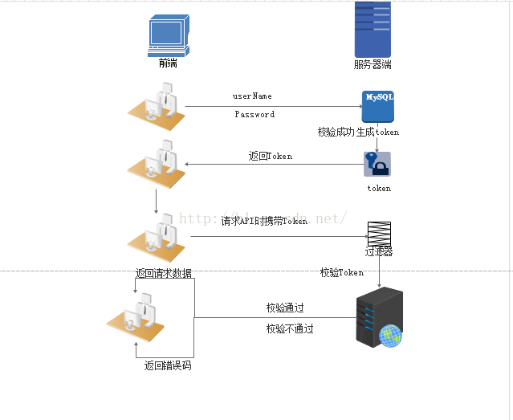
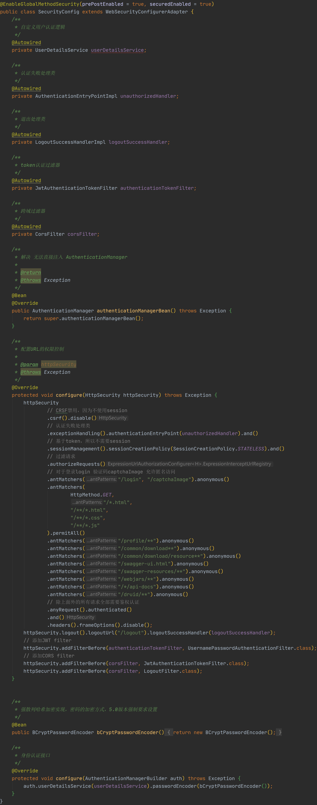

## 认证、授权、鉴权和权限控制

### 认证（Identification）

根据声明者所特有的识别信息，确认声明者的身份，最常见的认证实现方式是通过用户名和密码

### 授权（Authorization）

资源所有者委派执行者，赋予执行者指定范围的资源操作权限，以便执行者代理执行对资源的相关操作

- 资源所有者：拥有资源的所有权利，一般就是资源的拥有者
- 资源执行者：被委派去执行资源的相关操作
- 操作权限：可以对资源进行的某种操作
- 资源：有价值的信息或数据等，受到安全保护

资源所有者和执行者可以是分开的不同实体，也可以是同一个。若是分开的两者，则资源执行者是以资源所有者的代理形式而存在

授权实现方式主要通过一个共信的媒介完成，这个媒介不可被篡改，不可随意伪造，很多时候需要受保护，防止被窃取。在互联网应用开发领域，授权所用到的授信媒介主要包括如下几种

- 通过 Web 服务器的 Session 机制，一个访问会话保持着用户的授权信息
- 通过 Web 浏览器的 Cookie 机制，一个网站的 Cookie 保持着用户的授权信息
- 颁发授权令牌（token），一个合法有效的令牌中保持着用户的授权信息

前面两者常见于 Web 开发，需要有浏览器的支持

### 鉴权（Authentication）

对于一个声明者所声明的身份权利，对其所声明的真实性进行鉴别确认的过程。鉴权是一个承上启下的一个环节，接受授权的输出，校验其真实性后，然后获取权限，这个将会为下一步的权限控制做好准备

### 权限控制（Access / Permission Control）

对可执行的各种操作组合配置为权限列表，然后根据执行者的权限，若其操作在权限范围内，则允许执行，否则禁止

### 认证、授权、鉴权和权限控制的关系

认证、授权、鉴权和权限控制这四个环节是一个前后依次发生、上下游的关系

### 认证和鉴权的关系

- 认证是确认声明者的本身身份，其作为授权的上游衔接而存在
- 鉴权是对声明者所声明的真实性进行确认的过程，其作为授权的下游衔接而存在

*更多：[认证、授权、鉴权和权限控制](http://www.iocoder.cn/Fight/user_login_auth_terms//)*

## Cookie、Session、Token

### Cookie

Cookie 由服务器生成，发送给浏览器，浏览器把 Cookie 以键值对形式保存到某个目录下的文本文件内，下一次请求同一网站时会把该 Cookie 发送给服务器。由于 Cookie 是存在客户端上的，所以浏览器加入了一些限制确保 Cookie 不会被恶意使用，同时不会占据太多磁盘空间，所以每个域的 Cookie 数量是有限的

### Session

服务器为了区分当前发请求给自己的是谁，就要给每个客户端分配不同的身份标识，客户端每次向服务器发请求的时候，都带上这个身份标识，服务器就知道这个请求来自于谁了。至于客户端怎么保存这个身份标识，可以有很多种方式，对于浏览器客户端，**默认采用 Cookie 的方式**

服务器使用 Session 把用户的信息临时保存在了服务器上，用户离开网站后 Session 会被销毁。这种用户信息存储方式相对 Cookie 来说更安全，可是 Session 有一个缺陷，如果 Web 服务器做了负载均衡，那么下一个操作请求到了另一台服务器的时候 Session 会丢失

### Token

在 Web 领域基于 Token 的身份验证随处可见。在大多数使用 Web API 的互联网公司中，Token 是多用户下处理认证的最佳方式

#### 优点

* 无状态、可扩展
  * 在客户端存储的 Tokens 是无状态的，并且能够被扩展。基于这种无状态和不存储 Session 信息，负载负载均衡器能够将用户信息从一个服务传到其他服务器上
  * 如果将已验证的用户的信息保存在 Session 中，则每次请求都需要用户向已验证的服务器发送验证信息（Session 亲和性）。用户量大时，可能会造成一些拥堵

* 安全性
  * 请求中发送 Token 而不再是发送 Cookie 能够防止CSRF（跨站请求伪造）。即使在客户端使用 Cookie 存储 Token，Cookie 也仅仅是一个存储机制而不是用于认证。不将信息存储在 Session 中，让我们少了对 Session 操作

* 可扩展性
  * Tokens 能够创建与其它程序共享权限的程序。可以提供可选的权限给第三方应用程序。当用户想让另一个应用程序访问它们的数据，可以通过建立自己的 API，得出特殊权限的 Tokens

* 多平台跨域
  * 只要用户有一个通过了验证的 Token，数据和资源就能够在任何域上被请求到

#### 基于服务器的验证

HTTP 协议是无状态的，这种无状态意味着程序需要验证每一次请求，从而辨别客户端的身份。在这之前，程序都是通过在服务端存储的登录信息来辨别请求的。这种方式一般都是通过存储 Session 来完成。随着 Web，应用程序，以及移动端的兴起，这种验证的方式逐渐暴露出了问题，尤其是在可扩展性方面

- Seesion：每次认证用户发起请求时，服务器需要去创建一个记录来存储信息。当越来越多的用户发请求时，内存的开销也会不断增加
- 可扩展性：在服务端的内存中使用 Seesion 存储登录信息，伴随而来的是可扩展性问题
- CORS（跨域资源共享）：当需要让数据跨多台移动设备上使用时，跨域资源的共享会是一个让人头疼的问题。在使用 Ajax 抓取另一个域的资源，就可以会出现禁止请求的情况
- CSRF（跨站请求伪造）：用户在访问银行网站时，他们很容易受到跨站请求伪造的攻击，并且能够被利用其访问其他的网站。

#### 基于 Token 的验证原理

基于 Token 的身份验证是无状态的，不将用户信息存在服务器或 Session 中，意味着程序可以根据需要去增减机器，而不用去担心用户是否登录

- 基于 Token 的身份验证的过程
  1. 用户通过用户名和密码发送请求
  2. 程序验证
  3. 程序返回一个签名的 Token 给客户端
  4. 客户端储存 Token，并且每次用于每次发送请求
  5. 服务端验证 Token 并返回数据

- 每一次请求都需要 Token。Token 在 HTTP 的头部发送从而保证了 HTTP 请求无状态
- 实现思路
  1. 用户登录校验，校验成功后就返回 Token 给客户端
  2. 客户端收到数据后保存在客户端
  3. 客户端每次访问 API 都携带 Token 到服务器端
  4. 服务器端采用 filter 过滤器校验。校验成功则返回请求数据，校验失败则返回错误码



## Spring Security

添加完 Spring Security 对应依赖就算整合完毕

```yaml
spring:
	security:
		user:
			name: user	# 账号，默认为user
			password: 1234	# 密码
			roles: admin	# 角色
```

- 默认情况下，Spring Boot 的 `UserDetailsServiceAutoConfiguration` 自动化配置类，会创建一个 **内存级别** 的 `InMemoryUserDetailsManager Bean` 对象，提供认证的用户信息
  - 添加了 `spring.security.user` 配置项，`UserDetailsServiceAutoConfiguration` 会基于配置的信息创建一个用户 User 在内存中
  - 未添加 `spring.security.user` 配置项，`UserDetailsServiceAutoConfiguration` 会自动创建一个用户名为 `"user"` ，密码为 UUID 随机的用户 User 在内存中

### 配置类



- `authorizeRequests()`：配置 URL 的权限控制
  - `antMatchers(String... antPatterns)`：配置匹配的 URL 地址
  - **`permitAll()`：所有用户可访问**
  - **`denyAll()`：所有用户不可访问**
  - **`authenticated()`：登录用户可访问**
  - `anonymous()`：无需登录，即匿名用户可访问
  - `rememberMe()`：通过 remember me 登录的用户可访问
  - `fullyAuthenticated()`：非 remember me 登录的用户可访问
  - `hasIpAddress(String ipaddressExpression)`：来自指定 IP 表达式的用户可访问
  - **`hasRole(String role)`：拥有指定角色的用户可访问**
  - **`hasAnyRole(String... roles)`：拥有指定任一角色的用户可访问**
  - **`hasAuthority(String authority)`：拥有指定权限的用户可访问**
  - **`hasAnyAuthority(String... authorities)`：拥有指定任一权限的用户可访问**
  - **`access(String attribute)`：当 Spring EL 表达式的执行结果为 true 时，可以访问，以上方法除了 `antMatchers()` 都是通过 access 方法实现**

```java
@Service
public class UserDetailsServiceImpl implements UserDetailsService {
    @Autowired
    private ISysUserService userService;

    @Autowired
    private SysPermissionService permissionService;

    // 重写loadUserByUsername方法
    @Override
    public UserDetails loadUserByUsername(String username) throws UsernameNotFoundException {
        // 查找用户
        SysUser user = userService.selectUserByUserName(username);
        if (StringUtils.isNull(user)) {
            throw new UsernameNotFoundException("登录用户：" + username + " 不存在");
        } else if (UserStatus.DELETED.getCode().equals(user.getDelFlag())) {
            throw new BaseException("对不起，您的账号：" + username + " 已被删除");
        } else if (UserStatus.DISABLE.getCode().equals(user.getStatus())) {
            throw new BaseException("对不起，您的账号：" + username + " 已停用");
        }
        // 返回用户名、密码、权限集
        return createLoginUser(user);
    }

    public UserDetails createLoginUser(SysUser user) {
        return new User(user, permissionService.getMenuPermission(user));
    }
}
```

### 注解

修改配置类，增加 `@EnableGlobalMethodSecurity` 注解，开启对 Spring Security 注解的方法，进行权限验证

```java
@EnableGlobalMethodSecurity(prePostEnabled = true)
public class SecurityConfig extends WebSecurityConfigurerAdapter
```

```java
@RestController
public class DemoController {

    @PermitAll
    @GetMapping("/all")
    public String demo() {
        return "all";
    }

    @GetMapping("/normal")
    public String home() {
        return "normal";
    }

    @PreAuthorize("hasRole('ROLE_ADMIN')")
    @GetMapping("/admin")
    public String admin() {
        return "admin";
    }

    @PreAuthorize("hasRole('ROLE_NORMAL')")
    @GetMapping("/user")
    public String user() {
        return "user";
    }
}
```

- `@PermitAll`  注解，等价于 permitAll 方法，所有用户可访问
  - Java Config 配置的权限，和注解配置的权限，两者是 **叠加** 的
- `@PreAuthorize` 注解，等价于 access 方法，，当 Spring EL 表达式的执行结果为 true 时，可以访问


