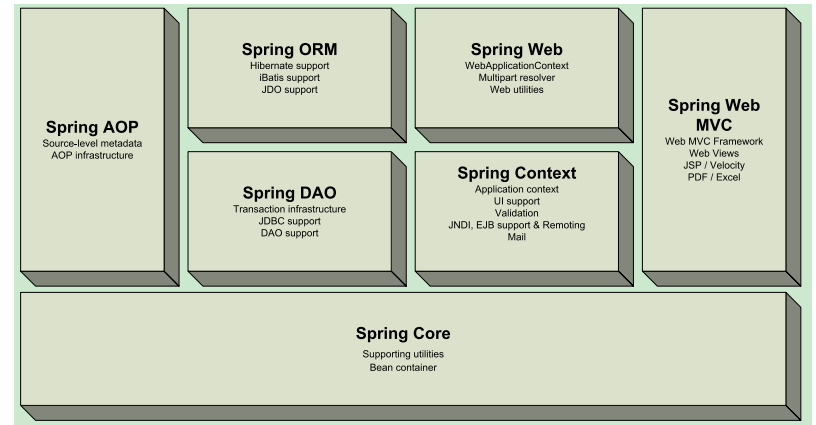
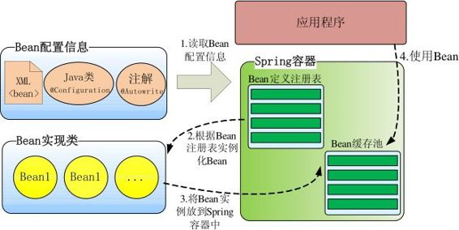
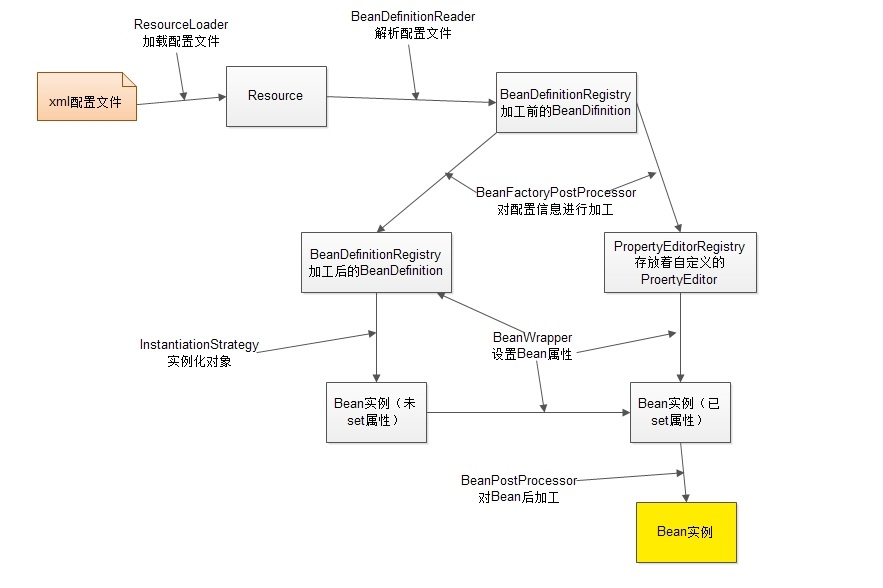
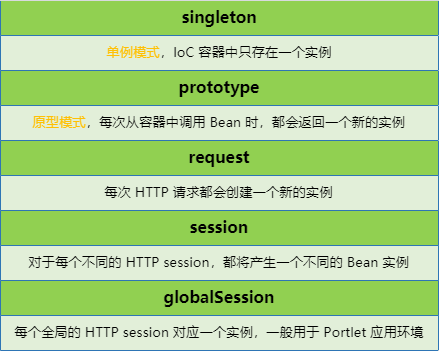
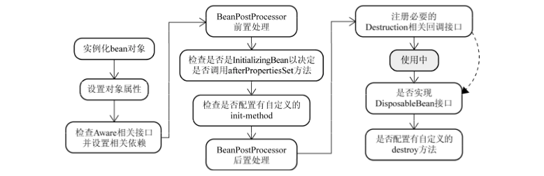
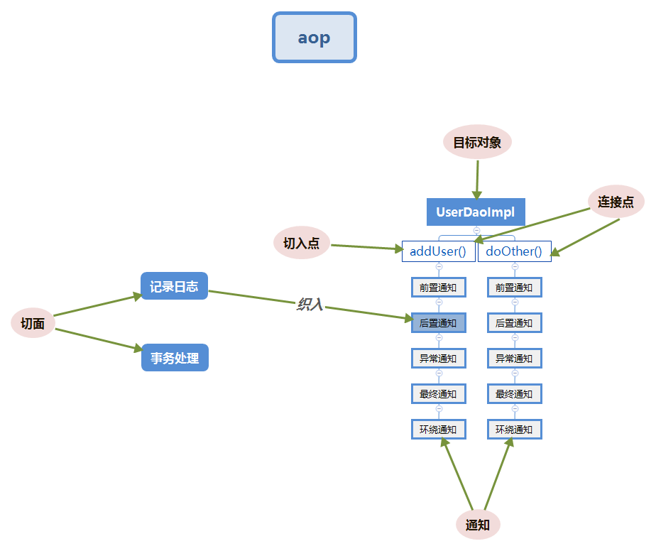

## Spring

开源的轻量级框架，主要用来简化 Java 应用的开发，并通过POJO为基础的编程模型促进良好的编程习惯

### 优点

* 轻量：Spring 是轻量的，基本的版本大约 2MB
* 方便解耦，简化开发：可以将对象依赖关系的维护交给 Spring 管理
* IoC 控制反转：对象的创建由 Spring 完成，并将创建好的对象注入给使用者
* AOP 编程的支持：可以将一些日志，事务等操作从业务逻辑的代码中抽取出来，提高代码的复用性
* 声明式事务的支持：只需要通过配置就可以完成对事务的管理，而无需手动编程
* 方便集成各种优秀框架：其内部提供了对很多优秀框架的直接支持
* 非侵入式：Spring 的 API 不会在业务逻辑的代码中出现，可以很方便的移植到其他框架上
* 异常处理：Spring 提供方便的 API 把具体技术相关的异常，如由 JDBC，Hibernate 抛出的异常，转化为一致的 unchecked 异常

### 缺点
* Spring 像一个胶水，将框架黏在一起，后面拆分的话就不容易拆分了
* Spring 的 JSP 代码过多，控制器过于灵活，缺乏一个公用的控制器，不适合分布式

### 三大核心思想

依赖注入、控制反转、面向切面编程

## Spring 项目

### 编写 Spring 程序

1. 导入 JAR 包：spring-context
2. 编写配置文件
3. 创建接口和实现类

### 接口与实现类

```java
public interface PersonService {
    void say();
}

public class PersonServiceImpl implements PersonService {
    public void say() {
        System.out.println("fuck you");
    }
}
```

### 配置文件

```xml
<beans xmlns="http://www.springframework.org/schema/beans"
       xmlns:xsi="http://www.w3.org/2001/XMLSchema-instance"
       xmlns:aop="http://www.springframework.org/schema/aop"
       xmlns:context="http://www.springframework.org/schema/context"
       xsi:schemaLocation="http://www.springframework.org/schema/beans
    http://www.springframework.org/schema/beans/spring-beans.xsd
    http://www.springframework.org/schema/aop
    http://www.springframework.org/schema/aop/spring-aop.xsd
    http://www.springframework.org/schema/context
    http://www.springframework.org/schema/context/spring-context.xsd">
	
    <!-- id不能重复，class中只能是类，不能是接口 -->
    <bean id="personService" class="com.test.service.impl.personServiceImpl"/>
    <!-- 可以使用init-method属性，让对象在创建后，执行某个方法，也可以使用@PostConstruct -->
    <!-- 可以使用destroy-method属性，让容器在销毁后，执行某个方法，也可以使用@PreDestroy -->
    
    <!-- 可以在主配置文件中引入其他的Spring配置文件 -->
    <import resource="spring-test.xml"/>
    <!-- 也可以使用通配符的方式，但主配置文件就不能以spring-开头，否则会无限递归 -->
    <import resource="spring-*.xml"/>
</beans>
```

### 测试类

```java
@Test
public void oldMehod() {
    // 之前需要自己手动去创建对象
    PersonService ps = new PersonServiceImpl();
    ps.say();
}

@Test
public void newMehod(){
    // 读取配置文件，如果有多个配置文件可以使用String数组
    ApplicationContext context = new ClassPathXmlApplicationContext("application-context.xml");
    // 从Spring获取对象
    PersonService ps = (PersonService) context.getBean("personService");
    ps.say();
}
```

## Spring 模块



- Spring AOP：提供了符合 AOP Alliance 规范的面向切面的编程实现
- Spring ORM：提供了对 ORM 的支持
- Spring Web：提供了基础的针对 Web 开发的集成特性
- Spring DAO：提供了对 JDBC 操作的支持
- Spring Context：构建于 Core 封装包基础上的 Context 封装包，提供了一种框架式的对象访问方法
- Spring Web MVC：提供了 Web 应用的 MVC 实现
- Spring Core：Spring 最基础部分，提供 IoC 和依赖注入特性

## IoC

控制反转（Inversion of Control）控制反转是一种 **思想**。是指创建对象的控制权的转移，把对象的创建和管理交给外部容器完成，即 IoC 容器

- 控制：当前对象对内部成员的控制权
- 反转：这种控制权 **不由当前对象管理** 了，由其他类或第三方容器来管理

### IoC 的作用

IoC 思想最核心的地方在于，资源不由使用资源的双方管理，而由不使用资源的第三方管理

* 资源集中管理，实现资源的可配置和易管理
* 降低了使用资源双方的依赖程度，即降低了耦合度

### IoC 容器

IoC 容器其实就是一个大工厂，用来管理我们所有的对象以及依赖关系

#### IoC 容器的原理



* 根据 bean 配置信息在容器内部创建 bean 定义注册表
* 根据注册表加载、实例化 bean、建立 bean 与 bean 之间的依赖关系
* 将这些准备就绪的 bean 放到 Map 缓存池中，等待应用程序调用

#### IoC 容器的工作机制




* ResourceLoader 从存储介质中加载 Spring 配置信息，并使用 Resource 表示这个配置文件的资源
* BeanDefinitionReader 读取 Resource 所指向的配置文件资源，然后解析配置文件。配置文件中每一个`<bean>` 解析成一个 BeanDefinition 对象，并保存到 BeanDefinitionRegistry 中
* 容器扫描 BeanDefinitionRegistry 中的 BeanDefinition，使用 Java 的反射机制自动识别出 Bean 后处理后器的 bean，然后调用这些 Bean 后处理器对 BeanDefinitionRegistry 中的 BeanDefinition 进行加工处理。主要完成以下两项工作
  * 对使用到占位符的 `<bean>` 元素标签进行解析，得到最终的配置值，这意味对一些半成品式的BeanDefinition 对象进行加工处理并得到成品的 BeanDefinition 对象
  * 对 BeanDefinitionRegistry 中的 BeanDefinition 进行扫描，通过反射机制找出所有属性编辑器的 Bean （实现 PropertyEditor 接口 的 Bean），并自动将它们注册到容器的属性编辑器注册表中（PropertyEditorRegistry）

* Spring 容器从 BeanDefinitionRegistry 中取出加工后的 BeanDefinition，并调用 InstantiationStrategy 着手进行 bean 实例化的工作
* 在实例化 bean 时，Spring 容器使用 BeanWrapper 对 bean 进行封装，BeanWrapper 提供了很多以反射机制操作 bean 的方法，它将结合该 bean 的 BeanDefinition 以及容器中属性编辑器，完成 bean 属性的设置工作
* 利用容器中注册的 Bean 后处理器，对已经完成属性设置工作的 bean 进行后续加工，直接装配出一个准备就绪的 bean

*更多：[Spring容器初始化过程](https://www.cnblogs.com/duanxz/p/3787884.html)*

#### BeanFactory 接口

IoC 容器的基本实现，Spring 里面最底层的接口，包含了各种 bean 的定义，读取 bean 配置文档，管理 bean 的加载、实例化，控制 bean 的生命周期，维护 bean 之间的依赖关系

```java
@Test
public void test() {
    DefaultListableBeanFactory factory = new DefaultListableBeanFactory();
    XmlBeanDefinitionReader reader = new XmlBeanDefinitionReader(factory);
    // 使用绝对路径
    reader.loadBeanDefinitions(new FileSystemResource("D:/test/src/main/resources/application-context.xml"));

    PersonService ps = (PersonService) factory.getBean("personService");
    ps.say();
}
```

#### ApplicationContext 接口

BeanFactory 的子接口，除了提供 BeanFactory 所具有的功能外，提供了更多的高级特性

- 继承 MessageSource，因此支持国际化
  - 根据用户的语言设置显示相应的语言和提示
- 统一的资源文件访问方式
- 提供在监听器中注册 bean 的事件
- 同时加载多个文件
- 载入多个（有继承关系）上下文，便得每一个上下文都专注于一个特定的层次，比如应用的 web 层

```java
@Test
public void test() {
    // 从类路径下加载配置文件 
    ApplicationContext context = new ClassPathXmlApplicationContext("application-context.xml");
    // 从文件系统中加载配置文件 
    ApplicationContext context=new FileSystemXmlApplicationContext("D:/test/src/main/resources/application-context.xml");
    PersonService ps = (PersonService) factory.getBean("personService");
    ps.say();
}
```

#### BeanFactory 和 ApplicationContext 的区别

* BeanFactroy 是以 **延迟加载** 形式来注入 bean 的。在读取配置文件之后不会创建里面 bean 的对象，即只有在使用到某个 bean 时，才会进行加载实例化，但这样就难以发现一些可能存在的配置问题。如果 bean 的某一个属性没有注入，会到第一次使用 getBean 方法才会抛出异常
  * 应用启动的时候占用资源很少，对资源要求较高的应用，或者需要在一些配置较差的机器中运行程序，比较有优势，但事务的管理、AOP 功能将会失效

* ApplicationContext 是在容器启动时，**一次性创建了所有的 bean 对象**。在容器启动时，就可以发现一些可能存在的配置问题，有利于检查所依赖属性是否注入。ApplicationContext 启动后就预载入所有的单实例 bean，确保当你需要的时候，可以立马使用
  * 所有的 bean 在启动的时候都加载，系统运行的速度快
  * 在启动的时候加载了所有的 bean，可以在系统启动的时候，尽早的发现系统中的配置问题，建议web应用，在启动的时候就把所有的 bean 都加载了，把费时的操作放到系统启动中完成
  * 唯一的不足是占内存空间，当应程序配置 bean 较多时，程序启动较慢

* BeanFactory 通常以编程的方式被创建，ApplicationContext 还能以声明的方式创建，如使用 ContextLoader

* BeanFactory 和 ApplicationContext 都支持 BeanPostProcessor、BeanFactoryPostProcessor，但两者之间的区别是：BeanFactory 需要手动注册，而 ApplicationContext 则是自动注册

*更多：[IoC-spring 的灵魂](https://juejin.im/post/593386ca2f301e00584f8036)、[Spring IOC知识点一网打尽！](https://segmentfault.com/a/1190000014979704)*

## Bean

bean 是被实例的，组装的以及被 Spring 容器管理的 Java 对象

### Bean 的装配

IoC 容器将 bean 对象创建好并传递给使用者的过程叫做 bean 的装配

#### 通过 XML 装配

* 默认的方式，IoC 容器会 **调用 bean 的无参构造方法** 来创建对象，所以要保证这些 bean 有无参构造方法

```xml
<bean id="personDao" class="com.test.service.impl.PersonDaoImpl"/>
```

* 实例工厂，需要自己定义一个工厂类，在该类中的方法都是非静态的

```java
public class MyBeanFactory {
    public PersonDao create() {
        return new PersonDaoImpl();
    }
}
```

```xml
<bean id="factory" class="com.test.util.MyBeanFactory"/>
<bean id="personDao" factory-bean="factory" factory-method="create"/>
```

* 静态工厂，需要自己定义一个工厂类，在该类中的方法都是 static 修饰的

```java
public class MyBeanFactory {
    public static PersonDao create() {
        return new PersonDaoImpl();
    }
}
```

```xml
<bean id="personDao" class="com.test.util.MyBeanFactory" factory-method="create"/>
```

#### Java 代码装配

编写配置类，被 @Configuration 修饰的类就是配置类，使用配置类创建 bean

- 使用 @Bean 来修饰方法，该方法返回一个对象
- Spring内部会将该对象加入到Spring容器中
- **容器中 bean 的 ID 默认为方法名**

```java
@org.springframework.context.annotation.Configuration
public class MyConfiguration {
    @Bean
    public PersonDao pd(){
        PersonDao personDao = new PersonDaoImpl();
        return personDao;
    }
}
```

测试类需要使用 @ContextConfiguration 加载配置类的信息，需要引入 spring-test 包

```java
@ContextConfiguration(classes = ContextConfiguration.class)
public class StudentTest {
    @Test
    public void newMehod() {
        ApplicationContext context = new ClassPathXmlApplicationContext("application-context.xml");
        PersonDao pd = (PersonDao) context.getBean("pd");
        pd.say();
    }
}

```

#### 自动化装配

```xml
<!-- 添加文件扫描器，开启注解 -->
<context:component-scan base-package="com.test"/>
```

```java
@Component("personDao")
public class PersonDaoImpl implements PersonDao {
    public void say() {
        System.out.println("fuck you!");
    }
}
```

* 自动装配不能将第三方库组件装配到应用中，可以使用 XML 或者 Java 代码显式装配配置

* 首推使用自动装配，而后是通过 Java 代码装配，最后才用 XML 装配

*更多：[Spring入门看这一篇就够了](https://segmentfault.com/a/1190000013700859)*

### Bean 的作用域

使用 IoC 容器为我们创建对象的时候，可以设定该对象的作用域，**默认是单例的**

```xml
<bean id="test" scope="prototype" class="com.test.scopeTest"/>
```



* request、session、globalSession 作用域，只有在 Web 应用中使用 Spring 时才有效
* 在配置文件中有个 lazy-init 属性，只对单例模式有效，使用后对象会在使用的时候才创建

```xml
<bean id="test" scope="singleton" init-lazy="true" class="com.test.test"/>
```

* 还可以使用 @Scope 注解在实现类上使用

### Bean 生命周期



* 实例化一个 bean 对象
* 对实例化的 bean 进行配置，也就是依赖注入
* 如果 bean 实现了 BeanNameAware 接口，将会调用 setBeanName 方法，传入 bean 的 id
* 如果 bean 实现了 BeanFactoryAware 接口，将会调用 setBeanFactory 方法，传入 BeanFactory 的实例
* 如果 bean 实现了 ApplicationContextAware 接口，将会调用 setApplicationContext 方法，传入应用上下文的引用
* 如果 bean 实现了 BeanPostProcessor 接口，将会调用 postProcessBeforeInitialization(Object Obj,String s) 方法
* 如果 bean 实现了 InitializingBean 接口，将会调用 afterPropertiesSet 方法
* 如果 bean 在配置文件中配置了 init-method 属性会自动调用其配置的初始化方法
* 如果 bean 实现了 BeanPostProcessor 接口，将会调用 postProcessAfterInitialization(Objec tObj,String s) 方法
* 此时 bean 已经准备就绪，并且是单例的，可以被应用程序使用了，他们将会一直驻留在应用上下文中，直到该应用上下文被销毁
* 当 bean 不再需要时，会进行清理阶段，如果 bean 实现了 DisposableBean 接口，将会调用 destroy 方法
* 如果 bean 在配置文件中配置了 destroy-method 属性会自动调用其配置的销毁方法
* 如果这个Bean的Spring配置中配置了destroy-method属性，会自动调
  用其配置的销毁方法。

#### BeanPostProcessor 接口

实现了 BeanPostProcessor 接口的类被称为后置处理器，在 bean 中方法的之前和之后会自动调用 bean 后处理器的两个方法，可以通过在这两个方法中编写代码来增强或扩展一些功能

```java
public class bpp implements BeanPostProcessor {
    @Override
    public Object postProcessBeforeInitialization(Object bean, String beanName) throws BeansException {
        System.out.println("postProcessBeforeInitialization");
        return bean;
    }

    @Override
    public Object postProcessAfterInitialization(Object bean, String beanName) throws BeansException {
        if ("personService".equals(beanName)) {
            InvocationHandler handler = ((Object obj, Method method, Object[] objs) -> {
                if ("say".equals(method.getName())) {
                    System.out.println("start");
                    // 执行目标方法
                    Object result = method.invoke(bean, objs);
                    System.out.println("end");
                    return result;
                }
                return method.invoke(bean, objs);
            });
            // 增强bean
            Object proxy = Proxy.newProxyInstance(
                    bean.getClass().getClassLoader(),
                    bean.getClass().getInterfaces(),
                    handler
            );
            System.out.println("====postProcessAfterInitialization====");
            return proxy;
        }
        return bean;
    }
}
// 返回
// postProcessBeforeInitialization
// postProcessAfterInitialization
// start
// fuck you
// end
```

```xml
<bean id="bpp" class="com.test.util.bpp"/>
```

*更多：[Spring中 bean的作用域与生命周期](https://blog.csdn.net/fuzhongmin05/article/details/73389779)*

## DI

依赖注入（Dependency Injection）是 IoC 常用的实现方式，是指程序运行过程中，若需要调用另一个对象协助时，无须在代码中创建被调用者，而是依赖于外部容器，由外部容器创建后传递给程序。依赖注入让 Spring 的 Bean 之间以配置文件的方式组织在一起，而不是以硬编码的方式耦合在一起。有三种常用的注入方式：setter 方法注入，构造方法注入，基于注解的注入

### DAO 接口和实现类

```java
public interface PersonDao {
    void say();
}

public class PersonDaoImpl implements PersonDao {
    public void say() {
        System.out.println("fuck you!");
    }
}
```

### setter 注入

```java
public class PersonServiceImpl implements PersonService {
    private PersonDao pd;

    public void setPd(PersonDao pd) {
        // 以前如果需要使用PersonDao对象的时候，需要在这里创建对象
        // pd = new PersonDaoImpl
        // 使用spring之后，由spring为我们创建对象
        this.pd = pd;
    }

    public void say() {
        pd.say();
    }
}
```

```xml
<bean id="personService" class="com.test.service.impl.PersonServiceImpl">
    <!-- name要跟Service实现类中的属性名一致 -->
    <property name="pd" ref="ud"/>
</bean>
<bean id="ud" class="com.test.dao.impl.PersonDaoImpl"/>
```

### 构造注入

```java
public class PersonServiceImpl implements PersonService {
    private PersonDao pd;

    public PersonServiceImpl(PersonDao pd) {
        this.pd = pd;
    }

    public void say() {
        pd.say();
    }
}
```

```xml
<bean id="personService" class="com.test.service.impl.PersonServiceImpl">
    <constructor-arg name="pd" ref="ud"/>
</bean>
<bean id="ud" class="com.test.dao.impl.PersonDaoImpl"/>
```

### 注解

使用注解实现依赖注入，就不需要在配置文件中注册 bean 了

```java
@Component("personService")
public class PersonServiceImpl implements PersonService {
    @Autowired
    @Qualifier("personDao")
    private PersonDao pd;

    public void say() {
        pd.say();
    }
}

@Component("personDao")
public class PersonDaoImpl implements PersonDao {
    public void say() {
        System.out.println("fuck you!");
    }
}
```

* @Component：指定把一个对象加入 IoC 容器，该注解中的内容用来指定该 bean 的 id，Spring 中还提供了等效的注解，通常会使用下面注解来代替 @Component
  * @Repository：在持久层使用
  * @Service：在业务逻辑层使用
  * @Controller：在控制层使用
* @Autowired：**默认根据类型自动装配**
  * 可以配合 @Qualifier 让 @Autowired 根据名称自动装配
  * 由 Spring 提供

* @Resource：**默认根据名称自动装配**
  * 可使用 **`@Resource(type="personDao")`** 根据类型自动装配
  * 由 Java 提供，JDK 版本需在 1.6 以上

#### 不同方式的自动装配

```xml
<bean id="test" class="com.test.test" autowire="byName">
```

**自动装配和手动装配同时使用，自动装配就会失效，注解默认是使用 byType 的**

- no：默认方式，**不进行自动装配**
- byName：**根据名称自动装配**，容器会试图匹配、装配和该 bean 的属性具有相同名字的 bean
- byType：**根据类型自动装配**，容器会试图匹配、装配和该 bean 的属性具有相同类型的 bean。如果有多个 bean 符合条件，则抛出错误
- constructor：类似于byType，但是要 **提供构造器参数**，如果没有确定的带参数的构造器参数类型，将会抛出异常
- autodetect：首先会尝试使用 constructor 进行自动装配，如果失败再尝试使用 byType。在 Spring3.0 之后已经被标记为 @Deprecated

*更多：[spring的 5种自动装配方式](https://blog.csdn.net/weixin_39220472/article/details/80643439)*

### 注解方式和 XML 方式

* 注解配置方便，更直观。但因为是以硬编码的方式写入到了 Java 代码中，修改后需要重新编译代码

* XML 配置方式的最大好处是，对其所做修改，无需编译代码，只需重启服务器即可将新的配置加载

* 若注解与 XML 同用，**XML 的优先级要高于注解**。这样，当需要对某个 bean 做修改，只需修改配置文件即可

## AOP

面向切面编程（Aspect Orient Programming），是面向对象编程的一种补充，**在运行时，动态地将代码切入到类的指定方法、指定位置上的编程思想**。可以分离日志记录、事务管理等非业务逻辑代码与业务代码，降低模块之间的耦合度，提高了扩展性和复用性

### Spring AOP 原理

Spring AOP 使用纯 Java 实现，它不需要专门的编译过程，也不需要特殊的类装载器，它在 **运行期通过代理方式向目标类织入增强代码**。在 Spring 中可以无缝地将 Spring AOP、IoC 和 AspectJ 整合在一起。Spring AOP 构建在动态代理基础之上，因此，**Spring 对 AOP 的支持局限于方法拦截**

* 如果被代理类实现了接口，会默认使用 JDK 动态代理。如果没有实现接口，会使用 CGLIB 动态代理

* 如果是单例的话最好使用 CGLIB 代理。因为 JDK 在创建代理对象时的性能要高于 CGLIB 代理，而生成代理对象的运行性能却比 CGLIB 的低
* 从耦合度上讲，JDK 要好于额外需要依赖字节码处理框架 ASM 的 CGLIB

### AOP 的实现

AOP 除了有 Spring AOP 实现外，还有 AspectJ。AspectJ 是 **语言级别** 的 AOP 实现，扩展了 Java 语言，定义了 AOP 语法，能够在 **编译期** 提供横切代码的织入，所以它 **有专门的编译器** 用来生成遵守 Java 字节码规范的 class 文件。而 Spring 借鉴了 AspectJ 很多非常有用的做法，**融合了 AspectJ 实现 AOP 的功能**

* AspectJ 是静态代理的增强，所谓静态代理，就是 AOP 框架会在编译阶段生成 AOP 代理类，因此也称为编译时增强，他会在编译阶段将切面织入到 Java 字节码中，运行的时候就是增强之后的 AOP 对象。静态代理与动态代理区别在于生成 AOP 代理对象的时机不同 ，相对来说 AspectJ 的静态代理方式具有更好的性能

* Spring AOP 使用的动态代理，所谓的动态代理，就是说 AOP 框架不会去修改字节码，而是每次运行时在内存中临时为方法生成一个 AOP 对象，这个 AOP 对象包含了目标对象的全部方法，并且在特定的切点做了增强处理，并回调原对象的方法

### AOP 术语



* 目标对象（Target）
  * **将要被增强的对象**，即包含主业务逻辑的类的对象

* 切面（Aspect）
  * 泛指 **非业务逻辑**，常用的切面有通知，实际就是对业务逻辑的一种增强

* 连接点（JoinPoint）
  * **可以被切面织入的方法**，通常业务接口中的方法均为连接点

* 切入点（Pointcut）
  * **切面具体织入的方法**。被 final 修饰的方法不能作为连接点和切入点，因为是不能被修改的，不能被增强

* 织入（Weaving）

  - **将切面代码插入到目标对象的过程**

* 通知（Advice）

  * **是切面的一种实现**，可以完成简单织入功能。通知定义了增强代码切入到目标代码的时间点，通知类型不同，切入时间不同。**切入点定义切入的位置，通知定义切入的时间**
  * **前置通知（Before advice）**：在连接点之前执行，即目标方法执行之前执行
  * **后置通知（After returning advice）**：在连接点正常结束之后执行，如果连接点抛出异常，则不执行
  * **异常通知（After throwing advice）**：在连接点抛出异常后执行

  * **最终通知（After advice）**：在连接点结束之后执行，无论是否抛出异常，都会执行
  * **环绕通知（Around advice）**：在连接点之前和之后均执行

*更多：[spring中的AOP](http://www.monkey1024.com/framework/1423)*

### AOP 的使用

导入 aspectjweave 和 spring-aspects 包

#### XML 方式

Service 实现类

```java
public class TestServiceImpl implements TestService {
    public void insert() {
        System.out.println("insert");
    }

    public void delete() {
        System.out.println("delete");
    }

    public void update(int id) throws Exception {
        System.out.println("update " + id);
        if (id == 0) {
            throw new Exception();
        }
    }

    public int selectOne(int id) {
        System.out.println("selectOne "+id);
        return 1;
    }

    public int selectAll() {
        System.out.println("selectAll");
        return 1024;
    }
}
```

切面类

```java
public class MyAspect {
    public void before() {
        System.out.println("--前置通知--");
    }

    public void afterReturning(int result) {
        System.out.println("--后置通知--" + result);
    }

    public void afterThrowing(Exception e) {
        System.out.println("--异常通知--" + e);
    }

    public void after() {
        System.out.println("--最终通知--");
    }

    public Object around(ProceedingJoinPoint pjp) throws Throwable {
        System.out.println("--环绕通知:前--");
        Object proceed = pjp.proceed();
        System.out.println("--环绕通知:后--");
        return proceed;
    }
}
```

配置文件

``` xml
<bean id="testService" class="com.test.service.impl.TestServiceImpl"/>
<bean id="myAspect" class="com.test.util.MyAspect"/>
<!-- 配置AOP，会根据其子标签的配置，生成自动代理 -->
<aop:config>
    <!-- 定义切入点，id指定切入点的名称，expression为execution表达式 -->
    <aop:pointcut id="insertPointcut" expression="execution(* insert())"/>
    <aop:pointcut id="deletePointcut" expression="execution(* delete())"/>
    <aop:pointcut id="updatePointcut" expression="execution(* update())"/>
    <aop:pointcut id="selectOnePointcut" expression="execution(* selectOne(..))"/>
    <aop:pointcut id="selectAllPointcut" expression="execution(* selectAll(..))"/>
    <!-- 定义切面，ref属性用于指定使用哪个切面 -->
    <aop:aspect ref="myAspect">
        <!-- method指定该通知使用的切面中的哪个方法，pointcut-ref指定该通知要织入的切入点 -->
        <!-- 前置通知 -->
        <aop:before method="before" pointcut-ref="insertPointcut"/>
        <!-- 后置通知 -->
        <aop:after-returning method="afterReturning" pointcut-ref="deletePointcut" returning="result"/>
        <!-- 异常通知 -->
        <aop:after-throwing method="afterThrowing" pointcut-ref="updatePointcut" throwing="e"/>
        <!-- 最终通知 -->
        <aop:after method="after" pointcut-ref="selectOnePointcut"/>
        <!-- 环绕通知 -->
        <aop:around method="around" pointcut-ref="selectAllPointcut"/>
    </aop:aspect>
</aop:config>
```

测试类

```java
@Test
public void test(){
    ApplicationContext context = new ClassPathXmlApplicationContext("application-context.xml");
    TestService ts = (TestService) context.getBean("testService");
    ts.insert();
    System.out.println("*****************");
    ts.delete();
    System.out.println("*****************");
    try {
        ts.update(1);
    } catch (Exception e) {
        e.printStackTrace();
    }
    System.out.println("*****************");
    ts.selectOne(1);
    System.out.println("*****************");
    ts.selectAll();
}
```

#### 注解方式

```xml
<!-- 配置AspectJ自动代理 -->
<aop:aspectj-autoproxy/>
```

```java
@Aspect		// 表示当前类为切面类
@Component
public class MyAspect {
    @Before("execution(* insert())")
    public void before() {
        System.out.println("--前置通知--");
    }

    @AfterReturning(value = "execution(* delete())", returning = "result")
    public void afterReturning(int result) {
        System.out.println("--后置通知--" + result);
    }

    @AfterThrowing(value = "execution(* update(..))", throwing = "e")
    public void afterThrowing(Exception e) {
        System.out.println("--异常通知--" + e);
    }

    @After("execution(* selectOne(..))")
    public void after() {
        System.out.println("--最终通知--");
    }

    @Around("execution(* selectAll())")
    public Object around(ProceedingJoinPoint pjp) throws Throwable {
        System.out.println("--环绕通知:前--");
        Object proceed = pjp.proceed();
        System.out.println("--环绕通知:后--");
        return proceed;
    }
}
```

### 切入点表达式

切入点表达式要匹配的对象就是目标方法的方法名，[ ] 的部分可省略，各部分间用空格分开，顺序不能变

```
execution ( 
    [modifiers-pattern]  访问权限类型
    ret-type-pattern  返回值类型
    [declaring-type-pattern]  全限定类名
    name-pattern(param-pattern)  方法名(参数名)
    [throws-pattern]  抛出异常类型 
)
```

```bash
# 任意公共方法
execution(public * *(..)) 

# 所有以set开始的方法
execution(* set*(..)) 

# service包里的任意类的任意方法
execution(* com.xyz.service.*.*(..)) 

# 指定只有一级包下的service类中所有方法为切入点 
execution(* *.service.*(..))

# service包或者子包里的任意类的任意方法
# ..出现在类名中时，后面必须跟*，表示包或子包下的所有类
execution(* com.xyz.service..*.*(..))

# 指定所有包下的serivce子包下所有类或接口中所有方法为切入点 
execution(* *..service.*.*(..))

# Mine若为接口，则为接口中的任意方法及其所有实现类中的任意方法；若为类，则为该类及其子类中的任意方法
execution(* com.xyz.service.Mine+.*(..)) 

# 所有的joke(String,int)方法
# 如果方法中的参数类型是java.lang包下的类，可以直接使用类名，否则必须使用全限定类名
# 如joke( java.util.List, int)。
execution(* joke(String,int)))

# 所有的joke()方法，该方法第一个参数为String，第二个参数可以是任意类型
execution(* joke(String,*))) 

# 所有的joke()方法，该方法第一个参数为String，后面可以有任意个参数且参数类型不限
execution(* joke(String,..))) 

# 所有的joke()方法，方法拥有一个参数，且参数是Object类型
execution(* joke(Object))

# 所有的joke()方法，方法拥有一个参数，且参数是 Object 类型或该类的子类
execution(* joke(Object+))) 
```

*更多：[原生AspectJ用法分析以及spring-aop原理分析](https://blog.mythsman.com/2017/12/21/1/)*

## 事务

Spring 支持 XML 和注解的方式进行事务配置。事务的配置通常是在 **service 层**，用来保证业务逻辑上数据的原子性，因为在 service 层有可能会调用多个 dao 中的方法操作数据库，这些方法的操作就需要事务来保证其一致性

### Spring 事务的实现方式和实现原理

Spring 事务的本质其实就是数据库对事务的支持，没有数据库的事务支持，Spring 是无法提供事务功能的。真正的数据库层的事务提交和回滚是通过 binlog 或者 redo log 实现的

### 实现声明式事务的四种方式

* 基于 TransactionInterceptor 的声明式事务：Spring 声明式事务的基础，通常不建议使用这种方式
* 基于 TransactionProxyFactoryBean 的声明式事务：第一种方式的改进版本，简化的配置文件的书写，Spring 早期推荐的声明式事务管理方式，但是在 Spring 2.0 中已经不推荐了
* 基于 `<tx>` 和 `<aop>` 命名空间的声明式事务管理：目前推荐的方式，其最大特点是与 Spring AOP 结合紧密，可以充分利用切点表达式的强大支持，使得管理事务更加灵活
* 基于 @Transactional 的全注解方式：将声明式事务管理简化到了极致。开发人员只需在配置文件中加上一行启用相关后处理 Bean 的配置，然后在需要实施事务管理的方法或者类上使用 @Transactional 指定事务规则即可实现事务管理，而且功能也不必其他方式逊色


## Spring 中都用到了哪些设计模式

**工厂模式**

BeanFactory就是简单工厂模式的体现，用来创建对象的实例；

**单例模式**

Bean默认为单例模式。

**代理模式**

Spring的AOP功能用到了JDK的动态代理和CGLIB字节码生成技术；

**模板方法**

用来解决代码重复的问题。比如. RestTemplate, JmsTemplate, JpaTemplate。

**观察者模式**

定义对象键一种一对多的依赖关系，当一个对象的状态发生改变时，所有依赖于它的对象都会得到通知被制动更新，如Spring中listener的实现--ApplicationListener。

## 更多

* [Spring学习与面试](https://github.com/Snailclimb/JavaGuide/blob/master/docs/system-design/framework/Spring学习与面试.md)