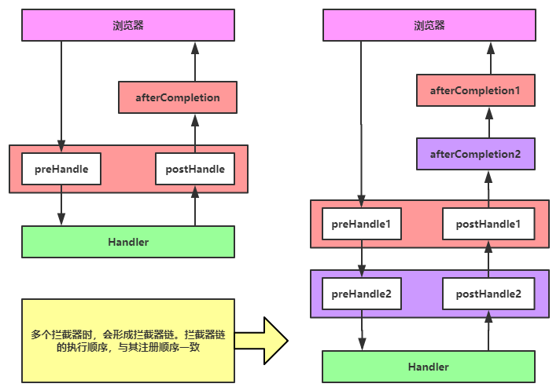

##  Spring MVC

也叫作 Spring Web MVC，是一个基于 MVC 的表现层框架，主要用来简化 web 应用程序开发。是 Spring 的一个模块，**无需中间整合层来整合**

### MVC

MVC 是一种设计模式，它强制的将应用程序的输入、处理、输出分开。使用了 MVC 的应用程序被分为 3 个核心部件：视图（View）、模型（Model）、控制器（Controller）。它们各司其职，既分工明确又相互合作

* 实现了功能模块和显示模块的分离，降低了耦合度，还提高了系统的可维护性、可扩展性和组件的可复用性

- 降低了系统的性能，增加了程序源码的复杂性，增加了开发成本，有时会导致级联的修改

#### MVC 工作流程


视图接受用户输入请求，然后将请求传递给控制器，控制器再调用某个模型来处理用户的请求，再将处理后的结果交给某个视图进行格式化输出给用户

### 三层架构

将整个业务应用划分为：表现层（UI）、业务逻辑层（BLL）、数据访问层（DAL）。区分层次的目的即为了实现 **高内聚，低耦合** 的思想

* 表现层：展现给用户的界面，即用户在使用一个系统的时候他的所见所得
  * 表现层只能作为一个外壳，不能包含任何的逻辑处理过程
* 业务逻辑层：针对具体问题的操作，也可以说是对数据层的操作，对数据业务逻辑处理，系统架构中最核心的部分
* 数据访问层：该层所做事务直接操作数据库，针对数据的增添、删除、修改、更新、查找等

#### 三层架构与 MVC

* MVC 把三层架构中的表现层再度进行了分化，分成了控制器、视图、模型三个部分

* 三层架构是基于业务逻辑来分的，是一种表现模式，而 MVC 是基于页面来分的，是一种架构模式
* 三层架构的分层模式是典型的上下关系，上层依赖于下层。但 MVC 作为表现模式是不存在上下关系的，而是相互协作关系。即使将 MVC 当作架构模式，也不是分层模式

### Spring MVC 的优点

* 它是基于组件技术的。全部的应用对象，无论控制器、视图、还是业务对象之类的都是 Java 组件。并且和 Spring 提供的其他基础结构紧密集成

* 不依赖于 Servlet API
  * 目标虽是如此，但是在实现的时候确实是依赖于 Servlet 的

* 可以任意使用各种视图技术，而不仅仅局限于 JSP

* 支持各种请求资源的映射策略

* 代码间耦合度低，可扩展性强

### Spring MVC 与 Struts2 的区别

* 框架机制
  * Spring MVC 是通过 **Servlet** 的方式进行拦截，在第一次请求发送时初始化，**随着容器关闭而销毁**
  * Struts2 是通过 **Filter** 的方式进行拦截，在容器初始化时加载，**晚于 servlet 销毁**

* 拦截机制
  * Spring MVC是 **方法级别** 上的拦截，一个请求对应着一个 controller 中的方法，请求参数会封装到方法参数中。controller 类中的属性被方法所共享，controller 类 **默认是单例** 的，在请求发送时不会创建对象
  * Struts2 是 **类级别** 上的拦截，每次请求都会创建一个对应的 action，一个 url 对应 action 中的一个方法，action 类中的属性被所有方法共享，所以 action 在 Spring **只能配置成多例**

* 性能
  * Spring MVC 几乎实现了零配置，还可以使用注解，无需频繁修改配置文件
  * Struts2 无法使用注解开发，每次需要编写一个 action 类都要配置一遍，非常繁琐
  * 性能和开发速度上 Spring MVC 都略优于 Struts2

### Spring MVC 的控制器是不是单例模式

是单例模式，所以在多线程访问的时候有线程安全问题，不要用同步，会影响性能，最好的解决方案是在控制器里面不能写字段

## Spring MVC 项目

### 创建 SpringMVC 步骤

1. 导入 JAR 包：spring-webmvc
2. 在 web.xml 中注册中央控制器
3. 创建 Spring MVC 配置文件
4. 创建一个类实现 Controller 接口
5. 启动服务器

### web.xml

```xml
<servlet>
    <servlet-name>springmvc</servlet-name>
    <!-- spring MVC的核心：中央控制器 -->
    <servlet-class>org.springframework.web.servlet.DispatcherServlet</servlet-class>
    <init-param>
        <param-name>contextConfigLocation</param-name>
        <param-value>classpath:springmvc.xml</param-value>
    </init-param>
    <!-- 表示该servlet的创建优先级，1为最高 -->
    <load-on-startup>1</load-on-startup>
</servlet>
<servlet-mapping>
    <servlet-name>springmvc</servlet-name>
    <!-- 所有以.do结尾的请求都会匹配到核心控制器中 -->
    <url-pattern>*.do</url-pattern>
</servlet-mapping>
```

*  param-name 中的 **contextConfigLocation 是固定写法**
  * DispatcherServlet 继承了 FrameworkServlet，在这个类中有个 contextConfigLocation 成员变量，所以在 param-name 中将其命名为 contextConfigLocation

### 配置文件

* 配置文件名需跟 init-param 中的 param-value 保持一致

```xml
<?xml version="1.0" encoding="UTF-8"?>
<beans xmlns="http://www.springframework.org/schema/beans"
    xmlns:xsi="http://www.w3.org/2001/XMLSchema-instance"
    xmlns:p="http://www.springframework.org/schema/p"
    xmlns:context="http://www.springframework.org/schema/context"
    xsi:schemaLocation="
        http://www.springframework.org/schema/beans
        http://www.springframework.org/schema/beans/spring-beans.xsd
        http://www.springframework.org/schema/context
        http://www.springframework.org/schema/context/spring-context.xsd">
	
    <!-- 注册控制器 -->
	<bean id="/hello.do" class="com.test.controller.TestController" />
</beans>
```

### Controller

* 创建一个类实现 Controller 接口

* 通常称这样的类为 Controller，作用类似于 Servlet，也可以认为在 Spring MVC 里面，就是使用了 Controller 来代替了 Servlet，它提供了比 Servlet 更加丰富的功能

```java
public class TestController implements Controller {
    
    public ModelAndView handleRequest(HttpServletRequest req, HttpServletResponse res) throws Exception {
    // ModelAndView其实就是将我们的视图路径和数据封装起来而已
    ModelAndView mv = new ModelAndView();
    mv.addObject("hello ", "world!");
    mv.setViewName("/WEB-INF/jsp/test.jsp");
    return mv;
    }
}
```

## 视图解析器

在 Controller 中每次都要传入要跳转的 JSP 的路径和名字，如果有多个 Controller 的话，会比较繁琐，这时可以
在配置文件配置一个视图解析器

```xml
<bean class="org.springframework.web.servlet.view.InternalResourceViewResolver">
    <!-- prefix表示前缀，即文件所在的路径 -->
    <!-- suffix表示后缀，即文件的后缀 -->
    <property name="prefix" value="/WEB-INF/jsp/"/>
    <property name="suffix" value=".jsp"/>
</bean>
```

```java
mv.setViewName("/WEB-INF/jsp/test.jsp");
// 配置好视图解析器，就可以修改为
mv.setViewName("test");
```

## Spring MVC 主要组件


### Spring MVC 工作流程


* 用户发送请求至 DispatcherServlet
* DispatcherServlet 收到请求后，调用 HandlerMapping，请求获取 Handler
* HandlerMapping 根据请求 URL 找到具体的 Handler，生成处理器对象及处理器拦截器（如果有则生成）一并返回给 DispatcherServlet
* DispatcherServlet 调用 HandlerAdapter
* HandlerAdapter 经过适配调用具体 Handler
* Handler 执行完成返回 ModelAndView
* HandlerAdapter 将 Handler 执行结果 ModelAndView 返回给 DispatcherServlet
* DispatcherServlet 将 ModelAndView 传给 ViewResolver 进行解析
* ViewResolver 解析后返回具体 View
* DispatcherServlet 对 View 进行渲染视图（即将模型数据填充至视图中）
* DispatcherServlet 响应用户

## url-pattern

只要请求的 URL 中包含配置的 url-pattern，该 URL 就可以到达 DispatcherServlet

### 设置 url-pattern 为 `/*`

* web 项目中的 JSP 都不能访问了，会报出 404 错误
* 因为 DispatcherServlet 会将向 JSP 页面的跳转请求也当作是一个普通的 Controller 请求，会对其进行处理，而此时是找不到与其相应的 Controller。也就是说这种配置会被 web 服务器匹配到 JSP 文件上。实际开发中不建议如此设置

### 设置 url-pattern 为 `/`

* 只要是在 web.xml 文件中找不到匹配的 URL，它们的访问请求都将交给 DispatcherServlet 处理，静态资源：CSS、JS、图片，也会被拦截并交给 DispatcherServlet 处理
* 该配置方式不会拦截 JSP 和 JSPX 文件，因为在 Tomcat 中的 web.xml 文件中已经添加的相应的处理方式了，他会交给 JspServlet 来处理，即可以正常访问系统中的 JSP 文件。在 RESTful 风格中常用

### 静态资源的访问

有三种方法可以解决静态资源访问的问题

* 使用 **defaultServlet**
  * 在 Tomcat 中的 web.xml，有一个叫做 defaultServlet 的配置。当系统找不到处理某次 URL 请求该交由谁处理的时候，就会交给这个 Servlet 处理
  * 在 web.xml 文件中添加下面配置，要添加在 DispatcherServlet 的前面，这样系统就会将带有下面后缀名的请求交给 defaultservlet 来处理

```xml
<servlet-mapping>
    <servlet-name>default</servlet-name>
    <url-pattern>*.jpg</url-pattern>
</servlet-mapping>

<servlet-mapping>
    <servlet-name>default</servlet-name>
    <url-pattern>*.js</url-pattern>
</servlet-mapping>

<servlet-mapping>
    <servlet-name>default</servlet-name>
    <url-pattern>*.css</url-pattern>
</servlet-mapping>
```

* 使用 **`mvc:default-servlet-handler`**
  * 在配置文件中添加即可，该方式会对所有的请求进行处理，然后交由相应的 Servlet
  * 这种方式其实最终也是由 DefaultServlet 来处理
* 使用 **`mvc:resources`**
  * 只需在配置文件中添加下面配置，会交给 Spring MVC 的 ResourceHttpRequestHandler 类来处理

```xml
<!-- mapping表示对该资源的请求，location表示静态资源所在目录 -->
<mvc:resources mapping="/css/**" location="/css/" />
```

## 注解

```xml
<!-- 注册组件扫描器 -->
<context:component-scan base-package="com.test.*"/>
<!-- 配置注解驱动，如果配置了mvc:resources就需要添加，否则访问Controller会报404 -->
<mvc:annotation-driven/>
```

### @Controller

表示当前类为一个 Controller，该类可以不继承 Controller 接口

### @RequestMapping

表示当前方法为 Controller 中的方法，该方法要对 value 属性所指定的 URL 进行处理与响应，被注解的方法的名称是可以随意命名的。**当有多个请求可以匹配该方法时，可以写上一个 String 类型的数组**。还可以 **定义在类上** 面，类似命名空间

#### 通配符

* `/test*.do`：请求的 URL 中只要是以 test 开头都可以被当前方法处理

* `/*test.do`：请求的 URL 中只要是以 test 结尾都可以被当前方法处理

* `tt/*/test.do`：请求的 URL 在 test.do 的前面，只能有两级路径，第一级必须是 tt，第二级随意

* `tt/**/test.do`：请求的 URL 在 test.do 的前面，必须以 tt 路径开头，而其它级的路径包含几级，各级又叫什么名称，均随意

#### 请求的提交方式

使用 method 属性可以设置接收请求的提交方式

```java
// RequestMethod 是一个枚举类型，里面包含了大部分的提交方式
// 只有当请求的方式为get时才会执行当前方法，其他方法均不进行处理
// 如果不添加method属性，无论使用何种方式都会进行处理
@RequestMapping(value="/hello",method = RequestMethod.GET)
```

#### 请求中携带的参数

使用 params 属性可以指定请求中必须携带的参数

```java
// 要求请求中必须携带请求参数id与name
@RequestMapping(value="/hello" ,  params={"id" , "name"}) 

// 要求请求中不能携带参数id，但必须携带参数name
@RequestMapping(value="/hello" , params={"!id" , "name"}) 

// 要求请求中必须携带请求参数id，且值必须为9；必须携带参数name，且值必须为test
@RequestMapping(value="/hello" , params={"id=9" , "name=test"}) 

// 要求请求中必须携带请求参数name，且值不能为test
@RequestMapping(value="/hello" , params="name!=test") 
```

### @RequestParam

可以解决表单中参数名和 Spring MVC 方法中的参数名不一致的情况

```java
// 指定请求参数的名称，即表单中input的name值
// value属性与name属性相同，只能选择使用一种
public String test(@RequestParam(name="username") String name)

// 指定该参数是否是必须传入的，boolean类型
// true，则表示请求中所携带的参数中必须包含当前参数。若为false，则表示有没有均可
// 若设置为true，但没有传入参数，则会报400错误
public String test(@RequestParam(name="username",required=true) String name)

// 指定当前参数的默认值。如果请求中没有该参数，则当前方法参数将取该默认值
public String test(@RequestParam(name="username",defaultValue="test") String name)
```

### @PathVariable

Controller 除了可以接收表单提交的数据之外，还可以获取 URL 中携带的变量，即路径变量

```java
// {}中为URL传入的参数
// 如果属性名一样可以不填写value的值，如name，value属性与name属性相同，只能选择使用一种
@RequestMapping("/hello/{t_id}/{name}")
public String test(@PathVariable("t_id") String id,@PathVariable String name)

// 指定该参数是否是必须传入的，boolean类型
// true，则表示请求中所携带的参数中必须包含当前参数。若为false，则表示有没有均可
@RequestMapping("/hello/{name}")
public String test(@PathVariable(required=true) String name)
```

### @ResponseBody

在 Controller 方法中返回字符串，Spring MVC 会根据字符串跳转到相应的资源中。如果单纯的想返回一个字符串，在方法上添加 @ResponseBody 即可

```java
// produces处理中文乱码
@RequestMapping(value="/hello",produces="text/html;charset=utf-8")
@ResponseBody
public String test(){
    return "中文：Chinese";
}
```

## Controller 返回值

Controller 中的方法可以返回任意类型，一般返回 String

### 返回 ModelAndView

可以跳转到资源页面和传递参数，但如果只需要使用其中一项功能就显得多余了

### 返回 String

可以跳转到资源页面

```java
@RequestMapping("/hello")
public String test(){
    // 要跳转的页面的名称
    return "test";
}
```

如果需要跳转到外部资源，需要在配置文件中配置一个 BeanNameViewResolver 类，这个类被称作是视图解析器

```xml
<!-- 视图解析器 -->
<bean class="org.springframework.web.servlet.view.BeanNameViewResolver"/>

<!--定义外部资源view对象-->
<bean id="baidu" class="org.springframework.web.servlet.view.RedirectView">
    <property name="url" value="http://www.baidu.com"/>
</bean>
```

```java
@RequestMapping("/hello")
public String test(){
    return "baidu";
}
```

#### Model 对象

Model 是一个接口，写在 Controller 的方法中的时候，**Spring MVC 会为其进行赋值**。可以使用 Model 对象来传递数据，当把方法返回值设置为 String 类型，通过这种方式实现与方法返回 ModelAndView 一样的功能

```java
@RequestMapping("/hello")
public String test(Model model){
    model.addAttribute("name", name);
    return "test";
}
```

### void

如果不需要 Spring MVC 进行资源的跳转，可以将 Controller 中的方法返回值设置为 void

- 通过原始的 Servlet 来实现跳转
- AJAX 响应

### 返回 Object 类型

如果需要返回 Object 类型，需要添加 jackson 的 JAR 包，在 Spring MVC 中使用了 jackson 来进行 JSON 数据格式的转换。然后在配置文件中添加注解驱动：**`<mvc:annotation-driven />`**

## 接收参数

当 **方法的参数列表中的参数名和表单中的参数名一致** 时，Spring MVC 会自动为其赋值，通过这种方式就可以在 Controller 中获取表单提交的数据了

Controller 的方法里面，可以写多个或者不写参数

- 参数列表中如果没有表单中的参数名则不会自动赋值
- 参数列表中如果出现表单中没有的参数名则为 Null
- Spring MVC 只会自动为以下五个参数进行自动赋值：**HttpServletRequest、HttpServletResponse、HttpSession、请求携带的参数、用于承载数据的 Model**

### 使用对象接收参数

如果表单中的参数较多，可以定义一个 JavaBean，将表单中的参数都写到 JavaBean 的属性里面，然后将这个bean 作为参数写到 Controller 的方法中。**bean 里面的属性名要与表单的 name 保持一致**

```java
public class Test{
    private String name;
}
```

```java
public ModelAndView test(Test test){
    ModelAndView mv = new ModelAndView();
    mv.addObject("name",test.getName());
    mv.setViewName("index");
    return mv;
}
```

```jsp
<input type="text" name="name"/>
```

#### 对象属性参数的接收

当请求中的参数是一个对象属性中的属性时，可以在表单中的 name 中用 **对象属性.属性** 的方式进行处理

```java
public class Test{
    private int id;
    private Person person;
}

public class Person{
    private String name;
}
```

```jsp
<input type="text" name="person.name"/>
```

```java
public ModelAndView test(Test test){
    ModelAndView mv = new ModelAndView();
    mv.addObject("name",test.getPerson().getName());
    mv.setViewName("index");
    return mv;
}
```

## 乱码

在 Spring MVC 的控制器中，如果没有对编码进行任何的操作，那么获取到的中文数据可能会是乱码

### 针对 Post 方式的乱码问题

可以使用 Spring MVC 为提供的 CharacterEncodingFilter 来解决乱码问题，这个其实就是一个过滤器。需要在 web.xml 文件中进行配置，最好将其设置在其他过滤器之前，因为过滤器是按照 web.xml 中的顺序执行的

```xml
<!--字符编码过滤器 -->
<filter>
    <filter-name>characterEncodingFilter</filter-name>
    <filter-class>org.springframework.web.filter.CharacterEncodingFilter</filter-class>
    <!-- 指定字符编码 -->
    <init-param>
        <param-name>encoding</param-name>
        <param-value>utf-8</param-value>
    </init-param>
	<!-- 强制指定字符编码，即使在request中指定了字符编码，也会为强制指定为设置的字符编码-->
    <init-param>
        <param-name>forceEncoding</param-name>
        <param-value>true</param-value>
    </init-param>
</filter>

<filter-mapping>
    <filter-name>characterEncodingFilter</filter-name>
    <url-pattern>/*</url-pattern>
</filter-mapping>
```

### 针对 Get 方式的乱码问题

* 在每次发生请求之前对 URL 进行编码

```java
Location.href="/encodeURI"("http://localhost/test/s?name=中文&sex=女");
```

* 修改 Tomcat 的配置文件 server.xml

```xml
<Connector URIEncoding="utf-8" connectionTimeout="20000" port="8080" 						   protocol="HTTP/1.1" redirectPort="8443"/>
```

* 对参数进行重新编码

```java
String s = new String(request.getParamter("name").getBytes("ISO8859-1"),"utf-8");
```

## 转发与重定向

Spring MVC 底层其实就是一个 Servlet，因此在 Spring MVC 中也存在转发和重定向的概念。对于转发的页面，可以是在 WEB-INF 目录下的页面；而重定向的页面，是不能在 WEB-INF 目录下的。因为重定向相当于用户再次发出一次请求，**而用户是不能直接访问 WEB-INF 目录下的资源的**。根据所要跳转的的资源，可以分为跳转到 JSP 页面和跳转到其他 Controller

### 返回 ModelAndView 时的转发

默认是使用的转发，也可以显式的指出要使用转发。需要在 setViewName() 指定的视图前添加 `forward:`，此时配置文件中配置的 **视图解析器将会失效**，即需要在 setViewName() 中写上 JSP 相对于项目根的路径。**如果要跳转到其他 Controller 中，需要显式的写上 forward**

```java
@RequestMapping("/hello")
public ModelAndView test(){
    ModelAndView mv = new ModelAndView();
    mv.addObject("message", "success");
    mv.setViewName("forward:/jsp/index.jsp");
    return mv;
}
```

### 返回 ModelAndView 时的重定向

需要在 setViewName() 指定的视图前添加 `redirect:`，此时配置文件中配置的视图解析器将会失效，，即需要在 setViewName() 中写上 JSP 相对于项目根的路径

重定向的方式 **在 request 域中的数据会失效**，此时可以通过 ModelAndView 来传递数据，但是 **只能传递基本数据类型和 String 类型**，因为 Spring MVC 会将传递的数据以请求参数的方式放到 URL 的后面，此时 **所有数据类型都会被转换为普通的字符串**

在 JSP 中取值的时候需要使用 EL 表达式中的请求参数 param 读取。还可以将数据放到 HttpSession 域中。在重定向到其他 Controller 中的方法的时候，只要保证两者的参数名一致即可实现数据的传递，可以传递对象

```java
@RequestMapping("/hello")
public ModelAndView test(){
    ModelAndView mv = new ModelAndView();
    mv.addObject("message", "success");
    mv.setViewName("redirect:/jsp/index.jsp");
    return mv;
}
```

```jsp
<!-- JSP取值 -->
${param.message}
```

### 返回 String 时的重定向

如果想传递数据的话，需要使用 Model 实现，因为这里的数据会放在 URL 中，所以只能传递基本数据类型和 String 类型，JSP 需用 param 取值

```java
@RequestMapping("/hello")
public String test(Model model){
    mo.addAttribute("message","success");
    return "redirect:/jsp/index.jsp";
}
```

### void 的重定向和转发

当方法没有返回值时，重定向和转发操作都是使用的 Servlet 的 API

```java
// 转发
request.getRequestDispatcher("/jsp/index.jsp").forward(request,response);

// 重定向
response.sendRedirect(request.getContextPath()+"/jsp/index.jsp");
```

## AJAX 与 JSON

通过 Jackson 框架就可以把 Java 里面的对象直接转化成 JS 可以识别的 JSON 对象

- 导入 Jackson 包
- 在配置文件中配置 JSON 的映射
- 在接收 AJAX 方法里面可以直接返回 Object、List 等，**但方法前面要加上 @ResponseBody**

```xml
<!--解决返回json数据乱码问题 -->
<bean id="stringHttpMessageConverter"
      class="org.springframework.http.converter.StringHttpMessageConverter">
    <property name="supportedMediaTypes">
        <list>
            <value>text/plain;charset=UTF-8</value>
            <value>application/json;charset=UTF-8</value>
        </list>
    </property>
</bean>

<mvc:annotation-driven>
    <mvc:message-converters>
        <ref bean="stringHttpMessageConverter" />
    </mvc:message-converters>
</mvc:annotation-driven>
```

### @RequestBody 与 @ResponseBody

* 如果传递进来的数据就是 JSON 格式的话，需要 @RequestBody 将请求的 JSON 数据转成 Java 对象
* 如果需要将 Java 对象转成 JSON 数据输出就需要用到 @ResponseBody 

## 拦截器

拦截器（Interceptor）是 Spring MVC 中提供的一种类似 Filter 过滤器的技术，拦截器只能拦截 Controller 的请求，而 Filter 可以过滤所有请求，其他内容大体上两者是近似的。常用作权限控制

定一个类实现 HandlerInterceptor 接口，这样就创建了一个拦截器，该接口中有三个方法

```java
// 该方法在Controller中的方法执行之前执行
// 其返回值为boolean，若为true，则紧接着会执行Controller方法
// 且会将afterCompletion()方法压栈进入入到一个专门的方法栈中等待执行
preHandle(request, response, Object handler);

// 该方法在Controller方法执行之后执行，Controller方法若最终未被执行，则该方法不会执行
// 由于该方法是在Controller方法执行完后执行，且该方法参数中包含ModelAndView
// 所以该方法可以修改Controller方法的处理结果数据，且可以修改跳转方向
postHandle(request, response, Object handler, modelAndView);

// 当preHandle()方法返回true时，会将该方法放到专门的方法栈中
// 等到对请求进行响应的所有工作完成之后才执行该方法
// 即该方法是在中央调度器渲染（数据填充）了响应页面之后执行的
// 此时对ModelAndView再操作也对响应无济于事
afterCompletion(request, response, Object handler, Exception ex);
```

在配置文件中注册拦截器，

```xml
<!--注册拦截器-->
<mvc:interceptors>
    <mvc:interceptor>
        <!-- /**表示对所有controller拦截 -->
        <mvc:mapping path="/**"/>
        <bean class="com.test.interceptor.MyInterceptor"/>
    </mvc:interceptor>
</mvc:interceptors>
```

### 拦截器的工作流程



## 异常处理

可以将异常抛给 Spring 框架，由 Spring 框架来处理，只需要配置简单的异常处理器，在异常处理器中添视图页面即可。有三种常用的异常处理器的配置方法

### 使用 Spring MVC 中的异常处理器

当系统出现异常时，可以让 Spring MVC 跳转到指定的 JSP 中，这样用户体验比较好，开发者来也方便定位问题

* 自定义一个异常

```java
public class MyException extends Exception {
    public MyException() {
        super();
    }

    public MyException(String message) {
        super(message);
    }
}
```

* 在配置文件中添加异常处理的相关配置

```xml
<!-- 配置异常处理器SimpleMappingExceptionResolver -->
<bean class="org.springframework.web.servlet.handler.SimpleMappingExceptionResolver">
    <!-- Properties类型属性，用于指定具体的不同类型的异常所对应的异常响应页面 -->
    <property name="exceptionMappings">
        <props>
            <!-- key为异常类的全名，value则为响应页面路径 -->
            <!-- 如果配置了视图解析器的话，会使用视图解析器中的配置 -->
            <prop key="com.test.exception.MyException">error/MyError</prop>
        </props>
    </property>
	<!-- 默认的异常跳转页面 -->
    <!-- 若发生的异常不是exceptionMappings中指定的异常，则使用默认异常响应页面 -->
    <property name="defaultErrorView" value="error/error"/>
    <!-- 异常信息，在EL表达式中可以获取到value中的值 -->
    <property name="exceptionAttribute" value="ex"/>
</bean>
```

```jsp
<!-- 获取异常信息 -->
${ex.message}
```

### 自定义异常处理器

如果需要在项目中捕获特定的异常，然后再根据捕获的异常做一些操作的时候，使用之以前的写法，需要在每次捕获异常之后或者抛出之前进行操作，这段代码就会重复的出现在很多类里面，导致代码冗余，此时可以通过自定义异常处理器来解决

* 自定义异常处理器，需要实现 HandlerExceptionResolver 接口，并且该类需要在配置文件中进行注册

```java
public class MyExceptionResolver implements HandlerExceptionResolver {

    public ModelAndView resolveException(HttpServletRequest request, HttpServletResponse response, Object handler, Exception ex) {
        
        ModelAndView mv = new ModelAndView();
        mv.addObject("ex", ex);
        //设置默认异常处理页面
        mv.setViewName("error/error");

        //判断ex是否是MyException
        if (ex instanceof MyException) {
            //可以在这里面编写捕获到该异常之后的操作
            //设置跳转页面
            mv.setViewName("error/MyError");
        }
        return mv;
    }
}
```

```xml
<!-- 注册自定义异常处理器 -->
<bean class="com.test.exception.MyExceptionResolver"/>
```

### 使用异常处理注解

使用 **@ExceptionHandler** 可以将一个方法指定为异常处理方法，该注解只有一个可选属性 value，是一个  Class<?> 数组，用于指定该注解的方法所要处理的异常类，当 Controller 中抛出的异常在这个 Class 数组中的时候才会调用该异常处理方法

* 被注解的异常处理方法
  * 返回值可以是 ModelAndView、String 或 void
  * 方法参数可以是 Exception 及其子类对象、HttpServletRequest、HttpServletResponse 等，系统会自动为这些方法参数赋值

```java
@ExceptionHandler(MyException.class)
public ModelAndView test(Exception ex){
    ModelAndView mv = new ModelAndView();
    mv.addObject("ex",ex);
    mv.setViewName("/error/MyError");
    return mv;
}
```

只有在当前的 Controller 中抛出 MyException 之后才会被该方法处理，其他 Controller 的方法中抛出 MyException 异常时候是不会被处理的。可以单独定义一个处理异常方法的 Controller，让其他 Controller 来继承它，但这样做的弊端就是继承这个类之后就不能继承其他类了

### 三种异常处理方式对比

* 使用 Spring MVC 中的异常处理器
  * 这会产生大量的冗余代码，不建议使用

* 使用自定义异常处理器
  * 将异常处理统一编写到一个类中，便于管理和维护，**建议使用**

* 使用异常处理注解
  * 如果将异常处理的方法都放到一个基类中，其他类在继承这个类之后就不能继承其他类了，扩展性较差

## 类型转换器

从前台提交到 Controller 中方法的表单数据会根据在方法参数中定义的类型来自动转换，不用强制转换。这个是通过 Spring MVC 中的默认类型转换器（converter）来实现的，但这些默认转换器不是万能的，如日期等类型就不能转换，可以自定义一个类型转换器来进行日期类型的转换。Spring MVC 会根据编写的类型转换器将 JSP 提交的 String 类型的数据转换为 Date 类型

* 创建一个类实现 Converter 接口，该接口中的泛型，**前面的类是待转换的类型，后面的是转换之后的类型**

```java
public class DateConverter implements Converter<String, Date> {

    public Date convert(String s) {
        if (s != null && !"".equals(s)) {
            SimpleDateFormat sdf = new SimpleDateFormat("yyyy-MM-dd");
            try {
                return sdf.parse(s);
            } catch (ParseException e) {
                e.printStackTrace();
            }
        }
        return null;
    }
}
```

* 配置文件

```xml
<!-- 注册注解驱动 -->
<mvc:annotation-driven conversion-service="conversionService"/>

<!-- 注册类型转换器，id要与注册类型转换服务bean中的ref一致 -->
<bean id="dateConverter" class="com.test.converter.DateConverter"/>

<!-- 注册类型转换服务bean -->
<bean id="conversionService" class="org.springframework.context.support.ConversionServiceFactoryBean">
    <property name="converters" ref="dateConverter"/>
</bean>
```

### @DataTimeFormat

通过该注解可以进行日期类型的转换，这样就不用单独编写日期类型的转换器。@DateTimeFormat 支持 joda time。**JDK1.8 之前需要导入 jota-time 包**

```java
 public String test(@DateTimeFormat(pattern = "yyyy-MM-dd") Date date)
```

还可以将日期转换为 LocalDate 类型，需要将这个属性写到 JavaBean 里面，不能使用 Controller中的方法参数的方式，此时会报出错误

```java
public class Test{
	private int id;
	@DataTimeFormat(pattern="yyyy-MM-dd")
    private LocalDate birthday;
}
```

## 数据校验

**永远不要相信用户的输入**，凡是涉及到用户输入的地方，都要进行校验。校验又分为前台校验和后台校验，前台校验通常由 JS 来完成，后台校验主要由 Java 来负责。可以通过 Spring MVC + Hibernate validator 进行数据校验

在 Java 中有一个 bean validation 的数据验证规范，该规范的实现者有很多，其中 Hibernate validator 使用的较多，它是 Hibernate 框架下的一款用于数据校验的框架，而一般统称的 Hibernate 特指的是 Hibernate ORM

* 首先需要导入 hibernate-validator 包，然后在配置文件中注册一个验证器

```xml
<!--验证器-->
<bean id="validator" class="org.springframework.validation.beanvalidation.LocalValidatorFactoryBean">
    <property name="providerClass" value="org.hibernate.validator.HibernateValidator"/>
</bean>

<!--注册注解驱动-->
<mvc:annotation-driven validator="validator"/>
```

* 创建 JavaBean，在需要校验的属性上面添加相应的注解

```java
public class Test {

    @NotEmpty(message = "姓名不能为空")
    @Size(min = 4,max = 20,message = "姓名长度必须在{min}-{max}之间")
    private String name;

    @Min(value = 0, message = "年龄不能小于{value}")
    @Max(value = 120,message = "年龄不能大于{value}")
    private int age;

    @Pattern(regexp = "^1([358][0-9]|4[579]|66|7[0135678]|9[89])[0-9]{8}$", message = "手机号码不正确")
    private String phone;
}
```

创建 Controller，在方法的参数中写上 **JavaBean 和 BindingResult**，在 JavaBean 前面 **添加 @Validated**。**不能将 @Validated 注解在 String 类型和基本类型的形参前**，BindingResult 参数可以获取到 **所有验证异常的信息**，当校验不通过的时候将提示信息放到 ModelAndView 中传递到 JSP 中

```java
public ModelAndView test(@Validated User user, BindingResult br) {

    ModelAndView mv = new ModelAndView();
    List<ObjectError> allErrors = br.getAllErrors();

    if (allErrors != null && allErrors.size() > 0) {
        FieldError nameError = br.getFieldError("name");
        FieldError ageError = br.getFieldError("age");
        FieldError phoneError = br.getFieldError("phone");

        if (nameError != null) {
            mv.addObject("nameError", nameError.getDefaultMessage());
        }
        if (ageError != null) {
            mv.addObject("ageError", ageError.getDefaultMessage());
        }
        if (phoneError != null) {
            mv.addObject("phoneError", phoneError.getDefaultMessage());
        }

        mv.setViewName("/fail");
        return mv;
    }
    mv.addObject("name", user.getName());
    mv.setViewName("/success");
    return mv;
}
```

### Hibernate Validator 中常用的验证注解


## 文件上传

### 编写文件上传的表单和 Controller

```jsp
 <form enctype="multipart/form-data" method="post" action="/upload">
    <!-- 表单中上传文件的input的type需写file -->
    图片:<input type="file" name="photo">
    <br>
    <input type="submit" value="上传">
</form>
```

```java
@RequestMapping("/upload")
// 在处理文件上传的方法中需要添加MultipartFile类型的参数，MultipartFile本身是一个接口
// HttpSession的主要作用就是获取服务器中用来存放上传文件的路径
public ModelAndView upload(MultipartFile photo, HttpSession session) {
    ModelAndView mv = new ModelAndView();
    // 判断是否上传了文件
    if (!photo.isEmpty()) {
        // 获取服务器上传的文件路径
        String path = session.getServletContext().getRealPath("/upload");
        // 获取文件名称
        String filename = photo.getOriginalFilename();
        
        // 限制文件上传的类型，getContentType为获得上传文件的类型
        if ("image/jpeg".equals(photo.getContentType())) {
            File file = new File(path, filename);
            // 完成文件上传，将文件上传至指定目录中
            photo.transferTo(file);
        }else {
            mv.addObject("message","JPG ONLY!!!");
            mv.setViewName("fail");
            return mv;
        }
    }
    mv.setViewName("success");
    return mv;
}
```

### Spring MVC 中两种上传文件的方式

#### 使用 Apache 的 commons-io 和 commons-fileupload 实现文件上传

在配置文件中添加 multipartResolver，里面的 id 必须要写成 multipartResolver，会由 DispatcherServlet 来调用，可以在这里设置上传文件大小、字符编码等内容

```xml
<bean id="multipartResolver" class="org.springframework.web.multipart.commons.CommonsMultipartResolver">
    <!-- 设置字符编码防止文件名乱码 -->
    <property name="defaultEncoding" value="utf-8"/>
    
    <!-- 设置上传文件的总大小，单位是字节 -->
    <property name="maxUploadSize" value="1048576"/>
    
    <!-- 设置单个上传文件的大小，单位是字节 -->
    <property name="maxUploadSizePerFile" value="1048576"/>
    
    <!-- 设置内存缓冲区的大小，当超过该值的时候会写入到临时目录 -->
    <property name="maxInMemorySize" value="1048576"/>
    
    <!-- 设置临时目录 -->
    <property name="uploadTempDir" value="tempupload"/>
    
    <!-- 默认是false，如果设置为true的话，不会将文件路径去除 -->
    <!-- 在IE浏览器下上传时会将路径名也作为文件名上传：D:\image\monkey.png -->
    <property name="preserveFilename" value="false"/>
    
    <!-- 是否使用懒加载，默认是false -->
    <property name="resolveLazily" value="true"/>
</bean>
```

* 设置临时上传文件目录的作用
  * 提高安全性：客户端上传的文件直接传到临时目录，这样子对于客户端来说隐藏了真实的文件存放目录
  * 便于管理：当用户取消上传或上传失败的话，直接操作临时目录即可，无需再去修改真实目录中的文件

#### 使用 Servlet3.0 实现文件上传

在 web.xml 中的中央控制器的 Servlet 配置

```xml
<multipart-config>
    <!-- 临时文件路径，只能放在第一行 -->
    <location>/temp</location>
    <!-- 单个上传文件的最大值，单位是byte -->
    <max-file-size>100</max-file-size>
    <!-- 总上传文件的最大值 -->
    <max-request-size>52428800</max-request-size>
    <!-- 内存缓冲区的大小,当超过该值时，会写入到临时文件中，单位是byte -->
    <file-size-threshold>1024</file-size-threshold>
</multipart-config>
```

在配置文件中配置 multipartResolver

```xml
<bean id="multipartResolver" class="org.springframework.web.multipart.support.StandardServletMultipartResolver"/>
```

### 上传文件超出设定大小的异常处理

当上传文件超出指定大小时，会抛出 MaxUploadSizeExceededException 异常。可以通过 Spring MVC 的异常处理方式来进行处理，给用户一个友好的提示信息

### 上传多个文件

JSP 中多个 input 的 name 要相同，type 为 file 类型

```JSP
<form enctype="multipart/form-data" method="post" action="/upload">
    图片1:<input type="file" name="photos">
    <br>
    图片2:<input type="file" name="photos">
    <br>
    图片3:<input type="file" name="photos">
    <br>
    <input type="submit" value="上传">
</form>
```

```java
@RequestMapping("/upload")
// 方法参数中需要添加 MultipartFile[]，并且要在其前面加上 @RequestParam
public ModelAndView upload(@RequestParam MultipartFile[] mf, HttpSession session) {
    ModelAndView mv = new ModelAndView();
    //获取服务器上传的文件路径
    String path = session.getServletContext().getRealPath("/upload");
    
    for (MultipartFile mpf : mf) {
        if (!photo.isEmpty()) {
            //获取文件名称
            String filename = mpf.getOriginalFilename();
            //限制文件上传的类型
            if ("image/jpeg".equals(mpf.getContentType())) {
                File file = new File(path, filename);
                //完成文件上传
                mpf.transferTo(file);
            } else {
                mv.addObject("message","JPG ONLY!!!");
            	mv.setViewName("fail");
                return mv;
            }
        }
    }
    mv.setViewName("success");
    return mv;
}
```

## RESTful

表现层状态转化（Representational State Transfer）是一种架构风格，跟编程语言或者平台无关，采用 HTTP 做传输协议，根据 RESTful 原则所理解，网络上任何一个资源就是一个实体，比如网上的一张图片，一首歌，一个服务等等，这些实体都可以通过 URI（统一资源标识符）来定位

如果一个架构支持 RESTful，就称它为 RESTful 架构

- 每一个 URI 代表一种资源
- 客户端和服务器之间，传递这种资源的某种表现层
- 客户端通过四个 HTTP 动词，对服务器端资源进行操作，实现表现层状态转化

```xml
<!-- 非RESTful的URL -->
www.test/items/one.do?id=001

<!-- RESTful的URL -->
www.test/items/one/001
```

在 RESTful 中会通过向服务器提交的请求类型来表示增删改查这些操作

* GET（SELECT）：从服务器取出资源
* POST（CREATE）：在服务器新建一个资源
* PUT（UPDATE）：在服务器更新资源
* DELETE（DELETE）：从服务器删除资源

### 使用

由于前端和后端的数据传输都使用 JSON 了，所以需要引入 Spring MVC 默认使用的 jackson 相关的 JAR 包。然后要把 web.xml 里面的中央控制器的 **URL 匹配方式改为 `/`**。还需要在配置文件中添加静态资源，设置 JSON 格式的字符编码

### 相关注解

- @RestController：用来替代 @Controller，相当于 @Controller + @ResponseBody
  - 通常请求和响应的数据都使用 JSON 格式，需要在 Controller 的每个方法上加上 @ResponseBody 来标注该方法返回值放到响应体中，这样就太麻烦了。此时就可以使用 @RestController 来代替之前的 @Controller，这样就标注了当前 Controller 中的每个方法的返回值要放到响应体中，就不用在每个方法上写 @ResponseBody 了
- @RequestBody：将 JSON 转化为 JavaBean
  - RESTful 风格的请求数据是使用 JSON 格式，此时我们在要接收请求参数的 JavaBean 前面添加 @RequestBody 就可以将请求的数据赋值到相应的 bean 属性中
- @GetMapping：用来替代 @RequestMapping，只处理 get 方式的请求
- @PostMapping：用来替代 @RequestMapping，只处理 post 方式的请求
- @PutMapping：用来替代 @RequestMapping，只处理 put 方式的请求
- @DeleteMapping：用来替代 @RequestMapping，只处理 delete 方式的请求

### URL 与 URI

* URL：统一资源定位符，可以提供找到某个资源的路径，例如常见的网址等
* URI：统一资源标识符，可以唯一标识一个资源
* 一般一个 URL 也是一个 URI，即 URL 可以看做是 URI 的子集


