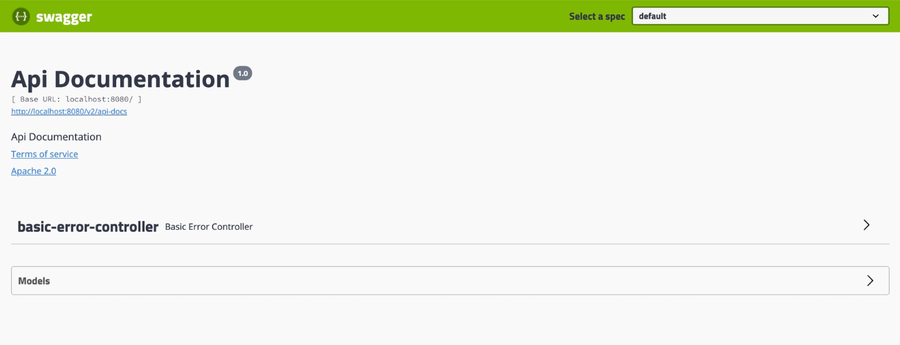
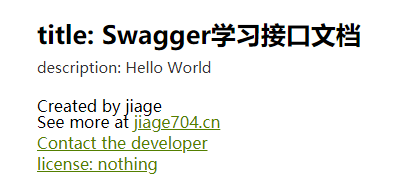

## 简介

随着互联网技术的发展，现在的网站架构基本都变成了：前端渲染、前后端分离的形态，而且前端技术和后端技术在各自的道路上越走越远。 前端和后端的唯一联系，变成了 API 接口。API 文档变成了前后端开发人员联系的纽带，变得越来越重要

- API 的目的是让人们可以简单的使用它来达到自己的目的。目前行业内有很多 API 风格，例如：REST、gRPC、GraphQL、SOAP、RPC 等等，但是每个风格都遵循一些基本的设计原则

没有 API 文档工具之前，都是手写 API 文档的，在什么地方书写的都有，而且 API 文档没有统一规范和格式，每个公司都不一样，这无疑给开发带来了灾难

OpenAPI 规范（OpenAPI Specification，简称 OAS）是 Linux 基金会的一个项目，试图通过定义一种用来描述 API 格式或 API 定义的语言，来规范 RESTful 服务开发过程，目前版本是 V3.0，并且已经发布并开源在 Github 上

如果手动去编写 OpenAPI 规范的文档，是非常麻烦的。Swagger 是全球最大的 OpenAPI 规范（OAS）API 开发工具框架，支持从设计和文档到测试和部署的整个 API 生命周期的开发

*更多：[使用 OAS（OpenAPI标准）来描述 Web API](https://blog.csdn.net/HuaZi_Myth/article/details/104053585)*

### Swagger 工具集

- Swagger Editor：编辑 Swagger 描述文件的编辑器，支持实时预览描述文件的更新效果，也提供了在线编辑器和本地部署编辑器两种方式
- Swagger UI：提供了一个可视化的 UI 页面展示描述文件，可以在该页面中对相关接口进行查阅和做一些简单的接口请求。该项目支持在线导入描述文件和本地部署 UI 项目
- Swagger Codegen：可以将描述文件生成 HTML 格式和 cwiki 形式的接口文档，同时也能生成多种语言的服务端和客户端的代码。支持通过 JAR 包、Docker、Node 等方式在本地化执行生成。也可以在 Swagger Editor 中在线生成
- Swagger Inspector：API 测试工具，可以保存请求的实际请求参数等数据
- SwaggerHub：集成了上面所有项目的各个功能，可以以项目和版本为单位，将描述文件上传到 Swagger Hub 中。在 Swagger Hub 中可以完成上面项目的所有工作，需要注册账号，分免费版和收费版

### Swagger 优缺点

- 对代码侵入性低，采用全注解的方式，开发简单
- 方法参数名修改、增加、减少参数都可以直接生效，不用手动维护

- 后端只需要定义好接口，会自动生成文档，接口功能、参数一目了然

- 操作简单，不用了解具体代码就可以操作
- 增加了开发成本，写接口还得再写一套参数配置

## 使用

- 引入依赖
- 编写配置

```java
@Configuration
// 开启Swagger
@EnableSwagger2
public class Swagger2Configuration {
}
```

- 测试运行：`IP:端口号/swagger-ui.html`



### 描述信息

```java
// Swagger参数配置
@Bean
public Docket docket() {
    return new Docket(DocumentationType.SWAGGER_2).apiInfo(apiInfo());
}

// Swagger描述信息
private ApiInfo apiInfo() {
    return new ApiInfo(
        	// 标题
            "Swagger学习接口文档",
        	// 描述
            "Hello World",
        	// 版本
            "version: 1.0",
        	// 组织链接
            "localhost:8080",
        	// 联系人信息
            new Contact("jiage", "jiage704.cn", "1031557588@qq.com"),
        	// 许可
            "Apache 2.0",
        	// 许可链接
            "http://www.apache.org/licenses/LICENSE-2.0",
        	// 扩展
            new ArrayList<>());
}
```



### 参数配置

```java
@Bean
public Docket docket() {
    return new Docket(DocumentationType.SWAGGER_2)
        	// 配置要忽略的参数
        	.ignoredParameterTypes(HttpSession.class)
        	// 配置是否启用swagger，配置为false，Swagger就不能在浏览器中访问
        	.enable(false)
            .select()
        	// 接口扫描策略
            .apis(RequestHandlerSelectors.any())
        	// 接口过滤
        	.paths(PathSelectors.any())
            .build();
}
```

#### RequestHandlerSelectors 中的方法

- `any()`：扫描所有的接口
- `none()`：不扫描
- `basePackage(String)`：扫描指定包
- `withClassAnnotation(Class)`：扫描指定注解的类
  - 例 `Controller.class`：只扫描有 Controller 注解的类中的接口
- `witMethodAnnotation(Class)`：扫描指定注解的方法
  - 例 `GetMapping.class`：只扫描 GET 请求

#### PathSelectors 中的方法

- `any()`：所有请求都过滤
- `none()`：不过滤
- `regex(String)`：通过正则的方式过滤接口
- `ant(String)`：通过 ant 风格表达式过滤接口，例 `"/hello/**"`

#### 动态配置项目是否能访问 Swagger 网页

在开发测试环境时可以访问，而上线是访问不了的，需要修改 Spring 配置文件

```java
@Configuration
@EnableSwagger2
public class Swagger2Configuration {
	@Autowired
    Environment environment;
    
    @Bean
    public Docket docket(Environment environment) {
		// 设置要显示Swagger的环境
        Profiles of = Profiles.of("dev", "test");
        // 判断当前是处于该环境，通过enable()接收此参数判断是否要显示
        boolean boo = environment.acceptsProfiles(of);

        return new Docket(DocumentationType.SWAGGER_2)
                .apiInfo(apiInfo())
            	.enable(boo)
                .select()
            	.build();
    }
}
```

通过 application.yml 切换不同环境的配置，例如 application-dev.yml、application-test.yml、application-pro.yml

```
spring:
	profiles:
		active: dev
```

#### 配置 API 分组

将 API 划分为不同的组，通过页面选择不同的组

```java
@Bean
public Docket docketUser() {
    return new Docket(DocumentationType.SWAGGER_2)
            .groupName("用户")
        	.select()
        	.paths(PathSelectors.ant("/user"))
            .build();
}

@Bean
public Docket docketVIP() {
    return new Docket(DocumentationType.SWAGGER_2)
            .groupName("VIP")
        	.select()
        	.paths(PathSelectors.ant("/vip"))
            .build();
}
```


#### 常用注解

- `@Api`：修饰整个类，描述 Controller 的作用
  - ~~description：描述信息，已过时~~
  - value：URL 的路径值
  - tags：标签信息，设置该值后，会覆盖 value 的值，字符串数组
  - hidden：设置为 true 将在文档中隐藏
- `@ApiOperation`：用在方法上，说明方法的作用，与 Controller 中的方法并列使用
  - value、tags、~~description~~、hidden
  - notes：详细的描述信息
  - httpMethod：设置请求方式
- `@ApiParam`：用在 `@ApiImplicitParams` 的方法里边，对单个参数描述
  - name：属性名称
  - value：属性值
  - hidden：设置为 true 将在文档中隐藏
  - defaultValue：设置默认值
  - allowableValues：限制可选值
  - required：是否为必填
  - example：举例
  - examples：多个例子
  - allowEmptyValue：是否允许空值
  - readOnly：是否只读
- `@ApiImplicitParam`：用于方法上描述请求参数，根据不同的 paramType 类型，请求的参数来源不同
  - name、value、required、defaultValue
  - paramType：表示参数存放位置
    - path：以地址的形式提交数据，参数的获取：`@PathVariable`
    - query：直接跟参数完成自动映射赋值，参数的获取：`@RequestParam`
    - header：参数在 request headers 里边提交，参数的获取：`@RequestHeader`
    - body：以流的形式提交，仅支持 POST，**不常用**
    - form：以 form 表单的形式提交，仅支持 POST，**不常用**
  - dataType：参数的数据类型，默认 String
- `@ApiImplicitParams`：用于方法上包含一组参数说明
- `@ApiModel`：对类进行说明，描述一个 Model 的信息，表示参数用实体类接收
- `@ApiModelProperty`：注解用于方法、字段，表示对 Model 属性的说明或者数据操作更改，配合 `@ApiModel` 一起使用
- `@ApiIgnore`：用于类或方法上，表示不需要 Swagger 处理
- `@ApiError` ：发生错误返回的信息
- `@ApiResponse`：用在请求的方法上，表示不同的响应
- `@ApiResponses`：用于请求的方法上，根据响应码表示不同响应

*更多：[齐全的 swagger注解介绍](https://zhuanlan.zhihu.com/p/49996147)*

## 更多

- [还不知道在Java中如何搭建Swagger API接口文档？看这篇文章就够了！](https://blog.csdn.net/qq122516902/article/details/89417964)
- [Swagger最佳实践](https://www.jianshu.com/p/6cac7bd21c8f)
- [Swagger介绍及使用](https://www.jianshu.com/p/349e130e40d5)
- [关于Swagger报错java.lang.NumberFormatException: For input string: ""的总结](https://blog.csdn.net/qq122516902/article/details/89673363)