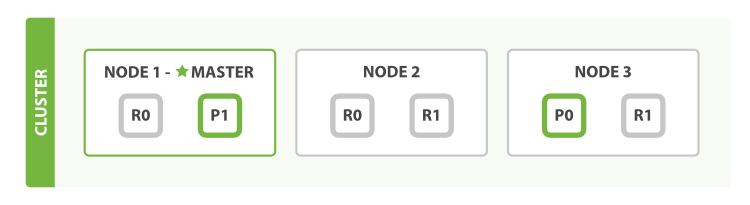

## 简介

Elasticsearch 是一个实时的分布式存储、搜索、分析的引擎，基于 Lucene 的开源的搜索服务器

- 分布式的实时文件存储，每个字段都被索引并可被搜索
- 分布式的实时分析搜索引擎
- 可以扩展到上百台服务器，处理 PB 级结构化或非结构化数据

### 全文搜索

全文搜索引擎是目前广泛应用的主流搜索引擎。它的工作原理是计算机索引程序通过扫描文章中的每一个词，对每一个词建立一个索引，指明该词在文章中出现的次数和位置，当用户查询时，检索程序就根据事先建立的索引进行查找，并将查找的结果反馈给用户的检索方式。这个过程类似于通过字典中的检索字表查字的过程

数据总体分为两种，有些地方还会有第三种，半结构化数据

- 结构化数据：具有固定格式或有限长度的数据，如数据库，元数据等
- 非结构化数据：不定长或无固定格式的数据，又可称为全文数据，如邮件，Word 文档等
- 半结构化数据：当根据需要可按结构化数据来处理，也可抽取出纯文本按非结构化数据来处理，，如 XML、HTML 等

根据数据分类，搜索也相应的分为两种：结构化数据搜索和非结构化数据搜索

- 结构化数据：可以通过关系型数据库的表的方式存储和搜索，也可以建立索引

- 非结构化数据：主要有两种方法
  - 顺序扫描：按照顺序扫描的方式查询特定的关键字，**比较耗时且低效**
  - 全文检索：将非结构化数据中的一部分信息提取出来，重新组织，使其变得有一定结构，然后对此有一定结构的数据进行搜索，从而达到搜索相对较快的目的。这部分从非结构化数据中提取出的然后重新组织的信息，称之为 **索引**

### 全文搜索引擎

所有数据在数据库里面都有，而且数据库里也能提供查询检索或者聚类分析功能，还可以添加索引、优化 SQL 等方式提升效率，为什么还需要全文搜索引擎

- 全文索引搜索支持非结构化数据的搜索，可以更好地快速搜索大量存在的任何单词或单词组的非结构化文本，而关系型数据库搜索不是能很好的支持

- 一般传统数据库，全文检索都实现的很鸡肋，进行全文检索需要扫描整个表。如果数据量大的话即使对 SQL 的语法优化，也收效甚微。建立了索引，但是维护起来也很麻烦，对于 insert 和 update 操作都会重新构建索引

#### 如何使用全文搜索引擎

- 搜索的数据对象是大量的非结构化的文本数据
- 文件记录量达到数十万或数百万个甚至更多
- 支持大量基于交互式文本的查询
- 需求非常灵活的全文搜索查询
- 对高度相关的搜索结果的有特殊需求，但是没有可用的关系数据库可以满足
- 对不同记录类型、非文本数据操作或安全事务处理的需求相对较少的情况

### Lucene

Lucene 是 Apache 发布的一个开源的全文检索引擎工具包，是一个 **全文检索引擎的架构**，提供了完整的创建索引和查询索引，以及部分文本分析的引擎，Lucene 的目的是为软件开发人员提供一个简单易用的工具包，以方便在目标系统中实现全文检索的功能，或者是以此为基础建立起完整的全文检索引擎

* Lucene 是根据关健字来搜索的文本搜索工具，只能在某个网站内部搜索文本内容，不能跨网站搜索

#### 索引库

Lucene 中存的就是一系列的二进制压缩文件和一些控制文件，它们位于计算机的硬盘上，这些内容统称为索引库，索引库有两个部份组成

- 原始记录：存入到索引库中的原始文本
- 词汇表：按照一定的拆分策略（即分词器）将原始记录中的每个字符拆开后，存入一个供将来搜索的表

当用户根据关键字来进行搜索时，程序就先去查询词汇表中有没有该关键字，如果有该关键字就定位到原始记录表中，将符合条件的原始记录返回给用户查看

### Solr 与 Elasticsearch

Apache Solr 是一个成熟的项目，拥有庞大而活跃的开发和用户社区，于 2006 年首次发布到开源，在搜索领域占据了多年的主导地位。然后，在2010年左右，Elasticsearch 成为市场上的另一种选择，Elasticsearch 建立在更现代的原则上，针对更现代的用例，并且是为了更容易处理大型索引和高查询率而构建的

|        特征         |                       Solr / SolrCloud                       |                        Elasticsearch                         |
| :-----------------: | :----------------------------------------------------------: | :----------------------------------------------------------: |
|    社区和开发者     |                  Apache 软件基金和社区支持                   |                     单一商业实体及其员工                     |
|      节点发现       |       Apache Zookeeper，在大量项目中成熟且经过实战测试       | Zen 内置于 Elasticsearch 本身，需要专用的主节点才能进行分裂脑保护 |
|      碎片放置       | 本质上是静态，需要手动工作来迁移分片，从 Solr7 开始允许一些动态操作 |              动态，可以根据群集状态按需移动分片              |
|      高速缓存       |                     全局，每个段更改无效                     |                   每段，更适合动态更改数据                   |
|    分析引擎性能     |                  非常适合精确计算的静态数据                  |                  结果的准确性取决于数据放置                  |
|    全文搜索功能     | 基于 Lucene 的语言分析，多建议，拼写检查，丰富的高亮显示支持 | 基于 Lucene 的语言分析，单一建议 API 实现，高亮显示重新计算  |
|     DevOps 支持     |                     尚未完全，但即将到来                     |                         非常好的 API                         |
|   非平面数据处理    |                     嵌套文档和父-子支持                      |    嵌套和对象类型的自然支持允许几乎无限的嵌套和父-子支持     |
|      查询 DSL       |             JSON（有限），XML（有限）或 URL 参数             |                             JSON                             |
| 索引 / 收集领导控制 |      领导者安置控制和领导者重新平衡甚至可以节点上的负载      |                            不可能                            |
|      机器学习       |      内置在流聚合之上，专注于逻辑回归和学习排名贡献模块      |         商业功能，专注于异常和异常值以及时间序列数据         |
|      流行趋势       |                           日落西山                           |                        有更大的吸引力                        |
|      安装配置       |                           比较繁琐                           |                      易于安装且非常轻巧                      |

#### 选择

- 由于易于使用，Elasticsearch 在新开发者中更受欢迎。但是，如果已经习惯了与 Solr 合作，请继续使用它，因为迁移到 Elasticsearch 没有特定的优势
- 如果除了搜索文本之外还需要它来处理分析查询，Elasticsearch 是更好的选择
- 如果需要分布式索引，则需要选择 Elasticsearch。对于需要良好可伸缩性和性能的云和分布式环境，Elasticsearch 是更好的选择
- 两者都有良好的商业支持（咨询，生产支持，整合等）
- 两者都有很好的操作工具，Elasticsearch 因其易于使用的 API 而更多地吸引了 DevOps 人群，因此可以围绕它创建一个更加生动的工具生态系统
- Elasticsearch 在开源日志管理用例中占据主导地位，许多组织在 Elasticsearch 中索引它们的日志以使其可搜索。虽然 Solr 现在也可以用于此目的，但它只是错过了这一想法
- Solr 仍然更加面向文本搜索。另一方面，Elasticsearch 通常用于过滤和分组，分析查询工作负载，而不一定是文本搜索。Elasticsearch 开发人员在 Lucene 和 Elasticsearch 级别上投入了大量精力使此类查询更高效（降低内存占用和 CPU 使用）。因此，对于不仅需要进行文本搜索，而且需要复杂的搜索时间聚合的应用程序，Elasticsearch 是一个更好的选择
- Elasticsearch 更容易上手，一个下载和一个命令就可以启动一切。Solr 传统上需要更多的工作和知识，但 Solr 最近在消除这一点上取得了巨大的进步，现在只需努力改变它的声誉
- 在性能方面，它们大致相同
- 从操作上讲，Elasticsearch 使用起来比较简单，它只有一个进程。Solr 在其类似 Elasticsearch 的完全分布式部署模式 SolrCloud 中依赖于 Apache ZooKeeper
- Elasticsearch 内置了类似 ZooKeeper 的组件 Xen，但 ZooKeeper 可以更好地防止有时在 Elasticsearch 集群中出现的可怕的裂脑问题。公平地说，Elasticsearch 开发人员已经意识到这个问题，并致力于改进 Elasticsearch 的这个方面
- 如果喜欢监控和指标，那么使用 Elasticsearch，Solr 暴露了关键指标，但远不及 Elasticsearch 那么多

## 基本概念

Elasticsearch 是一个近乎实时（NRT）的搜索平台。这意味着从索引文档到可搜索文档的时间有一点延迟（通常是 1 秒）

- Elasticsearch 对模糊搜索非常擅长（搜索速度很快）
- 从 Elasticsearch 搜索到的数据可以根据 **评分** 进行排序过滤
- 没有那么准确的关键字也能搜出相关的结果

### 倒排索引

- 正向索引：根据完整的条件，查找一条记录叫，一本书的章节目录就是正向索引，通过章节名称就找到对应的页码
- 倒排索引：根据关键词来查找对应记录

### 术语

- 节点（Node）：一个运行的 ES 实例就是一个节点，节点存储数据并参与集群的索引和搜索功能，节点由名称标识，默认情况下，该名称是在启动时分配给节点的随机通用唯一标识符（UUID）

- 索引（Index）：具有某些类似特征的文档集合，名称标识必须全部小写，此名称用于在对其中的文档执行索引，搜索，更新和删除操作时引用索引
  - 相当于数据库的 Table

- 类型（Type）：索引的逻辑类别，允许在同一索引中存储不同类型的文档，**新的版本已经废除**

- 文档（Document）：可以建立索引的基本信息单元
  - 相当于数据库的一行记录
- 字段（Field）：在索引中每个文档都包括了一个或多个字段
  - 相当于数据库的 Column
- 映射（Mapping）：描述字段的类型、如何进行分析、如何进行索引等内容

## 安装配置

下载所需的版本并解压，进入 bin 文件夹运行 `elasticsearch -d` 进行启动

- 启动 ES 服务的时候，不允许使用 root 账户
  - 创建用户：`adduser esuser`
  - 设置密码：`passwd esuser`
  - 赋予权限：`chown -R esuser /usr/local/elasticsearch/`
  - 切换到普通用户下，执行启动命令
- `max file descriptors [4096] for elasticsearch process is too low, increase to at least [65536]`：每个进程最大同时打开文件数太小

```ini
# 切换root账户，修改/etc/security/limits.conf
esuser    hard     nofile     65536 
esuser    soft     nofile     65536
*         soft     nproc      4096
*         hard     nproc      4096
```

- `max virtual memory areas vm.max_map_count [65530] is too low, increase to at least [262144]`：用户拥有的内存权限太小

```ini
# 切换root账户，修改/etc/sysctl.conf
vm.max_map_count=655360
# 修改完毕，执行sysctl -p命令
```

### 配置文件

- elasticsearch.yml

```yaml
# 集群名，ES启动后会将具有相同集群名字的节点放到一个集群下
cluster.name: es_cluster
# 节点名
node.name: es_node_1
# 绑定的IP地址
network.host: 0.0.0.0
# 端口号
http.port: 9200
# 节点间交互的tcp端口
transport.tcp.port: 9300
# 该节点是否有资格被选举成为master节点
node.master: true
# 该节点是否存储索引数据
node.data: true
# 该节点是否允许成为协调节点
node.ingest: true
# 指明集群中其它可能为master的节点IP
discovery.zen.ping.unicast.hosts: ["0.0.0.0:9300", "0.0.0.0:9301"]
# 指定集群中的节点中有几个有master资格的节点
discovery.zen.minimum_master_nodes: 1
# 是否锁住ES使用的内存，避免内存与swap分区交换数据
bootstrap.memory_lock: false
# 单机允许的最大存储节点数
node.max_local_storage_nodes: 2
# 数据存储位置
path.data: /usr/local/elasticsearch/data
# 日志存储位置
path.logs: /usr/local/elasticsearch/logs
# 开启cors跨域访问支持
http.cors.enabled: true
# 跨域访问允许的域名地址
http.cors.allow-origin: /.*/
```

### 可视化界面

head 插件是 ES 的一个可视化管理插件，用来监视 ES 的状态，并通过 head 客户端和 ES 服务进行交互，比如创建映射、创建索引等，需安装 node.js

- 下载后解压，进入文件夹，运行 `npm run start`，访问 9100 端口

## 集群

一组具有相同 `cluster.name` 的节点集合，他们协同工作，共享数据并提供故障转移和扩展功能，当然一个节点也可以组成一个集群

- 集群健康状态
  - 绿色：一切都很好
  - 黄色：所有数据均可用，但尚未分配一些副本
  - 红色：某些数据由于某种原因不可用



- 由三个节点组成的集群
  - 两个主分片：P0、 P1
  - 每个主分片有两个副本分片：R0、R1
  - 相同分片的副本不会放在同一节点
- 节点转发：每个节点都知道其它节点的信息，可以对任一节点发起请求，接收请求的节点会转发给其它节点查询数据
- 主节点：master 节点主要用于集群的管理及索引 比如新增节点、分片分配、索引的新增和删除等
- 数据节点：data 节点上保存了数据分片，负责索引和搜索操作
- 客户端结点：client 节点仅作为请求客户端存在，client 的作用也作为负载均衡器，client 节点不存数据，只是将请求均衡转发到其它结点

### 分片（Shards）

索引可能存储大量可能超过单个节点的硬件限制的数据，为了解决这个问题，ES 提供了将索引细分为多个称为分片的功能。创建索引时，只需定义所需的分片数即可。每个分片本身都是一个功能齐全且独立的索引，可以托管在集群中的任何节点上

- 设置分片的目的及原因
  - 分片允许水平拆分和缩放内容量
  - 分片允许跨分片（可能在多个节点上）分布和并行化操作，从而提高性能和吞吐量

- 分片的分布方式以及如何将其文档聚合回搜索请求的机制完全由 ES 管理，对用户而言是透明的

在可能随时发生故障的环境中，分片非常有用，建议使用故障转移机制，以防分片或节点以某种方式脱机或因任何原因消失。为此，ES 允许将索引的分片的一个或多个副本制作成所谓的副本分片

### 副本（Replicasedit）

对分片的复制。目的是为了当分片或节点发生故障时提供高可用性，它允许扩展搜索量和吞吐量，因为可以在所有副本上并行执行搜索

- 每个索引可以拆分为多个分片。索引也可以复制为零次（表示没有副本）或更多次。复制之后，每个索引将具有主分片（从原始分片复制而来的）和复制分片（主分片的副本）

### 集群搭建

- 只需重新复制一份 elasticsearch，并修改配置文件，之后启动即可
  - 复制的 elasticsearch 文件夹，需要将 data 文件中的节点数据清空，否则会启动错误

```ini
# 节点es_node_1配置文件
cluster.name: es_cluster
node.name: es_node_1
network.host: 0.0.0.0
http.port: 9200
transport.tcp.port: 9300
node.master: true
node.data: true
node.ingest: true
discovery.zen.ping.unicast.hosts: ["0.0.0.0:9300", "0.0.0.0:9301"]
discovery.zen.minimum_master_nodes: 1
bootstrap.memory_lock: false
node.max_local_storage_nodes: 2
path.data: /usr/local/elasticsearch01/data
path.logs: /usr/local/elasticsearch01/logs
http.cors.enabled: true
http.cors.allow-origin: /.*/
```

```ini
# 节点es_node_2配置文件
cluster.name: es_cluster
# 修改节点名
node.name: es_node_2
network.host: 0.0.0.0
# 修改端口号
http.port: 9201
transport.tcp.port: 9301
node.master: true
node.data: true
node.ingest: true
discovery.zen.ping.unicast.hosts: ["0.0.0.0:9300", "0.0.0.0:9301"]
discovery.zen.minimum_master_nodes: 1
bootstrap.memory_lock: false
node.max_local_storage_nodes: 2
# 修改elasticsearch位置
path.data: /usr/local/elasticsearch02/data
path.logs: /usr/local/elasticsearch02/logs
http.cors.enabled: true
http.cors.allow-origin: /.*/
```

## 使用

- 创建索引库（PUT）：`IP地址:9200/索引库名称`

```json
{
    "settings": {
        "index": {
            // 分片数量
            "number_of_shards": 1,
            // 副本数量
            "number_of_replicas": 0
        }
    }
}
```

- 创建映射（PUT）：`IP地址:9200/索引库名称/类型名称/_mapping`

```JSON
{
    "properties": {
        "name": {
            "type": "text"
        }
    }
}
```

- 更新映射：映射创建成功可以添加新字段，已有字段不允许更新
- 删除映射：通过删除索引来删除映射
- 创建文档（PUT）：`IP地址:9200/索引库名称/类型名称/ID值`
  - 如果不指定 ID 值 ES 会自动生成 ID

```JSON
{
    "name": "法克鱿"
}
```

- 搜索文档（GET）：`IP地址:9200/索引库名称/类型名称/ID值`
- 查询所有记录（GET）：`IP地址:9200/索引库名称/类型名称/_search`

- 查询名称中包括关键字的的记录（GET）：`IP地址:9200/索引库名称/类型名称/_search?q=name:关键字`

### IK 分词器

在添加文档时会进行分词，索引中存放的就是一个一个的词（term），搜索时就是拿关键字去匹配词，最终找到词关联的文档

- 测试当前索引库使用的分词器（POST）：`IP地址:9200/_analyze`

- 安装 IK 分词器
  - 下载与 ES 版本相同的 IK 分词器，解压到 ES 安装目录下 plugins 下的 ik 目录
- 分词模式
  - ik_max_word：会将文本做最细粒度的拆分
  - ik_smart：会将文本做最粗粒度的拆分
  - 索引时使用 ik_max_word 将搜索内容进行细粒度分词，搜索时使用 ik_smart 提高搜索精确性

#### 自定义词库

IK 分词器自带一个 `main.dic` 的文件，此文件为词库文件，可在文件中添加自定义词库文件

- 自定义词库文件：新建一个 dic 为后缀的文件，将需要的分词填写进去

```xml
<entry key="ext_dict">my.dic</entry>
```

### 映射类型

- 字符串
  - text：在映射时要设置分词器
  - keyword：关键字字段，按照整体搜索，不进行分词

```json
{
    "properties": {
        "name": {
            "type": "text",
            // 指定分词器
            "analyzer": "ik_max_word",
            // 指定搜索时使用的分词器
            "search_analyzer": "ik_smart",
            // 是否进行索引，为false则不进行搜索
            "index": false    
        }
    }
}

{
    "properties": {
        "name": {
            "type": "keyword"
        }
    }
}
```

- 日期类型

```json
{
    "properties": {
        "birthday": {
            "type": "date",
            "format": "yyyy-MM-dd HH:mm:ss"
        }
    }
}
```

- 数值类型：尽量选择范围小的类型，提高搜索效率
  - scaled_float、half_float、float、double、byte、short、integer、long

```json
{
    "properties": {
        "price": {
            "type": "scaled_float",
            // 对于浮点数尽量用比例因子
            // ES中会将输入的数字乘以100存储在ES中，因为整型比浮点型更易压缩，节省磁盘空间
            "scaling_factor": 100
        }
    }
}
```

### Spring Boot 整合

ES 在 6.0 之后提供 Java High Level REST Client，但还处于完善中，有些功能还没有，如有不支持的功能可以使用 Java Low Level REST Client

- 引入依赖，编写配置类

```java
@Configuration
public class ElasticsearchConfig {
    @Value("${es.elasticsearch.hostlist}")
    private String hostlist;

    @Bean
    public RestHighLevelClient restHighLevelClient() {
        return new RestHighLevelClient(RestClient.builder(split()));
    }

    @Bean
    public RestClient restClient() {
        return RestClient.builder(split()).build();
    }

    private HttpHost[] split() {
        // 解析hostlist配置信息
        String[] split = hostlist.split(",");
        // 存放es主机和端口的配置信息
        HttpHost[] httpHosts = new HttpHost[split.length];
        for (int i = 0; i < split.length; i++) {
            String item = split[i];
            httpHosts[i] = new HttpHost(
                item.split(":")[0], 
                Integer.parseInt(item.split(":")[1]), 
                "http");
        }
        return httpHosts;
    }
}
```

```yaml
es:
  elasticsearch:
    hostlist: ${eshostlist:192.168.101.128:9200}
```

- 创建索引库

```java
@SpringBootTest
@RunWith(SpringRunner.class)
public class TestIndex {
    @Autowired
    RestHighLevelClient restHighLevelClient;
    @Autowired
    RestClient restClient;

    @Test
    public void testCreateIndex() throws IOException {
        // 创建索引请求对象，并设置索引名称
        CreateIndexRequest createIndexRequest = new CreateIndexRequest("xc_course");
        // 设置索引参数
        createIndexRequest.settings(
            Settings.builder().put("number_of_shards", 1).put("number_of_replicas", 
                                                              0));
        // 设置映射
        createIndexRequest.mapping("doc", "{\n" +
                "    \"properties\": {\n" +
                "        \"description\": {\n" +
                "            \"type\": \"text\",\n" +
                "            \"analyzer\": \"ik_max_word\",\n" +
                "            \"search_analyzer\": \"ik_smart\"\n" +
                "        },\n" +
                "        \"name\": {\n" +
                "            \"type\": \"text\",\n" +
                "            \"analyzer\": \"ik_max_word\",\n" +
                "            \"search_analyzer\": \"ik_smart\"\n" +
                "        },\n" +
                "        \"pic\": {\n" +
                "            \"type\": \"text\",\n" +
                "            \"index\": false\n" +
                "        },\n" +
                "        \"studymodel\": {\n" +
                "            \"type\": \"text\"\n" +
                "        }\n" +
                "    }\n" +
                "}", XContentType.JSON);
        // 创建索引操作客户端
        IndicesClient indicesClient = restHighLevelClient.indices();
        // 创建响应对象
        CreateIndexResponse response = indicesClient.create(createIndexRequest);
        // 响应结果
        boolean result = response.isAcknowledged();
        System.out.println(result);
    }
}
```

#### DSL 搜索

DSL（Domain Specific Language）是 ES 提出的基于 JSON 的搜索方式，在搜索时传入特定的 JSON 格式的数据来完成不同的搜索需求

- DSL 比 URI 搜索方式功能强大，在项目中建议使用 DSL 方式来完成搜索


## 更多

* [Lucene就是这么简单](https://juejin.im/post/5aaf21d46fb9a028b86dcf38)
* [全文搜索引擎 ElasticSearch 还是 Solr？](https://www.cnblogs.com/jajian/p/9801154.html)
* [Elasticsearch 技术分析（一）： 基础入门](https://www.cnblogs.com/jajian/p/9976900.html)
* [Elasticsearch 技术分析（七）： Elasticsearch 的性能优化](https://www.cnblogs.com/jajian/p/10465519.html)
* [Elasticsearch 技术分析（九）：全文搜索引擎Elasticsearch，这篇文章给讲透了！](https://www.cnblogs.com/jajian/p/11223992.html)
* [ElasticSearch 在Linux下的安装和启动、常见问题解决](https://cloud.tencent.com/developer/article/1422171)

- [干货 Elasticsearch 知识点整理 一](https://www.cnblogs.com/ZhuChangwu/p/11793877.html)
- [「扫盲」Elasticsearch](https://juejin.im/post/5e264b026fb9a03003008435)

- [Elasticsearch就这么简单](https://juejin.im/post/5ab4496e518825556d0e0713)

- [SpringBoot+Elasticsearch](https://www.cnblogs.com/cjsblog/p/9756978.html)
- [Elasticsearch 快速开始](https://www.cnblogs.com/cjsblog/p/9439331.html)


