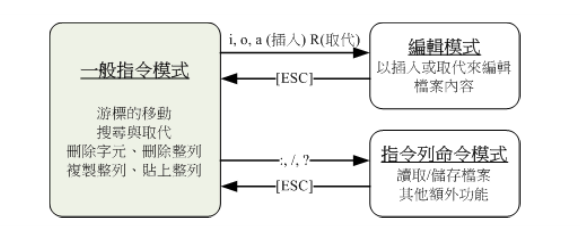

## vim程序编辑器

### vi的三种模式

- **一般指令模式 (command mode)**：以 vi 打开一个文件就直接进入一般指令模式了。在这个模式中， 你可以使用上下左右按键来移动光标，你可以使用删除字符或删除整列来处理文件内容，也可以使用复制、粘贴来处理你的文件数据
- **编辑模式 (insert mode)**：在一般指令模式中可以进行删除、复制、粘贴等操作，但无法编辑文件内容的。要按下 i, I, o, O, a, A, r, R 等任何一个字母之后才会进入编辑模式。通常在 Linux中，按下这些按键时，在画面的左下方会出现 INSERT 或 REPLACE 的字样，此时才可以进行编辑。而如果要回到一般指令模式时， 可按下 Esc 按键退出编辑模式
- **指令列命令模式 (command-line mode)**：在一般模式当中，输入 : / ?  三个中的任何一个按钮，就可以将光标移动到最底下那一列。在这个模式当中， 可以提供搜寻资料的操作，而读取、保存、离开 vi 、显示行号等操作则是在此模式中达成的

### vi按键说明

#### 一般模式可用指令

**移动光标**

|       按键       |                     说明                     |
| :--------------: | :------------------------------------------: |
|     `h`、`←`     |             光标向左移动一个字符             |
|     `j`、`↓`     |             光标向下移动一个字符             |
|     `k`、`↑`     |             光标向上移动一个字符             |
|     `l`、`→`     |             光标向右移动一个字符             |
|   `30j`、`25←`   |                   多次移动                   |
|   `Ctrl` + `f`   |            向下移动一页，**常用**            |
|   `Ctrl` + `b`   |            向上移动一页，**常用**            |
|   `Ctrl` + `d`   |                 向下移动半页                 |
|   `Ctrl` + `u`   |                 向上移动半页                 |
|       `+`        |          光标移动到非空格符的下一列          |
|       `-`        |          光标移动到非空格符的上一列          |
| `数字` + `space` |         光标向右移动这一列的几个字符         |
|   `0`、`Home`    |   光标移动到这一列的最前面字符处，**常用**   |
|    `$`、`End`    |   光标移动到这一列的最后面字符处，**常用**   |
|       `H`        | 光标移动到这个屏幕的最上方那一列的第一个字符 |
|       `M`        |  光标移动到这个屏幕的中央那一列的第一个字符  |
|       `L`        | 光标移动到这个屏幕的最下方那一列的第一个字符 |
|       `G`        |    光标移动到这个文件的最后一列，**常用**    |
|   `数字` + `G`   |          光标移动到这个文件的第几列          |
|       `gg`       |     光标移动到这个文件的第一列，**常用**     |
| `数字` + `Enter` |               光标向下移动几列               |

**搜索与替代**

|            按键             |                             说明                             |
| :-------------------------: | :----------------------------------------------------------: |
|          `/String`          |                   向光标之下寻找一个字符串                   |
|          `?String`          |                   向光标之上寻找一个字符串                   |
|             `n`             |                        继续下一个搜寻                        |
|             `N`             |                           反向搜寻                           |
| `:n1,n2s/String1/String2/g` |      在 n1 列到 n2 列之间寻找并替换 String1 为 String2       |
| `:n1,$s/String1/String2/g`  |       从第一列到最后一列寻找并替换 String1 为 String2        |
| `:n1,$s/String1/String2/gc` | 从第一列到最后一列寻找并替换 String1 为 String2，在替换前需要用户确认 |

**删除、复制、粘贴**

|     按键      |                    说明                    |
| :-----------: | :----------------------------------------: |
|      `x`      |          向后删一个字符，**常用**          |
|      `X`      |          向前删一个字符，**常用**          |
| `数字` + `x`  |            连续向后删除几个字符            |
|     `dd`      |      删除游标所在的那一整列，**常用**      |
| `数字` + `dd` |           删除光标所在的向下几列           |
|     `d1G`     |       删除光标所在到第一列的所有数据       |
|     `dG`      |      删除光标所在到最后一列的所有数据      |
|     `d$`      |    删除光标所在处，到该列的最后一个字符    |
|     `d0`      |   删除光标所在处，到该列的最前面一个字符   |
|     `yy`      |       复制光标所在的那一列，**常用**       |
| `数字` + `yy` |      复制光标所在的向下几列，**常用**      |
|     `y1G`     |      复制光标所在列到第一列的所有数据      |
|     `yG`      |     复制光标所在列到最后一列的所有数据     |
|     `y$`      | 复制光标所在的那个字符到该列行尾的所有数据 |
|     `y0`      | 复制光标所在的那个字符到该列行首的所有数据 |
|      `p`      |      将已复制的数据在光标下一列粘贴上      |
|      `P`      |      将已复制的数据在光标上一列粘贴上      |
|      `J`      |   将光标所在列与下一列的数据结合成同一列   |
|      `c`      |        重复删除多个数据，如 `10cj`         |
|      `u`      |          复原前一个动作，**常用**          |
| `Ctrl` + `r`  |          重做前一个动作，**常用**          |
|      `.`      |               重复前一个动作               |

#### 一般指令模式切换到编辑模式的可用的指令

**进入插入模式**

| 按键 |                  说明                  |
| :--: | :------------------------------------: |
| `i`  |          从目前光标所在处插入          |
| `I`  | 在目前所在列的第一个非空格符处开始插入 |
| `a`  |  从目前光标所在的下一个字符处开始插入  |
| `A`  | 从目前光标所在的最后一个字符处开始插入 |
| `o`  |  在目前光标所在的下一列处插入新的一列  |
| `O`  |  在目前光标所在处的上一列插入新的一列  |

**进入取代模式**

| 按键  |                    说明                     |
| :---: | :-----------------------------------------: |
|  `r`  |      只会取代光标所在的那一个字符一次       |
|  `A`  | 一直取代光标所在的文字，直到按下 `Esc` 为止 |
| `Esc` |      退出编辑模式，回到一般指令模式中       |

#### 一般指令模式切换到指令列模式的可用的指令

|        按键         |                     说明                     |
| :-----------------: | :------------------------------------------: |
|        `:w`         |     将编辑的数据写入硬盘文件中，**常用**     |
|        `:w!`        |      若文件属性为只读时，强制写入该文件      |
|        `:q`         |              离开 vi ，**常用**              |
|        `:wq`        |             储存后离开，**常用**             |
|       `:wq!`        |                强制储存后离开                |
|        `ZZ`         |              强制离开不储存文件              |
|    `:w [文件名]`    |         将编辑的数据储存成另一个文件         |
|    `:r [文件名]`    |      在编辑的数据中读入另一个文件的数据      |
| `:n1,n2 w [文件名]` |     n1 列到 n2 列之间的内容储存成新文件      |
|     `:! [指令]`     | 暂时离开 vi 到指令列模式下执行指令的显示结果 |
|      `:set nu`      |                   显示行号                   |
|     `:set nonu`     |                   取消行号                   |

### vim的暂存档、救援回复与开启时的警告讯息（待添加）