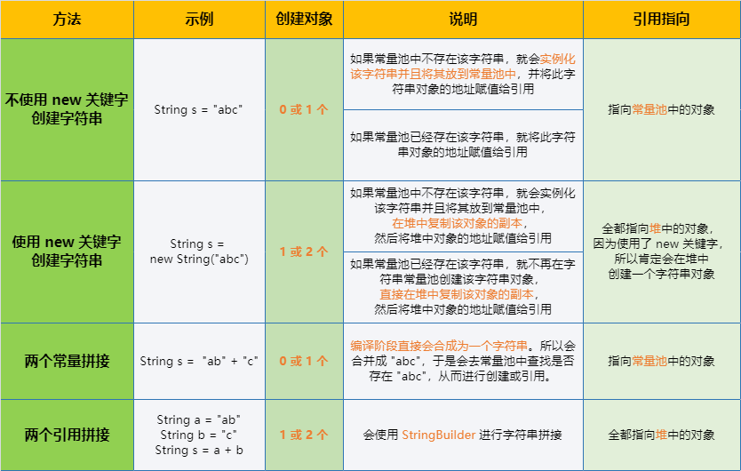
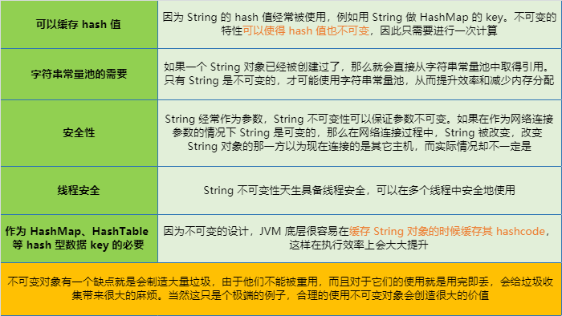

## String

String 类在 java.lang 包下面，是 Object 类的直接子类，被 final 修饰，所以不能被继承。String 被设计成不可变类，所以它的所有对象都是不可变对象。在 JDK9 之前，String 内部使用 **char** 数组存储数据，之后改用 **byte** 数组存储字符串，同时使用 **coder 来标识使用的编码**

### 字符串常量池

字符串常量池（String Pool）保存着所有字符串字面量，这些字面量在编译时期就确定。还可以使用 String 的 intern 方法在运行过程中将字符串添加到字符串常量池中

* 节省内存空间：常量池中所有相同的字符串常量被合并，只占用一个空间
* 节省运行时间：比较字符串时，比 equals() 快。对于两个引用变量，只需要判断引用是否相等，就可以判断实际值是否相等

*更多：[深入浅出 java常量池](https://www.cnblogs.com/syp172654682/p/8082625.html)*

### 创建字符串



* 尽量不要使用 new 来创建字符串，因为使用 new 创建字符串对象 **一定会开辟一个新的堆内存空间**，而双引号则是采用了 String interning（字符串驻留）进行了优化，效率更高
* 两个 new String 相加，首先会创建两个字符串对象，然后创建相加后的对象，然后判断常量池中是否存在这两个对象的字面量常量
* 双引号字符串与 new String 字符串相加，首先会创建两个对象，一个是 new String 的对象，一个是相加后的对象。然后判断双引号常量与 new String 的字面量在常量池是否存在
* **final 修饰的两个字符串拼接，会在编译阶段合成为一个字符串**

```java
String s1 = "abc";
String s2 = "ab" + "c";
// true，s1指向常量池中的地址，s2在编译期会转化为"abc"，所以也指向常量池中的地址
System.out.println(s1 == s2);

String s1 = "abc";
String a = "ab";
String b = "c";
// false，s1指向常量池中的地址，a+b会调用StringBuilder，所以指向堆中的地址
System.out.println(s1 == (a + b));

String s1 = "abc";
final String a = "ab";
final String b = "c";
// true，s1指向常量池中的地址，a+b在编译期会转化为"abc"，所以也指向常量池中的地址
System.out.println(s1 == (a + b));

String s1 = "abc";
final String a = new String("ab");
final String b = "c";
// false，s1指向常量池中的地址，a+b会调用StringBuilder，所以指向堆中的地址
System.out.println(s1 == (a + b));
```

### intern()

* 当一个字符串调用 intern 方法时
  * 如果字符串常量池中已经存在一个字符串和该字符串值相等，那么就返回字符串常量池中字符串的引用
  * 如果不存在，就会在字符串常量池中添加一个新的字符串，并返回这个新字符串的引用

- 常量池存放于方法区中，JDK6 方法区放在永久代（Java 堆的一部分），JDK7 特别将字符串常量池移动到了的堆内存中，JDK8 放在单独的元空间里面，和堆相独立。所以 intern 方法在不同版本会有不同表现

```java
String s1 = new String("abc");
// false，s1指向堆中的地址，s1.intern()指向常量池中的地址
System.out.println(s1 == s1.intern());

String s1 = new String("ab") + "c";
// false，s1指向堆中的地址，s1.intern()指向常量池中的地址
System.out.println(s1 == s1.intern());

String s1 = new String("ab") + "c";
String s2 = "abc";
// true，s1.intern()和s2都指向常量池中的地址
System.out.println(s1.intern() == s2);

String s1 = new String("ab") + new String("c");
String s2 = "abc";
// true，s1.intern()和s2都指向常量池中的地址
System.out.println(s1.intern() == s2);
```

*更多：[几张图轻松理解 String.intern()](https://blog.csdn.net/soonfly/article/details/70147205)、[《深入理解 java虚拟机》String.intern()探究](https://blog.csdn.net/w605283073/article/details/72753494)、[深入解析 String#intern](https://tech.meituan.com/2014/03/06/in-depth-understanding-string-intern.html)*

### 不可变对象

对象创建完成之后，不能再改变它的状态。如对象内的成员变量，包括基本数据类型的值不能改变，引用类型的变量不能指向其他的对象，引用类型指向的对象的状态也不能改变

#### 为什么 String 对象是不可变的

* String 对象本质上是一个字符数组，该数组被 final 修饰，数组初始化之后就不能再引用其它数组
* String 类中的所有成员变量都是私有的，也没有提供修改的方法
* String 类被 final 修饰，避免被继承后破坏，防止方法被重写

*更多：[Java中的 String为什么是不可变的](https://blog.csdn.net/zhangjg_blog/article/details/18319521)*

#### 为什么 String 被设计成不可变的



### 常用方法

```java
// 返回指定位置的字符
char charAt(int index)

// 将指定的字符串，加入到字符串的末尾
String concat(String str)

// 判断字符串中是否包含某个字符串
boolean contains(CharSequence s)

// 判断是否是以某个字符串结尾
boolean endsWith(String suffix)

// 判断是否是以某个字符串开始
boolean startsWith(String suffix)

// 将字符串转换成byte数组
byte[] getBytes()

// 将字符串转换成char数组
char[] toCharArray()

// 比较两个字符串是否相等
boolean equals(Object obj)

// 忽略大小写比较两个字符串是否相等
boolean equalsIgnoreCase(Object obj)

// 返回指定字符第一次出现在字符串的位置
int indexOf(String str)

// 从指定的索引开始，返回指定字符第一次出现在字符串的位置
int indexOf(String str, int fromIndex)

// 返回指定字符最后一次出现在字符串的位置
int lastIndexOf(String str)

// 从后往前算，从指定的索引开始，返回指定字符最后一次出现在字符串的位置
int lastIndexOf(String str, int fromIndex)

// 返回字符串的长度
int length()

// 判断是否为空字符串
boolean isEmpty()

// 根据正则表达式替换字符串
String replaceAll(String regex, String replacement)

// 判断字符串是否匹配给定的正则表达式
boolean matches(String regex)

// 根据正则表达式拆分字符串
String[] split(String regex)

// 根据传入的索引位置截子串
String substring(int beginIndex)

// 根据传入的起始和结束位置截子串
String substring(int beginIndex, int endIndex)

// 将字符串转换为大写
String toUpperCase()

// 将字符串转换为小写
String toLowerCase()

// 去除首尾空格
String trim()

// 将其他类型转换为字符串类型
String valueOf()
```

### CharSequence

String、StringBuffer、StringBuilder 都实现了 CharSequence 接口。是 char 值的一个可读序列

CharSequence 就是 **字符序列**，String、StringBuilder、StringBuffer 本质上都是通过字符数组实现的

### 如果 String 重写 equals 不重写 hashcode 会出现什么问题

String 重写了 Object 类的 hashcode 和 toString 方法。当 equals 方法被重写时，通常 **有必要重写 hashcode 方法**，以维护 hashCode 方法的常规协定，该协定声明相对等的两个必须有相同的 hashcode

如果不重写 hashcode，在存储散列集合时，如果 `原对象.equals(新对象)`，但没有对 hashCode 重写，即两个对象拥有不同的 hashcode，则在集合中将会存储两个值相同的对象，从而导致混淆

## StringBuffer 与 StringBuilder

是一个字符串缓冲区，建议在需要频繁的对字符串进行拼接时使用。在 Java 中无论使用何种方式进行字符串连接，实际上都使用的是 StringBuilder

### 工作原理

底层都是 char 数组，系统会默认创建一个长度为 **16 的 char 类型数组**，在使用时如果数组容量不够了，则会通过数组的拷贝对数组进行扩容，**每次扩容 16**，所以在使用时最好预测并手动初始化长度，这样能够减少数组的拷贝，从而提高效率

- StringBuilder 和 StringBuffer 里面的方法是一样的，不同的是 StringBuffer 中的方法都是被 synchronized 修饰的

### String、StringBuffer、StringBuilder

* 可变性
  * String 是不可变字符序列，存储在字符串常量池中
  * StringBuffer 和 StringBuilder 底层是 char 数组，系统会对该数组进行扩容

* 线程安全
  * String 不可变，因此是线程安全的
  * StringBuilder 是 JDK1.5 中加入的，是线程不安全的，效率高
  * StringBuffer 是 JDK1.0 中加入的，内部使用 synchronized 进行同步，是线程安全的，效率低

## 日期与时间

```java
// 获取1970年1月1日00时00分00秒000毫秒到当前的毫秒数
long now = System.currentTimeMillis();
// Java 8
long now8 = Clock.systemDefaultZone().millis();

// 获取系统当前时间
Date date = new Date();
// Java 8，获取当前日期
LocalDate localDate = LocalDate.now();
// Java 8，获取当前时间
LocalDateTime localDateTime = LocalDateTime.now();

// 日期格式化，y:年，M:月，d:日，H:时，m:分，s:秒，S:毫秒
SimpleDateFormat sdf = new SimpleDateFormat("yyyy年MM月dd日 HH:mm:ss SSS");
String str = sdf.format(date);
// Java 8
String format = "yyyy年MM月dd日 HH:mm:ss SSS";
DateTimeFormatter dateTimeFormatter = DateTimeFormatter.ofPattern(format);
String str = dateTimeFormatter.format(localDateTime);

// String转换成Date
Date newDate = sdf.parse("1111年11月11日 11:11:11 111");
```

```java
// 获取年月日时分秒
Calendar calendar = Calendar.getInstance();
System.out.println(calendar.get(Calendar.YEAR));
System.out.println(calendar.get(Calendar.MONTH));// 0-11
System.out.println(calendar.get(Calendar.DATE));
System.out.println(calendar.get(Calendar.HOUR_OF_DAY));
System.out.println(calendar.get(Calendar.MINUTE));
System.out.println(calendar.get(Calendar.SECOND));
// Java 8
LocalDateTime localDateTime = LocalDateTime.now();
System.out.println(localDateTime.getYear());
System.out.println(localDateTime.getMonthValue());// 1-12
System.out.println(localDateTime.getDayOfMonth());
System.out.println(localDateTime.getHour());
System.out.println(localDateTime.getMinute());
System.out.println(localDateTime.getSecond());
```

## Math

```java
// 圆周率
Math.PI

// 取绝对值
Math.abs(-10)

// 向上取整，返回double类型
Math.ceil(11.5)

// 向下取整，返回double类型
Math.floor(11.5) 

// 四舍五入
Math.round(11.5F)

// 获取两个值中的最大值
Math.max(1, 2)

// 获取两个值中的最小值
Math.min(1, 2)

// 计算a的b次方
Math.pow(a,b)

// 生成0.0到1.0之间的随机小数，包括0.0，不包括1.0
Math.random()

// 开平方
Math.sqrt(16)
```

## BigInteger

BigInteger 类可以让超过 Integer 范围的数据进行运算，通常在对数字计算比较大的行业中应用的多一些

```java
BigInteger a = new BigInteger("999999999999");
BigInteger b = new BigInteger("1000000000000");
System.out.println(a.add(b));		// 加
System.out.println(a.subtract(b));	// 减
System.out.println(a.multiply(b));	// 乘
System.out.println(a.gcd(b));		// 返回最大公约数
System.out.println(a.abs());		// 返回绝对值
System.out.println(a.remainder(b));	// 返回当前大整数除以b的余数
System.out.println(a.pow(10));		// 返回a的2次方
```

## BigDecimal

由于在运算的时候，float 类型和 double 很容易丢失精度，在对数值精度要求非常高的金融等行业，必须使用 BigDecimal 类

```java
BigDecimal a= new BigDecimal("9.99999999999");
BigDecimal b= new BigDecimal("1000000000000");
a.add(b)		// 加
a.subtract(b)	// 减
a.multiply(b)	// 乘
a.abs(b);		// 返回绝对值
a.remainder(b)	// 返回当前大整数除以b的余数
a.pow(10)		// 返回a的2次方
```

## DecimalFormat

在一些金融或者银行的业务里面，会出现千分位格式的数字 `￥123,456.00`，表示人民币壹拾贰万叁仟肆佰伍拾陆元整，java.text 包下提供了一个 DecimalFormat 的类可以满足这样的需求

```java
// 格式化人民币，返回￥123,456.00
String money = DecimalFormat.getCurrencyInstance().format(123456);

// 格式化输出，返回123,456.79
DecimalFormat df = new DecimalFormat("###,###.##");
System.out.println(df.format(123456.789));
// 保留四位小数，返回123,456.7890
DecimalFormat df = new DecimalFormat("###,###.0000");
System.out.println(df.format(123456.789));
```

## Random

```java
// 生成1~100之间的int类型随机数
Random random = new Random();
System.out.println(random.nextInt(101));
```