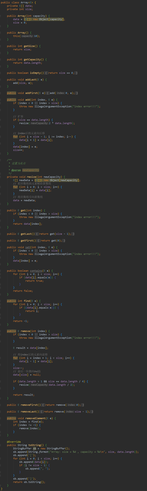
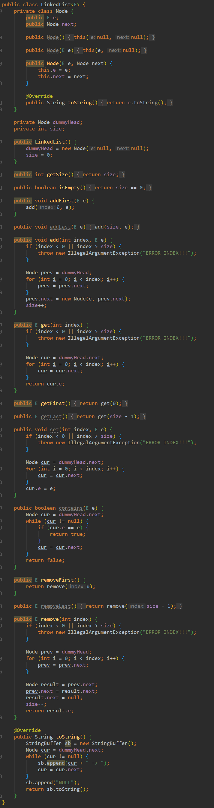

## 数据结构

- 数据：描述客观事物的符号，是计算机中可以操作的对象，能被计算机识别，并输入给计算机处理的符号集合
  - 可以被输入到计算机中
  - 能被计算机程序处理

- 数据元素：也被称作记录，是组成数据的、有一定意义的基本单位，在计算机中通常作为整体处理
  - 如牲畜的数据元素有牛、羊、猪等
- 数据项：一个数据元素可以由若干个数据项组成，**数据项是不可分割的最小单位**
  - 如人这样的数据元素有姓名、年龄、性别等数据项
- 数据对象：是性质相同的数据元素的集合，是数据的子集，性质相同是指元素具有相同数量和类型的数据项
  - 如人都有姓名、年龄、性别等相同的数据项
- 数据结构：是相互之间存在一种或多种特定关系的数据元素的集合，程序能否快速而有效的完成预定的任务，取决于是否选对了数据结构，而程序是否能清除而正确的把问题解决，则取决于算法。即 `数据结构 + 算法 = 可执行程序`

### 逻辑结构与物理结构

- 逻辑结构：数据对象中数据元素之间的相互关系，主要分为 4 种
  - 集合结构：集合结构中的数据元素 **除了同属于一个集合外，它们之间没有其他关系**。各个数据元素之间是平等的，它们共同属性是同属于一个集合
  - 线性结构：数据元素之间是 **一对一** 的关系
  - 树形结构：数据元素之间存在一种 **一对多** 的层次关系
  - 图形结构：数据元素之间是 **多对多** 的关系
- 物理结构：数据的逻辑结构在计算机中的存储形式，也称存储结构，主要分为两种
  - 顺序存储结构：把数据元素存放在地址连续的存储单元里，其数据间的逻辑关系和物理关系是一致的
  - 链式存储结构：把数据元素存放在任意的存储单元里，这组存储单元可以是连续的，也可以是不连续的。数据元素的存储关系并不能反映其逻辑关系，因此需要用一个 **指针** 存放数据元素的地址，这样通过地址就可以找到相关联数据元素的位置

### 数据类型

是指一组性质相同的值的集合及定义在此集合上的一些操作的总称

- 基本数据类型（atomic data type）：整数、浮点数、字符等
  - 也被称为物理数据类型（physical data type），基本的数据实体
- 结构型数据类型（structure data type）：字符串、集合、数组等
  - 也被称为虚拟数据类型（virtual data type），比物理数据类型更高级，是指一个数据结构包含其他的数据类型
- 抽象数据类型（Abstract Data Type）：堆栈、队列等
  - 比结构型数据类型更高级，ADT 是指定义一些结构型数据类型所具备的数学关系，用户无需考虑 ADT 的实现细节，即只针对数据的运算，而非数据本身的性质

## 算法

算法是解决特定问题求解步骤的描述，在计算机中表现为指令的有限序列，并且每条指令表示一个或多个操作

### 算法的特性

- 输入（Input）：0 个或多个输入数据，这些输入必须有清楚的描述或定义
- 输出（Output）：至少会有一个输出结果，不可以没有输出结果
- 明确性（Definiteness）：每一个指令或步骤必须是简洁明确的，不会出现二义性
- 有限性（Finiteness）：在有限步骤后一定会结束，不会产生无限循环
- 有效性（Effectiveness）：步骤清楚且可行，每一步都能够通过执行有限次数完成

### 算法设计的要求

- 正确性：算法至少应该具有输入、输出和加工处理无歧义性、能正确反映问题的需求、能够得到问题的正确答案，大致分为 4 个层次
  - 没有语法错误
  - 对于合法的输入数据能够产生满足要求的输出结果
  - 对于非法的输入数据能够得出满足规格说明的结果
  - 对于精心选择的，甚至刁难的测试数据都有满足要求的输出结果
- 可读性：算法设计的另一目的是为了便于阅读、理解和交流
- 健壮性：当输入数据不合法时，算法也能沟做出相关的处理，而不是产生异常或莫名其妙的结果
- 时间效率高和存储量低：设计算法应该尽量满足时间效率高和存储量低的需求

### 算法效能分析

对一个程序效能的评估，一般从时间和空间两种因素来考虑

- 时间复杂度（Time Complexity）：程序的运行时间
- 空间复杂度（Space Complexity）：程序在计算机内存所占的空间大小

#### 时间复杂度

在一个理想状态下的计算机中，定义 T(n) 来表示程序执行要花费的时间，n 代表数据输入量。当然程序的运行时间或最大运行时间是时间复杂度的衡量标准，一般以 Big-oh 表示。由于分析算法的时间复杂度必须考虑它的成长比率，往往是一种函数，而时间复杂度本身也是一种 **渐近表示**

- 推导大 O 阶方法
  1. 用常数 1 取代运行时间中所有加法常数
  2. 在修改后的运行次数函数中，只保留最高阶项
  3. 如果最高项阶存在且不是 1，则去除与这个项相乘的常数

- Ω（omega）也是一种时间复杂度的渐近表示法，如果 **Big-oh 是运行时间量度的最坏情况，那么 Ω 就是运行时间量度的最好状况**
- θ（theta）是一种比 Big-oh 与 Ω 更精确的时间复杂度渐近表示法

## 线性表

几乎所有的程序设计语言中，都包含数组（Array）数据结构。一个数组元素可以表示成一个索引和名称，而且存储在相邻的计算机内存中，属于一种典型的线性表

### 线性表（Linear List）

也被称为有序表（Ordered List），是数学概念应用在计算机科学中一种相当基本的数据结构。是 **0 个或多个数据元素的有限序列**

#### 线性表在计算机中的应用

线性表可应用在计算机中的数据结构，基本上按照内存存储的方式，可分为两种

- 静态数据结构（static data structure）：也被称作密集表（dense list），是一种将有序列表的数据使用 **连续分配空间** 来存储的，如数组
  - 优点是设计时相当简单，读取与修改列表中的任一元素的时间都是固定的
  - 缺点是删除或加入数据时，需要移动大量的数据。另外静态数据结构的内存分配是在编译时，就必须分配给相关的变量。因此数组在建立初期，必须事先声明最大可能的固定存储空间，容易造成内存的浪费
- 动态数据结构（dynamic data structure）：也被称作链接列表（linked list），是一种将线性表的数据使用 **不连续存储空间** 来存储，如指针
  - 优点是数据的插入或删除都相当方便，不需要移动大量数据。另外动态数据结构的内存分配在执行时才发生，所以无需事先声明，能够充分节省内存
  - 缺点时设计数据结构是较为麻烦，在查找数据时，无法随机读取，必须按顺序找到该数据位置

### 数组

数组结构其实就是一排紧密相邻的可数内存，并提供一个能够直接访问单一数据内容的计算方法

不同的程序设计语言中，数组结构类型的声明有所差异，但必须包含 5 种属性

- 起始地址：表示数组名（数组第一个元素）所在内存中的起始位置
- 维度：代表数组为几维数组
- 索引上下限：指元素在此数组中，内存所存储位置的上标与下标
- 数组元素个数：指索引上限与下限的差 + 1
- 数组类型：声明数组的类型，决定了数组元素在内存中所占用的大小

#### 数组实现

## 链表

链表（Linked List）是由许多相同数据类型的元素按照特定顺序排列而成的线性表，特点是在内存中的位置是 **不连续且随机存储** 的

### 单向链表（Singly Linked List）

列表中最常用的一种，所有节点串成一列，并且指针所指的方向一样，即列表中的每个数据除了要存储原本的数据，还必须存储下一个数据的存储地址。在程序设计语言中，一个列表节点由两个字段，即数据字段和链接字段组成，列表的组成基本要件为节点（node），而且每一个节点不必存储于连续的内存地址，并且包含数据字段和链接字段

在单向链表中第一个节点是列表指针头，指向最后一个节点的链接字段设为 Null，表示它是列表指针尾，不指向任何地方

#### 单向链表实现

### 环形链表

把列表的最后一个节点指针指向表头，整个列表就成为单向的环形结构，每一个节点都可以是表头，也可以从任一节点来追踪其他节点。建立过程与单向链表相似，唯一的不同是必须将最后一个节点指向第一个节点

### 双向链表

在单向链表或环形链表中，只能沿着同一个方向查找数据，如果有一个链接不小心断裂，则后面的链表就会消失而无法救回，双向链表可以改善这两个缺点

#### 双向链表的定义

每个节点都具有三个字段，中间为数据字段，左右各有两个链接字段，分别为 LLINK 与 RLINK。RLINK 指向下一个节点，LLINK 指向上一个节点。通常加上一个表头，此表不存在任何数据，其左边链接字段指向表中的最后一个节点，右边链接指向第一个节点

## 堆栈

堆栈（stack）是一组相同数据类型的组合，所有操作均在堆栈顶端进行，具有后进先出（LIFO）的特性

