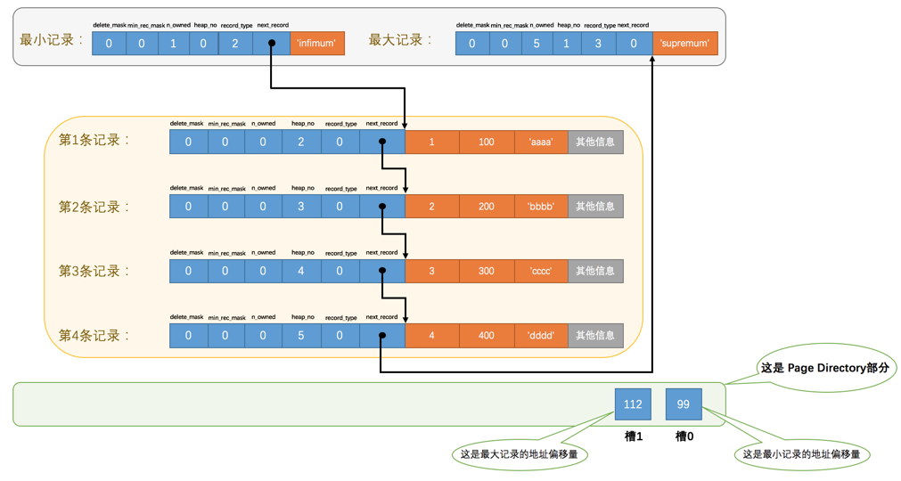
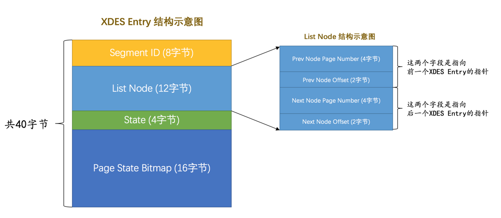
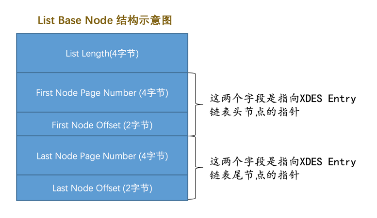
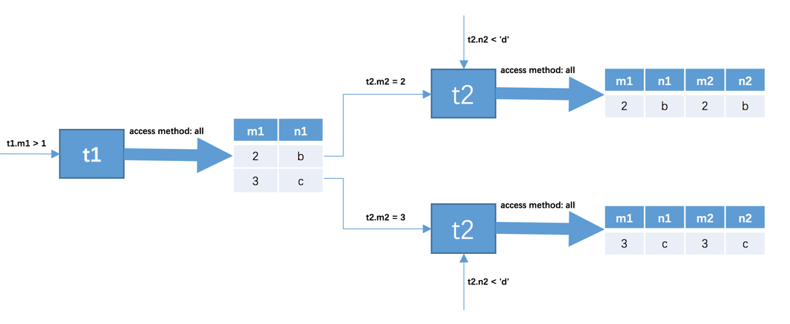

## InnoDB 数据页结构

InnoDB 是一个将表中的数据存储到磁盘上的存储引擎，而真正处理数据的过程是发生在 **内存** 中的，所以需要把磁盘中的数据加载到内存中，如果是处理写入或修改请求的话，还需要把内存中的内容刷新到磁盘上。当需要从表中获取某些记录时，InnoDB 需要一条一条的把记录从磁盘上读出来的话，效率非常低

InnoDB 采取的方式是：**将数据划分为若干个页，以页作为磁盘和内存之间交互的基本单位**，页的大小一般为 **16KB**

|        名称        |       中文名       | 占用空间 |         简单描述         |
| :----------------: | :----------------: | :------: | :----------------------: |
|    File Header     |      文件头部      | 38 字节  |     页的一些通用信息     |
|    Page Header     |      页面头部      | 56 字节  |   数据页专有的一些信息   |
| Infimum + Supremum | 最小记录和最大记录 | 26 字节  |     两个虚拟的行记录     |
|    User Records    |      用户记录      |  不确定  |   实际存储的行记录内容   |
|     Free Space     |      空闲空间      |  不确定  |    页中尚未使用的空间    |
|   Page Directory   |      页面目录      |  不确定  | 页中的某些记录的相对位置 |
|    File Trailer    |      文件尾部      |  8 字节  |      校验页是否完整      |

- Infimum + Supremum 与 User Records 同属行记录

### 存储引擎

MySQL 上负责对表中数据的读取和写入的部分是存储引擎，而服务器又支持不同类型的存储引擎，不同的存储引擎是为实现不同的特性而开发的，真实数据在不同存储引擎中存放的格式一般是不同的

### 记录在页中的存储

在页的 7 个组成部分中，存储的记录会按照指定的行格式存储到 User Records 部分。但在 **一开始生成页的时候，并没有 User Records 这个部分**，每当插入一条记录，都会从 Free Space 部分 **申请一个记录大小的空间划分到 User Records 部分**，当 Free Space 部分的空间全部被 User Records 部分替代掉之后，也就意味着这个页使用完了，如果还有新的记录插入的话，就需要去 **申请新的页** 了


### File Header

**对各种类型的页都通用**，不同类型的页都会以 File Header 作为第一个组成部分，它描述了一些针对各种页都通用的一些信息，占用固定的 **38 个字节**

|               名称               | 占用空间（字节） |                             描述                             |
| :------------------------------: | :--------------: | :----------------------------------------------------------: |
|     FIL_PAGE_SPACE_OR_CHKSUM     |        4         |                **页的校验和**（checksum 值）                 |
|         FIL_PAGE_OFFSET          |        4         |                             页号                             |
|          FIL_PAGE_PREV           |        4         |                        上一个页的页号                        |
|          FIL_PAGE_NEXT           |        4         |                        下一个页的页号                        |
|           FIL_PAGE_LSN           |        8         |  页面被最后修改时对应的日志序列位置（Log Sequence Number）   |
|          FIL_PAGE_TYPE           |        2         |                          该页的类型                          |
|     FIL_PAGE_FILE_FLUSH_LSN      |        8         | 仅在系统表空间的一个页中定义，代表文件至少被刷新到了对应的 LSN 值 |
| FIL_PAGE_ARCH_LOG_NO_OR_SPACE_ID |        4         |                       页属于哪个表空间                       |

- FIL_PAGE_SPACE_OR_CHKSUM：校验和就是 **对于一个很长的字节串来说，会通过某种算法来计算一个比较短的值来代表这个很长的字节串**，这个比较短的值就称为校验和。这样在比较两个很长的字节串之前先比较这两个长字节串的校验和，如果校验和都不一样两个长字节串肯定是不同的，省去了直接比较两个比较长的字节串的时间损耗

- FIL_PAGE_OFFSET：每一个页都有一个单独的页号，InnoDB 通过页号来可以唯一定位一个页

- FIL_PAGE_TYPE：当前页的类型，InnoDB 为了不同的目的而把页分为不同的类型，除了存储记录的数据页，其实还有很多别的类型的页

  |        类型名称         |  十六进制  |          描述          |
  | :---------------------: | :--------: | :--------------------: |
  | FIL_PAGE_TYPE_ALLOCATED |   0x0000   |   最新分配，还没使用   |
  |    FIL_PAGE_UNDO_LOG    |   0x0002   |      Undo 日志页       |
  |     FIL_PAGE_INODE      |   0x0003   |       段信息节点       |
  | FIL_PAGE_IBUF_FREE_LIST |   0x0004   | Insert Buffer 空闲列表 |
  |  FIL_PAGE_IBUF_BITMAP   |   0x0005   |   Insert Buffer 位图   |
  |    FIL_PAGE_TYPE_SYS    |   0x0006   |         系统页         |
  |  FIL_PAGE_TYPE_TRX_SYS  |   0x0007   |      事务系统数据      |
  |  FIL_PAGE_TYPE_FSP_HDR  |   0x0008   |     表空间头部信息     |
  |   FIL_PAGE_TYPE_XDES    |   0x0009   |       扩展描述页       |
  |   FIL_PAGE_TYPE_BLOB    |   0x000A   |        BLOB 页         |
  |     FIL_PAGE_INDEX      | **0x45BF** |  **索引页**，即数据页  |

- FIL_PAGE_PREV 和 FIL_PAGE_NEXT：InnoDB 都是以页为单位存放数据的，有时存放某种类型的数据占用的空间非常大，InnoDB 可能不可以一次性为这么多数据分配一个非常大的存储空间，如果 **分散到多个不连续的页中存储的话需要把这些页关联起来**，FIL_PAGE_PREV 和 FIL_PAGE_NEXT 就分别代表本页的上一个和下一个页的页号。这样通过建立一个 **双向链表** 把许许多多的页就都串联起来了，而无需这些页在物理上真正连着

  - 需要注意的是，并不是所有类型的页都有上一个和下一个页的属性


### Page Header

页结构的第二部分，占用 **固定的 56 个字节**，专门存储各种 **状态信息**

|       名称        | 占用空间（字节） |                             描述                             |
| :---------------: | :--------------: | :----------------------------------------------------------: |
| PAGE_N_DIR_SLOTS  |        2         |                      在页目录中的槽数量                      |
|   PAGE_HEAP_TOP   |        2         |    还未使用的空间最小地址，即从该地址之后就是 Free Space     |
|    PAGE_N_HEAP    |        2         | 本页中的记录的数量（包括最小和最大记录以及标记为删除的记录） |
|     PAGE_FREE     |        2         | 第一个已经标记为删除的记录地址（各个已删除的记录通过 next_record 也会组成一个单链表，这个单链表中的记录可以被重新利用） |
|   PAGE_GARBAGE    |        2         |                    已删除记录占用的字节数                    |
| PAGE_LAST_INSERT  |        2         |                      最后插入记录的位置                      |
|  PAGE_DIRECTION   |        2         |                        记录插入的方向                        |
| PAGE_N_DIRECTION  |        2         |                  一个方向连续插入的记录数量                  |
|    PAGE_N_RECS    |        2         | 该页中记录的数量（不包括最小和最大记录以及被标记为删除的记录） |
|  PAGE_MAX_TRX_ID  |        8         |       修改当前页的最大事务 ID，该值仅在二级索引中定义        |
|    PAGE_LEVEL     |        2         |                  当前页在 B+ 树中所处的层级                  |
|   PAGE_INDEX_ID   |        8         |               索引 ID，表示当前页属于哪个索引                |
| PAGE_BTR_SEG_LEAF |        10        |       B+ 树叶子段的头部信息，仅在 B+ 树的 Root 页定义        |
| PAGE_BTR_SEG_TOP  |        10        |      B+ 树非叶子段的头部信息，仅在 B+ 树的 Root 页定义       |

- PAGE_DIRECTION：假如 **新插入的一条记录的主键值比上一条记录的主键值大，那么这条记录的插入方向就是右边，反之则是左边**。用来表示最后一条记录插入方向的状态就是 PAGE_DIRECTION
- PAGE_N_DIRECTION：假设 **连续几次插入新记录的方向都是一致的**，InnoDB 会把沿着同一个方向插入记录的条数记下来，这个条数就用 PAGE_N_DIRECTION 这个状态表示。如果最后一条记录的插入方向改变了的话，这个状态的值会被清零重新统计

### Page Directory

记录在页中 **按照主键值由小到大顺序串联成一个单链表**，可以根据主键值查找页中的某条记录

1. 将所有正常的记录（包括最大和最小记录，不包括标记为已删除的记录）划分为几个组
2. 每个组的最后一条记录（即组内最大的那条记录）的头信息中的 n_owned 属性表示该记录拥有多少条记录，即该组内共有几条记录
3. 将每个组的 **最后一条记录的地址偏移量单独提取出来按顺序存储到靠近页的尾部的地方**，这个地方就是所谓的 Page Directory，这些地址偏移量被称为 **槽（Slot）**，所以这个页面目录就是由槽组成的



- 最小记录的 n_owned 值为 1，代表以最小记录结尾的这个分组中只有 1 条记录，即最小记录本身
- 最大记录的 n_owned 值为 5，代表以最大记录结尾的这个分组中只有 5 条记录，包括最大记录本身还有插入的 4 条记录

最小记录所在的分组 **只能有 1 条记录**，最大记录所在的分组拥有的记录条数 **只能在 1~8 条之间**，剩下的分组中记录的条数范围 **只能在 4~8 条之间**

- 初始情况下一个数据页里只有最小记录和最大记录两条记录，它们分属于两个分组
- 之后每插入一条记录，都会从页目录中找到 **主键值比本记录的主键值大并且差值最小的槽**，然后把该槽对应的记录的 n_owned 值加 1，表示本组内又添加了一条记录，**直到该组中的记录数等于 8 个**
- 在一个组中的记录数等于 8 个后再插入一条记录时，**会将组中的记录拆分成两个组**，一个组中 4 条记录，另一个 5 条记录。这个过程会在页目录中新增一个槽来记录这个新增分组中最大的那条记录的偏移量


- 因为各个槽代表的记录的主键值都是从小到大排序的，所以可以使用 **二分法** 来进行快速查找。4 个槽的编号分别是：0、1、2、3、4，所以初始情况下 **最低的槽就是 low = 0**，**最高的槽就是 high = 4**
- 所以在一个数据页中查找指定主键值的记录的过程分为两步
  1. 通过二分法确定该记录所在的槽，并找到该槽中主键值最小的那条记录
  2. 通过记录的 next_record 属性遍历该槽所在的组中的各个记录

### File Trailer

File Trailer 与 File Header 类似，都是所有类型的页通用的。InnoDB 在同步内存和磁盘的数据时候如果出现故障，为了检测一个页是否完整，InnoDB 在每个页的尾部都加了一个 File Trailer 部分，这个部分由 **8 个字节** 组成，可以分成 2 个小部分

- 前 4 个字节代表页的校验和：这个部分 **和 File Header 中的校验和相对应** 。每当一个页面在内存中修改了，在同步之前就要把它的校验和算出来，因为 File Header 在页面的前边，所以 **校验和会被首先同步到磁盘，当完全写完时，校验和也会被写到页的尾部**，如果完全同步成功，则页的首部和尾部的校验和应该是一致的。如果写了一半儿断电了，那么在 File Header 中的校验和就代表着已经修改过的页，而在 File Trailer 中的校验和代表着原先的页，二者不同则意味着同步中间出了错
- 后 4 个字节代表页面被最后修改时对应的日志序列位置（LSN）：这个部分也是为了校验页的完整性的

## InnoDB 行格式

我们平时是以记录为单位来向表中插入数据的，这些记录在磁盘上的存放方式也被称为 **行格式或者记录格式**。目前有 4 种不同类型的行格式，分别是：**Compact、Redundant、Dynamic、Compressed**，在原理上大体都是相同的

### COMPACT 行格式


```mysql
# 指定行格式
CREATE TABLE [表名] (列的信息) ROW_FORMAT = [行格式]

# 修改行格式
ALTER TABLE [表名] ROW_FORMAT = [行格式]
```

### 记录的额外信息

服务器为了描述这条记录而不得不额外添加的一些信息

#### 变长字段列表

MySQL 支持一些变长的数据类型，比如 VARCHAR、VARBINARY、TEXT、BLOB 等，也称为 **变长字段**，变长字段中存储多少字节的数据是 **不固定的**，所以在存储真实数据的时候需要把这些数据 **占用的字节数** 也存起来，所以这些变长字段占用的存储空间分为两部分：**真正的数据内容、占用的字节数**

- 在 Compact 行格式中，**把所有变长字段的真实数据占用的字节长度都存放在记录的开头部位**，从而形成一个变长字段长度列表，各变长字段数据占用的字节数 **按照列的顺序逆序存放**
- **只存储值为非 NULL 的列内容占用的长度**，值为 NULL 的列的长度是不储存的
- 如果内容占用的字节数比较小，用 **1 个字节** 就可以表示，但是如果变长列的内容占用的字节数比较多，可能就需要用 **2 个字节** 来表示
  - 假设某个字符集中表示一个字符最多需要使用的字节数为 W，即使用 **`SHOW CHARSET`** 语句的结果中的 **Maxlen** 列；对于变长类型来说，这种类型表示能存储最多 M 个字符；实际存储的字符串占用的字节数是 L
  - 如果该可变字段允许存储的最大字节数（**M × W**）**超过 255 字节并且真实存储的字节数（L）超过 127 字节**，则使用 2 个字节，否则使用 1 个字节

#### NULL 值列表

某些列可能存储 NULL 值，如果把这些 NULL 值都放到 **记录的真实数据** 中存储会很占地方，所以 Compact 行格式把这些值为 NULL 的列统一管理起来，存储到 NULL 值列表中

1. 首先统计表中 **允许** 存储 NULL 的列有哪些
2. **如果表中没有允许存储 NULL 的列，则 NULL 值列表也不存在了**。否则将每个允许存储 NULL 的列对应一个二进制位，**按照列的顺序逆序排列**
   * 二进制位的值为 1 时，代表该列的值为 NULL；为 0 时，代表该列的值不为 NULL
3. MySQL 规定 NULL 值列表必须用 **整数个字节** 的位表示，如果使用的二进制位个数不是整数个字节，则在 **字节的高位补 0**


#### 记录头信息

是由固定的 5 个字节组成。 5 个字节也就是 40 个二进制位，不同的位代表不同的意思


|     名称     | 大小（bit） |                             描述                             |
| :----------: | :---------: | :----------------------------------------------------------: |
|   预留位1    |      1      |                           没有使用                           |
|   预留位2    |      1      |                           没有使用                           |
| delete_mask  |      1      |                   **标记该记录是否被删除**                   |
| min_rec_mask |      1      |     **B+ 树的每层非叶子节点中的最小记录** 都会添加该标记     |
|   n_owned    |      4      |                  当前记录拥有的 **记录数**                   |
|   heap_no    |     13      |                当前记录在页中的 **位置信息**                 |
| record_type  |      3      | 当前记录的类型，**0 表示普通记录，1 表示 B+ 树非叶子节点记录，2 表示最小记录，3 表示最大记录** |
| next_record  |     16      |                   **下一条记录的相对位置**                   |

- delete_mask：**值为 0 的时候代表记录并没有被删除，为 1 的时候代表记录被删除掉了**。所以被删除的记录还在页中，因为移除它们之后把其他的记录在磁盘上重新排列需要 **性能消耗**，所以只是打一个删除标记而已
  - 所有被删除掉的记录都会组成一个所谓的 **垃圾链表**，在这个链表中的记录占用的空间称作 **可重用空间**，之后如果有新记录插入到表中的话，可能把这些被删除的记录占用的存储空间覆盖掉
- heap_no：**从 2 开始，0 为最小记录，1 为最大记录**
  - InnoDB 自动给每个页添加两个记录，由于这两个记录并不是我们插入的，所以有时候也称为 **伪记录或虚拟记录**。这两个伪记录一个代表 **最小记录**，一个代表 **最大记录**。这两条记录都是由  **5 字节大小的记录头信息和 8 字节大小的一个固定的部分** 组成的。对于一条完整的记录来说，比较记录的大小就是 **比较主键的大小**
  - 最小和最大记录不是由我们自己定义的记录，所以它们并不存放在页的 User Records 部分，他们被单独放在一个称为 **Infimum + Supremum** 的部分


- next_record：**从当前记录的真实数据到下一条记录的真实数据的地址偏移量**。其实就是个 **链表**，可以通过一条记录找到它的下一条记录。但注意下一条记录指得并不是按照插入顺序的下一条记录，而是 **按照主键值由小到大的顺序的下一条记录**
  - **Infimum 记录的下一条记录就是本页中主键值最小的记录**，而本页中 **主键值最大的记录的下一条记录就是 Supremum 记录**
  - 记录按照主键从小到大的顺序形成了一个单链表。最大记录的 **next_record 的值为 0**，即 **最大记录是没有下一条记录了**，它是这个单链表中的最后一个节点
  - 当删除某条数据时，该数据的 next_record 值变为 0，它的上一条数据 next_record 会指向它的下一条数据。它的存储空间不会被立即回收，这样当新记录的插入时不会申请新的存储空间，而是直接复用了原来被删除记录的存储空间
  - 当数据页中存在多条被删除掉的记录时，这些记录的 next_record 属性将会把这些被删除掉的记录组成一个垃圾链表，以备之后重用这部分存储空间


### 记录的真实数据

除了我们自己定义的列的数据以外，MySQL 会为每个记录默认的添加一些列，也称为 **隐藏列**

|      列名      | 是否必须 | 占用空间 |          描述           |
| :------------: | :------: | :------: | :---------------------: |
|     row_id     |    否    |  6 字节  | 行 ID，唯一标识一条记录 |
| transaction_id |    是    |  6 字节  |         事务 ID         |
|  roll_pointer  |    是    |  7 字节  |        回滚指针         |

* 实际上这几个列的真正名称其实是：DB_ROW_ID、DB_TRX_ID、DB_ROLL_PTR

InnoDB 存储引擎会为每条记录都添加 transaction_id 和 roll_pointer 这两个列，但是 row_id 是可选的。这些隐藏列的值，InnoDB 存储引擎会自动生成

- InnoDB 表对主键的生成策略：**优先使用用户自定义主键作为主键**，如果没有则选取一个 **Unique 键** 作为主键，如果表中连 Unique 键都没有定义的话，则 InnoDB 会为表默认添加一个名为 **row_id** 的隐藏列作为主键


#### CHAR(M) 列的存储格式

对于 CHAR(M) 类型的列来说，当列采用的是定长字符集时，该列占用的字节数不会被加到变长字段长度列表，**而如果采用变长字符集时，该列占用的字节数也会被加到变长字段长度列表**

- 变长字符集的 CHAR(M) 类型的列要求至少占用 M 个字节，而 VARCHAR(M) 却没有这个要求

### 行溢出数据

#### VARCHAR(M) 最多能存储的数据

VARCHAR(M) 类型的列最多可以占用 **65535 个字节**，其中的 **M 代表该类型最多存储的字符数量**。MySQL 对一条记录占用的最大存储空间是有限制的，除了 **BLOB、TEXT** 类型的列之外，其他所有的列（**不包括隐藏列和记录头信息**）占用的字节长度加起来 **不能超过 65535 个字节**。这个 65535 个字节除了列本身的数据之外，还包括一些其他的数据（storage overhead），例如为了存储一个 VARCHAR(M) 类型的列，其实需要占用 3 部分存储空间

* 真实数据
* 真实数据占用字节的长度
* NULL 值标识，如果该列有 NOT NULL 属性则可以没有这部分存储空间

所以 VARCHAR(M) 类型的列没有 NOT NULL 属性，最多只能存放 65532 个字节的数据，因为 **真实数据的长度可能占用 2 个字节，NULL 值标识需要占用 1 个字节**。不同字符集，存放的字符数不同，ASCII 一个字符占 1 个字 节，可以存放 65532 个字符，UTF8 一个字符占 3 个字节，可以存放 21844 个字符

#### 记录中的数据太多产生的溢出

一个页的大小一般是 16KB，即 16384 字节，而一个 VARCHAR(M) 类型的列就最多可以存储 65532 个字节，这样就可能造成一个页存放不了一条记录的尴尬情况

在 Compact 行格式中，对于占用存储空间非常大的列，在记录的真实数据处 **只会存储该列的一部分数据，把剩余的数据分散存储在几个其他的页中**，然后记录的真实数据处用 **20 个字节存储指向这些页的地址**（20 个字节还包括这些分散在其他页面中的数据的占用的字节数），从而可以找到剩余数据所在的页


如果某一列中的数据非常多的话，**真实数据处只会存储该列的前 768 个字节的数据和一个指向其他页的地址**，然后把剩下的数据存放到其他页中，这个过程也叫做 **行溢出**，存储超出 768 字节的那些页面也被称为 **溢出页**

- 不只是 VARCHAR(M) 类型的列，其他的 TEXT、BLOB 类型的列在存储数据非常多的时候也会发生行溢出

#### 行溢出的临界点

MySQL 中规定 **一个页中至少存放两行记录**。每个页除了存放我们的记录以外，也需要存储一些额外的信息，加起来需要 **132 个字节** 的空间，其他的空间都可以被用来存储记录

* 每个记录需要的额外信息是 **27 字节**
  - 2 个字节用于存储真实数据的长度
  - 1 个字节用于存储列是否是 NULL 值
  - 5 个字节大小的头信息
  - 6 个字节的 row_id 列
  - 6 个字节的 transaction_id 列
  - 7 个字节的 roll_pointer 列

那么行溢出的临界点为 `132 + 2 * (27 + n) < 16384`，结果为 n < 8099。如果表中有多个列，那上边的式子和结论都需要改一改了，重点是只要知道一条记录的某个列中存储的数据 **占用的字节数非常多时**，该列就可能成为溢出列

### Redundant 行格式

MySQL5.0 之前用的一种行格式，与 Compact 行格式类似，**没有 NULL 值列表**

### Dynamic 和 Compressed 行格式

MySQL 默认行格式就是 Dynamic，这俩行格式和 Compact 行格式挺像，只不过在处理行溢出数据时有点儿分歧，它们不会在记录的真实数据处存储字段真实数据的前 768 个字节，而是把 **所有的字节都存储到其他页面中**，**只在记录的真实数据处存储其他页面的地址**


* Compressed 行格式和 Dynamic 不同的一点是，Compressed 行格式会采用 **压缩算法** 对页面进行压缩，以节省空间

## B+ 树索引

在没有索引的情况下，不论是根据主键列或者其他列的值进行查找，由于不能快速的定位到记录所在的页，所以只能从第一个页沿着双向链表一直往下找，而且要遍历所有的数据页，显然是很耗时的

### 简单的索引方案

如果想快速的定位到需要查找的记录，可以想办法为快速定位记录所在的数据页而建立一个别的目录，即索引，建这个目录必须完成下边这些事儿

- 下一个数据页中用户记录的主键值必须大于上一个页中用户记录的主键值
  - 在对页中的记录进行增删改操作的过程中，必须通过一些诸如记录移动的操作来始终保证这个状态一直成立，这个过程也称为 **页分裂**
- 给所有的页建立一个目录项
  - 由于数据页的编号可能 **并不是连续** 的，因为这些页在物理存储上可能并不挨着，如果想从这么多页中根据主键值快速定位某些记录所在的页，需要给它们做个目录，每个页对应一个目录项，每个目录项包括两个部分：**页的用户记录中最小的主键值（key），页号（page_no）**


只需要把几个目录项在物理存储器上连续存储，比如把他们放到一个数组里，就可以实现根据主键值利用二分法快速查找某条记录的功能了

#### 缺点

之所以称为一个简易的索引方案，是因为在根据主键值进行查找时，使用二分法快速定位具体的目录项，而假设所有目录项都可以在物理存储器上连续存储，但是这样做有几个问题

- InnoDB 是使用页来作为管理存储空间的基本单位，即最多能保证 16KB 的连续存储空间，而随着表中记录数量的增多，需要非常大的连续的存储空间才能把所有的目录项都放下，这对记录数量非常多的表是不现实的
- 我们时常会对记录进行增删，假设把页 28 中的记录都删除了，页 28 也就没有存在的必要了，那意味着目录项 2 也就没有存在的必要了，这就需要把目录项 2 后的目录项都向前移动一下，这种牵一发而动全身的设计不是什么好主意

### InnoDB 中的索引方案

InnoDB 有灵活管理所有目录项的方式。因为目录项其实跟用户记录类似，只是目录项中的两个列是主键和页号而已，所以 InnoDB 复用了之前存储用户记录的数据页来存储目录项，为了和用户记录做一下区分，这些用来表示目录项的记录称为 **目录项记录**

- InnoDB 使用了 record_type 属性来区分一条记录是用户记录还是目录项记录


#### 目录项记录与用户记录的区别

- 目录项记录的 record_type 值是 1；用户记录的 record_type 值是 0
- 目录项记录只有主键值和页的编号两个列；普通的用户记录的列是用户自己定义的，可能包含很多列，还有 InnoDB 自己添加的隐藏列
- **只有在存储目录项记录的页中的，主键值最小的目录项记录的 min_rec_mask 值为 1**，其他的记录的 min_rec_mask 值都是 0

#### 目录项记录过多

当一个页中的目录项记录过多时，会创建一个新的页。但是这些页在存储空间中可能不挨着，并且如果表中的数据非常多，则会产生很多存储目录项记录的页，所以为了这些存储目录项记录的页会再生成一个更高级的目录，就像是一个多级目录一样，大目录里嵌套小目录，小目录里才是实际的数据


#### B+ 树

随着表中记录的增加，这个目录的层级会继续增加，如果简化一下，其实就是一种组织数据的形式，或者说是一种数据结构，它的名称是 B+ 树


不论是存放用户记录的数据页，还是存放目录项记录的数据页，都把它们存放到 B+ 树这个数据结构中了，所以这些数据页也被称为 **节点**。从图中可以看出来，实际用户记录其实都存放在 B+ 树的最底层的节点上，这些节点也被称为 **叶子节点或叶节点**，其余用来存放目录项的节点称为 **非叶子节点或内节点**，其中 B+ 树最上边的那个节点也称为 **根节点**

一个 B+ 树的节点其实可以分成好多层，InnoDB 规定最下边的那层，即存放用户记录的那层为 **第 0 层**，之后依次往上加。一般情况下，**用到的 B+ 树都不会超过 4 层**，通过主键值去查找某条记录最多只需要做 4 个页面内的查找（**3 个目录项页和 1 个用户记录页**），又因为在每个页面内都有 Page Directory，所以在页面内也可以通过二分法实现快速定位记录

#### 聚簇索引

B+ 树本身就是一个目录，或者说本身就是一个索引。它有两个特点

- 按照记录主键值的大小进行记录和页的排序，包括 3 个方面的含义
  - 页内的记录是按照主键的大小顺序排成一个单向链表
  - 各个存放用户记录的页也是根据页中用户记录的主键大小顺序排成一个双向链表
  - 存放目录项记录的页分为不同的层次，在同一层次中的页也是根据页中目录项记录的主键大小顺序排成一个双向链表

- **B+ 树的叶子节点存储的是完整的用户记录**，即这个记录中存储了所有列的值（包括隐藏列）

具有这两种特性的 B+ 树被称为 **聚簇索引**，所有完整的用户记录都存放在这个聚簇索引的叶子节点处。聚簇索引并不需要在 MySQL 语句中显式的创建，**InnoDB 会自动为我们创建聚簇索引**。在 InnoDB 中，聚簇索引就是数据的存储方式（所有的用户记录都存储在了叶子节点），即 **索引即数据，数据即索引**

#### 二级索引

也被称作 **辅助索引**。聚簇索引只能在搜索条件是 **主键值** 时才能发挥作用，因为 B+ 树中的数据都是按照主键进行排序的。如果想以别的列作为搜索条件，可以多建几棵 B+ 树，不同的 B+ 树中的数据采用不同的排序规则。目录项记录中不再是 主键 + 页号 的搭配，而是变成 **搜索的列 + 页号** 的搭配

按非主键列建立的 B+ 树，当需要查询数据时，只能确定要查找记录的主键值，所以如果想查找到完整的用户记录的话，仍然需要到聚簇索引中再查一遍，这个过程也被称为 **回表**。即根据非主键列的值查询一条完整的用户记录需要使用到 **2 棵 B+ 树**

- 如果把完整的用户记录放到叶子节点是可以不用回表，但是太占地方了。相当于每建立一棵 B+ 树都需要把所有的用户记录再都拷贝一遍，太浪费存储空间了


#### 联合索引

同时以 **多个列** 的大小作为排序规则，也就是同时为多个列建立索引。会先把各个记录和页按照某列进行排序，在记录的列相同的情况下，再采用另一个列进行排序


联合索引本质上也是一个二级索引。它的意思与分别建立索引的表述是不同的

- 建立联合索引只会建立 1 棵 B+ 树
- 分别建立索引会分别以列的大小为排序规则建立多棵 B+ 树

#### 根页面万年不动窝

一个 B+ 树索引的根节点自诞生之日起，便不会再移动

- 实际上 B+ 树的形成过程
  1. 每当为某个表创建一个 B+ 树索引（聚簇索引不是人为创建的，默认就有），都会为这个索引创建一个根节点页面。最开始表中没有数据的时候，每个 B+ 树索引对应的根节点中既没有用户记录，也没有目录项记录
  2. 随后向表中插入用户记录时，先把用户记录存储到这个 **根节点** 中
  3. 当根节点中的可用空间用完时继续插入记录，此时会将根节点中的所有记录复制到一个新分配的页，然后对这个新页进行 **页分裂** 的操作，得到另一个新页。这时新插入的记录根据键值（即聚簇索引中的主键值，二级索引中对应的索引列的值）的大小就会被分配到页中，**而根节点便升级为存储目录项记录的页**

#### 内节点中目录项记录的唯一性

B+ 树索引的内节点中目录项记录的内容是 索引列 + 页号 的搭配，如果二级索引中目录项记录的内容只是使用这样的搭配的话，如果遇到索引列的值都相同的情况，该如何插入数据呢


为了让新插入记录能找到自己在哪个页里，需要保证在 **B+ 树的同一层内节点的目录项记录除页号这个字段以外是唯一的**。所以二级索引的内节点的目录项记录的内容实际上是由 3 个部分构成的：**索引列的值、主键值、页号**


#### 一个页面最少存储2条记录

一个 B+ 树只需要很少的层级就可以轻松存储数亿条记录，查询速度也很快。这是因为 B+ 树本质上就是一个大的多层级目录，每经过一个目录时都会过滤掉许多无效的子目录，直到最后访问到存储真实数据的目录

如果一个大的目录中只存放一个子目录，那就是目录层级非常多，而且最后的那个存放真实数据的目录中只能存放一条记录，费了半天劲只能存放一条真实的用户记录。所以 InnoDB 的一个数据页至少需要存放两条记录

### MyISAM 中的索引方案

InnoDB 中 **索引即数据**，即聚簇索引的那棵 B+ 树的叶子节点中已经把所有完整的用户记录都包含了，而 MyISAM 的索引方案虽然也使用树形结构，但是却将索引和数据分开存储

- 将表中的记录 **按照记录的插入顺序单独存储在一个文件中**，称之为 **数据文件**。这个文件并不划分为若干个数据页，有多少记录就往这个文件中塞多少记录就成了。可以通过行号而快速访问到一条记录

MyISAM 记录也需要记录头信息来存储一些额外数据，由于在插入数据的时候并没有刻意按照主键大小排序，所以并不能在这些数据上使用二分法进行查找


- 使用 MyISAM 的表会把索引信息另外存储到一个称为 **索引文件** 的另一个文件中。MyISAM 会 **单独为表的主键创建一个索引**，只不过在索引的叶子节点中存储的不是完整的用户记录，而是 **主键值 + 行号** 的组合。即先通过索引找到对应的行号，再通过行号去找对应的记录
  -  这一点和 InnoDB 是完全不相同的，在 InnoDB 中，只需要根据主键值对聚簇索引进行一次查找就能找到对应的记录，而在 MyISAM 中却需要进行一次 **回表** 操作，即 **MyISAM 中建立的索引相当于全部都是二级索引**

- 如果有需要的话，也可以对其它的列分别建立索引或者建立联合索引，原理和 InnoDB 中的索引差不多，不过在叶子节点处存储的是 **相应的列 + 行号**

### 创建和删除索引

InnoDB 和 MyISAM 会自动为 **主键或者声明为 UNIQUE** 的列建立 B+ 树索引，但是想为其他的列建立索引就需要显式的去指明。之所以不自动为每个列都建立个索引呢，是因为每建立一个索引都会建立一棵 B+ 树，每插入一条记录都要维护各个记录、数据页的排序关系，很费性能和存储空间

```mysql
# 创建表的时候指定需要建立索引，KEY与INDEX是同义词
CREATE TABLE `表名` (
    各种列的信息,
    [KEY|INDEX] 索引名 (需要被索引的单个列或多个列)
);

# 修改表结构的时候添加索引
ALTER TABLE 表名 ADD [INDEX|KEY] 索引名 (需要被索引的单个列或多个列);

# 修改表结构的时候删除索引
ALTER TABLE 表名 DROP [INDEX|KEY] 索引名;
```

## 索引的使用

### 索引的代价

- 空间上的代价：每建立一个索引都要为它建立一棵 B+ 树，每一棵 B+ 树的每一个节点都是一个数据页，一个页默认会占用 16KB 的存储空间，一棵很大的 B+ 树由许多数据页组成，那可是很大的一片存储空间
- 时间上的代价：每次对表中的数据进行增删改操作时，都需要去修改各个 B+ 树索引。而且 B+ 树每层节点都是按照索引列的值从小到大的顺序排序而组成了双向链表。不论是叶子节点中的记录，还是内节点中的记录，都是按照索引列的值从小到大的顺序而形成了一个单向链表。而增删改操作可能会对节点和记录的排序造成破坏，所以存储引擎需要额外的时间进行一些记录移位，页面分裂、页面回收等操作来维护好节点和记录的排序

### B+ 树索引适用的条件

#### 全值匹配

**搜索条件中的列和索引列一致**，根据搜索条件先后对记录进行排序，找到满足所有条件的记录。**搜索列的顺序对查询的执行过程没有影响**，MySQL 中的查询优化器会分析这些搜索条件，并且按照可以使用的索引中列的顺序来决定先使用哪个搜索条件，后使用哪个搜索条件

#### 匹配左边的列

在搜索语句中也可以不用包含全部联合索引中的列，**只包含左边的就行，或者包含多个左边的列**

- 搜索条件中必须出现左边的列才可以使用到这个 B+ 树索引
  - 例如联合索引中列的定义顺序是 name、age，如果搜索条件只有 age，联合索引就会失效，因为需要先按照 name 列进行排序，而跳过 name 列根据 age 列查找，age 列可能是无序的

- 如果想使用联合索引中尽可能多的列，搜索条件中的各个列必须是联合索引中 **从最左边连续的列**
  - 例如联合索引中列的定义顺序是 name、age、phone，如果搜索条件没有 age，就只能用上 name 列的索引

#### 匹配列前缀

为某个列建立索引的意思其实就是 **在对应的 B+ 树的记录中使用该列的值进行排序**。因为字符串的排序，其实就是逐个比较字符的大小，即字符串的前 n 个字符，也就是前缀都是排好序的，所以对于字符串类型的索引，只匹配它的前缀也是可以快速定位记录的

- 如果只给出后缀或者中间的某个字符串，例如 `'%A%'`，MySQL 就无法快速定位记录位置，因为字符串中间有 A 的字符串并没有排好序，所以只能全表扫描了

对于有一些匹配某些字符串后缀的需求，为了在查询时用到这个索引而不至于全表扫描，可以把后缀查询改写成前缀查询，不过就得把表中的数据全部逆序存储一下

- 例如 `www.baidu.com` ，想以 `'%com'`进行查找，可以将网址保存成 `moc.udiab.www`，然后使用 `'moc%'` 进行搜索

#### 匹配范围值

因为所有记录都是按照索引列的值从小到大的顺序排好序的，所以可以很方便的查找索引列的值在某个范围内的记录

```mysql
SELECT * FROM test WHERE age > 60 AND age < 7;
```

- 会先找到 age 为 60 的记录，再找到 age 为 7 的记录，由于所有记录都是由链表连起来的（记录之间用单链表，数据页之间用双链表），找到这些记录的主键值，再到聚簇索引中回表查找完整的记录

如果对多个列同时进行范围查找的话，只有对索引 **最左边** 的那个列进行范围查找的时候才能用到 B+ 树索引

````mysql
SELECT * FROM test WHERE name < 'James' AND age > 7;
````

- 会先对 name 进行范围查找，然后通过 age 的条件继续过滤。对于联合索引来说，只会用到 name 列的部分，而用不到 age 列的部分，因为只有 name 值相同的情况下才能用 age 列的值进行排序，而这个查询中通过 name 进行范围查找的记录中可能并不是按照 age 列进行排序的，所以在搜索条件中继续以 age 列进行查找时是用不到这个 B+ 树索引的

#### 精确匹配某一列并范围匹配另外一列

对于同一个联合索引来说，虽然对多个列都进行范围查找时只能用到最左边那个索引列，但是如果左边的列是精确查找，则右边的列可以进行范围查找

````mysql
SELECT * FROM test WHERE name = 'James' AND age > 7 AND phone > '110';
````

- 会先对 name 列进行精确查找，所以查找后的结果 name 值都是相同的，它们会按照 age 的值进行排序，所以此时对 age 列进行范围查找是可以用到 B+ 树索引的。之后通过 phone 进行范围查找，无法再利用 B+ 树索引了，只能遍历上一步查询得到的记录

#### 用于排序

在经常需要对查询出来的记录通过 `ORDER BY` 子句按照某种规则进行排序，一般会把记录都加载到内存中，再用一些排序算法，在内存中对这些记录进行排序，有时可能查询的结果集太大以至于不能在内存中进行排序的话，还可能暂时借助磁盘的空间来存放中间结果，排序操作完成后再把排好序的结果集返回到客户端

- 在 MySQL 中，把这种在内存中或者磁盘上进行排序的方式统称为 **文件排序**（filesort）

但是如果 `ORDER BY` 子句里使用到了索引列，就有可能省去在内存或文件中排序的步骤。因为 B+ 树索引本身就是排好序的，所以直接从索引中提取数据，然后进行回表操作取出该索引中不包含的列

- 对于联合索引，`ORDER BY` 后边的列的顺序也必须 **按照索引列的顺序** 给出
- 使用联合索引的各个排序列的排序顺序，**不能 ASC 、DESC 混用**
- 如果 WHERE 子句中出现了 **非排序使用到的索引列**，那么排序依然是使用不到索引的
- **排序列包含非同一个索引的列**，也是使用不了索引的
- 排序列使用了复杂的表达式，例如 TRIM 函数，就不是单独的列了。要想使用索引进行排序操作，必须保证索引列是以单独列的形式出现

#### 用于分组

为了方便统计表中的一些信息，可以把表中的记录按照某些列进行分组

````mysql
SELECT * FROM test GROUP BY name,age,phone;
````

- 相当于做了 3 次分组操作。先把记录按照 name 进行分组，再把 name 值相同的分组记录里再按照 age 的值进行分组，再将产生的小分组按照 phone 的值分成更小的分组
- 如果没有索引的话，这个分组过程全部需要在内存里实现，而如果有了索引的话，恰巧这个分组顺序又和索引列的顺序是一致的，而索引又是按照索引列排好序的，所以就可以直接使用索引进行分组

### 回表的代价

````mysql
SELECT * FROM test WHERE name > 'James' AND name < 'Zac';
````

- 会先从对应的 B+ 树中取出 name 值在 James 和 Zac 之间的记录。如果索引只包含 name 和 age，不包括 phone，而使用 `*` 来查找所有字段，这时需要把从上一步中获取到的每一条记录的 id 字段，都到聚簇索引对应的 B+ 树中找到完整的用户记录，即回表，然后把完整的用户记录返回给查询用户

由于索引对应的 B+ 树中的记录首先会按照 name 列的值进行排序，所以值在 James 和 Zac 之间的记录在磁盘中的存储是相连的，可以很快的把这些连着的记录从磁盘中读出来，这种读取方式也被称为 **顺序 I/O**

根据获取到的记录的 id 字段的值可能并不相连，而在聚簇索引中记录是根据 id（主键）的顺序排列的，所以根据这些并不连续的 id 值到聚簇索引中访问完整的用户记录可能分布在不同的数据页中，这样读取完整的用户记录可能要访问更多的数据页，这种读取方式也被称为 **随机 I/O**

一般情况下，**顺序 I/O 比随机 I/O 的性能高很多**，所以这个使用索引的查询有两个特点

- 会使用到 **两个 B+ 树索引**，一个二级索引，一个聚簇索引
- **访问二级索引使用顺序 I/O，访问聚簇索引使用随机 I/O**

**需要回表的记录越多，使用二级索引的性能就越低**，甚至让某些查询宁愿使用全表扫描也不使用二级索引

#### 全表扫描方式与 二级索引 + 回表 方式的选择

**查询优化器** 会事先对表中的记录计算一些统计数据，然后再利用这些统计数据根据查询的条件来计算一下需要回表的记录数，**需要回表的记录数越多，就越倾向于使用全表扫描**，反之倾向于使用 二级索引 + 回表 的方式

- 一般情况下，**限制查询获取较少** 的记录数会让优化器更倾向于选择使用 二级索引 + 回表 的方式进行查询，因为回表的记录越少，性能提升就越高

#### 覆盖索引

为了彻底告别回表操作带来的性能损耗，建议最好在查询列表里 **只包含索引列**。这样就不必到聚簇索引中再查找记录的剩余列了，这样就省去了回表操作带来的性能损耗。这种只需要用到索引的查询方式被称为 **索引覆盖**，**排序操作也优先使用覆盖索引的方式进行查询**

- 不建议用 `*` 号作为查询列表，最好把需要查询的列依次标明

### 挑选索引

#### 只为用于搜索、排序或分组的列创建索引

只为出现在 WHERE 子句中的列、连接子句中的连接列，或者出现在 `ORDER BY` 或 `GROUP BY` 子句中的列创建索引

#### 考虑列的基数

列的基数指的是 **某一列中不重复数据的个数**，在记录行数一定的情况下，**列的基数越大，该列中的值越分散，列的基数越小，该列中的值越集中**

假设某个列的基数为 1，即所有记录在该列中的值都一样，那为该列建立索引是没有用的，因为所有值都一样就无法排序，无法进行快速查找。而且如果某个建立了二级索引的列的重复值特别多，那么使用这个二级索引查出的记录还可能要做回表操作，这样性能损耗就更大了

- 最好为那些列的基数大的列建立索引，为基数太小列的建立索引效果可能不好

#### 索引列的类型尽量小

类型大小指的就是该类型表示的数据范围的大小。如果想要对某个列建立索引的话，在表示的范围允许的情况下，尽量让索引列使用较小的类型

- 数据类型越小，**在查询时进行的比较操作越快**，**索引占用的存储空间就越少**，在一个数据页内就可以放下更多的记录，从而减少磁盘 I/O 带来的性能损耗，即可以把更多的数据页缓存在内存中，从而加快读写效率
- 对于表的主键来说更加适用，因为不仅是聚簇索引中会存储主键值，其他所有的二级索引的节点处都会存储一份记录的主键值，如果主键适用更小的数据类型，也就意味着节省更多的存储空间和更高效的 I/O

#### 索引字符串值的前缀

假设我们的字符串很长，那存储一个字符串就需要占用很大的存储空间。在需要为这个字符串列建立索引时，那就意味着在对应的 B+ 树中有这么两个问题

- B+ 树索引中的记录需要把该列的完整字符串存储起来，而且字符串越长，在索引中占用的存储空间越大
- 如果 B+ 树索引中索引列存储的字符串很长，那在做字符串比较时会占用更多的时间

索引列的字符串前缀其实也是排好序的，可以只对字符串的前几个字符进行索引，即在二级索引的记录中只保留字符串前几个字符。这样在查找记录时虽然不能精确的定位到记录的位置，但是能定位到相应前缀所在的位置，然后根据前缀相同的记录的主键值回表查询完整的字符串值，再对比就好了

- 这样只在 B+ 树中存储字符串的前几个字符的编码，既节约空间，又减少了字符串的比较时间，还可能解决排序的问题

````mysql
CREATE TABLE person_info(
    name VARCHAR(100) NOT NULL,
    birthday DATE NOT NULL,
    country varchar(100) NOT NULL,
    KEY idx_name_birthday (name(10), birthday)
);
# name(10)就表示在建立的B+树索引中只保留记录的前10个字符的编码

SELECT * FROM person_info ORDER BY name LIMIT 10;
# 使用索引列前缀的方式无法支持使用索引排序，只能使用文件排序
# 因为二级索引中不包含完整的name列信息，无法进行排序
````

- 非常鼓励这种只索引字符串值的前缀的策略，尤其是在字符串类型能存储的字符比较多的时候

#### 让索引列在比较表达式中单独出现

如果索引列在比较表达式中不是以单独列的形式出现，而是以某个表达式，或者函数调用形式出现的话，是用不到索引的

- `WHERE my_col * 2 < 4` 与 `WHERE my_col < 4 / 2` 在语义上是一致的，但效率却有差别
  - 第一个 my_col 并不是以单独列的形式出现的，而是以 `my_col * 2` 这样的表达式的形式出现的，存储引擎会依次遍历所有的记录，计算这个表达式的值是不是小于 4，所以这种情况下是使用不到为 my_col 列建立的 B+ 树索引的
  - 第二个 my_col 是以单独列的形式出现的，这样的情况可以直接使用 B+ 树索引

#### 主键插入顺序

使用 InnoDB 存储引擎的表，在没有显式的创建索引时，表中的数据实际上都是存储在 **聚簇索引** 的叶子节点的。而记录又是存储在数据页中的，数据页和记录又是按照记录主键值从小到大的顺序进行排序，所以如果插入的记录的主键值是依次增大的话，那每插满一个数据页就换到下一个数据页继续插，而如果插入的主键值忽大忽小的话，这就比较麻烦了

有可能某个数据页已经满了，再从中插进来数据，就需要把当前页面分裂成两个页面，把本页中的一些记录移动到新创建的这个页中。页面分裂和记录移位意味着 **性能损耗**。所以如果想尽量避免这样无谓的性能损耗，最好让插入的记录的主键值依次递增，这样就不会发生这样的性能损耗了

- 建议让主键具有 AUTO_INCREMENT，让存储引擎自己为表生成主键，而不是手动插入

#### 冗余和重复索引

有时候可能会有意或者无意的就对同一个列创建了多个索引，即冗余索引，维护这个索引只会增加维护的成本，并不会对搜索有什么好处

## MySQL 的数据目录

MySQL 服务器程序在启动时会到文件系统的某个目录下加载一些文件，之后在运行过程中产生的数据也都会存储到这个目录下的某些文件中，这个目录就称为 **数据目录**

### 数据库和文件系统的关系

像 InnoDB、MyISAM 这样的存储引擎都是把表存储在磁盘上的，而操作系统用来管理磁盘的又被称为 **文件系统**。即像 InnoDB、MyISAM 这样的存储引擎都是把表存储在文件系统上的。当需要读取数据的时候，这些存储引擎会从文件系统中把数据读出来返回给我们，当需要写入数据的时候，这些存储引擎会把这些数据又写回文件系统

### 数据目录

用来存储 MySQL 在运行过程中产生的数据。数据目录对应着一个系统变量 **datadir**，可以使用以下命令确定数据目录的地址：`SHOW VARIABLES LIKE 'datadir';`

### 数据库在文件系统中的表示

每当使用 SQL 语句创建一个数据库的时候，**每个数据库都对应数据目录下的一个子目录，或者说对应一个文件夹**，每当新建一个数据库时，MySQL 就会做两件事

- 在数据目录下创建一个和数据库名同名的子目录（或者说是文件夹）
- 在该与数据库名同名的子目录下创建一个名为 **`db.opt`** 的文件，这个文件中包含了该数据库的各种属性，如该数据库的字符集和比较规则

### 表在文件系统中的表示

数据其实都是以记录的形式插入到表中的，每个表的信息其实可以分为两种：表结构的定义、表中的数据

#### 表结构

就是该表的名称，表里边有多少列，每个列的数据类型，约束条件等各种信息，这些信息都体现在建表语句中。为了保存这些信息，InnoDB 和 MyISAM 都在数据目录下对应的数据库子目录下，创建了一个专门用于描述表结构的文件：**`表名.frm`**，这个文件是以二进制格式存储的，我们直接打开会是乱码的

#### InnoDB 是如何存储表数据的

InnoDB 提出了一个 **表空间或文件空间**（table space 或者 file space）的概念，这个表空间是一个抽象的概念，**它可以对应文件系统上一个或多个真实文件**（不同表空间对应的文件数量可能不同）。每一个表空间可以被划分为很多个页，**表数据就存放在某个表空间下的某些页里**。InnoDB 将表空间划分为几种不同的类型

- **系统表空间**（system tablespace）：对应文件系统上一个或多个实际的文件，默认情况下，InnoDB 会在数据目录下创建一个名为 `ibdata1`，大小为 12M 的文件，这个文件就是对应的系统表空间在文件系统上的表示。这个文件是自扩展文件，即当不够用的时候它会自己增加文件大小
  - 在一个 MySQL 服务器中，系统表空间 **只有一份**。从 MySQL5.5.7 到 MySQL5.6.6 之间的各个版本中，表中的数据都会被默认存储到这个系统表空间

- **独立表空间**（file-per-table tablespace）：在 MySQL5.6.6 以及之后的版本中，InnoDB 并不会默认的把各个表的数据存储到系统表空间中，而是 **为每一个表建立一个独立表空间**。使用独立表空间来存储表数据的话，会在该表所属数据库对应的子目录下创建一个表示该独立表空间的文件：**`表名.ibd`**
- 其他类型的表空间：随着 MySQL 的发展，除了上述两种老牌表空间之外，现在还新提出了一些不同类型的表空间，如通用表空间（general tablespace）、undo表空间（undo tablespace）、临时表空间（temporary tablespace）等

#### MyISAM 是如何存储表数据的

因为在 MyISAM 中的索引全部都是二级索引，该存储引擎的数据和索引是分开存放的，所以在文件系统中也是使用不同的文件来存储数据文件和索引文件。而且和 InnoDB 不同的是，MyISAM 并没有什么所谓的表空间一说，**表数据都存放到对应的数据库子目录下**。使用 MyISAM 创建表，会在数据库子目录下创建 3 个文件：**`表名.frm`、`表名.MYD`（数据文件）、`表名.MYI`（索引文件）**

### 视图在文件系统中的表示

MySQL 中的视图其实是虚拟的表，即某个查询语句的一个别名而已，所以在存储视图的时候是不需要存储真实的数据的，**只需要把它的结构存储起来就行了**。和表一样，描述视图结构的文件也会被存储到所属数据库对应的子目录下边，只会存储一个 **`视图名.frm`** 的文件

### 其他的文件

除了上述的这些用户自己存储的数据以外，数据目录下还包括为了更好运行程序的一些额外文件，主要包括这几种类型的文件

- 服务器进程文件：每运行一个 MySQL 服务器程序，都意味着启动一个进程。MySQL服务器会把自己的进程  ID 写入到一个文件中
- 服务器日志文件：在服务器运行过程中，会产生各种各样的日志
- 默认或自动生成的 SSL 和 RSA 证书和密钥文件：主要是为了客户端和服务器安全通信而创建的一些文件

### 文件系统对数据库的影响

因为 MySQL 的数据都是存在文件系统中的，就不得不受到文件系统的一些制约

- **数据库名称和表名称不得超过文件系统所允许的最大长度**：每个数据库都对应数据目录的一个子目录，还有 `.frm`、`.ibd` 文件等。这些目录或文件名的长度都受限于文件系统所允许的长度
- **特殊字符** 的问题：为了避免因为数据库名和表名出现某些特殊字符而造成文件系统不支持的情况，MySQL 会把数据库名和表名中，**所有除数字和拉丁字母以外** 的所有字符在文件名里都映射成 **`@ + 编码值`** 的形式作为文件名。如创建的表的名称为 `'test?'`，会被映射成编码值：`test@003f.frm`
- **文件长度受文件系统最大长度限制**
  - 对于 InnoDB 的独立表空间来说，每个表的数据都会被存储到一个与表名同名的 `.ibd` 文件中
  - 对于 MyISAM 存储引擎来说，数据和索引会分别存放到与表同名的 `.MYD` 和 `.MYI` 文件中。这些文件会随着表中记录的增加而增大，它们的大小受限于文件系统支持的最大文件大小

### MySQL 系统数据库

- mysql：MySQL 的核心，存储了 MySQL 的用户账户和权限信息，存储过程、事件的定义信息，运行过程中产生的日志信息，帮助信息以及时区信息等
- information_schema：保存着 MySQL 服务器维护的所有其他数据库的信息，比如有哪些表、哪些视图、哪些列、哪些索引等。这些信息并不是真实的用户数据，而是一些 **描述性信息**，有时候也称之为 **元数据**
- performance_schema：主要保存 MySQL 服务器运行过程中的一些状态信息，算是对 MySQL 服务器的一个性能监控。包括统计最近执行了哪些语句，在执行过程的每个阶段都花费了多长时间，内存的使用情况等信息
- sys：主要是通过视图的形式把 information_schema 和 performance_schema 结合起来，让程序员可以更方便的了解 MySQL 服务器的一些性能信息

## 独立表空间结构

InnoDB 支持许多种类型的表空间，主要是独立表空间和系统表空间的结构。它们的结构比较相似，但是系统表空间中额外包含了一些关于整个系统的信息

### 区（extent）

表空间中的页实在是太多了，为了更好的管理这些页面，InnoDB 提出了 **区** 的概念。对于 16KB 的页来说，**连续的 64 个页就是一个区**，即 **一个区默认占用 1MB 空间大小**。不论是系统表空间还是独立表空间，都可以看成是由若干个区组成的，**每 256 个区被划分成一组**


- 第一个组最开始的 3 个页面的类型是固定的
  - FSP_HDR 类型：**登记整个表空间的一些整体属性以及本组所有的区**，即本组 256 个区的属性。**整个表空间只有一个 FSP_HDR 类型的页面**
  - IBUF_BITMAP 类型：存储本组所有的区的所有页面关于 INSERT BUFFER 的信息
  - INODE 类型：存储了许多称为 INODE 的数据结构

- 其余各组最开始的 2 个页面的类型是固定的
  - XDES 类型：全称是 extent descriptor，用来登记本组 256 个区的属性。XDES 类型的页面其实和 FSP_HDR 类型的页面的作用类似，只不过 **FSP_HDR 类型的页面还会额外存储一些表空间的属性**

### 段（segment）

每向表中插入一条记录，本质上就是向该表的聚簇索引以及所有二级索引代表的 B+ 树的节点中插入数据。而 B+ 树的每一层中的页都会形成一个双向链表，如果是以页为单位来分配存储空间的话，双向链表相邻的两个页之间的物理位置可能离得非常远。而如果链表中相邻的两个页物理位置离得非常远，就是所谓的随机 I/O。随机 I/O 是非常慢的，所以应该尽量让链表中相邻的页的物理位置也相邻，这样进行范围查询的时候才可以使用所谓的顺序 I/O

所以 InnoDB 引入了 **区** 的概念，一个区就是在 **物理位置上连续的 64 个页**。在表中数据量大的时候，为某个索引分配空间的时候就不再按照页为单位分配了，而是按照区为单位分配，甚至在表中的数据十分非常特别多的时候，可以一次性分配多个连续的区。虽然可能造成一点点空间的浪费，但是从性能角度看，**可以消除很多的随机 I/O**

- InnoDB 中叶子节点有自己独有的区，非叶子节点也有自己独有的区。这些区的集合就算是一个段，即一个索引会生成 2 个段，一个叶子节点段，一个非叶子节点段

默认情况下一个使用 InnoDB 存储引擎的表只有一个聚簇索引，一个索引会生成 2 个段，而段是以区为单位申请存储空间的。为了考虑以完整的区为单位分配给某个段，对于数据量较小的表太浪费存储空间的这种情况，InnoDB 提出了 **碎片区**（fragment）的概念，即 **在一个碎片区中，并不是所有的页都是为了存储同一个段的数据而存在的**，而是碎片区中的页可以用于不同的目的。**碎片区直属于表空间，并不属于任何一个段**。所以此后为某个段分配存储空间的策略是这样的

- 在刚开始向表中插入数据的时候，段是 **从某个碎片区以单个页面为单位来分配存储空间的**
- 当某个段已经占用了 **32 个碎片区** 页面之后，就会以完整的区为单位来分配存储空间

### 区的分类

表空间的是由若干个区组成的，这些区大体上可以分为 4 种类型

- 空闲的区（**FREE**）：现在还没有用到这个区中的任何页面
- 有剩余空间的碎片区（**FREE_FRAG**）：碎片区中还有可用的页面
- 没有剩余空间的碎片区（**FULL_FRAG**）：碎片区中的所有页面都被使用，没有空闲页面
- 附属于某个段的区（**FSEG**）：每一个索引都可以分为叶子节点段和非叶子节点段，除此之外 InnoDB 还会另外定义一些特殊作用的段，在这些段中的数据量很大时将使用区来作为基本的分配单位

**这 4 种类型的区也可以被称为区的 4 种状态**。处于 FREE、FREE_FRAG、FULL_FRAG 这三种状态的区都是独立的，算是 **直属于表空间**；而处于 FSEG 状态的区是 **附属于某个段的**

为了方便管理这些区，InnoDB 设计了 XDES Entry（Extent Descriptor Entry） 结构，**每一个区都对应着一个 XDES Entry 结构**，这个结构记录了对应的区的一些属性



XDES Entry 是一个 **40 个字节** 的结构，大致分为 4 个部分
- Segment ID：每一个段都有一个唯一的编号，用 ID 表示，此处的 Segment ID 字段表示就是该区所在的段

- List Node：可以 **将若干个 XDES Entry 结构串联成一个链表**，如果想定位表空间内的某一个位置的话，只需 **指定页号以及该位置在指定页号中的页内偏移量**
- State：表明区的状态。可选的值就是：FREE、FREE_FRAG、FULL_FRAG、FSEG
- Page State Bitmap：这个部分共占用 16 个字节，即 128 个比特位。一个区默认有 64 个页，这 128 个比特位被划分为 64 个部分，每个部分 2 个比特位，对应区中的一个页
  - 这两个比特位的第一个位表示对应的页是否是空闲的，第二个比特位还没有用

#### 向段中插入数据的过程

- 当段中数据较少的时候，首先会查看表空间中是否有状态为 FREE_FRAG 的区，如果有就从该区中取一些零碎的页把数据插进去；否则到表空间下申请一个状态为 FREE 的区，把该区的状态变为 FREE_FRAG，然后从该新申请的区中取一些零碎的页把数据插进去。之后不同的段使用零碎页的时候都会从该区中取，直到该区中没有空闲空间，然后该区的状态就变成了 FULL_FRAG。那么如何确定表空间里区的状态呢，总不能每次都遍历这些区对应的 XDES Entry 结构。这时候就可以通过 List Node 中的指针
  - 把状态为 FREE、FREE_FRAG、FREE_FRAG 的区对应的 XDES Entry 结构分别通过 List Node 来连接成一个链表，分别称之为 FREE 链表、FREE_FRAG 链表、FULL_FRAG 链表
  - 每当想找一个 FREE_FRAG 状态的区时，就直接把 FREE_FRAG 链表的头节点拿出来，从这个节点中取一些零碎的页来插入数据，当这个节点对应的区用完时，就修改一下这个节点的 State 字段的值，然后从 FREE_FRAG 链表中移到 FULL_FRAG 链表中
  - 如果 FREE_FRAG 链表中一个节点都没有，那么就直接从 FREE 链表中取一个节点移动到 FREE_FRAG 链表的状态，并修改该节点的 State 字段值为 FREE_FRAG，然后从这个节点对应的区中获取零碎的页就好了

- 当段中数据已经占满了32个零散的页后，就直接申请完整的区来插入数据了，那么如何知道哪些区属于哪个段的呢。显然想要每个段都有它独立的链表，可以根据 Segment ID 来建立链表，有多少个段就建多少个链表。但是因为一个段中可以有好多个区，有的区是完全空闲的，有的区还有一些页面可以用，有的区已经没有空闲页面可以用了，所以有必要继续细分，InnoDB 为每个段中的区对应的 XDES Entry 结构建立了 3 个链表
  - FREE 链表：同一个段中，所有页面都是空闲的区对应的 XDES Entry 结构会被加入到这个链表。注意和直属于表空间的 FREE 链表区别开了，此处的 FREE 链表是 **附属于某个段的**
  - NOT_FULL 链表：同一个段中，仍有空闲空间的区对应的 XDES Entry 结构会被加入到这个链表
  - FULL 链表：同一个段中，已经没有空闲空间的区对应的 XDES Entry 结构会被加入到这个链表

#### 链表基节点（List Base Node）

这个结构中包含了链表的头节点和尾节点的指针以及这个链表中包含了多少节点的信息



每个链表都对应一个 List Base Node 结构

- List Length：表明该链表一共有多少节点
- First Node Page Number 和 First Node Offset：表明该链表的头节点在表空间中的位置
- Last Node Page Number 和 Last Node Offset：表明该链表的尾节点在表空间中的位置

### 段的结构

段其实不对应表空间中某一个连续的物理区域，而是一个逻辑上的概念，由若干个零散的页面以及一些完整的区组成。像每个区都有对应的 XDES Entry 来记录这个区中的属性一样，InnoDB 为每个段都定义了一个 INODE Entry 结构来记录一下段中的属性


- Segment ID：指这个 INODE Entry 结构对应的段的编号
- NOT_FULL_N_USED：指的是在 NOT_FULL 链表中已经使用了多少个页面。下次从 NOT_FULL 链表分配空闲页面时可以直接根据这个字段的值定位到。而不用从链表中的第一个页面开始遍历着寻找空闲页面
- 3 个 List Base Node：分别为段的 FREE 链表、NOT_FULL 链表、FULL 链表定义了 List Base Node，这样想查找某个段的某个链表的头节点和尾节点的时候，就可以直接到这个部分找到对应链表的 List Base Node
- Magic Number：用来标记这个 INODE Entry 是否已经被初始化了（即把各个字段的值都填进去了）。如果这个数字是值的 **97937874**，表明该 INODE Entry 已经初始化，否则没有被初始化
- Fragment Array Entry：段是一些零散页面和一些完整的区的集合，每个 Fragment Array Entry 结构都对应着一个零散的页面，这个结构一共 4 个字节，表示一个零散页面的页号

### 各类型页面详细情况

#### FSP_HDR 类型

一个完整的 FSP_HDR 类型的页面大致由 5 个部分组成

|       名称       |    中文名    | 占用空间（字节） |            简单描述            |
| :--------------: | :----------: | :----------: | :----------------------------: |
|   File Header    |   文件头部   |   38   |        页的一些通用信息        |
| File Space Header |  表空间头部  |  112   |    表空间的一些整体属性信息    |
|    XDES Entry    |  区描述信息  | 10240  | 存储本组 256 个区对应的属性信息  |
|   Empty Space    | 尚未使用空间 |  5986  | 用于页结构的填充，没啥实际意义 |
|   File Trailer   |   文件尾部   |   8    |         校验页是否完整         |


#### File Space Header

|                  名称                   | 占用空间（字节） |                             描述                             |
| :-------------------------------------: | :--------------: | :----------------------------------------------------------: |
|                Space ID                 |        4         |                         表空间的 ID                          |
|                Not Used                 |        4         |                这 4 个字节未被使用，可以忽略                 |
|                  Size                   |        4         |                    当前表空间占有的页面数                    |
|               FREE Limit                |        4         | 尚未被初始化的最小页号，大于或等于这个页号的区对应的 XDES Entry 结构都没有被加入 FREE 链表 |
|               Space Flags               |        4         |             表空间的一些占用存储空间比较小的属性             |
|               FRAG_N_USED               |        4         |               FREE_FRAG 链表中已使用的页面数量               |
|      List Base Node for FREE List       |        16        |                      FREE 链表的基节点                       |
|    List Base Node for FREE_FRAG List    |        16        |                    FREE_FRAG 链表的基节点                    |
|    List Base Node for FULL_FRAG List    |        16        |                    FULL_FRAG 链表的基节点                    |
|         Next Unused Segment ID          |        8         |            当前表空间中下一个未使用的 Segment ID             |
| List Base Node for SEG_INODES_FULL List |        16        |                 SEG_INODES_FULL 链表的基节点                 |
| List Base Node for SEG_INODES_FREE List |        16        |                 SEG_INODES_FREE 链表的基节点                 |

- `List Base Node for FREE List`、`List Base Node for FREE_FRAG List`、`List Base Node for FULL_FRAG List`
  - 分别是直属于表空间的 FREE、FREE_FRAG、FULL_FRAG 链表的基节点，这三个链表的基节点在表空间的位置是固定的，就是在表空间的第一个页面（即 FSP_HDR 类型的页面）的 File Space Header 部分
- FRAG_N_USED：表明在 FREE_FRAG 链表中已经使用的页面数量，方便之后在链表中查找空闲的页面
- FREE Limit：表空间都对应着具体的磁盘文件，一开始、创建表空间的时候对应的磁盘文件中都没有数据，所以需要对表空间完成一个初始化操作，包括为表空间中的区建立 XDES Entry 结构，为各个段建立 INODE Entry 结构，建立各种链表等。可以一开始就为表空间申请一个特别大的空间，但是实际上有绝大部分的区是空闲的，可以选择把所有的这些空闲区对应的 XDES Entry 结构加入 FREE 链表，也可以选择只把一部分的空闲区加入 FREE 链表，等到空闲链表中的 XDES Entry 结构对应的区不够用了，再把之前没有加入 FREE 链表的空闲区对应的 XDES Entry 结构加入 FREE 链表，就是用到的时候才进行初始化，InnoDB 为表空间定义了 FREE Limit 这个字段，在该字段表示的页号之前的区都被初始化了，之后的区尚未被初始化
- Next Unused Segment ID：表中每个索引都对应 2 个段，每个段都有一个唯一的 ID，当为某个表新创建一个索引的时候，就意味着要创建两个新的段。那怎么为这个新创建的段找一个唯一的 ID 呢，InnoDB 提出了这个字段，该字段表明 **当前表空间中最大的段 ID 的下一个 ID**，这样在创建新段的时候赋予新段一个唯一的 ID值就直接使用这个字段的值就好了

- `List Base Node for SEG_INODES_FULL List`、`List Base Node for SEG_INODES_FREE List`
  - 每个段对应的 INODE Entry 结构会集中存放到一个类型位 INODE 的页中，如果表空间中的段特别多，则会有多个 INODE Entry 结构，可能一个页放不下，这些 INODE 类型的页会组成两种列表
  - SEG_INODES_FULL 链表，该链表中的 INODE 类型的页面都已经被 INODE Entry 结构填充满了，没空闲空间存放额外的 INODE Entry 了
  - SEG_INODES_FREE 链表，该链表中的 INODE 类型的页面仍有空闲空间来存放 INODE Entry 结构
- Space Flags：表空间对于一些布尔类型的属性，或者只需要几个比特位搞定的属性都放在了这个 Space Flags 中存储，虽然它只有 **4 个字节**，32 个比特位大小，却存储了好多表空间的属性

|   标志名称    | 占用的空间（bit） |                    描述                    |
| :-----------: | :---------------: | :----------------------------------------: |
| POST_ANTELOPE |         1         |       表示文件格式是否大于 ANTELOPE        |
|   ZIP_SSIZE   |         4         |             表示压缩页面的大小             |
| ATOMIC_BLOBS  |         1         | 表示是否自动把值非常长的字段放到 BLOB 页里 |
|  PAGE_SSIZE   |         4         |                  页面大小                  |
|   DATA_DIR    |         1         |  表示表空间是否是从默认的数据目录中获取的  |
|    SHARED     |         1         |              是否为共享表空间              |
|   TEMPORARY   |         1         |              是否为临时表空间              |
|  ENCRYPTION   |         1         |               表空间是否加密               |
|    UNUSED     |        18         |             没有使用到的比特位             |

#### XDES Entry

一个 XDES Entry 结构的大小是 **40 字节**，但是一个页面的大小有限，只能存放有限个 XDES Entry 结构，所以才把 256 个区划分成一组，在每组的第一个页面中存放 256 个 XDES Entry 结构，XDES Entry 0 就对应着 extent 0，依此类推

- XDES 类型：结构和 FSP_HDR 类型非常相似，除了少了 File Space Header 部分之外，也就是除了少了记录表空间整体属性的部分之外，其余的部分是一样一样的
- IBUF_BITMAP 类型：记录了一些有关 Change Buffer 的信息
- INODE 类型：存储 INODE Entry 结构

|             名称              |    中文名    | 占用空间（字节） |                    简单描述                    |
| :---------------------------: | :----------: | :--------------: | :--------------------------------------------: |
|          File Header          |   文件头部   |        38        |                页的一些通用信息                |
| List Node for INODE Page List | 通用链表节点 |        12        | 存储上一个 INODE 页面和下一个 INODE 页面的指针 |
|          INODE Entry          |  段描述信息  |      16320       |                                                |
|          Empty Space          | 尚未使用空间 |        6         |         用于页结构的填充，没啥实际意义         |
|         File Trailer          |   文件尾部   |        8         |                 校验页是否完整                 |


- List Node for INODE Page List：因为一个表空间中可能存在超过 85 个段，可能一个 INODE 类型的页面不足以存储所有的段对应的 INODE Entry 结构，所以就需要额外的 INODE 类型的页面来存储这些结构。并且为了方便管理这些 INODE 类型的页面，InnoDB 将这些 INODE 类型的页面串联成两个不同的链表
  - SEG_INODES_FULL 链表：该链表中的 INODE 类型的页面中已经没有空闲空间来存储额外的 INODE Entry 结构
  - SEG_INODES_FREE 链表：该链表中的 INODE 类型的页面中还有空闲空间来存储额外的 INODE Entry 结构

之前提到过这两个链表的基节点就存储在 File Space Header 里边，即这两个链表的基节点的位置是固定的，所以可以很轻松的访问到这两个链表。以后每当新创建一个段（创建索引时就会创建段）时，都会创建一个 INODE Entry 结构与之对应，存储 INODE Entry 的大致过程就是这样

- 先看看 SEG_INODES_FREE 链表是否为空，如果不为空，直接从该链表中获取一个节点，也就相当于获取到一个仍有空闲空间的 INODE 类型的页面，然后把该 INODE Entry 结构放到该页面中。当该页面中无剩余空间时，就把该页放到 SEG_INODES_FULL 链表中
- 如果 SEG_INODES_FREE 链表为空，则需要从表空间的 FREE_FRAG 链表中申请一个页面，修改该页面的类型为 INODE，把该页面放到 SEG_INODES_FREE 链表中，与此同时把该 INODE Entry 结构放入该页面

### Segment Header 结构的运用

为了确定某个段对应哪个 INODE Entry 结构，所以得找个地方记下来这个对应关系。在 Page Header 部分有两个属性：`PAGE_BTR_SEG_LEAF`、`PAGE_BTR_SEG_TOP`，它们都占用 10 个字节，它们其实对应一个叫 Segment Header 的结构


|              名称              | 占用字节数 |                描述                |
| :----------------------------: | :--------: | :--------------------------------: |
|  Space ID of the INODE Entry   |     4      |  INODE Entry 结构所在的表空间 ID   |
| Page Number of the INODE Entry |     4      |   INODE Entry 结构所在的页面页号   |
|  Byte Offset of the INODE Ent  |     2      | INODE Entry 结构在该页面中的偏移量 |

- PAGE_BTR_SEG_LEAF 记录着叶子节点段对应的 INODE Entry 结构的地址是哪个表空间的哪个页面的哪个偏移量

- PAGE_BTR_SEG_TOP 记录着非叶子节点段对应的 INODE Entry 结构的地址是哪个表空间的哪个页面的哪个偏移量

这样子索引和其对应的段的关系就建立起来了。因为一个索引只对应两个段，所以只需要在索引的根页面中记录这两个结构即可

### 真实表空间对应的文件大小

一个新建的表对应的 `.ibd` 文件只占用了 96K，才 6 个页面大小，一开始表空间占用的空间自然是很小，因为表里边都没有数据。随着表中数据的增多，表空间对应的文件也逐渐增大

## 系统表空间

系统表空间的结构和独立表空间基本类似，只不过由于整个 MySQL 进程只有一个系统表空间，在系统表空间中会额外记录一些有关整个系统信息的页面，所以会比独立表空间多出一些记录这些信息的页面。因为这个系统表空间相当于是表空间之首，所以它的 表空间 ID（Space ID）是 **0**

### 系统表空间的整体结构

系统表空间与独立表空间的一个非常明显的不同之处，就是在表空间开头有许多记录整个系统属性的页面


可以看到，系统表空间和独立表空间的前三个页面的类型是一致的，只是页号为 3～7 的页面是系统表空间特有的

统表空间特有的，我们来看一下这些多出来的页面都是干啥使的：

| 页号 | 页面类型 |        英文描述        | 描述                          |
| :--: | :------: | :--------------------: | :---------------------------- |
|  3   |   SYS    |  Insert Buffer Header  | 存储 Insert Buffer 的头部信息 |
|  4   |  INDEX   |   Insert Buffer Root   | 存储 Insert Buffer 的根页面   |
|  5   | TRX_SYS  |   Transction System    | 事务系统的相关信息            |
|  6   |   SYS    | First Rollback Segment | 第一个回滚段的页面            |
|  7   |   SYS    | Data Dictionary Header | 数据字典头部信息              |

- 除了这几个记录系统属性的页面之外，系统表空间的 extent 1 和 extent 2 这两个区，即页号从 64 ~ 191 这 128 个页面被称为 **Doublewrite buffer（双写缓冲区）**

### InnoDB 数据字典

每当向一个表中插入一条记录的时候，MySQL 先要校验一下插入语句对应的表存不存在，插入的列和表中的列是否符合，如果语法正确，还需要知道该表的聚簇索引和所有二级索引对应的根页面，是哪个表空间的哪个页面，然后把记录插入对应索引的 B+ 树中。所以说 MySQL 除了保存着插入的用户数据之外，还需要保存许多额外的信息

为了更好的管理这些用户数据而不得已引入的一些额外数据，这些数据也称为 **元数据**。InnoDB 特意定义了一些列的 **内部系统表**（internal system table）来记录这些这些元数据

|       表名       |                      描述                       |
| :--------------: | :---------------------------------------------: |
|    SYS_TABLES    |             InnoDB 中所有的表的信息             |
|   SYS_COLUMNS    |             InnoDB 中所有的列的信息             |
|   SYS_INDEXES    |            InnoDB 中所有的索引的信息            |
|    SYS_FIELDS    |        InnoDB 中所有的索引对应的列的信息        |
|   SYS_FOREIGN    |            InnoDB 中所有的外键的信息            |
| SYS_FOREIGN_COLS |         InnoDB 中所有的外键对应列的信息         |
| SYS_TABLESPACES  |            InnoDB 中所有的表空间信息            |
|  SYS_DATAFILES   | InnoDB 中所有的表空间对应文件系统的文件路径信息 |
|   SYS_VIRTUAL    |         InnoDB 中所有的虚拟生成列的信息         |

这些系统表也被称为 **数据字典**，它们都是以B+树的形式保存在系统表空间的某些页面中，其中 **SYS_TABLES、SYS_COLUMNS、SYS_INDEXES、SYS_FIELDS** 这四个表尤其重要，称之为 **基本系统表**（basic system tables）

- SYS_TABLES 表，有两个索引
  - 以 NAME 列为主键的聚簇索引
  - 以 ID 列建立的二级索引

|    列名    |                       描述                       |
| :--------: | :----------------------------------------------: |
|    NAME    |                     表的名称                     |
|     ID     |     InnoDB 存储引擎中每个表都有一个唯一的 ID     |
|   N_COLS   |                 该表拥有列的个数                 |
|    TYPE    | 表的类型，记录了一些文件格式、行格式、压缩等信息 |
|   MIX_ID   |                   已过时，忽略                   |
|  MIX_LEN   |                表的一些额外的属性                |
| CLUSTER_ID |                   未使用，忽略                   |
|   SPACE    |               该表所属表空间的 ID                |

- SYS_COLUMNS 表只有一个聚集索引
  - 以 `(TABLE_ID, POS)` 列为主键的聚簇索引

|   列名   |                             描述                             |
| :------: | :----------------------------------------------------------: |
| TABLE_ID |                     该列所属表对应的 ID                      |
|   POS    |                      该列在表中是第几列                      |
|   NAME   |                          该列的名称                          |
|  MTYPE   |   main data type，主数据类型，INT、CHAR、VARCHAR、FLOAT 等   |
|  PRTYPE  | precise type，精确数据类型，修饰主数据类型，比如是否允许 NULL 值，是否允许负数等 |
|   LEN    |                 该列最多占用存储空间的字节数                 |
|   PREC   |       该列的精度，不过这列貌似都没有使用，默认值都是 0       |

- SYS_INDEXES 表只有一个聚集索引
  - 以 `(TABLE_ID, ID)` 列为主键的聚簇索引

|      列名       |                             描述                             |
| :-------------: | :----------------------------------------------------------: |
|    TABLE_ID     |                    该索引所属表对应的 ID                     |
|       ID        |              InnoDB 中每个索引都有一个唯一的 ID              |
|      NAME       |                         该索引的名称                         |
|    N_FIELDS     |                      该索引包含列的个数                      |
|      TYPE       | 该索引的类型，比如聚簇索引、唯一索引、更改缓冲区的索引、全文索引、普通的二级索引等 |
|      SPACE      |                 该索引根页面所在的表空间 ID                  |
|     PAGE_NO     |                   该索引根页面所在的页面号                   |
| MERGE_THRESHOLD | 如果页面中的记录被删除到某个比例，就把该页面和相邻页面合并，这个值就是这个比例 |

- SYS_FIELDS 表只有一个聚集索引
  - 以 `(INDEX_ID, POS)` 列为主键的聚簇索引

|   列名   |             描述             |
| :------: | :--------------------------: |
| INDEX_ID |   该索引列所属的索引的 ID    |
|   POS    | 该索引列在某个索引中是第几列 |
| COL_NAME |        该索引列的名称        |

#### Data Dictionary Header 页面

只要有了上述 4 个基本系统表，也就意味着可以获取其他系统表以及用户定义的表的所有元数据。即这 4 个表是表中之表，那这 4 个表的元数据去哪里获取呢。只能把这 4 个表的元数据硬编码到代码中，然后 InnoDB 又拿出一个固定的页面，来记录这 4 个表的聚簇索引和二级索引对应的 B+树 位置，这个页面就是页号为 7 的页面，类型为 SYS，记录了 Data Dictionary Header ，即数据字典的头部信息。除了这 4 个表的 5 个索引的根页面信息外，这个页号为 7 的页面还记录了整个 InnoDB 的一些全局属性


|          名称          |      中文名      | 占用空间（字节） |                           简单描述                           |
| :--------------------: | :--------------: | :--------------: | :----------------------------------------------------------: |
|      File Header       |     文件头部     |        38        |                       页的一些通用信息                       |
| Data Dictionary Header | 数据字典头部信息 |        56        | 记录一些基本系统表的根页面位置以及 InnoDB 存储引擎的一些全局信息 |
|     Segment Header     |    段头部信息    |        10        |         记录本页面所在段对应的 INODE Entry 位置信息          |
|      Empty Space       |   尚未使用空间   |      16272       |                 用于页结构的填充，没实际意义                 |
|      File Trailer      |     文件尾部     |        8         |                        校验页是否完整                        |

注意这个页面里有个 Segment Header 部分，意味着 InnoDB 把这些有关数据字典的信息当成一个段来分配存储空间，也被称为 **数据字典段**

- Max Row ID：如果不显式的为表定义主键，而且表中也没有 UNIQUE 索引，那么 InnoDB 会默认生成一个名为 row_id 的列作为主键。因为它是主键，所以每条记录的 row_id 列的值不能重复。原则上只要一个表中的 row_id 列不重复就可以了，不过 InnoDB 只提供了这个 Max Row ID 字段，不论哪个拥有 row_id 列的表插入一条记录时，该记录的 row_id 列的值就是 Max Row ID 对应的值，然后再把 Max Row ID 对应的值加 1，即这个 Max Row ID 是 **全局共享** 的
- Max Table ID：InnoDB 中的所有的表都对应一个唯一的 ID，每次新建一个表时，就会把本字段的值作为该表的 ID，然后自增本字段的值
- Max Index ID：InnoDB 中的所有的索引都对应一个唯一的 ID，每次新建一个索引时，就会把本字段的值作为该索引的 ID，然后自增本字段的值
- Max Space ID：InnoDB 中的所有的表空间都对应一个唯一的 ID，每次新建一个表空间时，就会把本字段的值作为该表空间的 ID，然后自增本字段的值
- Mix ID Low（Unused）：这个字段没啥用
- Root of SYS_TABLES clust index：代表 SYS_TABLES 表聚簇索引的根页面的页号
- Root of SYS_TABLE_IDS sec index：代表 SYS_TABLES 表为 ID 列建立的二级索引的根页面的页号
- Root of SYS_COLUMNS clust index：代表 SYS_COLUMNS 表聚簇索引的根页面的页号
- Root of SYS_INDEXES clust index：代表 SYS_INDEXES 表聚簇索引的根页面的页号
- Root of SYS_FIELDS clust index：代表 SYS_FIELDS 表聚簇索引的根页面的页号
- Unused：这 4 个字节没用

#### information_schema系统数据库

用户是不能直接访问 InnoDB 的这些内部系统表的，除非直接去解析系统表空间对应文件系统上的文件。不过 InnoDB 考虑到查看这些表的内容可能有助于大家分析问题，所以在系统数据库 information_schema 中提供了一些以 innodb_sys 开头的表

这些以 INNODB_SYS 开头的表并不是真正的内部系统表（内部系统表就是以 SYS 开头的表），而是在存储引擎启动时读取这些以 SYS 开头的系统表，然后填充到这些以 INNODB_SYS 开头的表中。以 INNODB_SYS 开头的表和以 SYS 开头的表中的字段并不完全一样，但供大家参考已经足矣

## InnoDB 的表空间总结


## 单表访问方法

### 访问方法（access method）

MySQL 把查询的执行方式大致分为两种

- 使用全表扫描进行查询：就是把表的每一行记录都扫一遍，把符合搜索条件的记录加入到结果集就完了
- 使用索引进行查询：因为直接使用全表扫描的方式执行查询要遍历好多记录，所以代价可能太大了。如果查询语句中的搜索条件可以使用到某个索引，那直接使用索引来执行查询可能会加快查询执行的时间。使用索引来执行查询的又可以细分为许多种类
  - 针对主键或唯一二级索引的等值查询
  - 针对普通二级索引的等值查询
  - 针对索引列的范围查询
  - 直接扫描整个索引

MySQL 执行查询语句的方式称之为 **访问方法或访问类型**。同一个查询语句可能可以使用多种不同的访问方法来执行，虽然最后的查询结果都是一样的，但是执行的时间可能差很多

### const

有时可以通过主键列来定位一条记录，MySQL 会直接利用主键值在聚簇索引中定位对应的用户记录，因为根据主键值定位一条记录的速度很快。类似的，根据唯一二级索引列来定位一条记录的速度也是很快的

所以 MySQL 把这种通过主键或者唯一二级索引列来定位一条记录的访问方法定义为：**const**，意思是 **常数级别的**，代价是可以忽略不计的。不过这种 const 访问方法只能在主键列或者唯一二级索引列和一个常数进行等值比较时才有效，如果主键或者唯一二级索引是由多个列构成的话，索引中的每一个列都需要与常数进行等值比较，这个 const 访问方法才有效（这是因为只有该索引中全部列都采用等值比较才可以定位唯一的一条记录）

- 对于唯一二级索引来说，查询该列为 NULL 值的情况比较特殊，因为唯一二级索引列并不限制 NULL 值的数量，所以可能访问到多条记录，即不可以使用 const 访问方法来执行

### ref

由于普通二级索引 **并不限制索引列值的唯一性**，所以可能找到多条对应的记录，即使用二级索引来执行查询的代价取决于等值匹配到的二级索引记录条数。如果匹配的记录较少，则回表的代价还是比较低的，所以 MySQL 可能选择使用索引而不是全表扫描的方式来执行查询。MySQL 把这种搜索条件为二级索引列与常数等值比较，采用二级索引来执行查询的访问方法称为：**ref**

对于普通的二级索引来说，通过索引列进行等值比较后可能匹配到多条连续的记录，而不是像主键或者唯一二级索引那样最多只能匹配 1 条记录，所以这种 ref 访问方法比 const 差了一点，但是在二级索引等值比较时匹配的记录数较少时的效率还是很高的（如果匹配的二级索引记录太多那么回表的成本就太大了）。不过需要注意两种情况

- 二级索引列值为 NULL 的情况：不论是普通的二级索引，还是唯一二级索引，它们的索引列对包含 NULL 值的数量并不限制，所以采用 `key IS NULL` 这种形式的搜索条件最多只能使用 ref 的访问方法，而不是 const 的访问方法
- 对于某个包含多个索引列的二级索引来说，只要是 **最左边的连续索引列是与常数的等值比较** 就可能采用 ref 的访问方法

### ref_or_null

有时不仅想找出某个二级索引列的值等于某个常数的记录，还想把该列的值为 NULL 的记录也找出来，当使用二级索引而不是全表扫描的方式执行该查询时，这种类型的查询使用的访问方法就称为：**ref_or_null**

### range

有时搜索的条件更复杂

```mysql
SELECT * FROM test WHERE key IN (1438, 6328) OR (key >= 38 AND key <= 79);
```

当然还可以使用全表扫描的方式来执行这个查询，不过也可以使用 二级索引 + 回表 的方式执行，如果采用 二级索引 + 回表 的方式来执行的话，那么此时的搜索条件就不只是要求索引列与常数的等值匹配了，而是索引列需要匹配某个或某些范围的值，MySQL 把这种利用索引进行范围匹配的访问方法称之为：**range**

###  index

搜索条件并不是联合索引的最左索引列时，就无法使用 ref 或者 range 访问方法来执行这个语句，但是这个查询符合两个条件

- 查询列表的列都包括在联合索引中

- 搜索条件的列都包括在联合索引中

即可以直接通过遍历联合索引的叶子节点的记录来比较查询条件是否成立，把匹配成功的二级索引记录的列的值直接加到结果集中就行了。由于 **二级索引记录比聚簇索记录小的多**（聚簇索引记录要存储所有用户定义的列以及所谓的隐藏列，而二级索引记录只需要存放索引列和主键），而且这个过程 **也不用进行回表操作**，所以直接遍历二级索引比直接遍历聚簇索引的成本要小很多，MySQL 把这种采用遍历二级索引记录的执行方式称之为：**index**

### all

最直接的查询执行方式，即全表扫描，对于 InnoDB 表来说也就是直接扫描聚簇索引，MySQL 把这种使用全表扫描执行查询的方式称之为：**all**

### 注意事项

#### 二级索引 + 回表

**一般情况下** 只能利用单个二级索引执行查询

```` mysql
SELECT * FROM test WHERE key1 = 'abc' AND key2 > 1000;
````

查询优化器会识别到这个查询中的两个搜索条件，优化器一般会根据表的统计数据来判断，到底使用哪个条件到对应的二级索引中查询扫描的行数会更少，选择那个扫描行数较少的条件到对应的二级索引中查询。然后将从该二级索引中查询到的结果，经过回表得到完整的用户记录后再根据其余的 WHERE 条件过滤记录

- 一般来说，等值查找比范围查找需要扫描的行数更少，即 ref 的访问方法一般比 range 好，但这也不总是一定的，也可能采用 ref 访问方法的那个索引列的值为特定值的行数特别多

#### 明确 range 访问方法使用的范围区间

其实对于 B+ 树索引来说，只要索引列和常数使用 `=`、`<=>`、`IN`、`NOT IN`、`IS NULL`、`IS NOT NULL`、`>`、`<`、`>=`、`<=`、`BETWEEN`、`!=`、`<>`、`LIKE` 操作符连接起来，就可以产生一个所谓的 **区间**

当使用 range 访问方法来执行一个查询语句时，重点就是找出该查询可用的索引，以及这些索引对应的范围区间

- 有的搜索条件无法使用索引的情况：当有搜索条件是在回表获取了完整的用户记录后才使用的，而范围区间是为了到索引中取记录中提出的概念，所以在确定范围区间的时候不需要考虑这个条件，在为某个索引确定范围区间的时候只需要把用不到相关索引的搜索条件 **替换为 TRUE** 就好了
  - 之所以把用不到索引的搜索条件替换为 TRUE，是因为我们不打算使用这些条件进行在该索引上进行过滤，所以不管索引的记录满不满足这些条件，都把它们选取出来，待到之后回表的时候再使用它们过滤
  - 当使用 OR 的情况，由于只要有一个条件为 TRUE，整个搜索条件就都为 TRUE，所以对应的范围是所有，即一个使用到索引的搜索条件和没有使用该索引的搜索条件，使用 OR 连接起来后是无法使用该索引的

#### 索引合并

MySQL 在一般情况下执行一个查询时最多只会用到单个二级索引，但在特殊情况下也可能在一个查询中使用到多个二级索引，MySQL 把这种使用到多个索引来完成一次查询的执行方法称之为：**index merge**，具体的索引合并算法有三种

- Intersection 合并：**交集合并**，即某个查询可以使用多个二级索引，将从多个二级索引中查询到的结果取交集。计算出这结果集中 id 值的交集，再按照生成的 id 值列表进行回表操作
  - 如果只根据某个搜索条件去读取一个二级索引，然后回表后再过滤另外一个搜索条件，虽然读取多个二级索引比读取一个二级索引消耗性能，但是读取二级索引的操作是顺序 I/O，而回表操作是随机 I/O，所以如果只读取一个二级索引时需要回表的记录数特别多，而读取多个二级索引之后取交集的记录数非常少，当节省的因为回表而造成的性能损耗比访问多个二级索引带来的性能损耗更高时，读取多个二级索引后取交集比只读取一个二级索引的成本更低
  - MySQL 在某些特定的情况下才 **可能** 会使用到 Intersection 索引合并
    - 二级索引列是等值匹配的情况，对于联合索引来说，在联合索引中的每个列都必须等值匹配，不能出现只匹配部分列的情况：因为只有在这种情况下根据二级索引查询出的结果集是 **按照主键值排序的**
    - 主键列可以是范围匹配

- Union 合并：**并集合并**，适用于使用不同索引的搜索条件之间使用 OR 连接起来的情况。与 Intersection 索引合并类似，MySQL 在某些特定的情况下才 **可能** 会使用到 Union 索引合并
  - 二级索引列是等值匹配的情况，对于联合索引来说，**在联合索引中的每个列都必须等值匹配**，不能出现只出现匹配部分列的情况
  - 主键列可以是范围匹配
  - 使用 Intersection 索引合并的搜索条件，先按照搜索条件从索引中使用 Intersection 索引合并的方式得到一个主键集合，再根据其他的搜索条件从联合索引中得到另一个主键合集，再采用 Union 索引合并方式把上述两个主键集合取并集，然后进行回表操作，将结果返回给用户

- Sort-Union 合并：Union 索引合并的使用条件太苛刻，必须保证各个二级索引列在进行等值匹配的条件下才可能被用到。我们把先按照二级索引记录的主键值进行排序，之后按照 Union 索引合并方式执行的方式称之为 **Sort-Union 索引合并**
  - 很显然，这种 Sort-Union 索引合并比单纯的 Union 索引合并多了一步对二级索引记录的主键值排序的过程

为何没有 Sort-Intersection 索引合并，因为 Sort-Union 的适用场景是单独根据搜索条件从某个二级索引中获取的记录数比较少，这样即使对这些二级索引记录按照主键值进行排序的成本也不会太高，而 Intersection 索引合并的适用场景是单独根据搜索条件从某个二级索引中获取的记录数太多，导致回表开销太大，合并后可以明显降低回表开销，但是如果加入 Sort-Intersection 后，就需要为大量的二级索引记录按照主键值进行排序，这个成本可能比回表查询都高了

## 连接的原理

连接的本质就是把各个连接表中的记录都取出来，依次匹配的组合加入结果集并返回给用户


这个过程看起来就是把 t1 表的记录和 t2 的记录连起来组成新的更大的记录，所以这个查询过程称之为 **连接查询**。连接查询的结果集中包含一个表中的每一条记录，与另一个表中的每一条记录相互匹配的组合，像这样的结果集就可以称之为 **笛卡尔积**。在 MySQL 中，只要在 FROM 语句后边跟多个表名，就可以使用连接查询

### 连接过程

如果想要连接任意数量张表，但是如果没有任何限制条件的话，这些表连接起来产生的笛卡尔积可能是非常巨大的。所以在连接的时候过滤掉特定记录组合是有必要的，在连接查询中的过滤条件可以分成两种：**涉及单表的条件、涉及两表的条件**

```mysql
SELECT * FROM t1, t2 WHERE t1.m1 > 1 AND t1.m1 = t2.m2 AND t2.n2 < 'd';
```

1. 首先确定第一个需要查询的表，这个表称之为 **驱动表**。怎样在单表中执行查询语句，只需要选取 **代价最小** 的那种访问方法去执行单表查询语句就好了（即从 const、ref、ref_or_null、range、index、all 这些执行方法中选取代价最小的去执行查询）。此处假设使用 t1 作为驱动表，并把访问方法设为 all，即全表扫描，那么就需要到 t1 表中找满足条件的记录


2. 针对上一步骤中从驱动表产生的结果集中的每一条记录，分别需要到 t2 表中查找匹配的记录，所谓 **匹配的记录**，指的是 **符合过滤条件的记录**。因为是根据 t1 表中的记录去找 t2 表中的记录，所以 t2 表也可以被称之为 **被驱动表**。上一步骤从驱动表中得到了 2 条记录，所以需要查询 2 次 t2 表。此时涉及两个表的列的过滤条件 `t1.m1 = t2.m2` 就派上用场了



这个两表连接查询共需要查询 1 次 t1 表，2 次 t2 表。如果把 `t1.m1 > 1` 这个条件去掉，那么从 t1 表中查出的记录就有 3 条，就需要查询 3 次 t2 表了。即在两表连接查询中，**驱动表只需要访问一次，被驱动表可能被访问多次**

### 内连接和外连接

驱动表中的记录即使在被驱动表中没有匹配的记录，也仍然需要加入到结果集。为了解决这个问题，就有了 **内连接** 和 **外连接** 的概念

- 内连接的两个表，驱动表中的记录在被驱动表中找不到匹配的记录，该记录 **不会加入到最后的结果集**

- 外连接的两个表，驱动表中的记录即使在被驱动表中没有匹配的记录，也 **仍然需要加入到结果集**

  - 在 MySQL 中，根据选取驱动表的不同，外连接仍然可以细分为 2 种

    - 左外连接：选取左侧的表为驱动表

    - 右外连接：选取右侧的表为驱动表

可是这样，即使对于外连接来说，有时候也有并不想把驱动表的全部记录都加入到最后的结果集。可以把过滤条件分为两种，放在不同地方的过滤条件有不同语义

- WHERE 子句中的过滤条件：不论是内连接还是外连接，**凡是不符合 WHERE 子句中的过滤条件的记录都不会被加入最后的结果集**
- ON 子句中的过滤条件：对于外连接的驱动表的记录来说，如果无法在被驱动表中找到匹配 ON 子句中的过滤条件的记录，那么该记录仍然会被加入到结果集中，对应的被驱动表记录的 **各个字段使用 NULL 值填充**
  - ON 子句是专门为外连接驱动表中的记录在被驱动表找不到匹配记录时，应不应该把该记录加入结果集这个场景下提出的，所以如果把 ON 子句放到内连接中，MySQL 会把它和 WHERE 子句一样对待，即 **内连接中的 WHERE 子句和 ON 子句是等价的**

一般情况下，把只涉及单表的过滤条件放到 WHERE 子句中，把涉及两表的过滤条件都放到 ON 子句中，一般也把放到 ON 子句中的过滤条件称为 **连接条件**

#### 左（外）连接的语法

````mysql
SELECT * FROM t1 LEFT [OUTER] JOIN t2 ON 连接条件 [WHERE 普通过滤条件];
````

中括号里的 OUTER 单词是可以省略的。对于 LEFT JOIN 类型的连接来说，把放在左边的表称之为 **外表或者驱动表**，右边的表称之为 **内表或者被驱动表**

- 对于左（外）连接和右（外）连接来说，**必须使用 ON 子句来指出连接条件**

#### 右（外）连接的语法

右（外）连接和左（外）连接的原理是一样的，语法也只是把 LEFT 换成 RIGHT 而已。只不过 **驱动表是右边的表，被驱动表是左边的表**

#### 内连接的语法

内连接和外连接的根本区别，就是在驱动表中的记录不符合 ON 子句中的连接条件时，不会把该记录加入到最后的结果集

````mysql
SELECT * FROM t1 [INNER | CROSS] JOIN t2 [ON 连接条件] [WHERE 普通过滤条件];
````

- 由于在内连接中 ON 子句和 WHERE 子句是等价的，所以内连接中不要求强制写明 ON 子句

- 对于内连接来说，驱动表和被驱动表是可以互换的，并不会影响最后的查询结果

### 连接的原理

#### 嵌套循环连接（Nested-Loop Join）

通用的两表连接过程


如果有 3 个表进行连接的话，那么步骤 2 中得到的结果集就像是新的驱动表，然后第三个表就成为了被驱动表，重复上边过程，即步骤 2 中得到的结果集中的每一条记录都需要到 t3 表中找一找有没有匹配的记录

这个过程就像是一个嵌套的循环，所以这种驱动表只访问一次，但被驱动表却可能被多次访问，访问次数取决于对驱动表执行单表查询后的结果集中的记录条数的连接执行方式，称之为 **嵌套循环连接**（Nested-Loop Join），这是最简单，也是最笨拙的一种连接查询算法

#### 使用索引加快连接速度

在嵌套循环连接的步骤 2 中可能需要访问多次被驱动表，如果访问被驱动表的方式都是全表扫描的话，那得要扫描很多次，但其实查询 t2 表其实就相当于一次单表扫描，可以 **利用索引来加快查询速度**

````mysql
SELECT * FROM t1, t2 WHERE t1.m1 > 1 AND t1.m1 = t2.m2 AND t2.n2 < 'd';
````

查询驱动表 t1 后的结果集中有两条记录，嵌套循环连接算法需要对被驱动表查询 2 次，即当 `t1.m1 = 2 AND t2.n2 < 'd'` 时与当 `t1.m1 = 3 AND t2.n2 < 'd'`  时。可以看到，原来的 `t1.m1 = t2.m2` 这个涉及两个表的过滤条件在针对 t2 表做查询时关于 t1 表的条件就已经确定了，所以只需要优化对 t2 表的查询就行了，由于对 t2 表的查询语句中利用到的列是 m2 和 n2 列

- 在 m2 列上建立索引，因为对 m2 列的条件是等值查找，所以可能使用到 ref 的访问方法，假设使用 ref 的访问方法去执行对 t2 表的查询的话，需要回表之后再判断 `t2.n2 < 'd'` 这个条件是否成立
  - 有一个比较特殊的情况，就是假设 m2 列是 t2 表的主键或者唯一二级索引列，那么使用 `t2.m2 = 常数值` 这样的条件从 t2 表中查找记录的过程的代价就是常数级别的。在单表中使用主键值或者唯一二级索引列的值进行等值查找的方式称之为 const，MySQL 把在连接查询中对被驱动表使用主键值或者唯一二级索引列的值进行等值查找的查询执行方式称之为：**eq_ref**

- 在 n2 列上建立索引，涉及到的条件是 `t2.n2 < 'd'`，可能用到 range 的访问方法，假设使用 range 的访问方法对 t2 表的查询的话，需要回表之后再判断在 m2 列上的条件是否成立

假设 m2 和 n2 列上都存在索引的话，那么就需要从这两个里边儿挑一个 **代价更低** 的去执行对 t2 表的查询。当然，建立了索引不一定使用索引，只有在 **二级索引 + 回表 的代价比全表扫描的代价更低时才会使用索引**

有时候连接查询的查询列表和过滤条件中可能只涉及被驱动表的部分列，而这些列都是某个索引的一部分，这种情况下即使不能使用 eq_ref、ref、ref_or_null、range 这些访问方法执行对被驱动表的查询的话，也可以使用索引扫描，即 index 的访问方法来查询被驱动表。所以建议在真实工作中 **最好不要使用 `*` 作为查询列表，最好把真实用到的列作为查询列表**

#### 基于块的嵌套循环连接（Block Nested-Loop Join）

扫描一个表的过程其实是先把这个表从磁盘上加载到内存中，然后从内存中比较匹配条件是否满足。现实生活中的表可能几百万、几千万，甚至几亿条记录的表到处都是。内存里可能并不能完全存放的下表中所有的记录，所以在扫描表前边记录的时候后边的记录可能还在磁盘上，等扫描到后边记录的时候可能内存不足，所以需要把前边的记录从内存中释放掉

采用嵌套循环连接算法的两表连接过程中，被驱动表可是要被访问好多次的，如果这个被驱动表中的数据特别多而且不能使用索引进行访问，那就相当于要从磁盘上读好几次这个表，这个 I/O 代价就非常大了，所以得 **尽量减少访问被驱动表的次数**

当被驱动表中的数据非常多时，每次访问被驱动表，被驱动表的记录会被加载到内存中，在内存中的每一条记录只会和驱动表结果集的一条记录做匹配，之后就会被从内存中清除掉。然后再从驱动表结果集中拿出另一条记录，再一次把被驱动表的记录加载到内存中一遍，周而复始，驱动表结果集中有多少条记录，就得把被驱动表从磁盘上加载到内存中多少次

所以可不可以在把被驱动表的记录加载到内存的时候，一次性和多条驱动表中的记录做匹配，这样就可以大大减少重复从磁盘上加载被驱动表的代价了。所以 MySQL 提出了一个 **join buffer** 的概念，就是执行连接查询前申请的一块固定大小的内存，先把若干条驱动表结果集中的记录装在这个 join buffer 中，然后开始扫描被驱动表，每一条被驱动表的记录一次性和 join buffer 中的多条驱动表记录做匹配，因为匹配的过程都是在内存中完成的，所以这样可以显著减少被驱动表的 I/O 代价


- 最好的情况是 join buffer 足够大，能容纳驱动表结果集中的所有记录，这样只需要访问一次被驱动表就可以完成连接操作了。MySQL 把这种加入了 join buffer 的嵌套循环连接算法称之为 **基于块的嵌套连接**（Block Nested-Loop Join）算法

join buffer 的大小是可以通过启动参数或者系统变量 join_buffer_size 进行配置，默认大小为 **262144 字节（即 256KB）**，最小可以设置为 **128 字节**。当然，对于优化被驱动表的查询来说，最好是为被驱动表加上效率高的索引，如果实在不能使用索引，并且自己的机器的内存也比较大可以尝试调大 join_buffer_size 的值来对连接查询进行优化

需要注意的是，驱动表的记录并不是所有列都会被放到 join buffer 中，只有 **查询列表中的列和过滤条件中的列** 才会被放到 join buffer 中，所以最好不要把 `*` 作为查询列表，只把需要的列放到查询列表就好了，这样还可以在 join buffer 中放置更多的记录

## 基于成本的优化

MySQL 执行一个查询可以有不同的执行方案，它会选择其中成本最低，或者说代价最低的那种方案去真正的执行查询。在 MySQL 中一条查询语句的执行成本是由这两个方面组成的

- I/O 成本：MyISAM、InnoDB 存储引擎都是将数据和索引都存储到磁盘上的，当想查询表中的记录时，需要先把数据或者索引加载到内存中然后再操作。这个 **从磁盘到内存这个加载的过程损耗的时间** 称之为 I/O 成本
- CPU 成本：读取以及检测记录是否满足对应的搜索条件、对结果集进行排序等这些操作损耗的时间称之为 CPU 成本

对于 InnoDB 存储引擎来说，页是磁盘和内存之间交互的基本单位，MySQL 规定 **读取一个页面花费的成本默认是 1.0**，**读取以及检测一条记录是否符合搜索条件的成本默认是 0.2**

- 1.0、0.2 这些数字称之为 **成本常数**，这两个成本常数最常用到

### 基于成本的优化步骤

在一条单表查询语句真正执行之前，MySQL 的查询优化器会找出执行该语句所有可能使用的方案，对比之后找出成本最低的方案，这个成本最低的方案就是所谓的 **执行计划**，之后才会调用存储引擎提供的接口真正的执行查询，这个过程总结一下就是这样

1. 根据搜索条件，找出所有可能使用的索引
2. 计算全表扫描的代价
3. 计算使用不同索引执行查询的代价
4. 对比各种执行方案的代价，找出成本最低的那一个

#### 1. 根据搜索条件，找出所有可能使用的索引

对于 B+ 树索引来说，只要索引列和常数使用 `=`、`<=>`、`IN`、`NOT IN`、`IS NULL`、`IS NOT NULL`、`>`、`<`、`>=`、`<=`、`BETWEEN`、`!=`、`<>`、`LIKE` 操作符连接起来，就可以产生一个所谓的范围区间，即这些搜索条件都可能使用到索引，MySQL 把一个查询中可能使用到的索引称之为 **possible keys**

#### 2. 计算全表扫描的代价

对于 InnoDB 存储引擎来说，全表扫描的意思就是把聚簇索引中的记录都依次和给定的搜索条件做一下比较，把符合搜索条件的记录加入到结果集，所以需要将聚簇索引对应的页面加载到内存中，然后再检测记录是否符合搜索条件。由于 `查询成本 = I/O成本 + CPU成本`，所以计算全表扫描的代价需要两个信息：**聚簇索引占用的页面数，该表中的记录数**

这两个信息从哪来呢，MySQL 为每个表维护了一系列的统计信息。MySQL 提供了 `SHOW TABLE STATUS` 语句来查看表的统计信息，如果要看指定的某个表的统计信息，在该语句后加对应的 LIKE 语句就好了

出现的结果主要关心两个

- Rows：表示 **表中的记录条数**
  - 对于使用 MyISAM 存储引擎的表来说，该值是准确的
  - 对于使用 InnoDB 存储引擎的表来说，该值是一个估计值
- Data_length：表示 **表占用的存储空间字节数**
  - 对于使用 MyISAM 存储引擎的表来说，该值就是数据文件的大小
  - 对于使用 InnoDB 存储引擎的表来说，该值就相当于聚簇索引占用的存储空间大小，即可以这样计算该值的大小：`Data_length = 聚簇索引的页面数量 x 每个页面的大小`
  - InnoDB 中一个页是 16KB，可以反向来推导出聚簇索引的页面数量 `聚簇索引的页面数量 = Data_length ÷ 16 ÷ 1024`

MySQL 在真实计算成本时会进行一些 **微调**，这些微调的值是直接硬编码到代码里的，但是由于这些微调的值十分的小，并不影响分析，也没有必要在这些微调值上纠结

这样全表扫描成本的计算过程

- `I/O成本 = 聚簇索引占用的页面数 * 1.0 + 1.1`：1.0 为加载一个页面的成本常数，1.1 是一个微调值，不用在意
- `CPU成本 = 表的记录数 * 0.2 +1.0`：0.2 为访问一条记录所需的成本常数，1.0 是一个微调值，不用在意
- `总成本 = I/O成本 + CPU成本`

#### 3. 计算使用不同索引执行查询的代价

MySQL 查询优化器先分析使用唯一二级索引的成本，再分析使用普通索引的成本


#### 4. 对比各种执行方案的代价，找出成本最低的那一个


