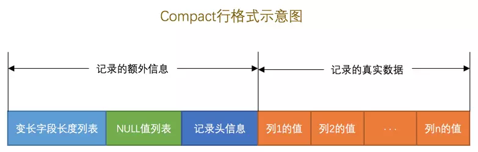
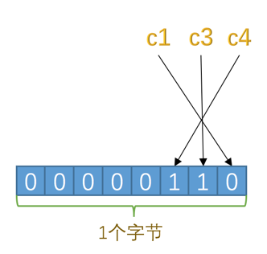
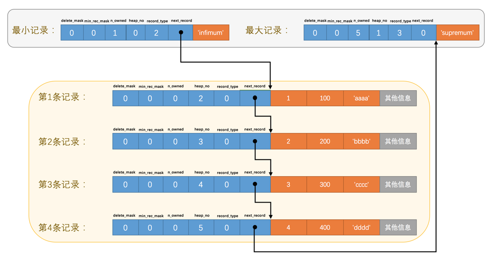
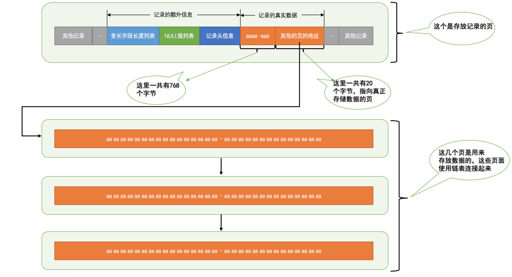
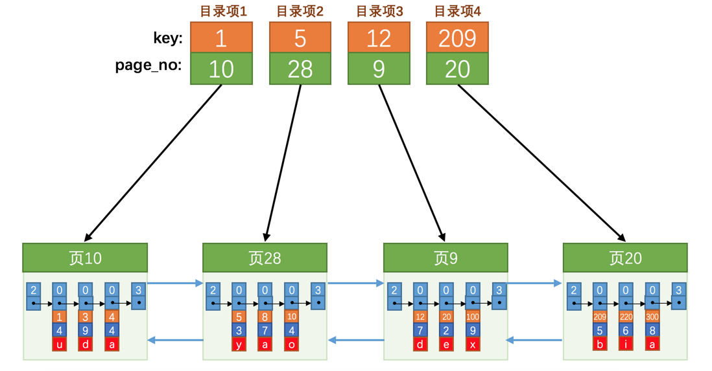
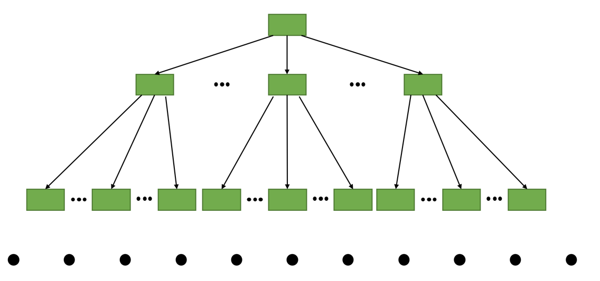
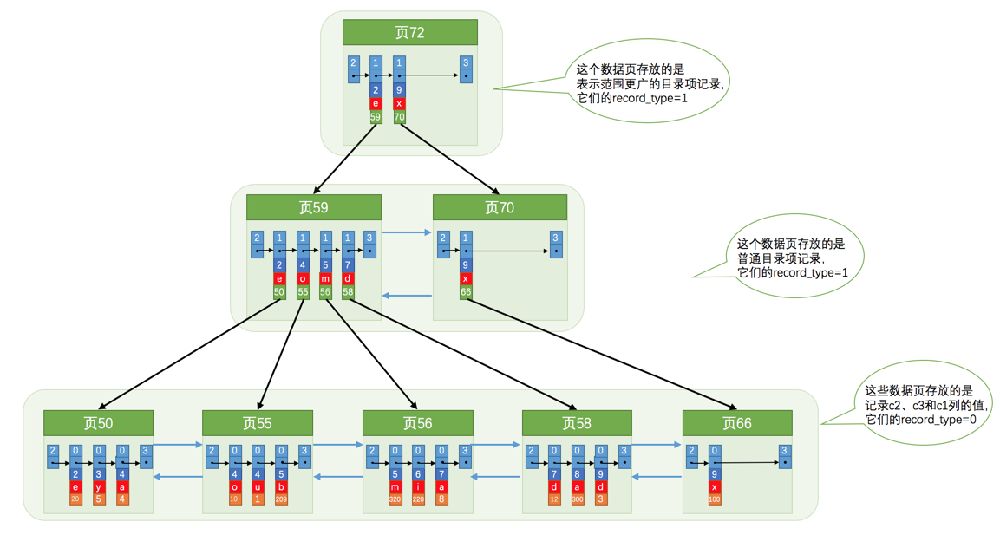
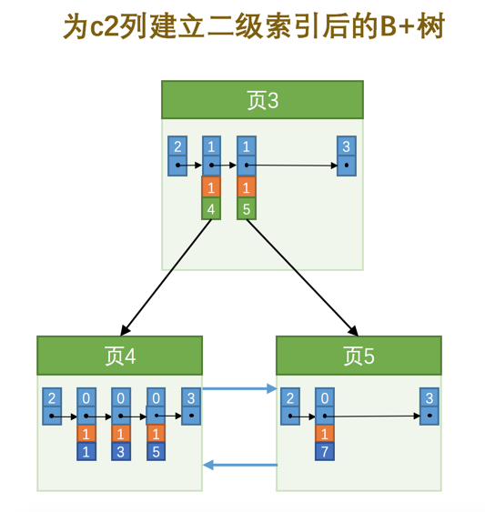

## InnoDB 记录存储结构

MySQL 服务器上负责对表中数据的读取和写入工作的部分是存储引擎，而服务器又支持不同类型的存储引擎，不同的存储引擎是为实现不同的特性而开发的，真实数据在不同存储引擎中存放的格式一般是不同的

## InnoDB 数据页结构

InnoDB 是一个将表中的数据存储到磁盘上的存储引擎，所以即使关机后重启数据还是存在的。而真正处理数据的过程是发生在 **内存** 中的，所以需要把磁盘中的数据加载到内存中，如果是处理写入或修改请求的话，还需要把内存中的内容刷新到磁盘上。当需要从表中获取某些记录时，InnoDB 需要一条一条的把记录从磁盘上读出来的话，效率非常低

InnoDB 采取的方式是：**将数据划分为若干个页，以页作为磁盘和内存之间交互的基本单位**，页的大小一般为 **16KB**，即在一般情况下，一次最少从磁盘中读取 16KB 的内容到内存中，一次最少把内存中的 16KB 内容刷新到磁盘中


|        名称        |       中文名       |         简单描述         |
| :----------------: | :----------------: | :----------------------: |
|    File Header     |      文件头部      |     页的一些通用信息     |
|    Page Header     |      页面头部      |   数据页专有的一些信息   |
| Infimum + Supremum | 最小记录和最大记录 |     两个虚拟的行记录     |
|    User Records    |      用户记录      |   实际存储的行记录内容   |
|     Free Space     |      空闲空间      |    页中尚未使用的空间    |
|   Page Directory   |      页面目录      | 页中的某些记录的相对位置 |
|    File Trailer    |      文件尾部      |      校验页是否完整      |


### 记录在页中的存储

在页的 7 个组成部分中，我们自己存储的记录会按照指定的行格式存储到 User Records 部分。但是在 **一开始生成页的时候，其实并没有 User Records 这个部分**，每当我们插入一条记录，都会从 Free Space 部分，也就是尚未使用的存储空间中 **申请一个记录大小的空间划分到 User Records 部分**，当 Free Space 部分的空间全部被 User Records 部分替代掉之后，也就意味着这个页使用完了，如果还有新的记录插入的话，就需要去申请新的页了


### Page Directory（页目录）

记录在页中按照主键值由小到大顺序串联成一个单链表，那么如何根据主键值查找页中的某条记录

1. 将所有正常的记录（包括最大和最小记录，不包括标记为已删除的记录）划分为几个组
2. 每个组的最后一条记录（也就是组内最大的那条记录）的头信息中的 n_owned 属性表示该记录拥有多少条记录，也就是该组内共有几条记录
3. 将每个组的 **最后一条记录的地址偏移量单独提取出来按顺序存储到靠近页的尾部的地方**，这个地方就是所谓的 Page Directory，页面目录中的这些地址偏移量被称为 **槽（Slot）**，所以这个页面目录就是由槽组成的


- 最小记录的 n_owned 值为 1，这就代表着以最小记录结尾的这个分组中只有 1 条记录，也就是最小记录本身
- 最大记录的 n_owned 值为 5，这就代表着以最大记录结尾的这个分组中只有 5 条记录，包括最大记录本身还有我们自己插入的 4 条记录

逻辑上记录和页目录的关系


- 对于最小记录所在的分组 **只能有 1 条记录**，最大记录所在的分组拥有的记录条数 **只能在 1~8 条之间**，剩下的分组中记录的条数范围 **只能在是 4~8 条之间**。所以分组是按照下边的步骤进行的
  - 初始情况下一个数据页里只有最小记录和最大记录两条记录，它们分属于两个分组
  - 之后每插入一条记录，都会从页目录中找到 **主键值比本记录的主键值大并且差值最小的槽**，然后把该槽对应的记录的 n_owned 值加 1，表示本组内又添加了一条记录，**直到该组中的记录数等于 8 个**
  - 在一个组中的记录数等于 8 个后再插入一条记录时，**会将组中的记录拆分成两个组**，一个组中 4 条记录，另一个 5 条记录。这个过程会在页目录中新增一个槽来记录这个新增分组中最大的那条记录的偏移量


因为各个槽代表的记录的主键值都是从小到大排序的，所以可以使用 **二分法** 来进行快速查找。4 个槽的编号分别是：0、1、2、3、4，所以初始情况下 **最低的槽就是 low=0**，**最高的槽就是 high=4**

所以在一个数据页中查找指定主键值的记录的过程分为两步

1. 通过二分法确定该记录所在的槽，并找到该槽中主键值最小的那条记录
2. 通过记录的 next_record 属性遍历该槽所在的组中的各个记录

### Page Header（页面头部）

它是页结构的第二部分，这个部分占用 **固定的 56 个字节**，专门存储各种状态信息

|       名称        | 占用空间大小 |                             描述                             |
| :---------------: | :----------: | :----------------------------------------------------------: |
| PAGE_N_DIR_SLOTS  |    2 字节    |                      在页目录中的槽数量                      |
|   PAGE_HEAP_TOP   |    2 字节    |    还未使用的空间最小地址，即从该地址之后就是 Free Space     |
|    PAGE_N_HEAP    |    2 字节    | 本页中的记录的数量（包括最小和最大记录以及标记为删除的记录） |
|     PAGE_FREE     |    2 字节    | 第一个已经标记为删除的记录地址（各个已删除的记录通过 next_record 也会组成一个单链表，这个单链表中的记录可以被重新利用） |
|   PAGE_GARBAGE    |    2 字节    |                    已删除记录占用的字节数                    |
| PAGE_LAST_INSERT  |    2 字节    |                      最后插入记录的位置                      |
|  PAGE_DIRECTION   |    2 字节    |                        记录插入的方向                        |
| PAGE_N_DIRECTION  |    2 字节    |                  一个方向连续插入的记录数量                  |
|    PAGE_N_RECS    |    2 字节    | 该页中记录的数量（不包括最小和最大记录以及被标记为删除的记录） |
|  PAGE_MAX_TRX_ID  |    8 字节    |       修改当前页的最大事务 ID，该值仅在二级索引中定义        |
|    PAGE_LEVEL     |    2 字节    |                  当前页在 B+ 树中所处的层级                  |
|   PAGE_INDEX_ID   |    8 字节    |               索引 ID，表示当前页属于哪个索引                |
| PAGE_BTR_SEG_LEAF |   10 字节    |       B+ 树叶子段的头部信息，仅在 B+ 树的 Root 页定义        |
| PAGE_BTR_SEG_TOP  |   10 字节    |      B+ 树非叶子段的头部信息，仅在 B+ 树的 Root 页定义       |

- PAGE_DIRECTION：假如新插入的一条记录的主键值比上一条记录的主键值大，我们说这条记录的插入方向是右边，反之则是左边。用来表示最后一条记录插入方向的状态就是 PAGE_DIRECTION
- PAGE_N_DIRECTION：假设连续几次插入新记录的方向都是一致的，InnoDB 会把沿着同一个方向插入记录的条数记下来，这个条数就用 PAGE_N_DIRECTION 这个状态表示。当然，如果最后一条记录的插入方向改变了的话，这个状态的值会被清零重新统计

### File Header（文件头部）

**对各种类型的页都通用**，不同类型的页都会以 File Header 作为第一个组成部分，它描述了一些针对各种页都通用的一些信息，比方说这个页的编号是多少，它的上一个页、下一个页是谁等等，这个部分占用固定的 **38 个字节**

|               名称               | 占用空间大小 |                             描述                             |
| :------------------------------: | :----------: | :----------------------------------------------------------: |
|     FIL_PAGE_SPACE_OR_CHKSUM     |    4 字节    |                  页的校验和（checksum 值）                   |
|         FIL_PAGE_OFFSET          |    4 字节    |                             页号                             |
|          FIL_PAGE_PREV           |    4 字节    |                        上一个页的页号                        |
|          FIL_PAGE_NEXT           |    4 字节    |                        下一个页的页号                        |
|           FIL_PAGE_LSN           |    8 字节    |  页面被最后修改时对应的日志序列位置（Log Sequence Number）   |
|          FIL_PAGE_TYPE           |    2 字节    |                          该页的类型                          |
|     FIL_PAGE_FILE_FLUSH_LSN      |    8 字节    | 仅在系统表空间的一个页中定义，代表文件至少被刷新到了对应的 LSN 值 |
| FIL_PAGE_ARCH_LOG_NO_OR_SPACE_ID |    4 字节    |                       页属于哪个表空间                       |

- FIL_PAGE_SPACE_OR_CHKSUM：这个代表当前页面的 **校验和**（checksum）。校验和就是对于一个很长很长的字节串来说，我们会通过某种算法来计算一个比较短的值来代表这个很长的字节串，这个比较短的值就称为校验和。这样在比较两个很长的字节串之前先比较这两个长字节串的校验和，如果校验和都不一样两个长字节串肯定是不同的，所以省去了直接比较两个比较长的字节串的时间损耗。

- FIL_PAGE_OFFSET：每一个页都有一个单独的页号，InnoDB 通过页号来可以唯一定位一个页

- FIL_PAGE_TYPE：当前页的类型，InnoDB 为了不同的目的而把页分为不同的类型，除了存储记录的数据页，其实还有很多别的类型的页

  |        类型名称         | 十六进制 |            描述            |
  | :---------------------: | :------: | :------------------------: |
  | FIL_PAGE_TYPE_ALLOCATED |  0x0000  |     最新分配，还没使用     |
  |    FIL_PAGE_UNDO_LOG    |  0x0002  |        Undo 日志页         |
  |     FIL_PAGE_INODE      |  0x0003  |         段信息节点         |
  | FIL_PAGE_IBUF_FREE_LIST |  0x0004  |   Insert Buffer 空闲列表   |
  |  FIL_PAGE_IBUF_BITMAP   |  0x0005  |     Insert Buffer 位图     |
  |    FIL_PAGE_TYPE_SYS    |  0x0006  |           系统页           |
  |  FIL_PAGE_TYPE_TRX_SYS  |  0x0007  |        事务系统数据        |
  |  FIL_PAGE_TYPE_FSP_HDR  |  0x0008  |       表空间头部信息       |
  |   FIL_PAGE_TYPE_XDES    |  0x0009  |         扩展描述页         |
  |   FIL_PAGE_TYPE_BLOB    |  0x000A  |          BLOB 页           |
  |     FIL_PAGE_INDEX      |  0x45BF  | 索引页，即我们所说的数据页 |

- FIL_PAGE_PREV 和 FIL_PAGE_NEXT：InnoDB 都是以页为单位存放数据的，有时候我们存放某种类型的数据占用的空间非常大，InnoDB 可能不可以一次性为这么多数据分配一个非常大的存储空间，如果分散到多个不连续的页中存储的话需要把这些页关联起来，FIL_PAGE_PREV 和 FIL_PAGE_NEXT 就分别代表本页的上一个和下一个页的页号。这样通过建立一个双向链表把许许多多的页就都串联起来了，而无需这些页在物理上真正连着

  - 需要注意的是，并不是所有类型的页都有上一个和下一个页的属性

### File Trailer

File Trailer 与 File Header 类似，都是所有类型的页通用的。InnoDB 存储引擎会把数据存储到磁盘上，但是磁盘速度太慢，需要以页为单位把数据加载到内存中处理，如果该页中的数据在内存中被修改了，那么在修改后的某个时间需要把数据同步到磁盘中。但是在同步了一半的时候中断电了咋办，为了检测一个页是否完整，InnoDB 在每个页的尾部都加了一个 File Trailer 部分，这个部分由 **8 个字节** 组成，可以分成 2 个小部分

- 前 4 个字节代表页的校验和：这个部分 **和 File Header 中的校验和相对应** 。每当一个页面在内存中修改了，在同步之前就要把它的校验和算出来，因为 File Header 在页面的前边，所以 **校验和会被首先同步到磁盘，当完全写完时，校验和也会被写到页的尾部**，如果完全同步成功，则页的首部和尾部的校验和应该是一致的。如果写了一半儿断电了，那么在 File Header 中的校验和就代表着已经修改过的页，而在 File Trialer 中的校验和代表着原先的页，二者不同则意味着同步中间出了错
- 后 4 个字节代表页面被最后修改时对应的日志序列位置（LSN）：这个部分也是为了校验页的完整性的

## InnoDB 行格式

我们平时是以记录为单位来向表中插入数据的，这些记录在磁盘上的存放方式也被称为 **行格式或者记录格式**。目前有 4 种不同类型的行格式，分别是：**Compact、Redundant、Dynamic、Compressed**，在原理上大体都是相同的

### COMPACT 行格式



```mysql
# 指定行格式
CREATE TABLE [表名] (列的信息) ROW_FORMAT = [行格式]

# 修改行格式
ALTER TABLE [表名] ROW_FORMAT = [行格式]
```

### 记录的额外信息

服务器为了描述这条记录而不得不额外添加的一些信息

#### 变长字段列表

MySQL 支持一些变长的数据类型，比如 VARCHAR、VARBINARY、TEXT、BLOB 等，也称为 **变长字段**，变长字段中存储多少字节的数据是 **不固定的**，所以在存储真实数据的时候需要把这些数据 **占用的字节数** 也存起来，所以这些变长字段占用的存储空间分为两部分：**真正的数据内容、占用的字节数**

- 在 Compact 行格式中，**把所有变长字段的真实数据占用的字节长度都存放在记录的开头部位**，从而形成一个变长字段长度列表，各变长字段数据占用的字节数按照列的顺序 **逆序存放**
- **只存储值为非 NULL 的列内容占用的长度**，值为 NULL 的列的长度是不储存的
- 如果内容占用的字节数比较小，用 **1 个字节** 就可以表示，但是如果变长列的内容占用的字节数比较多，可能就需要用 **2 个字节** 来表示
  - 假设某个字符集中表示一个字符最多需要使用的字节数为 W，即使用 **`SHOW CHARSET`** 语句的结果中的 **Maxlen** 列；对于变长类型来说，这种类型表示能存储最多 M 个字符；实际存储的字符串占用的字节数是 L
  - 如果该可变字段允许存储的最大字节数（**M × W**）**超过 255 字节并且真实存储的字节数（L）超过 127 字节**，则使用 2 个字节，否则使用 1 个字节

#### NULL 值列表

某些列可能存储 NULL 值，如果把这些 NULL 值都放到 **记录的真实数据** 中存储会很占地方，所以 Compact 行格式把这些值为 NULL 的列统一管理起来，存储到 NULL 值列表中

1. 首先统计表中 **允许** 存储 NULL 的列有哪些
2. **如果表中没有允许存储 NULL 的列，则 NULL 值列表也不存在了**。否则将每个允许存储 NULL 的列对应一个二进制位，二进制位按照列的顺序 **逆序排列**
   * 二进制位的值为 1 时，代表该列的值为 NULL；为 0 时，代表该列的值不为 NULL
3. MySQL 规定 NULL 值列表必须用 **整数个字节** 的位表示，如果使用的二进制位个数不是整数个字节，则在 **字节的高位补 0**



#### 记录头信息

是由固定的 5 个字节组成。 5 个字节也就是 40 个二进制位，不同的位代表不同的意思


|     名称     | 大小（单位：bit） |                             描述                             |
| :----------: | :---------------: | :----------------------------------------------------------: |
|   预留位1    |         1         |                           没有使用                           |
|   预留位2    |         1         |                           没有使用                           |
| delete_mask  |         1         |                     标记该记录是否被删除                     |
| min_rec_mask |         1         |       B+ 树的每层非叶子节点中的最小记录都会添加该标记        |
|   n_owned    |         4         |                     当前记录拥有的记录数                     |
|   heap_no    |        13         |                   当前记录在页中的位置信息                   |
| record_type  |         3         | 当前记录的类型，0 表示普通记录，1 表示 B+ 树非叶子节点记录，2 表示最小记录，3 表示最大记录 |
| next_record  |        16         |                     下一条记录的相对位置                     |

- delete_mask：标记着当前记录是否被删除，占用 1 个二进制位，值为 0 的时候代表记录并没有被删除，为 1 的时候代表记录被删除掉了。所以被删除的记录还在页中，因为移除它们之后把其他的记录在磁盘上重新排列需要 **性能消耗**，所以只是打一个删除标记而已
  - 所有被删除掉的记录都会组成一个所谓的 **垃圾链表**，在这个链表中的记录占用的空间称作 **可重用空间**，之后如果有新记录插入到表中的话，可能把这些被删除的记录占用的存储空间覆盖掉
- heap_no：当前记录在页中的位置，**从 2 开始，0 为最小记录，1 为最大记录**
  - InnoDB 自动给每个页里边儿加了两个记录，由于这两个记录并不是我们自己插入的，所以有时候也称为 **伪记录或虚拟记录**。这两个伪记录一个代表 **最小记录**，一个代表 **最大记录**。这两条记录的构造十分简单，都是由  **5 字节大小的记录头信息和 8 字节大小的一个固定的部分** 组成的。对于一条完整的记录来说，比较记录的大小就是 **比较主键的大小**
  - 由于这两条记录不是我们自己定义的记录，所以它们并不存放在页的 User Records 部分，他们被单独放在一个称为 **Infimum + Supremum** 的部分


- next_record：**从当前记录的真实数据到下一条记录的真实数据的地址偏移量**。其实是个 **链表**，可以通过一条记录找到它的下一条记录。但注意下一条记录指得并不是按照我们插入顺序的下一条记录，而是 **按照主键值由小到大的顺序的下一条记录**。而且规定 Infimum 记录的下一条记录就是本页中 **主键值最小** 的用户记录，而本页中 **主键值最大** 的用户记录的下一条记录就是 Supremum记录
  - 记录按照主键从小到大的顺序形成了一个单链表。最大记录的 **next_record 的值为 0**，这也就是说 **最大记录是没有下一条记录了**，它是这个单链表中的最后一个节点
  - 当删除某条数据时，该数据的 next_record 值变为 0，它的上一条数据 next_record 会指向它的下一条数据。它的存储空间不会被立即回收，这样当新记录的插入时不会申请新的存储空间，而是直接复用了原来被删除记录的存储空间
  -  当数据页中存在多条被删除掉的记录时，这些记录的 next_record 属性将会把这些被删除掉的记录组成一个垃圾链表，以备之后重用这部分存储空间



### 记录的真实数据

除了我们自己定义的列的数据以外，MySQL 会为每个记录默认的添加一些列，也称为 **隐藏列**

|      列名      | 是否必须 | 占用空间 |          描述           |
| :------------: | :------: | :------: | :---------------------: |
|     row_id     |    否    |  6 字节  | 行 ID，唯一标识一条记录 |
| transaction_id |    是    |  6 字节  |         事务 ID         |
|  roll_pointer  |    是    |  7 字节  |        回滚指针         |

* 实际上这几个列的真正名称其实是：DB_ROW_ID、DB_TRX_ID、DB_ROLL_PTR

InnoDB 存储引擎会为每条记录都添加 transaction_id 和 roll_pointer 这两个列，但是 row_id 是可选的。这些隐藏列的值，InnoDB 存储引擎会自动生成

- InnoDB 表对主键的生成策略：**优先使用用户自定义主键作为主键**，如果用户没有定义主键，则选取一个 **Unique 键** 作为主键，如果表中连 Unique 键都没有定义的话，则 InnoDB 会为表默认添加一个名为 **row_id** 的隐藏列作为主键


#### CHAR(M) 列的存储格式

对于 CHAR(M) 类型的列来说，当列采用的是定长字符集时，该列占用的字节数不会被加到变长字段长度列表，**而如果采用变长字符集时，该列占用的字节数也会被加到变长字段长度列表**

- 变长字符集的 CHAR(M) 类型的列要求至少占用 M 个字节，而 VARCHAR(M) 却没有这个要求

### 行溢出数据

#### VARCHAR(M) 最多能存储的数据

VARCHAR(M) 类型的列最多可以占用 **65535 个字节**，其中的 **M 代表该类型最多存储的字符数量**。MySQL 对一条记录占用的最大存储空间是有限制的，除了 **BLOB、TEXT** 类型的列之外，其他所有的列（**不包括隐藏列和记录头信息**）占用的字节长度加起来 **不能超过 65535 个字节**。这个 65535 个字节除了列本身的数据之外，还包括一些其他的数据（storage overhead），例如为了存储一个 VARCHAR(M) 类型的列，其实需要占用 3 部分存储空间

* 真实数据
* 真实数据占用字节的长度
* NULL 值标识，如果该列有 NOT NULL 属性则可以没有这部分存储空间

所以 VARCHAR(M) 类型的列没有 NOT NULL 属性，最多只能存放 65532 个字节的数据，因为 **真实数据的长度可能占用 2 个字节，NULL 值标识需要占用 1 个字节**。不同字符集，存放的字符数不同，ASCII 一个字符占一个字节，可以存放 65532 个字符，UTF8 一个字符占 3 个字节，可以存放 21844 个字节

#### 记录中的数据太多产生的溢出

一个页的大小一般是 16KB，即 16384 字节，而一个 VARCHAR(M) 类型的列就最多可以存储 65532 个字节，这样就可能造成一个页存放不了一条记录的尴尬情况

在 Compact 行格式中，对于占用存储空间非常大的列，在记录的真实数据处 **只会存储该列的一部分数据，把剩余的数据分散存储在几个其他的页中**，然后记录的真实数据处用 **20 个字节存储指向这些页的地址**（20 个字节还包括这些分散在其他页面中的数据的占用的字节数），从而可以找到剩余数据所在的页



如果某一列中的数据非常多的话，**真实数据处只会存储该列的前 768 个字节的数据和一个指向其他页的地址**，然后把剩下的数据存放到其他页中，这个过程也叫做 **行溢出**，存储超出 768 字节的那些页面也被称为 **溢出页**

- 不只是 VARCHAR(M) 类型的列，其他的 TEXT、BLOB 类型的列在存储数据非常多的时候也会发生行溢出

#### 行溢出的临界点

MySQL 中规定 **一个页中至少存放两行记录**。每个页除了存放我们的记录以外，也需要存储一些额外的信息，加起来需要 **132 个字节** 的空间，其他的空间都可以被用来存储记录

* 每个记录需要的额外信息是 **27 字节**
  - 2 个字节用于存储真实数据的长度
  - 1 个字节用于存储列是否是 NULL 值
  - 5 个字节大小的头信息
  - 6 个字节的 row_id 列
  - 6 个字节的 transaction_id 列
  - 7 个字节的 roll_pointer 列

那么行溢出的临界点为 `132 + 2 * (27 + n) < 16384`，结果为 n < 8099。如果表中有多个列，那上边的式子和结论都需要改一改了，重点是只要知道一条记录的某个列中存储的数据 **占用的字节数非常多时**，该列就可能成为溢出列

### Redundant 行格式

MySQL5.0 之前用的一种行格式，与 Compact 行格式类似，**没有 NULL 值列表**

### Dynamic 和 Compressed 行格式

MySQL 默认行格式就是 Dynamic，这俩行格式和 Compact 行格式挺像，只不过在处理行溢出数据时有点儿分歧，它们不会在记录的真实数据处存储字段真实数据的前 768 个字节，而是把 **所有的字节都存储到其他页面中**，**只在记录的真实数据处存储其他页面的地址**


* Compressed 行格式和 Dynamic 不同的一点是，Compressed 行格式会采用 **压缩算法** 对页面进行压缩，以节省空间

## B+ 树索引

在没有索引的情况下，不论是根据主键列或者其他列的值进行查找，由于不能快速的定位到记录所在的页，所以只能从第一个页沿着双向链表一直往下找，而且要遍历所有的数据页，显然是很耗时的

### 简单的索引方案

如果想快速的定位到需要查找的记录，可以想办法为快速定位记录所在的数据页而建立一个别的目录，即索引，建这个目录必须完成下边这些事儿

- 下一个数据页中用户记录的主键值必须大于上一个页中用户记录的主键值
  - 在对页中的记录进行增删改操作的过程中，我们必须通过一些诸如记录移动的操作来始终保证这个状态一直成立，这个过程也称为 **页分裂**
- 给所有的页建立一个目录项
  - 由于数据页的编号可能 **并不是连续** 的，因为这些页在物理存储上可能并不挨着，所以如果想从这么多页中根据主键值快速定位某些记录所在的页，需要给它们做个目录，每个页对应一个目录项，每个目录项包括两个部分：**页的用户记录中最小的主键值（key），页号（page_no）**



只需要把几个目录项在物理存储器上连续存储，比如把他们放到一个数组里，就可以实现根据主键值利用二分法快速查找某条记录的功能了

#### 缺点

之所以称为一个简易的索引方案，是因为为了在根据主键值进行查找时，使用二分法快速定位具体的目录项，而假设所有目录项都可以在物理存储器上连续存储，但是这样做有几个问题

- InnoDB 是使用页来作为管理存储空间的基本单位，即最多能保证 16KB 的连续存储空间，而随着表中记录数量的增多，需要非常大的连续的存储空间才能把所有的目录项都放下，这对记录数量非常多的表是不现实的
- 我们时常会对记录进行增删，假设把页 28 中的记录都删除了，页 28 也就没有存在的必要了，那意味着目录项 2 也就没有存在的必要了，这就需要把目录项 2 后的目录项都向前移动一下，这种牵一发而动全身的设计不是什么好主意

### InnoDB 中的索引方案

InnoDB 有灵活管理所有目录项的方式。因为目录项其实跟用户记录类似，只是目录项中的两个列是主键和页号而已，所以 InnoDB 复用了之前存储用户记录的数据页来存储目录项，为了和用户记录做一下区分，这些用来表示目录项的记录称为 **目录项记录**

InnoDB 使用了 record_type 属性来区分一条记录是用户记录还是目录项记录


#### 目录项记录与用户记录的区别

- 目录项记录的 record_type 值是 1；普通用户记录的 record_type 值是 0
- 目录项记录只有主键值和页的编号两个列；普通的用户记录的列是用户自己定义的，可能包含很多列，还有 InnoDB 自己添加的隐藏列
- **只有在存储目录项记录的页中的，主键值最小的目录项记录的 min_rec_mask 值为 1**，其他的记录的 min_rec_mask 值都是 0

#### 目录项记录过多

当一个页中的目录项记录过多时，会创建一个新的页。但是这些页在存储空间中可能不挨着，并且如果表中的数据非常多，则会产生很多存储目录项记录的页，所以为了这些存储目录项记录的页会再生成一个更高级的目录，就像是一个多级目录一样，大目录里嵌套小目录，小目录里才是实际的数据


#### B+ 树

随着表中记录的增加，这个目录的层级会继续增加，如果简化一下，其实就是一种组织数据的形式，或者说是一种数据结构，它的名称是 B+ 树



不论是存放用户记录的数据页，还是存放目录项记录的数据页，都把它们存放到 B+ 树这个数据结构中了，所以这些数据页也被称为 **节点**。从图中可以看出来，实际用户记录其实都存放在 B+ 树的最底层的节点上，这些节点也被称为 **叶子节点或叶节点**，其余用来存放目录项的节点称为 **非叶子节点或内节点**，其中 B+ 树最上边的那个节点也称为 **根节点**

一个 B+ 树的节点其实可以分成好多层，InnoDB 规定最下边的那层，即存放用户记录的那层为 **第 0 层**，之后依次往上加。一般情况下，**用到的 B+ 树都不会超过 4 层**，通过主键值去查找某条记录最多只需要做 4 个页面内的查找（**3 个目录项页和 1 个用户记录页**），又因为在每个页面内都有 Page Directory，所以在页面内也可以通过二分法实现快速定位记录

#### 聚簇索引

B+ 树本身就是一个目录，或者说本身就是一个索引。它有两个特点

- 使用记录主键值的大小进行记录和页的排序，包括 3 个方面的含义
  - 页内的记录是按照主键的大小顺序排成一个单向链表
  - 各个存放用户记录的页也是根据页中用户记录的主键大小顺序排成一个双向链表
  - 存放目录项记录的页分为不同的层次，在同一层次中的页也是根据页中目录项记录的主键大小顺序排成一个双向链表

- B+ 树的叶子节点存储的是完整的用户记录
  - 完整的用户记录，就是指这个记录中存储了所有列的值（包括隐藏列）

具有这两种特性的 B+ 树被称为 **聚簇索引**，所有完整的用户记录都存放在这个聚簇索引的叶子节点处。这种聚簇索引并不需要在 MySQL 语句中显式的使用 INDEX 语句去创建，**InnoDB 会自动为我们创建聚簇索引**。在 InnoDB 中，聚簇索引就是数据的存储方式（所有的用户记录都存储在了叶子节点），也就是所谓的 **索引即数据，数据即索引**

#### 二级索引

也被称作 **辅助索引**。聚簇索引只能在搜索条件是 **主键值** 时才能发挥作用，因为 B+ 树中的数据都是按照主键进行排序的。如果想以别的列作为搜索条件，可以多建几棵 B+ 树，不同的 B+ 树中的数据采用不同的排序规则。目录项记录中不再是主键 + 页号的搭配，而是变成 **搜索的列 + 页号** 的搭配

按非主键建立的 B+ 树，当需要查询数据时，只能确定要查找记录的主键值，所以如果想查找到完整的用户记录的话，仍然需要到聚簇索引中再查一遍，这个过程也被称为 **回表**。即根据非主键列的值查询一条完整的用户记录需要使用到 **2 棵 B+ 树**

- 如果把完整的用户记录放到叶子节点是可以不用回表，但是太占地方了。相当于每建立一棵 B+ 树都需要把所有的用户记录再都拷贝一遍，太浪费存储空间了


#### 联合索引

同时以 **多个列** 的大小作为排序规则，也就是同时为多个列建立索引。会先把各个记录和页按照某列进行排序，在记录的列相同的情况下，再采用另一个列进行排序



联合索引本质上也是一个二级索引。它的意思与分别建立索引的表述是不同的

- 建立联合索引只会建立 1 棵 B+ 树
- 分别建立索引会分别以列的大小为排序规则建立多棵 B+ 树

#### 根页面万年不动窝

实际上 B+ 树的形成过程

1. 每当为某个表创建一个 B+ 树索引（聚簇索引不是人为创建的，默认就有）的时候，都会为这个索引创建一个根节点页面。最开始表中没有数据的时候，每个 B+ 树索引对应的根节点中既没有用户记录，也没有目录项记录
2. 随后向表中插入用户记录时，先把用户记录存储到这个 **根节点** 中
3. 当根节点中的可用空间用完时继续插入记录，此时会将根节点中的所有记录复制到一个新分配的页，然后对这个新页进行 **页分裂** 的操作，得到另一个新页。这时新插入的记录根据键值（即聚簇索引中的主键值，二级索引中对应的索引列的值）的大小就会被分配到页中，**而根节点便升级为存储目录项记录的页**

一个 B+ 树索引的根节点自诞生之日起，便不会再移动

#### 内节点中目录项记录的唯一性

B+ 树索引的内节点中目录项记录的内容是索引列 + 页号的搭配，如果二级索引中目录项记录的内容只是使用这样的搭配的话，如果遇到索引列的值都相同的情况，该如何插入数据呢



为了让新插入记录能找到自己在哪个页里，需要保证在 **B+ 树的同一层内节点的目录项记录除页号这个字段以外是唯一的**。所以二级索引的内节点的目录项记录的内容实际上是由 3 个部分构成的：**索引列的值、主键值、页号**


#### 一个页面最少存储2条记录

一个 B+ 树只需要很少的层级就可以轻松存储数亿条记录，查询速度也很快。这是因为 B+ 树本质上就是一个大的多层级目录，每经过一个目录时都会过滤掉许多无效的子目录，直到最后访问到存储真实数据的目录

如果一个大的目录中只存放一个子目录，那就是目录层级非常多，而且最后的那个存放真实数据的目录中只能存放一条记录，费了半天劲只能存放一条真实的用户记录。所以 InnoDB 的一个数据页至少可以存放两条记录

### MyISAM 中的索引方案

InnoDB 中 **索引即数据**，即聚簇索引的那棵 B+ 树的叶子节点中已经把所有完整的用户记录都包含了，而 MyISAM 的索引方案虽然也使用树形结构，但是却将索引和数据分开存储

- 将表中的记录按照记录的插入顺序单独存储在一个文件中，称之为 **数据文件**。这个文件并不划分为若干个数据页，有多少记录就往这个文件中塞多少记录就成了。可以通过行号而快速访问到一条记录

MyISAM 记录也需要记录头信息来存储一些额外数据，由于在插入数据的时候并没有刻意按照主键大小排序，所以并不能在这些数据上使用二分法进行查找


- 使用 MyISAM 的表会把索引信息另外存储到一个称为 **索引文件** 的另一个文件中。MyISAM 会 **单独为表的主键创建一个索引**，只不过在索引的叶子节点中存储的不是完整的用户记录，而是 **主键值 + 行号** 的组合。即先通过索引找到对应的行号，再通过行号去找对应的记录
  -  这一点和 InnoDB 是完全不相同的，在 InnoDB 中，只需要根据主键值对聚簇索引进行一次查找就能找到对应的记录，而在 MyISAM 中却需要进行一次 **回表** 操作，即 **MyISAM 中建立的索引相当于全部都是二级索引**

- 如果有需要的话，也可以对其它的列分别建立索引或者建立联合索引，原理和 InnoDB 中的索引差不多，不过在叶子节点处存储的是 **相应的列 + 行号**

### 创建和删除索引

InnoDB 和 MyISAM 会自动为 **主键或者声明为 UNIQUE** 的列建立 B+ 树索引，但是想为其他的列建立索引就需要显式的去指明。之所以不自动为每个列都建立个索引呢，是因为每建立一个索引都会建立一棵 B+ 树，每插入一条记录都要维护各个记录、数据页的排序关系，很费性能和存储空间

```mysql
# 创建表的时候指定需要建立索引，KEY与INDEX是同义词
CREATE TALBE 表名 (
    各种列的信息 ··· , 
    [KEY|INDEX] 索引名 (需要被索引的单个列或多个列)
)

# 修改表结构的时候添加索引
ALTER TABLE 表名 ADD [INDEX|KEY] 索引名 (需要被索引的单个列或多个列);

# 修改表结构的时候删除索引
ALTER TABLE 表名 DROP [INDEX|KEY] 索引名;
```

## 索引的使用

### 索引的代价

- 空间上的代价：每建立一个索引都要为它建立一棵 B+ 树，每一棵 B+ 树的每一个节点都是一个数据页，一个页默认会占用 16KB 的存储空间，一棵很大的 B+ 树由许多数据页组成，那可是很大的一片存储空间
- 时间上的代价：每次对表中的数据进行增删改操作时，都需要去修改各个 B+ 树索引。而且 B+ 树每层节点都是按照索引列的值从小到大的顺序排序而组成了双向链表。不论是叶子节点中的记录，还是内节点中的记录，都是按照索引列的值从小到大的顺序而形成了一个单向链表。而增、删、改操作可能会对节点和记录的排序造成破坏，所以存储引擎需要额外的时间进行一些记录移位，页面分裂、页面回收等操作来维护好节点和记录的排序

### B+ 树索引适用的条件


