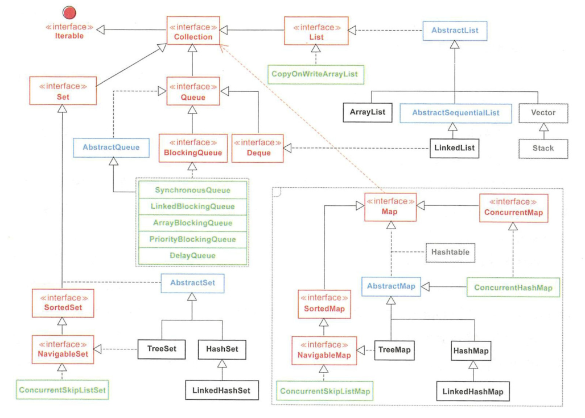

## 集合

一个放数据的容器，准确的说是放数据对象引用的容器。集合存放的都是对象的引用，而非对象本身，一般称集合中的对象就是集合中对象的引用

### 集合框架



### Collection 接口

Collection 接口是最基本的集合接口，不提供直接的实现。Collection 所代表的是一种规则，它所包含的元素都必须遵循一条或者多条规则，如有些允许重复而有些则不能重复、有些必须要按照顺序插入而有些则是散列，有些支持排序但是有些则不支持

在 Java 中所有实现了 Collection 接口的类都必须提供两套标准的构造函数，**一个是无参，用于创建一个空的 Collection，一个是带有 Collection 参数的有参构造函数，用于创建一个新的 Collection**，这个新的 Collection 与传入进来的 Collection 具备相同的元素

### Collection 与 Collections 的区别

- Collection 是个 java.util 下的接口，它是各种集合结构的父接口
- Collections 是个 java.util 下的类，它包含有各种有关集合操作的静态方法

### List 接口

List 接口为 Collection 直接接口，是线性数据结构的主要实现。List 所代表的是 **有序的 Collection**，即它用某种特定的插入顺序来维护元素顺序。用户可以对列表中每个元素的插入位置进行精确地控制，同时可以根据元素的整数索引（在列表中的位置）访问元素，并搜索列表中的元素

#### ArrayList
ArrayList 是一个 **容量可以改变的非线程安全集合**，内部使用 **数组** 进行存储，也是最常用的集合，允许任何符合规则的元素插入甚至包括 Null。每一个 ArrayList 都有一个 **初始容量（10）**，该容量代表了数组的大小。当容器中的元素不断增加时，集合扩容时会创建更大的数组空间。所以 **最好指定一个初始容量值**，避免过多的进行扩容操作而浪费时间、效率

- ArrayList 擅长于随机访问，但插入和删除时速度通常很慢，因为可能需要移动其他元素
- size、isEmpty、get、set、iterator 和 listIterator 操作都以固定时间运行。add 操作以分摊的固定时间运行，也就是说，添加 n 个元素需要 O(n) 时间（由于要考虑到扩容，所以这不只是添加元素会带来分摊固定时间开销那样简单）

#### LinkedList
LinkedList 本质是 **双向链表**。除了有 ArrayList 的基本操作方法外还提供了 get，remove，insert 方法操作首部或尾部。除了继承 AbstractList 抽象类外，LinkedList 还实现了 **Deque 接口**，这个接口 **同时具有队列和栈的性质**。LinkedList 包含 3 个重要的成员：**size、first、last**。size 是双向链表中节点的个数，first 和 last 分别指向第一个和最后一个节点的引用。LinkedList 的优点在于 **可以将零散的内存单元通过附加引用的方式关联起来，形成按链路顺序查找的线性结构，内存利用率较高**

- LinkedList 的插入和删除速度很快，但是随机访问速度则很慢。因为所有的操作都是要按照双重链表的需要执行。**在列表中索引的操作将从开头或结尾遍历列表**（从靠近指定索引的一端）。这样做的好处就是可以通过较低的代价在 List 中进行插入和删除操作

- 与 ArrayList 一样，LinkedList 也是非同步的。如果多个线程同时访问一个 List，则必须自己实现访问同步。一种解决方法是在创建 List 时构造一个同步的 List： **`List list = Collections.synchronizedList(new LinkedList(...))`**

#### Vector
与 ArrayList 相似，但是 Vector 是同步的，即 Vector 是 **线程安全的动态数组**。它的操作与 ArrayList 几乎一样
#### Stack
**继承自 Vector**，实现一个 **后进先出的堆栈**，Stack 刚创建后是空栈。Stack 提供 5 个额外的方法使得 Vector 得以被当作堆栈使用。基本的 push 和 pop 方法，还有 peek 方法得到栈顶的元素，empty 方法测试堆栈是否为空，search 方法检测一个元素在堆栈中的位置

### Queue 接口

Queue（队列）是一种先进先出的数据结构，队列是一种特殊的线性表，只允许在表的一端进行获取操作，在表的另一端进行插入操作，**可以存放重复的数据**。当队列中没有元素时，称为空队列。主要分为两大类，一类是 **阻塞式队列**，**队列满了以后再插入元素则会抛出异常**，主要包括 ArrayBlockQueue、PriorityBlockingQueue、LinkedBlockingQueue。另一类则是 **双端队列**，**支持在头、尾两端插入和移除元素**，主要包括：ArrayDeque、LinkedBlockingDeque、LinkedList

- 自从 BlockingQueue（阻塞队列）问世以来，队列的地位得到极大的提升，在各种高并发编程场景中，由于其本身 FIFO 的特性和阻塞操作的特点，经常被作为 Buffer（数据缓冲区）使用

### Map 接口

Map 集合是以 Key-Value 键值对作为存储元素实现的 **哈希结构**，**Key 按某种哈希函数计算后是唯一的，Value 则是可以重复的**。Map 没有继承 Collection，两个接口之间只是有依赖关系。最早用于存储键值对的 Hashtable 因为性能瓶颈已经被淘汰，而如今广泛使用的 HashMap，线程是不安全的。ConcurrentHashMap 是线程安全的，在 JDK8 中进行了锁的大幅度优化，体现出不错的性能。**在多线程并发场景中，优先推荐使用 ConcurrentHashMap**，而不是 HashMap

- **可以使用 keySet() 查看所有的 Key，使用 values() 查看所有的 Value，使用 entrySet() 查看所有的键值对**

#### HashMap

以哈希表数据结构实现，查找对象时通过哈希函数计算其位置，它是为快速查询而设计的，其内部定义了一个 hash 表数组（Entry[] table），元素会通过 **哈希转换函数** 将元素的 **哈希地址转换成数组中存放的索引**，如果有冲突，则使用 **散列链表的形式将所有相同哈希地址的元素串起来**，可以通过查看 HashMap.Entry 的源码它是一个单链表结构

#### TreeMap

键以某种排序规则排序，内部以 **红黑树** 数据结构实现，实现了 SortedMap 接口

#### HashTable

以哈希表数据结构实现，解决冲突时与 HashMap 一样也是采用了散列链表的形式，但性能比 HashMap 要低

### Set 接口

Set 是 **不允许出现重复元素** 的集合类型。Set 体系最常用的是 HashSet、TreeSet、LinkedHashSet。**它允许 Null 的存在但是仅有一个**

#### HashSet

HashSet 堪称 **查询速度最快的集合**，从源码分析是使用 **HashMap** 来实现的，只是 **Value 固定为一个静态对象，使用 Key 保证集合元素的唯一性，但它不保证集合元素的顺序**

#### TreeSet

从源码分析是使用 **TreeMap** 来实现的，**底层为树结构**，在添加新元素到集合中时，按照某种比较规则将其插入合适的位置，保证插入后的集合仍然是有序的

#### LinkedHashSet

继承自 HashSet，具有 HashSet 的优点，**内部使用链表维护了元素插入顺序**

### 集合间异同点

#### Vector、ArrayList 与 LinkedList

|              | Vector | ArrayList | LinkedList |
| :----------: | :----: | :-------: | :--------: |
| 底层数据结构 |  数组  |   数组    |    链表    |
|   线程安全   |  安全  |  不安全   |   不安全   |
|     查询     |   快   |    快     |     慢     |
|     增删     |   慢   |    慢     |     快     |
|     效率     |   低   |    高     |     高     |

#### HashSet、LinkedHashSet 与 TreeSet

- HashSet：**无序**，HashSet 中存放自定义类型对象时，一定要重写 hashCode 和 equals 方法
- LinkedHashSet：底层使用了链表的数据结构，特点是 **读取元素的顺序跟存入元素的顺序是一致的**
- TreeSet：特点是 **可以对存放进去的元素进行排序**

#### HashMap、HashTable 与 HashSet

- **实现接口不同**：HashMap、HashTable 是 Map 接口的实现类，而 HashSet 是 Set 接口的实现类，Set 接口是继承 Collection 接口
- **线程安全性，同步**：HashTable 中的方法加了同步锁（synchronized），所以对象是线程安全，而 HashMap 是异步的，所以存放的对象并不是线程安全的，而 HashSet 的底层是用 HashMap 实现的，所以它也不是线程安全的
- **执行效率**：HashTable 是同步的，而 HashMap 是异步的，所以 HashMap 的执行效率比 HashTable 要高，三者之间执行效率的排序是：HashMap > HashSet > HashTable
- **Key、Value 能否存放 Null**：HashMap 的 Key、Value 都可以为 Null，而 HashTable 是不能存放 Null，HashSet 存放的不是键值对，而是对象，也是可以为 Null
- **添加元素的方法不同**：HashMap 是通过 put 方法来增加元素的，而 HashSet 是通过 add 方法来增加元素的

#### HashMap 与 ConcurrentHashMap

ConcurrentHashMap 对整个桶数组进行了分割分段（Segment），然后在每一个分段上都用 lock 锁进行保护，相对于 HashTable 的 synchronized 锁的粒度更精细了一些，并发性能更好，而 HashMap 没有锁机制，不是线程安全的。JDK1.8 之后 ConcurrentHashMap 启用了一种全新的方式实现，利用 CAS 算法

- HashMap 的键值对允许有 Null，但是 ConCurrentHashMap 都不允许

### 集合框架中的泛型

JDK1.5 引入了泛型，所有的集合接口和实现都大量地使用它。泛型为集合提供一个可以容纳的对象类型，如果添加其它类型的任何元素，它会在编译时报错，避免在运行时出现 ClassCastException，因为会在编译时得到报错信息。泛型也使得代码整洁，不需要使用显式转换和 instanceOf 操作符。也给运行时带来好处，因为不会产生类型检查的字节码指令

## 集合初始化

集合的容量不会在 new 的时候分配，而在第一次加入数据时分配

### ArrayList

当 ArrayList 使用无参构造时，**默认大小为 10**，即在第一次 add 的时候，分配为 10 的容量，后续的每次扩容都会调用 **Array.copyOf 方法**，**创建新数组再复制**，**每次扩容 1.5 倍，向下取整**。假如需要将 1000 个元素放置在 ArrayList 中，采用默认构造方法，则需要被动扩容 13 次才可以完成存储。如果在初始化时便指定了容量 `new ArrayList(1000)`，那么在初始化 ArrayList 对象的时候就直接分配 1000 个存储空间，从而避免被动扩容和数组复制的额外开销。如果这个值达到更大量级，却没有注意初始的容量分配问题，那么无形中造成的性能损耗是非常大的，甚至导致 OOM 风险

### HashMap

在 HashMap 中有两个比较重要的参数：Capacity 决定了存储容量的大小，**默认为 16**，LoadFactor 决定了填充比例，一般使用 **默认的 0.75**，即当元素个数超过 `16 * 0.75 = 12` 的时候就进行扩容。基于这两个参数的 **乘积**，HashMap 内部用 **threshold 变量表示 HashMap 中能放入的元素个数**。**HashMap 容量并不会在 new 的时候分配，而是在第一次 put 的时候完成创建**。HashMap 如果需要放置 1000 个元素，同样没有设置初始容量大小，随着元素的不断增加，则需要被动扩容 7 次才可以完成存储。**扩容时需要重建 hash 表，非常影响性能**

为了提高运算速度，设定 HashMap 容量大小为 2^n，这样的方式使计算落槽位置更快。如果初始化 HashMap 的时候通过构造器指定了 initialCapacity，则会先计算出比 initialCapacity 大的 2 的幕存入 threshold，在第一次 put 时会按照这个 2 的幕初始化数组大小，此后每次扩容都是增加 2 倍

## Iterator（迭代器）

Iterator 是一个接口，迭代器取代了集合框架中的 Enumeration，允许调用者在迭代过程中移除元素。它只有三个方法：hasNext()、next()、remove()。在遍历集合的元素都可以使用 Iterator，它的具体实现是以内部类的方式实现的

### Enumeration 与 Iterator 的区别

Enumeration 的速度是 Iterator 的两倍，也使用更少的内存。Enumeration 满足了基础的需要，但 Iterator 更加安全，因为当一个集合正在被遍历的时候，它会阻止其它线程去修改集合

- Iterator 允许调用者从集合中移除元素，而 Enumeration 不能做到

## 遍历

### List 遍历

````java
for (int i = 0; i < list.size(); i++) {
    System.out.print(list.get(i));
}

for (int i : list) {
    System.out.print(i);
}

Iterator<Integer> it = list.iterator();
while (it.hasNext()) {
    System.out.print(it.next());
}

list.forEach(i-> System.out.print(i));
````

### Set 遍历

````java
for (int i : set) {
    System.out.print(i);
}

Iterator<Integer> it = set.iterator();
while (it.hasNext()) {
    System.out.print(it.next());
}

set.forEach(i-> System.out.print(i));
````

Map 遍历

````java
Set<Integer> set = map.keySet();

for (Object obj : set) {
    int key = (int) obj;
    String value = map.get(key);
    System.out.print(key + " : " + value);
}

Iterator<Integer> it = set.iterator();
while (it.hasNext()) {
    int key = it.next();
    String value = map.get(key);
    System.out.print(key + " : " + value);
}

Set set2 = map.entrySet();
for (Object obj : set2) {
    Map.Entry me = (Map.Entry) obj;
    int key = (int) me.getKey();
    String value = (String) me.getValue();
    System.out.print(key + " : " + value);
}

map.forEach((key, value) -> System.out.print(key + " : " + value));
````

### 遍历方式对比

- 普通 for 循环：在遍历 ArrayList 时效率会高一些，因为 ArrayList 底层使用的是数组实现的，所以可以认为 ArrayList 中的元素都是有下标的，可以快速的定位到 ArrayList 中的元素
- 增强 for 循环和迭代器：可以认为增强 for 循环是迭代器的一种简便的写法，而迭代器比较适合遍历 LinkedList，因为它底层使用的是链表的数据结构

* 使用 forEach 方法 + lambda 表达式：JDK8 以上的版本建议使用此种方式，该方式内部默认的使用增强 for 循环去遍历集合，不过在 ArrayList 类中重写了 forEach 方法，里面使用了普通的 for 循环去遍历。**不管使用哪一种，这种方式底层会选择最优的遍历方式**

### 删除元素

* 普通 for 循环：可以删除，注意让索引做自减运算

* 迭代器：可以删除，但是必须使用迭代器自身的 remove 方法，否则会出现并发修改异常

* 增强 for 循环：不能删除

## 数组与集合

数组是一种 **顺序表**，在各种高级语言中，它是组织和处理数据的一种常见方式，可以使用索引下标进行快速定位并获取指定位置的元素。数组的下标从 0 开始，这源于 BCPL 语言，它将指针设置在 0 的位置，用数组下标作为直接偏移量进行计算。如果数组下标从 1 开始，计算偏移量就要使用当前下标减 1 的操作，加减法运算对 CPU 来说是双数运算，在数组下标使用频率极富的场景下，这种运算是十分耗时的。在 Java 体系中，数组用以存储同一类型的对象，一旦分配内存后则无法扩容，提倡类型与中括号紧挨斗相连来定义数组

### 数组转集合

可以使用 Arrays.asList 方法进行数组转集合。可以通过 set 方法修改元素的值，**原有数组相应位置的值同时也会被修改**，但是 **不能进行修改元素个数的任何操作**， 如 add、remove、clear 方法，否则均会抛出 UnsupportedOperationException 异常。Arrays.asList 体现的是适配器模式，后台的数据仍是原有数组，set 方法即间接对数组进行值的修改操作。 asList 的 **返回对象是一个 Arrays 的内部类**，它并没有实现集合个数的相关修改方法，这也正是抛出异常的原因

### 集合转数组

可以使用集合的 toArray 方法把集合转换成数组，数组长度要等于集合的长度，否则可能会输出 Null 值

### 数组和集合的区别

|                |                             数组                             |                             集合                             |
| :------------: | :----------------------------------------------------------: | :----------------------------------------------------------: |
|      长度      |                           长度固定                           |                 可以根据元素的增加而自动增长                 |
| 元素的数据类型 | 可以存储基本数据类型和引用数据类型，基本数据类型存储的是值，引用数据类型存储的是地址值 | 只能存储引用数据类型，如果存储基本数据类型时，会 **自动装箱** 变成相应的包装类 |
|    存储内容    |                   存储的是同一种类型的元素                   |               可以存储不同类型的元素（不建议）               |

## 元素的比较

### Comparable 与 Comparator

Java 中两个对象相比较的方法通常用在元素排序中，常用的两个接口分别是 Comparable 和 Comparator，前者是自己和自己比，可以看作是自营性质的比较器；后者是第三方比较器，可以看作是平台性质的比较器

实现 Comparable 时，**可以加上泛型限定**，这样不需要在运行期进行类型检查和强制转换。如果这个排序的规则不符合业务方的要求，那么就需要修改这个类的比较方法 compareTo，但根据开闭原则，即最好不要对已经交付的类进行修改。另外，如果另一个业务方也在使用这个比较方法呢甚至再极端一点，我们可能连源码都没有。所以，其实需要在外部定义比较器，即 Comparator。正因为 Comparator 的出现，业务方可以根据需要修改排序规则

- 不管是 Comparable 还是 Comparator，小于的情况返回 -1，等于的情况返回 0，大于的情况回 1

### hashCode 与 equals

hashCode 和 equals 用来标识对象，两个方法协同工作可用来判断两个对象是否相等。**根据生成的哈希将数据离散开来，可以使存取元素更快**。对象通过调用 `Object.hashCode()` 生成哈希值，由于不可避免地会存在哈希值冲突的情况，因此当 hashCode 相同时，还需要再调用 equals 进行一次值的比较，但若 hashCode 不同，将直接判定 Objects 不同，跳过 equals，这加快了冲突处理效率

- 两个对象相等，则 hashcode 一定也是相同的
- 两个对象有相同的 hashcode，也不一定是相等的
- equals 方法被重写，则 hashCode 方法也必须被重写
- 两个对象相等，对两个对象分别调用 equals 方法都返回 true

## fail-fast 与 fail-safe 机制

fail-fast（快速失败） 机制是集合中比较常见的 **错误检测机制**，通常出现在遍历集合元素的过程中，在遍历中途出现意料之外的修改时，通过 unchecked 异常暴力地反馈出来。**在遍历一个集合对象时，如果遍历过程中对集合对象的内容进行了增删改，则会抛出 ConcurrentModificationException** 

- 这种机制经常出现在多线程环境下，当前线程会维护一个计数比较器，即 expectedModCount，记录已经修改的次数。在进入遍历前，会把实时修改次数 modCount 赋值给 expectedModCount，如果这两个数据不相等，则抛出异常

- 异常的抛出条件是检测到 `modCount != expectedmodCount` 这个条件。如果集合发生变化时修改 modCount 值刚好又设置为了 expectedmodCount 值，则异常不会抛出。因此，不能依赖于这个异常是否抛出而进行并发操作的编程，这个异常只建议用于检测并发修改的 bug
- 在使用 Iterator 机制进行遍历时的删除，如果是多线程并发，还需要在 Iterator 遍历时加锁，或者使用并发容器 CopyOnWriteArrayList 代替 ArrayList，该容器内部会对 Iterator 进行锁操作

采用 fail-safe（安全失败） 机制的集合容器，在 **遍历时不是直接在集合内容上访问的，而是先复制原有集合内容，在拷贝的集合上进行遍历**

- 由于迭代时是对原集合的拷贝进行遍历，所以在遍历过程中对原集合所作的修改并不能被迭代器检测到，所以不会触发 Concurrent Modification Exception，但 **迭代器并不能访问到修改后的内容**，即迭代器遍历的是开始遍历那一刻拿到的集合拷贝，在遍历期间原集合发生的修改迭代器是不知道的
- java.util 下的所有集合类都是 fail-fast，而 concurrent 包中的集合类都是 fail-safe

### COW

即 Copy-On-Write，它是并发的种新思路，**实行读写分离**，如果是写操作，则复制一个新集合，在新集合内添加或删除元素。待一切修改完成之后，再将原集合的引用指向新的集合。这样做的好处是可以高并发地对 COW 进行读遍历操作，而不需要加锁，因为当前集合不会添加任何元素。使用 COW 时应注意两点

- 尽量设置合理的容量初始值，它扩容的代价比较大
- 使用批量添加或删除方法，如 addAll、removeAll 操作，在高并发请求下，可以攒一下要添加或者删除的元素，避免增加一个元素复制整个集合。如果集合数据是 100MB，再写入 50MB，那么某个时间段内占用的内存就达到 `(100MBx2) + 50MB = 250MB`，循环 20 万次，不断地进行数据插入，这对 COW 类型的集合来说简直是灾难性的操作。要初始化这样的 COW 集合，建议先将数据填充到 ArrayList 集合中去，然后把 ArrayList 集合当成 COW 的参数。所以明显 **COW 适用于读多写极少的场景**
- COW 是 fail-safe 机制的，在并发包的集合中都是由这种机制实现的，fail-safe 是在安全的副本（或者没有修改操作的正本）上进行遍历，集合修改与副本的遍历是没有任何关系的，但是缺点也很明显，就是 **读取不到最新的数据**。这也是 CAP 理论中 C（Consistency）与 A （Availability）的矛盾，即一致性与可用性的矛盾


